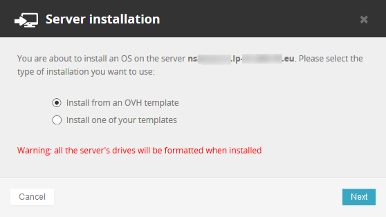
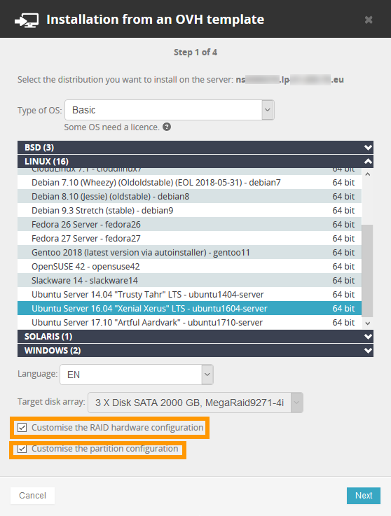
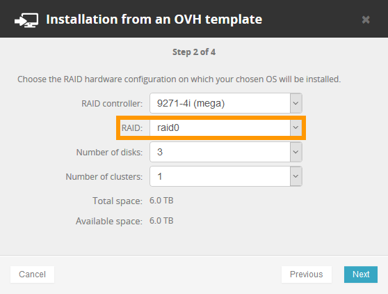
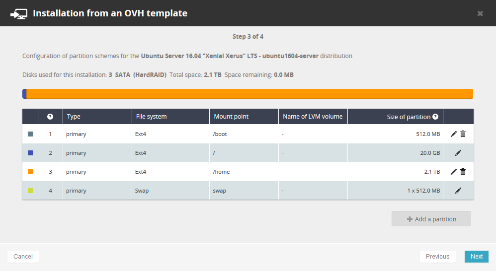
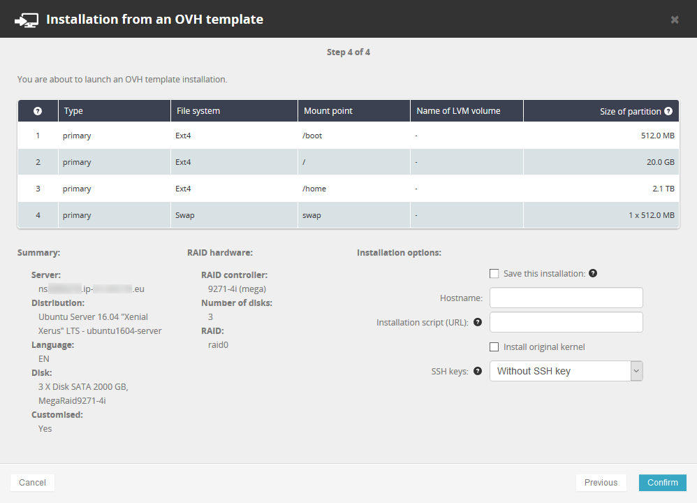
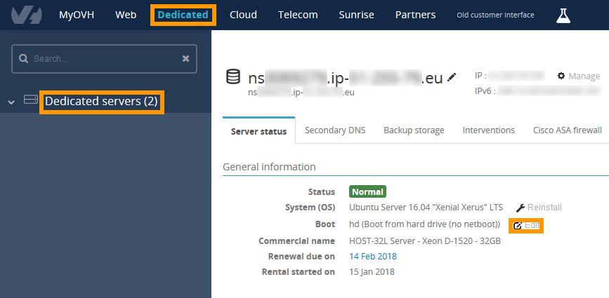
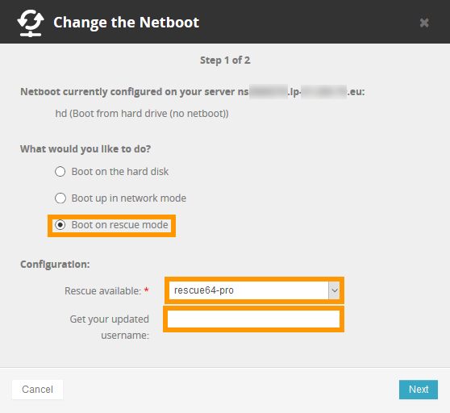
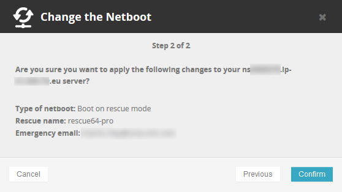
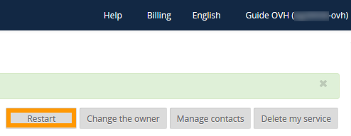

**Last updated 2nd August 2018**
 
## Objective

Redundant Array of Independent Disks (RAID) is a utility that mitigates data loss on a server by replicating data across two or more disks.

The default RAID level for OVH server installations is RAID 1, which doubles the space taken up by your data, effectively halving the usable disk space.

**This guide will help you to configure your server’s disks with RAID 0, which will allow you to use all your disks' usable space.**

> [!warning]
> 
> Please note: RAID 0 provides **NO FAULT TOLERANCE** and **NO DATA REDUNDANCY**, making data loss in the event of disk failure highly likely.
> 

## Requirements

- a [dedicated server](https://www.ovh.co.uk/dedicated_servers/){.external} with hardware RAID
- administrative (root) access to the server via SSH

## Instructions

### Using the OVH Control Panel

In the [OVH Control Panel](https://www.ovh.com/auth/?action=gotomanager){.external}, click on the `Dedicated`{.action} menu and select your server.

Next, on the `Server status`{.action} tab, click the `Reinstall`{.action} button to install a new operating system with your custom RAID 0 configuration.

Now select **Install from an OVH template** and then click `Next`{.action}.

{.thumbnail}

Select the operating system you want to install and then click `Next`{.action}.

Tick the boxes for **Customise the RAID hardware configuration** and **Customise the partition configuration**, then click `Next`{.action}.

{.thumbnail}

Select raid0 from the RAID drop-down list and click `Next`{.action}.

{.thumbnail}

Configure the partitions as you see fit and then click `Next`{.action}.

{.thumbnail}

Finally, click `Confirm`{.action}.

{.thumbnail}

After your server has been installed, check the partition sizes by logging on to the server via SSH and running the following command:

```sh
df -h
```

### Using rescue mode

In the [OVH Control Panel](https://www.ovh.com/auth/?action=gotomanager){.external}, click on the `Dedicated`{.action} menu and select your server.

On the `Server status`{.action} tab, click the `Edit`{.action} button to change the boot system.

{.thumbnail}

Next, select `Boot on rescue mode`{.action} then select `rescue64-pro`{.action} from the drop-down list.

Now, type your email address in the `Get your updated username`{.action} field.

{.thumbnail}

Click `Next`{.action} and then click `Confirm`{.action} on the following screen.

{.thumbnail}

Click the `Restart`{.action} button in the [Control Panel](https://www.ovh.com/auth/?action=gotomanager){.external}.

{.thumbnail}

When your server reboots, log in to it via SSH using the rescue mode credentials that were emailed to you.

From the command line, type the following commands to delete the existing RAID settings. All data in the RAID will be deleted:

```sh
MegaCli -CfgLdDel -L0 -a0
MegaCli -CfgLdDel -Lall -aAll
```

Type the following command to retrieve the slot device IDs of your disks:

```sh
MegaCli -PdList -aALL | egrep "Slot|Device ID"
```

Type the following commands to configure RAID level 0:

```sh
MegaCli -CfgLDAdd -R0[252:0,252:1] -a0
```

In this example, 252 is the ID of the drive enclosure.

After setting the new RAID level you can check the settings with the following command:

```sh
MegaCli -LDInfo -Lall -a0 |grep -i size
```

## Go further

[Hot Swap – Hardware RAID](https://docs.ovh.com/gb/en/dedicated/hotswap-raid-hard/){.external}

[Hot Swap – Software RAID](https://docs.ovh.com/gb/en/dedicated/hotswap-raid-soft/){.external}

[Hardware RAID](https://docs.ovh.com/gb/en/dedicated/raid-hard/){.external} 

Join our community of users on <https://community.ovh.com/en/>
