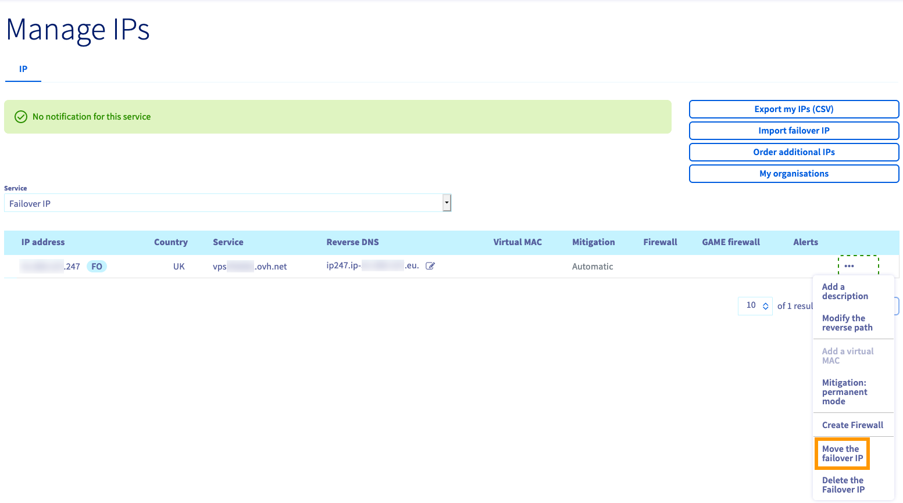

**Last updated 6th October 2022**

> [!primary]
>
> Since October 6th, 2022 our service "Failover IP" is named [Additional IP](https://www.ovhcloud.com/en-au/network/additional-ip/). This has no further impact on any of its features or the functioning of your services.
>

## Objective

Additional IP addresses can be moved between the services you use. This provides an advantage since you can maintain your IP reputation, your SEO and improve the continuity of service of your applications and systems.

With this technology, you can switch IP addresses from one solution to another in less than a minute, with virtually no interruption to services for your users. It is useful for service migrations (e.g. moving projects from development to production), or when switching to a backup server during a technical issue.

> [!primary]
> An Additional IP cannot be moved from one zone to another. For example, an IP located in the SBG data centre can be moved to GRA or RBX, but cannot be moved to BHS.
>
> Migration only works for whole blocks, it is not possible to migrate individual IPs within a block.

**This guide explains how to move an Additional IP in your OVHcloud Control Panel or via the OVHcloud API.**

## Requirements

- A [dedicated server](https://www.ovhcloud.com/en-au/bare-metal/) in your OVHcloud account
- An [Additional IP address](https://www.ovhcloud.com/en-au/bare-metal/ip/)
- Access to the [OVHcloud Control Panel](https://ca.ovh.com/auth/?action=gotomanager&from=https://www.ovh.com.au/&ovhSubsidiary=au)

> [!warning]
> This feature might be unavailable or limited on servers of the [**Eco** product line](https://eco.ovhcloud.com/en-au/about/).
>
> Please visit our [comparison page](https://eco.ovhcloud.com/en-au/compare/) for more information.

> [!warning]
> If the Additional IP address or one of the block IP addresses has a virtual MAC attached, the target server must support the vMAC functionality.
> See [this guide](https://docs.ovh.com/au/en/dedicated/network-support-virtual-mac/) for details.
>
> Otherwise, the virtual MACs must be removed from the Additional IPs before the transfer.

## Instructions

> [!primary]
> When an IP block containing unique virtual MAC addresses is moved between two servers, those addresses are temporarily suspended. They will appear on the new server once the move is complete.
>
> On the other hand, blocks containing duplicate virtual MAC addresses cannot be moved. You must first delete the duplicate virtual MAC address on the block to be moved.
>
> If an IP block is moved/added to the vRack, it is no longer linked to a physical server. In this case, any virtual MAC address will be lost during the transfer.
>

### Moving an IP from the OVHcloud Control Panel

Log in to the [OVHcloud Control](https://ca.ovh.com/auth/?action=gotomanager&from=https://www.ovh.com.au/&ovhSubsidiary=au), go to the `Bare Metal Cloud`{.action} menu and open `IP`{.action}.

The "Service" drop-down menu allows you to filter for Additional IPs.

Click on the `...`{.action} button to the right of the IP address you want to move, then `Move the Additional IP`{.action}.

{.thumbnail}

In the pop-up window, select the service to move the IP address to from the menu.

{.thumbnail}

Click `Next`{.action}, then `Confirm`{.action}.

### Moving an IP via the API

Log in to the OVHcloud [API webpage](https://ca.api.ovh.com/).

First, it is best to check if the IP address can be moved.
 To check if the IP can be moved to one of your dedicated servers, use the following call:

> [!api]
>
> @api {GET} /dedicated/server/{serviceName}/ipCanBeMovedTo
>

- `serviceName`: the destination dedicated server reference
- `ip`: the Additional IP address to move

To move the IP address, use the following call:

> [!api]
>
> @api {POST} /dedicated/server/{serviceName}/ipMove
>

- `serviceName`: the destination dedicated server reference
- `ip`: the Additional IP address to move

## Go further

Join our community of users on <https://community.ovh.com/en/>.