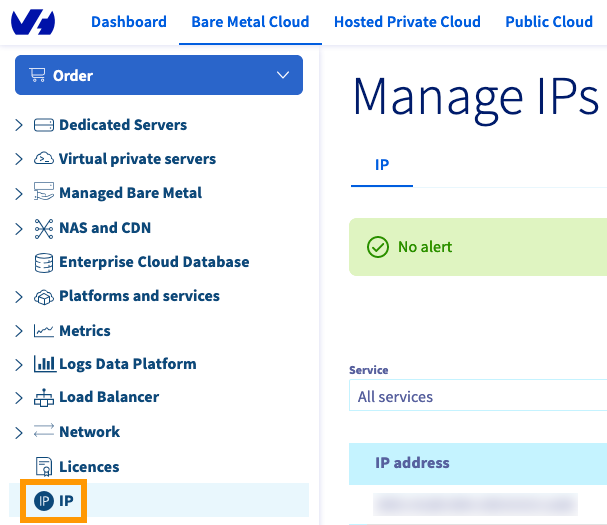

> [!primary]
> Tłumaczenie zostało wygenerowane automatycznie przez system naszego partnera SYSTRAN. W niektórych przypadkach mogą wystąpić nieprecyzyjne sformułowania, na przykład w tłumaczeniu nazw przycisków lub szczegółów technicznych. W przypadku jakichkolwiek wątpliwości zalecamy zapoznanie się z angielską/francuską wersją przewodnika. Jeśli chcesz przyczynić się do ulepszenia tłumaczenia, kliknij przycisk “Zaproponuj zmianę” na tej stronie.
>

**Ostatnia aktualizacja z dnia 26-07-2022**

> [!primary]
>
> Od 6 października 2022 nasze rozwiązanie "Failover IP" nazywa się teraz [Additional IP](https://www.ovhcloud.com/pl/network/additional-ip/). Nie ma to żadnego wpływu na funkcje ani na działanie usług.
>

## Wprowadzenie

Additional IP mogą być przenoszone między Twoimi usługami. Chodzi o to, aby nie tracić reputacji i lepszego pozycjonowania Twoich aplikacji i systemów.

Technologia ta pozwala na wymianę adresów IP między poszczególnymi rozwiązaniami w czasie krótszym niż jedna minuta, praktycznie bez przerwy w dostępie do Twoich użytkowników. Mechanizm ten może być wykorzystywany w trakcie migracji usługi, podczas przenoszenia projektów ze środowiska programistycznego do środowiska produkcyjnego i przełączania usług na serwer backup w przypadku usterki.

> [!primary]
> Additional IP nie może być przenoszone między strefami. Na przykład adres IP zlokalizowany w centrum danych SBG może zostać przeniesiony do GRA lub RBX, ale nie może zostać przeniesiony do BHS.
>
> Migracja dotyczy tylko całych bloków danych. Nie można przenieść pojedynczych adresów IP wewnątrz bloku.

**Dowiedz się, jak przenieść adres Additional IP z Panelu klienta OVHcloud lub poprzez API OVHcloud**

## Wymagania początkowe

- Posiadanie [serwera dedykowanego](https://www.ovhcloud.com/pl/bare-metal/){.external} w Panelu klienta
- Posiadanie [adresu Additional IP](https://www.ovhcloud.com/pl/bare-metal/ip/)
- Dostęp do [panelu klienta OVHcloud](https://www.ovh.com/auth/?action=gotomanager&from=https://www.ovh.pl/&ovhSubsidiary=pl)

> [!warning]
> Funkcja ta może być niedostępna lub ograniczona na [serwerach dedykowanych **Eco**](https://eco.ovhcloud.com/pl/about/).
>
> Aby uzyskać więcej informacji, zapoznaj się z naszym [porównaniem](https://eco.ovhcloud.com/pl/compare/).
>

> [!warning]
> Jeśli adres Additional IP lub jeden z adresów IP bloku, ma przypisany wirtualny adres MAC, serwer docelowy musi obsługiwać funkcje wirtualnych adresów MAC.
> Zapoznaj się [z tym przewodnikiem](https://docs.ovh.com/pl/dedicated/network-support-virtual-mac/).
>
> W przeciwnym razie wirtualne adresy MAC muszą zostać usunięte z adresów Additional IP przed przeniesieniem.

## W praktyce

> [!primary]
> Przeniesienie bloku IP zawierającego unikalne wirtualne adresy MAC między dwoma serwerami powoduje tymczasowe zawieszenie tych adresów. Pojawią się one na nowym serwerze po zakończeniu przenoszenia.
>
> Z drugiej strony, bloki zawierające zduplikowane wirtualne adresy MAC nie mogą być przenoszone. Usuń zduplikowany wirtualny adres MAC z bloku, który chcesz przenieść.
>
> Jeśli blok IP zostanie przeniesiony/dodany do vRack, nie jest już związany z serwerem fizycznym. W tym przypadku każdy wirtualny adres MAC zostanie utracony podczas transferu.
>

### Przenieś IP w Panelu klienta OVHcloud

Zaloguj się do [Panelu klienta OVHcloud](https://www.ovh.com/auth/?action=gotomanager&from=https://www.ovh.pl/&ovhSubsidiary=pl), kliknij menu `Bare Metal Cloud`{.action}, następnie otwórz sekcję  `IP`{.action}.

{.thumbnail}

W rozwijanym menu "Service" możesz wybrać tylko adresy Additional IP.

Kliknij przycisk `...`{.action} po prawej stronie przenoszonego adresu IP, a następnie `Przenieś Additional IP`{.action}.

{.thumbnail}

W menu, które się wyświetla wybierz usługę, do której chcesz przenieść adres IP.

Kliknij `Dalej`{.action}, a następnie `Zatwierdź`{.action}.

{.thumbnail}

### Przeniesienie IP przez API

Zaloguj się na stronie WWW [API OVHcloud](https://api.ovh.com/).

Najpierw należy sprawdzić, czy adres IP może zostać przeniesiony.
 Aby sprawdzić, czy IP może zostać przeniesione na jeden z Twoich serwerów dedykowanych, wywołaj następujące połączenie:

> [!api]
>
> @api {GET} /dedicated/server/{serviceName}/ipCanBeMovedTo
>

- `serviceName`: numer serwera dedykowanego docelowego
- `ip`: adres Additional IP do przeniesienia

Aby przenieść adres IP, użyj następującego połączenia:

> [!api]
>
> @api {POST} /dedicated/server/{serviceName}/ipMove
>

- `serviceName`: numer serwera dedykowanego docelowego
- `ip`: adres Additional IP do przeniesienia

## Sprawdź również

Przyłącz się do społeczności naszych użytkowników na stronie <https://community.ovh.com/en/>.