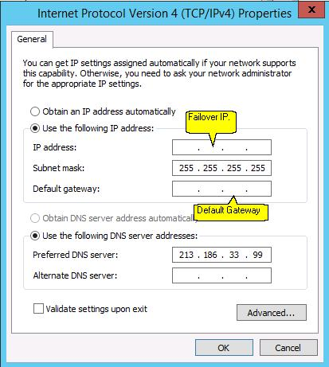

**Last updated 4th March 2019**

## Objective

Bridged networking can be used to configure your virtual machines. Some tweaking is necessary to make the network configuration work on our network.

**This guide will show you how to use network bridging to configure internet access for your virtual machines.**

<iframe width="560" height="315" src="https://www.youtube.com/embed/TZZbPe9hCOk?rel=0" frameborder="0" allow="autoplay; encrypted-media" allowfullscreen></iframe>

## Requirements

* a Dedicated Server with a hypervisor installed (e.g. [VMware ESXi](http://www.vmware.com/products/esxi-and-esx/overview.html){.external}, Citrix Xen Server, Proxmox, etc.)
* at least one [failover IP](https://www.ovh.co.uk/dedicated_servers/ip_failover.xml) address attached to the server
* access to the [OVH Control Panel](https://www.ovh.com/auth/?action=gotomanager){.external}

## Instructions

For this example, we will use the following values in our code samples, which should be replaced with your own values:

* SERVER_IP = The main IP address of your server
* FAILOVER_IP = The address of your failover IP
* GATEWAY_IP = The address of your default gateway

### Assign a virtual MAC address

Log in to the [OVH Control Panel](https://www.ovh.com/auth/?action=gotomanager){.external} and click on the `Dedicated`{.action} menu. Then click on the `IP`{.action} menu on the left side of the page, and then locate your failover IP address in the table.

{.thumbnail}

Click on the three dots to open the `Context`{.action} menu, and click `Add a virtual MAC`{.action}.

{.thumbnail}

Select `OVH`{.action} from the `Type`{.action} dropdown box, type a name in the `Name of virtual machine`{.action} field, and then confirm your options.

{.thumbnail}

### Determine the gateway address

To configure your virtual machines for internet access, you will need to know the gateway of your host machine (i.e. your Dedicated Server). The gateway address is made up of the first three octets of your server's main IP address, with 254 as the last octect. For example, if your server's main IP address is:

* 123.456.789.012

Your gateway address would therefore be:

* 123.456.789.254

### Apply the configuration

> [!primary]
>
For all operating systems and distributions, you **MUST** configure you virtual machine with the virtual MAC address you created in the Control Panel.
>

#### Debian and Debian-based operating systems (Ubuntu, CrunchBang, SteamOS, etc.)

Open up an SSH connection to your virtual machine. Once connected, open the virtual machine's network configuration file, which is located in `/etc/network/interfaces`. Edit the file so that it reflects the configuration below (please remember to replace our variables with your own values):

```bash
auto lo eth0
iface lo inet loopback
iface eth0 inet static
    address FAILOVER_IP
    netmask 255.255.255.255
    broadcast FAILOVER_IP
    post-up route add GATEWAY_IP dev eth0
    post-up route add default gw GATEWAY_IP
    pre-down route del GATEWAY_IP dev eth0
    pre-down route del default gw GATEWAY_IP
```

Save and close the file, then reboot the virtual machine.

#### Redhat and Redhat-based operating systems (CentOS 6, Scientific Linux, ClearOS, etc.)

Open up an SSH connection to your virtual machine. Once connected, open the virtual machine's network configuration file, which is located in `/etc/network/interfaces`. Edit the file so that it reflects the configuration below (please remember to replace our variables with your own values):

```bash
DEVICE=eth0
BOOTPROTO=none
ONBOOT=yes
USERCTL=no
IPV6INIT=no
PEERDNS=yes
TYPE=Ethernet
NETMASK=255.255.255.255
IPADDR=FAILOVER_IP
GATEWAY=GATEWAY_IP
ARP=yes
HWADDR=MY:VI:RT:UA:LM:AC
```

Now, save and close the file.

Next, open the virtual machine's routing file, which is located in `/etc/sysconfig/network-scripts/route-eth0`. Edit the file so that it reflects the configuration below (please remember to replace our variables with your own values):

```bash
GATEWAY_IP dev eth0
default via GATEWAY_IP dev eth0
```

Save and close the file, then reboot your virtual machine.

#### CentOS 7

> [!primary]
> 
> For CentOS 7, the name of the network adapter will vary, depending on the installation options. You will need to verify the adapter name and use it to configure your virtual machine. Use the command `ipaddr`{.action} to find your interface name.
> 

Open up an SSH connection to your virtual machine. Once connected, open the virtual machine's network configuration file, which is located in `/etc/sysconfig/network-scripts/ifcfg-(interface name)`. Edit the file so that it reflects the configuration below (please remember to replace our variables with your own values):

```bash
DEVICE=(insert interface Name)
BOOTPROTO=none
ONBOOT=yes
USERCTL=no
IPV6INIT=no
PEERDNS=yes
TYPE=Ethernet
NETMASK=255.255.255.255
IPADDR=FAILOVER_IP
GATEWAY=GATEWAY_IP
ARP=yes
HWADDR=MY:VI:RT:UA:LM:AC
```

Save and close the file.

Next, open the virtual machine's routing file, which is located in `/etc/sysconfig/network-scripts/route-(interface-name)`. Edit the file so that it reflects the configuration below (please remember to replace our variables with your own values):

```bash
GATEWAY_IP - 255.255.255.255 (insert interface Name)
NETWORK_GW_VM - 255.255.255.0 (insert interface Name)
default GATEWAY_IP
```

#### OpenSUSE

Open up an SSH connection to your virtual machine. Once connected, open the virtual machine's network configuration file, which is located in `/etc/sysconfig/network/ifcfg-ens32`. If the file doesn't exist, you'll have to create it. Edit the file so that it reflects the configuration below (please remember to replace our variables with your own values):

```bash
DEVICE=ens32
BOOTPROTO=static
ONBOOT=yes
ARP=yes
USERCTL=no
IPV6INIT=no
TYPE=Ethernet
STARTMODE=auto
IPADDR=FAILOVER_IP
NETMASK=255.255.255.255
GATEWAY=GATEWAY_IP
HWADDR=MY:VI:RT:UA:LM:AC
```

Save and close the file.

Next, open the virtual machine's routing file, which is located in `/etc/sysconfig/network-scripts/ifroute-ens32`. If the file doesn't exist, you'll have to create it. Edit the file so that it reflects the configuration below (please remember to replace our variables with your own values):

```bash
GATEWAY_IP - 255.255.255.255 ens32
NETWORK_GW_VM - 255.255.255.0 ens32
default GATEWAY_IP
```

Next, open the virtual machine's DNS configuration file, which is located in `/etc/sysconfig/network/resolv.conf`. If the file doesn't exist, you'll have to create it. Edit the file so that it reflects the configuration below:

```bash
nameserver 213.186.33.99 # OVH DNS Server
```

Save and close the file, then reboot your virtual machine.

#### Arch Linux

First, establish an SSH connection to your virtual machine and install **Netctl**, which is a command line utility used for configuring network interfaces:

```ssh
# apt-get netctl
```

Once Netctl has been installed, run the following command to determine the name of your virtual machine's network interface:

```
# ip link

1: eno3: <BROADCAST,MULTICAST,UP,LOWER_UP> mtu 1500 qdisc mq state UP mode DEFAULT group default qlen 1000
    link/ether ac:1f:6b:67:ce:a4 brd ff:ff:ff:ff:ff:ff
```

From the output above, we can see that the name of our network interface is **eno3**. This is for demonstration purposes. Your interface will likely have a different name.

Next, copy the contents of the Netctl static configuration file, and create a new file with the name of your network interface:

```ssh
# cp /etc/netctl/examples/ethernet-static /etc/netctl/eno3
```

Next, edit the file you just created, substituting the values for your failover IP address, subnet mask, gateway address and DNS address. **For the subnet mask, please use the address that was emailed to you when you purchased the failover IP address.**

```sh
Description='A basic static ethernet connection'
Interface=eno3
Connection=ethernet
IP=FAILOVER_IP
Address=('255.255.255.255')
Gateway=('GATEWAY_IP')
DNS=('213.186.33.99')
```

Next, enable the network card to start automatically on every reboot with the following command:

```sh
# netctl enable eno3
```

Now start the network profile, as shown below:

```ssh
# netctl start eno3
```

Next, stop and disable the dhcp service:

```ssh
# systemctl stop dhcpcd
# systemctl disable dhcpcd
```

Finally, restart your system for the changes to take effect.

#### FreeBSD 8.0

Open up an SSH connection to your virtual machine. Once connected, open the virtual machine's network configuration file, which is located in `/etc/rc.conf`. Edit the file so that it reflects the configuration below (please remember to replace our variables with your own values):

```bash
ifconfig_em0="inet FAILOVER_IP netmask 255.255.255.255 broadcast FAILOVER_IP"
static_routes="net1 net2"
route_net1="-net GATEWAY_IP/32 FAILOVER_IP"
route_net2="default GATEWAY_IP"
```

Save and close the file, then reboot your virtual machine.

#### Ubuntu 18.04

First, establish an SSH connection to your virtual machine and open the network configuration file located in `/etc/netplan/` with the following command. For demonstration purposes, our file is called `50-cloud-init.yaml`.

```sh
# nano /etc/netplan/50-cloud-init.yaml
```

Once the file is open for editing, amend it with the following code:

```sh
network:
    ethernets:
        your-network-interface:
            addresses:
            - your-failover-ip/32
            nameservers:
                addresses:
                - 213.186.33.99
                search: []
            optional: true
            routes:
                - to: 0.0.0.0/0
                  via: your-gateway-ip
                  on-link: true
    version: 2
```

Once you've made the changes, save and close the file, then run the following command:

```sh
# netplan try
Warning: Stopping systemd-networkd.service, but it can still be activated by:
  systemd-networkd.socket
Do you want to keep these settings?

Press ENTER before the timeout to accept the new configuration

Changes will revert in 120 seconds
Configuration accepted.
```

#### Windows Server 2012 / Hyper-V

Before configuring your virtual machine, you'll need to create a virtual switch.

From the command line of your Dedicated Server, run `IPconfig /ALL`{.action} and then note the name of the network adapter that contains the server's main IP address.

In the Hyper-V Manager, create a new virtual switch and set the connection type to `External`{.action}.

Select the adapter with the server’s IP, then check `Allow management operating system to share this network adapter`{.action}.

{.thumbnail}

> [!primary]
> 
>This step is only required once for a hyper-v server. For all VMs, a virtual switch is required to connect the VM’s virtual network adapters to the server’s physical adapter.
> 

Next, select the VM that you wish to add the failover IP to. Use the Hyper-V Manager to change the settings of the VM and shut it down.

Next, expand the network adapter and click on `Advanced Features`{.action}, change the MAC address to `static`{.action}, and enter the virtual MAC address for the failover IP. Once you have entered these settings, press `OK`{.action} to apply the changes.

{.thumbnail}

Next, start the VM and log in as an administrator, then go to `Control Panel`{.action} > `Network and Sharing Center`{.action}. Click on the `Connections: Ethernet`{.action} link, then click on the `Properties`{.action} button to view the ethernet properties.

Select `Internet Protocol Version 4 (TCP/IPv4)`{.action}, and then click on the `Properties`{.action} button to show IPv4 properties.

{.thumbnail}

In the IPv4 Properties window, select `Use the following IP address`{.action}. Enter the failover IP into the IP address field, and enter 255.255.255.255 into the subnet mask.

Next, enter your server’s gateway IP address into the default gateway (i.e. your server’s IP, ending with 254), and enter 213.186.33.99 into the `Preferred DNS Server`{.action} field.

Click `OK`{.action}, and ignore the warning message about the gateway IP and assigned IP not being in the same subnet.

Finally, reboot the server. The VM should then be connected to the internet using the failover IP.

{.thumbnail}

## Go further

Join our community of users on <https://community.ovh.com/en/>.
