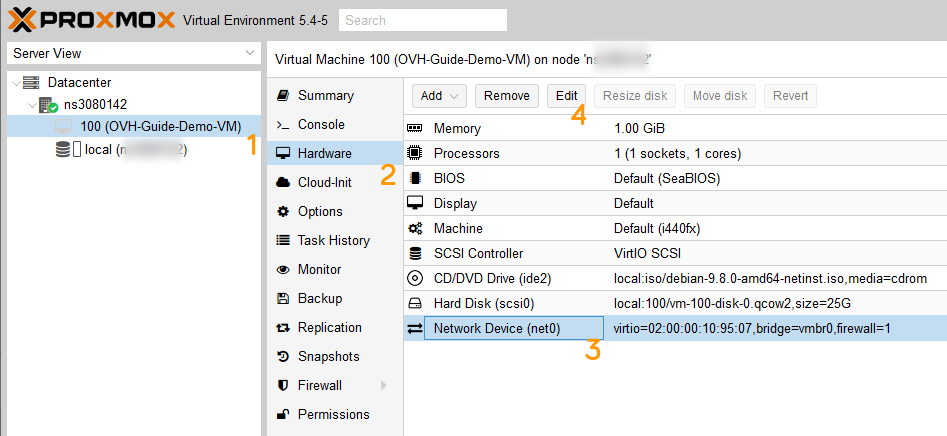

**Last updated 27th May 2019**

## Objective

Bridged networking can be used to configure your virtual machines. Some tweaking is necessary to make the network configuration work on our network.

**This guide will show you how to use network bridging to configure internet access for your virtual machines.**

<iframe width="560" height="315" src="https://www.youtube.com/embed/TZZbPe9hCOk?rel=0" frameborder="0" allow="autoplay; encrypted-media" allowfullscreen></iframe>

## Requirements

* a Dedicated Server with a hypervisor installed (e.g. [VMware ESXi](http://www.vmware.com/products/esxi-and-esx/overview.html){.external}, Citrix Xen Server, Proxmox, etc.)
* at least one [failover IP](https://www.ovh.co.uk/dedicated_servers/ip_failover.xml) address attached to the server
* access to the [OVH Control Panel](https://www.ovh.com/auth/?action=gotomanager){.external}

## Instructions

The basic steps are always the same - independent of the Systems used:
* creating a virtual MAC address for a fail-over IP
* setting the MAC of the VM to that new virtual MAC address
* configuring the **IP address**, **netmask**, **gateway** and **route to the gateway** inside the VM

For these examples, we will use the following values in our code samples, which should be replaced with your own values:

* SERVER_IP = The main IP address of your server
* FAILOVER_IP = The address of your failover IP
* GATEWAY_IP = The address of your default gateway

### Assign a virtual MAC address

Log in to the [OVH Control Panel](https://www.ovh.com/auth/?action=gotomanager){.external} and click on the `Dedicated`{.action} menu. Then click on the `IP`{.action} menu on the left side of the page, and then locate your failover IP address in the table.

{.thumbnail}

Click on the three dots to open the `Context`{.action} menu, and click `Add a virtual MAC`{.action}.

{.thumbnail}

Select `OVH`{.action} from the `Type`{.action} dropdown box - unless you're using VMware ESXi, then `vmware` - type a name in the `Name of virtual machine`{.action} field, and then confirm your options.

{.thumbnail}

### Determine the gateway address

To configure your virtual machines for internet access, you will need to know the gateway of your host machine (i.e. your Dedicated Server). The gateway address is made up of the first three octets of your server's main IP address, with 254 as the last octect. For example, if your server's main IP address is:

* 123.456.789.012

Your gateway address would therefore be:

* 123.456.789.**254**

### Prepare the Host

> [!primary]
>
For all operating systems and distributions, you **MUST** configure you virtual machine with the virtual MAC address you created in the Control Panel.
>
#### Proxmox
After you've created the virtual machine and while it's powered off:
 1. select the VM
 2. open the `Hardware` section
 3. select `Network Device`
 4. click the `Edit` button

{.thumbnail}

add the vMAC address, you've created earlier
{.thumbnail}


Now you can start the VM and proceed with the steps, depending on the Operation System on it.

#### VMware ESXi
After you've created the virtual machine and while it's powered off, right click the VM and click `Edit settings`
{.thumbnail}

Fold out `Netwok Adapter 1` and change the value in the `MAC Address` dropdown menu to `Manual` and enter the vmware MAC address, created earlier.
{.thumbnail}

Now you can start the VM and proceed with the steps, depending on the Operation System on it.

### Configure the virtual machines

#### Debian

Connect to the shell of your virtual machine. Open the virtual machine's network configuration file, which is located in `/etc/network/interfaces`. 
Edit the file so that it reflects the configuration below (please remember to replace our variables with your own values):

```
auto lo eth0
iface lo inet loopback
iface eth0 inet static
    address FAILOVER_IP
    netmask 255.255.255.255
    broadcast FAILOVER_IP
    post-up route add GATEWAY_IP dev eth0
    post-up route add default gw GATEWAY_IP
    pre-down route del GATEWAY_IP dev eth0
    pre-down route del default gw GATEWAY_IP
```
Also replace `eth0` if your system uses Predictible Network Interface Names. You can find the Network interface names with the following command:
```sh
ls /sys/class/net
```
Save and close the file, then restart your network or reboot the virtual machine.

#### Redhat and Redhat-based operating systems (CentOS 6, Scientific Linux, ClearOS, etc.)

Open a terminal on your virtual machine. Once connected, open the virtual machine's network configuration file, which is located in `/etc/network/interfaces`. Edit the file so that it reflects the configuration below (please remember to replace our variables with your own values):

```sh
DEVICE=eth0
BOOTPROTO=none
ONBOOT=yes
USERCTL=no
IPV6INIT=no
PEERDNS=yes
TYPE=Ethernet
NETMASK=255.255.255.255
IPADDR=FAILOVER_IP
GATEWAY=GATEWAY_IP
ARP=yes
HWADDR=MY:VI:RT:UA:LM:AC
```

Now, save and close the file.

Next, open the virtual machine's routing file, which is located in `/etc/sysconfig/network-scripts/route-eth0`. Edit the file so that it reflects the configuration below (please remember to replace our variables with your own values):

```bash
GATEWAY_IP dev eth0
default via GATEWAY_IP dev eth0
```

Save and close the file, then reboot your virtual machine.

#### CentOS 7

> [!primary]
> 
> For CentOS 7, the name of the network adapter will vary, depending on the installation options. You will need to verify the adapter name and use it to configure your virtual machine. You can find the Network interface names with the command `ls /sys/class/net`
> 

Open a terminal on your virtual machine. Once connected, open the virtual machine's network configuration file, which is located in `/etc/sysconfig/network-scripts/ifcfg-(interface-name)`. Edit theso that it reflects the configuration below (please remember to replace our variables with your own values):

```sh
DEVICE=(interface-name)
BOOTPROTO=none
ONBOOT=yes
USERCTL=no
IPV6INIT=no
PEERDNS=yes
TYPE=Ethernet
NETMASK=255.255.255.255
IPADDR=FAILOVER_IP
GATEWAY=GATEWAY_IP
ARP=yes
HWADDR=MY:VI:RT:UA:LM:AC
```

Save and close the file.

Next, open the virtual machine's routing file, which is located in `/etc/sysconfig/network-scripts/route-(interface-name)`. Edit the file so that it reflects the configuration below (please remember to replace our variables with your own values):

```bash
GATEWAY_IP - 255.255.255.255 (interface-name)
NETWORK_GW_VM - 255.255.255.0 (interface-name)
default GATEWAY_IP
```
Save and close the file.

Next, open the virtual machine's DNS configuration file, which is located in `/etc/resolv.conf` and add this line:
```bash
nameserver 213.186.33.99
```

After saving and closing the file, restart your network or reboot the VM.

#### OpenSUSE
> [!primary]
> 
> For OpenSUSE, the name of the network adapter will vary, depending on the installation options. You will need to verify the adapter name and use it to configure your virtual machine. You can find the Network interface names with the command `ls /sys/class/net`
> 

Open a terminal on your virtual machine. Once connected, open the virtual machine's network configuration file, which is located in `/etc/sysconfig/network/ifcfg-(interface-name)`. If the file doesn't exist, you'll have to create it. Edit the file so that it reflects the configuration below (please remember to replace our variables with your own values):

```bash
DEVICE=(interface-name)
BOOTPROTO=static
ONBOOT=yes
ARP=yes
USERCTL=no
IPV6INIT=no
TYPE=Ethernet
STARTMODE=auto
IPADDR=FAILOVER_IP
NETMASK=255.255.255.255
GATEWAY=GATEWAY_IP
HWADDR=MY:VI:RT:UA:LM:AC
```

Save and close the file.

Next, open the virtual machine's routing file, which is located in `/etc/sysconfig/network-scripts/ifroute-(interface-name)`. If the file doesn't exist, you'll have to create it. Edit the file so that it reflects the configuration below (please remember to replace our variables with your own values):

```bash
GATEWAY_IP - 255.255.255.255 (interface-name)
NETWORK_GW_VM - 255.255.255.0 (interface-name)
default GATEWAY_IP
```

Next, open the virtual machine's DNS configuration file, which is located in `/etc/sysconfig/network/resolv.conf`. If the file doesn't exist, you'll have to create it. Edit the file so that it reflects the configuration below:

```bash
nameserver 213.186.33.99 # OVH DNS Server
```

Save and close the file, then reboot your virtual machine.


#### FreeBSD 12.0

Open a terminal on your virtual machine. Once connected, open the virtual machine's network configuration file, which is located in `/etc/rc.conf`. Edit the file so that it includs the configuration below (please remember to replace our variables with your own values. In this example, the inteface name is `em0`; Adjust if necessary.):

```bash
ifconfig_em0="inet FAILOVER_IP netmask 255.255.255.255 broadcast FAILOVER_IP"
static_routes="net1 net2"
route_net1="-net GATEWAY_IP/32 -interface em0"
route_net2="default GATEWAY_IP"
```

Save and close the file. Next edit the File `/etc/resolv.conf`,create when necessary
```sh
nameserver 213.186.33.99
```

Save and close the file, then reboot your virtual machine.

#### Ubuntu 18.04

First, open a terminal on your virtual machine and open the network configuration file located in `/etc/netplan/` with the following command. For demonstration purposes, our file is called `50-cloud-init.yaml`.

```sh
# nano /etc/netplan/50-cloud-init.yaml
```

Once the file is open for editing, amend it with the following code:

```sh
network:
    ethernets:
        (interface-name):
            addresses:
                - FAILOVER_IP/32
            nameservers:
                addresses:
                    - 213.186.33.99
                search: []
            optional: true
            routes:
                - to: 0.0.0.0/0
                  via: GATEWAY_IP
                  on-link: true
    version: 2
```

Once you've made the changes, save and close the file, then run the following command:

```sh
# netplan try
Warning: Stopping systemd-networkd.service, but it can still be activated by:
  systemd-networkd.socket
Do you want to keep these settings?

Press ENTER before the timeout to accept the new configuration

Changes will revert in 120 seconds
Configuration accepted.
```

#### Windows Server 2012 / Hyper-V

Before configuring your virtual machine, you'll need to create a virtual switch.

From the command line of your Dedicated Server, run `IPconfig /ALL`{.action} and then note the name of the network adapter that contains the server's main IP address.

In the Hyper-V Manager, create a new virtual switch and set the connection type to `External`{.action}.

Select the adapter with the server’s IP, then check `Allow management operating system to share this network adapter`{.action}.

{.thumbnail}

> [!primary]
> 
>This step is only required once for a hyper-v server. For all VMs, a virtual switch is required to connect the VM’s virtual network adapters to the server’s physical adapter.
> 

Next, select the VM that you wish to add the failover IP to. Use the Hyper-V Manager to change the settings of the VM and shut it down.

Next, expand the network adapter and click on `Advanced Features`{.action}, change the MAC address to `static`{.action}, and enter the virtual MAC address for the failover IP. Once you have entered these settings, press `OK`{.action} to apply the changes.

{.thumbnail}

Next, start the VM and log in as an administrator, then go to `Control Panel`{.action} > `Network and Sharing Center`{.action}. Click on the `Connections: Ethernet`{.action} link, then click on the `Properties`{.action} button to view the ethernet properties.

Select `Internet Protocol Version 4 (TCP/IPv4)`{.action}, and then click on the `Properties`{.action} button to show IPv4 properties.

{.thumbnail}

In the IPv4 Properties window, select `Use the following IP address`{.action}. Enter the failover IP into the IP address field, and enter 255.255.255.255 into the subnet mask.

Next, enter your server’s gateway IP address into the default gateway (i.e. your server’s IP, ending with 254), and enter 213.186.33.99 into the `Preferred DNS Server`{.action} field.

Click `OK`{.action}, and ignore the warning message about the gateway IP and assigned IP not being in the same subnet.

Finally, reboot the server. The VM should then be connected to the internet using the failover IP.

{.thumbnail}

#### Troubleshooting

If you are unable to establish a connection from your VM to the public network and suspect a networking problem, please reboot the server in Rescue Mode and setup the bridging network interface directly on the host.

In order to do that, once you’ve rebooted your server in Rescue Mode, enter the following commands:

```bash
ip link add name test-bridge link eth0 type macvlan
ip link set dev test-bridge address MAC_ADDRESS
ip link set test-bridge up
ip addr add FAILOVER_IP/32 dev test-bridge
```

Where you will replace MAC_ADDRESS by the vMAC address that you generated in the Control Panel and FAILOVER_IP by the actual IPFO.

Next, simply ping your IPFO from the outside. If it works, it probably means that there is a configuration error either on the VM or the host that prevents the IPFO from working in normal mode. If, on the contrary, the IP is still not working, please open a ticket to the support team via your Control Panel for further investigations.

## Go further

Join our community of users on <https://community.ovh.com/en/>.
