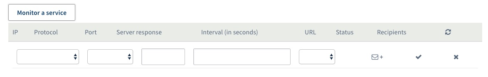

## Requirements
The monitoring service allows OVH to monitor the status of your machine and automatically trigger the intervention of a technician in the datacenter.

All the servers of our customers and the entire network are monitored 24/7 by OVH technical teams.

OVH intervenes as soon as an alert (non-response to the pings) is triggered in order to minimize the downtime of the servers and the network.

To implement a restrictive firewall, especially on ICMP, and continue to benefit from OVH monitoring, it is necessary to authorize the IPs that you will find below.

To do this, you must have :

- An OVH product on which you have installed a Firewall.
- Have access to the Firewall rules.

## IP to be authorized

|Reverse|IP|Protocol|
|---|---|---|
|mrtg-rbx-100|37.187.231.251|icmp|
|mrtg-sbg-100|37.187.231.251|icmp|
|mrtg-gra-100|37.187.231.251|icmp|
|mrtg-bhs-100|37.187.231.251|icmp|
|mrtg-rbx-101|151.80.231.244|icmp|
|mrtg-rbx-102|151.80.231.245|icmp|
|mrtg-rbx-103|151.80.231.246|icmp|
|mrtg-gra-101|151.80.231.247|icmp|
|a2.ovh.net|213.186.33.62|icmp|
||92.222.184.0/24|icmp|
||92.222.185.0/24|icmp|
||92.222.186.0/24|icmp|
||167.114.37.0/24|icmp|
|proxy.p19.ovh.net|213.186.45.4|icmp|
|proxy.rbx.ovh.net|213.251.184.9|icmp|
|proxy.sbg.ovh.net|37.59.0.235|icmp|
|proxy.bhs.ovh.net|8.33.137.2|icmp|
|ping.ovh.net|213.186.33.13|icmp|
|proxy.ovh.net|213.186.50.98|icmp|
||xxx.xxx.xxx.250 (xxx.xxx.xxx.aaa is the server ip)|icmp|
||xxx.xxx.xxx.251 (xxx.xxx.xxx.aaa is the server ip)|icmp + Port monitored by the monitoring service|

**Communication between the RTM service and your server also requires that you allow inbound and outbound connections on UDP ports 6100 through 6200.**

> [!primary]
>
> If your server is located in Roubaix 3, you have to retrieve the last IP via tcpdump.
> 
  <pre class="highlight command-prompt"> root@nsXXXX:# tcpdump host server.ip | grep ICMP </pre>

>
**Enable/Disable Monitoring**
>
>First, log in to the [OVH Control Panel](https://www.ovh.com/auth/?action=gotomanager){.external}. On the left-hand tab select the Dedicated Server in question from the **Dedicated servers** drop-down menu.
>
{.thumbnail}
>
In the **Server status** tab, click the **Enable** or **Disable** button next to "Monitoring". Click **Confirm** on the popup window to confirm the changes.
>
**Enable Monitoring of Specific Services**
>
In addition to the standard Monitoring, you can enable OVH to monitor specific services such as HTTP, SSH, and other protocols in the OVH Manager. To do this, click **Monitor my services** under the "Service status" section on the **Server status** tab. Click **Monitor a service** and you will be taken to the following screen:
>
{.thumbnail}
>
Enter the IP address, protocol, port number, server response, and the time interval between checks on your service and press the check mark to confirm the changes.
>
**Conclusion**
>
OVH Monitoring offers our customers a variety of ways in which OVH can provide information about the status of your Dedicated Servers. We highly recommend that you take advantage of these free services.
>
