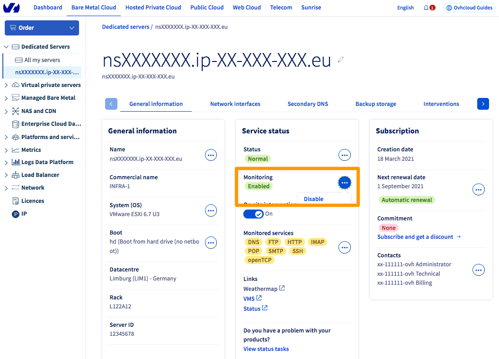
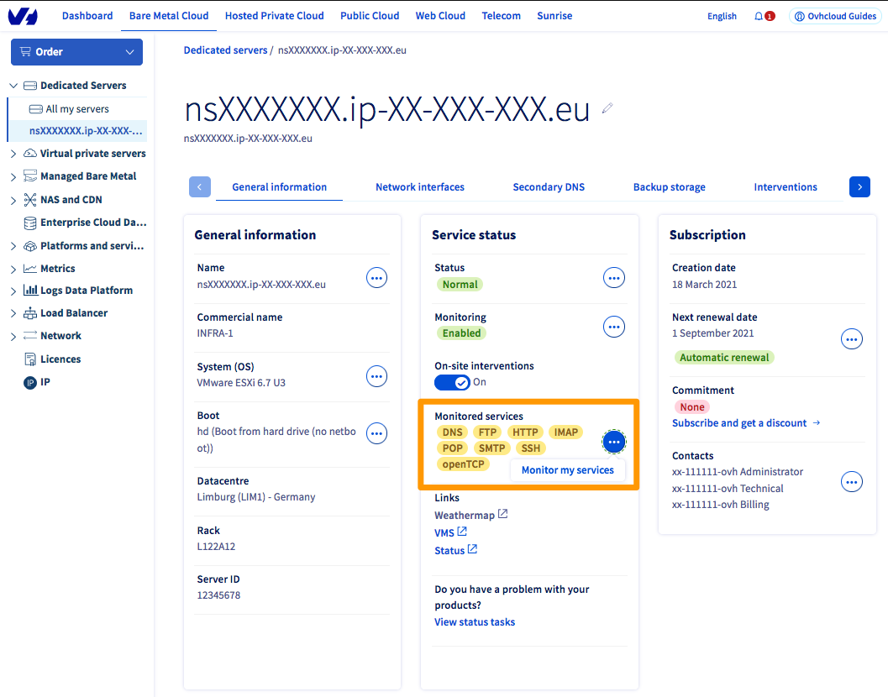

**Last updated 17th august 2021**

## Objective

The monitoring service allows OVHcloud to monitor the status of your machine and automatically trigger the intervention of a technician in the datacenter.

All the servers of our customers and the entire network are monitored 24/7 by OVHcloud technical teams.

OVHcloud intervenes as soon as an alert (non-response to the pings) is triggered in order to minimize the downtime of the servers and the network.

To implement a restrictive firewall, especially on ICMP, and continue to benefit from OVHcloud monitoring, it is necessary to authorize the IPs that you will find below.

## Requirements

- An OVHcloud product on which you have installed a Firewall.
- Have access to the Firewall rules.

## Instructions

## IP adresses to be authorized

|Reverse|IP|Protocol|
|---|---|---|
|mrtg-rbx-100|37.187.231.251|icmp|
|mrtg-sbg-100|37.187.231.251|icmp|
|mrtg-gra-100|37.187.231.251|icmp|
|mrtg-bhs-100|37.187.231.251|icmp|
|mrtg-rbx-101|151.80.231.244|icmp|
|mrtg-rbx-102|151.80.231.245|icmp|
|mrtg-rbx-103|151.80.231.246|icmp|
|mrtg-gra-101|151.80.231.247|icmp|
|a2.ovh.net|213.186.33.62|icmp|
|---|---|---|
|netmon-rbx-probe|92.222.184.0/24|icmp|
|netmon-sbg-probe|92.222.185.0/24|icmp|
|netmon-gra-probe|92.222.186.0/24|icmp|
|netmon-bhs-probe|167.114.37.0/24|icmp|
|netmon-sgp-probe|139.99.1.144/28|icmp|
|---|---|---|
|proxy.p19.ovh.net|213.186.45.4|icmp|
|proxy.rbx.ovh.net|213.251.184.9|icmp|
|proxy.sbg.ovh.net|37.59.0.235|icmp|
|proxy.bhs.ovh.net|8.33.137.2|icmp|
|ping.ovh.net|213.186.33.13|icmp|
|proxy.ovh.net|213.186.50.98|icmp|
||xxx.xxx.xxx.250 (xxx.xxx.xxx.aaa is the server ip)|icmp|
||xxx.xxx.xxx.251 (xxx.xxx.xxx.aaa is the server ip)|icmp + Port monitored by the monitoring service|

**Communication between the RTM service and your server also requires that you allow inbound and outbound connections on UDP ports 6100 through 6200.**

> [!primary]
>
> If your server is located in Roubaix 3, you have to retrieve the last IP via tcpdump.
> 
  <pre class="highlight command-prompt"> root@nsXXXX:# tcpdump host server.ip | grep ICMP </pre>

>

### Enabling or disabling monitoring

First, log in to the [OVHcloud Control Panel](https://ca.ovh.com/auth/?action=gotomanager&from=https://www.ovh.com/world/&ovhSubsidiary=we){.external} and select the `Bare Metal Cloud`{.action} tab. In the left-hand menu, select the server concerned in the `Dedicated servers`{.action} drop-down menu.

In the `General information`{.action} tab, then the **Service status** box, click on the `...`{.action} button next to “Monitoring”. Then click `Enable`{.action} or `Disable`{.action}. Click `Confirm`{.action} in the window that appears to confirm the changes.

{.thumbnail}

### Enabling monitoring for specific services

In addition to standard monitoring, you can authorise OVHcloud to monitor specific services such as HTTP, SSH and other protocols.

 To do this, in the `General information`{.action} tab, then in the **Service status** box, click the `...`{.action} button next to "Monitored services". Click `Monitor my services`{.action}.

{.thumbnail}

 You will be redirected to the screen below. Click `Monitor a service`{.action}, then enter the IP address, protocol, port number, server response, and time interval between your service checks. Click the validation symbol (**V**) to confirm the changes.

{.thumbnail}

## Go further

[Configure the Network Firewall.](../firewall-network/)

Join our community of users on <https://community.ovh.com/en/>.
