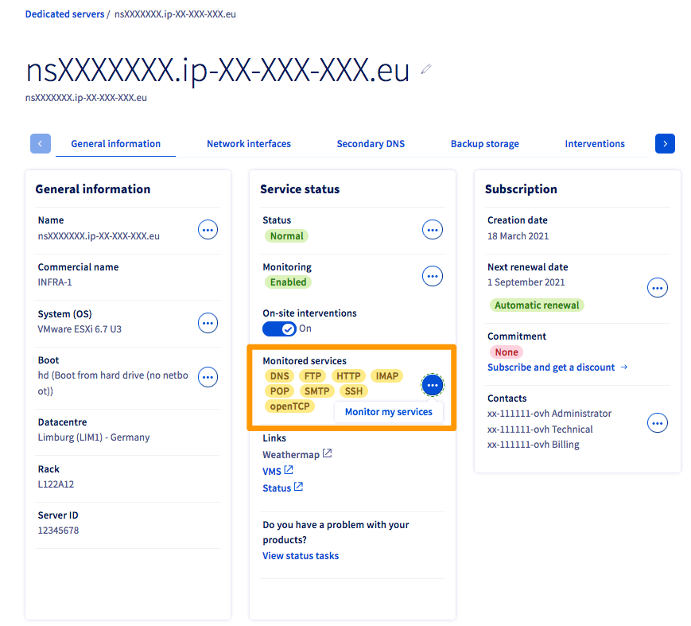
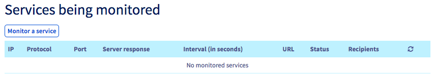

> [!primary]
> Esta tradução foi automaticamente gerada pelo nosso parceiro SYSTRAN. Em certos casos, poderão ocorrer formulações imprecisas, como por exemplo nomes de botões ou detalhes técnicos. Recomendamos que consulte a versão inglesa ou francesa do manual, caso tenha alguma dúvida. Se nos quiser ajudar a melhorar esta tradução, clique em "Contribuir" nesta página.
>

**Última atualização: 17/08/2021**

## Objetivo

O serviço de monitoring permite seguir o estado da sua máquina e ativar automaticamente a intervenção de um técnico no datacenter.

Todos os servidores dos nossos clientes, bem como o conjunto da rede, são vigiados 24h/24 e 7d/7 pelas equipas técnicas da OVHcloud.

A OVHcloud intervém a partir do lançamento de um alerta (não resposta aos pings) de forma a limitar ao máximo o tempo de indisponibilidade dos servidores e da rede.

Para implementar uma firewall restritiva, nomeadamente no ICMP, e continuar a beneficiar do monitoring OVHcloud, é necessário autorizar os endereços IP que encontrar abaixo.

## Requisitos

- Um produto OVHcloud no qual instalou uma Firewall.
- Ter acesso às regras da Firewall.

## Instruções

### Endereços IP a autorizar

|Reverse|IP|Protocolo|
|---|---|---|
|mrtg-rbx-100|37.187.231.251|icmp|
|mrtg-sbg-100|37.187.231.251|icmp|
|mrtg-gra-100|37.187.231.251|icmp|
|mrtg-bhs-100|37.187.231.251|icmp|
|mrtg-rbx-101|151.80.231.244|icmp|
|mrtg-rbx-102|151.80.231.245|icmp|
|mrtg-rbx-103|151.80.231.246|icmp|
|mrtg-gra-101|151.80.231.247|icmp|
|a2.ovh.net|213.186.33.62|icmp|
|---|---|---|
|netmon-rbx-probe|92.222.184.0/24|icmp|
|netmon-sbg-probe|92.222.185.0/24|icmp|
|netmon-gra-probe|92.222.186.0/24|icmp|
|netmon-bhs-probe|167.114.37.0/24|icmp|
|netmon-sgp-probe|139.99.1.144/28|icmp|
|---|---|---|
|proxy.p19.ovh.net|213.186.45.4|icmp|
|proxy.rbx.ovh.net|213.251.184.9|icmp|
|proxy.sbg.ovh.net|37.59.0.235|icmp|
|proxy.bhs.ovh.net|8.33.137.2|icmp|
|ping.ovh.net|213.186.33.13|icmp|
|proxy.ovh.net|213.186.50.98|icmp|
|---|---|---|
||xxx.xxx.xxx.250 (xxx.xxx.xxx.aaa sendo o IP do servidor)|icmp|
||xxx.xxx.xxx.251 (xxx.xxx.xxx.aaa sendo o IP do servidor)|icmp + porta vigiada pelo serviço monitoring|

**A comunicação entre o serviço RTM e o seu servidor requer igualmente que autorize as ligações de entrada e de saída nas portas UDP 6100 a 6200.**

> [!primary]
>
> Se o seu servidor está situado em Roubaix 3, deverá recuperar o último IP através do tcpdump.
>
> ```
> tcpdump host ip.fixo.do.servidor | grep ICMP
> ```
>

### Ativar ou desativar o monitoring

Em primeiro lugar, aceda à [Área de Cliente OVHcloud](https://www.ovh.com/auth/?action=gotomanager&from=https://www.ovh.pt/&ovhSubsidiary=pt){.external} e selecione o separador `Bare Metal Cloud`{.action}. Selecione o servidor em causa no menu pendente dos `Servidores Dedicados`{.action}.

No separador `Informações gerais`{.action} e depois o quadro **Estado dos serviços**, clique no botão `...`{.action} junto de "Monitorização". A seguir, clique em `Ativar`{.action} ou `Desativar`{.action}. Clique em `Validar`{.action} na janela que aparece para confirmar as modificações.

{.thumbnail}

### Ativar a monitorização de serviços específicos

Além do sistema de monitorização standard, pode autorizar a OVHcloud a monitorizar serviços específicos como HTTP, SSH e outros protocolos.

 Para isso, no separador `Informações gerais`{.action} e, a seguir, o quadro **Estado dos serviços**, clique no botão `...`{.action} junto de "Serviços monitorizados". Clique em `Monitorizar os meus serviços`{.action}.

{.thumbnail}

 Será redirecionado para o ecrã abaixo. Clique em `Monitorizar um serviço`{.action} e introduza o endereço IP, o protocolo, o número de porta, a resposta do servidor e o intervalo de tempo entre as verificações do seu serviço. Clique no símbolo de validação (**V**) para confirmar as modificações.

{.thumbnail}

## Quer saber mais?

[Configurar a Network Firewall](../firewall-network/)

Fale com a nossa comunidade de utilizadores: <https://community.ovh.com/en/>.
