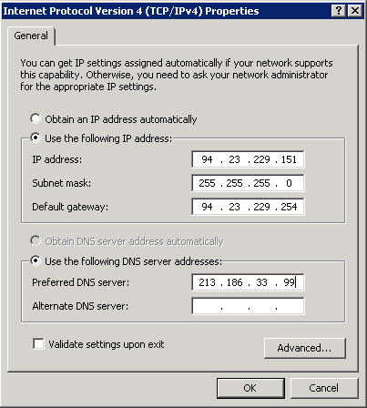

**Dernière mise à jour le 20/01/2020**

## Objectif

L'alias d'IP (*IP aliasing* en anglais) est une configuration spéciale du réseau de votre serveur dédié, qui vous permet d'associer plusieurs adresses IP sur une seule interface réseau.

<iframe width="560" height="315" src="https://www.youtube.com/embed/s1qDqQ0p07Q" frameborder="0" allow="autoplay; encrypted-media" allowfullscreen></iframe>

**Ce guide vous explique comment réaliser cet ajout.**

## Prérequis

- Posséder un [serveur dédié](https://www.ovh.com/fr/serveurs_dedies/){.external}, un [VPS](https://www.ovh.com/fr/vps/){.external} ou une [instance Public Cloud](https://www.ovh.com/fr/public-cloud/instances/){.external}.
- Avoir une ou plusieurs [IP fail-over](https://www.ovh.com/fr/serveurs_dedies/ip_failover.xml){.external}.
- Être connecté en SSH au serveur (accès root).


## En pratique

> [!primary]
> Les configurations visibles dans ce guide sont fournies à titre d’exemples. Des adaptations peuvent être nécessaires suivant le système d’exploitation que vous utilisez sur votre serveur dédié. 
>


Voici les configurations pour les distributions et les systèmes d’exploitation principaux.


### Debian 6/7/8 et dérivés

#### Étape 1 : créer une sauvegarde

Il convient avant tout d'effectuer une copie du fichier source afin de pouvoir revenir en arrière à tout moment :

```sh
cp /etc/network/interfaces /etc/network/interfaces.bak
```

#### Étape 2 : éditer le fichier de configuration

Vous pouvez désormais modifier le fichier source :

```sh
editor /etc/network/interfaces
```

Vous devez ensuite ajouter une interface secondaire :

```bash
auto eth0.0
iface eth0:0 inet static
address FAILOVER_IP
netmask 255.255.255.255
```

Pour vous assurer que l’interface secondaire est activée quand l’interface `eth0` l’est aussi, vous devez ajouter la ligne suivante à la configuration de `eth0` :

```bash
post-up /sbin/ifconfig eth0:0 IP_FAILOVER netmask 255.255.255.255 broadcast IP_FAILOVER
pre-down /sbin/ifconfig eth0:0 down
```

Si vous avez deux IP fail-over à configurer, le fichier `/etc/network/interfaces` doit ressembler à ceci :

```bash
auto eth0
iface eth0 inet static
address SERVER_IP
netmask 255.255.255.0
broadcast xxx.xxx.xxx.255
gateway xxx.xxx.xxx.254

auto eth0.0
iface eth0:0 inet static
address FAILOVER_IP
netmask 255.255.255.255

auto eth0:1
iface eth0:1 inet static
address FAILOVER_IP
netmask 255.255.255.255
```
Ou à cela :

```bash
auto eth0
iface eth0 inet static
address SERVER_IP
netmask 255.255.255.0
broadcast xxx.xxx.xxx.255
gateway xxx.xxx.xxx.254

# IPFO 1
post-up /sbin/ifconfig eth0:0 IP_FAILOVER netmask 255.255.255.255 broadcast IP_FAILOVER
pre-down /sbin/ifconfig eth0:0 down

# IPFO 2
post-up /sbin/ifconfig eth0:1 IP_IP2 netmask 255.255.255.255 broadcast IP_IP2
pre-down /sbin/ifconfig eth0:1 down
```

#### Étape 3 : redémarrer l’interface

Il vous reste à redémarrer votre interface :

```sh
/etc/init.d/networking restart
```


### Debian 9+, Ubuntu 17.04+, Fedora 26+ et Arch Linux

Sur ces distributions, la dénomination des interfaces comme `eth0`, `eth1` (et ainsi de suite) est supprimée. Nous utiliserons donc désormais de manière plus générique `systemd-network`.

#### Étape 1 : créer une sauvegarde

Il convient avant tout d'effectuer une copie du fichier source afin de pouvoir revenir en arrière à tout moment :

```sh
cp /etc/systemd/network/50-default.network /etc/systemd/network/50-default.network.bak
```

#### Étape 2 : éditer le fichier de configuration

Vous pouvez désormais ajouter dans le fichier source votre IP fail-over comme suit :

```sh
éditeur /etc/systemd/network/50-default.network
```
```sh
[Address]
Address=FAILOVER_IP/32
Label=failover1 # optional
```

Le label est optionnel. Il est présent pour distinguer vos différentes adresses IP fail-over.

#### Étape 3 : redémarrer l’interface

Il vous reste à redémarrer votre interface :

```sh
systemctl restart systemd-networkd
```
### Ubuntu 17.10 et versions suivantes

Chaque adresse IP fail-over aura besoin de sa propre ligne dans le fichier de configuration. Celui-ci a pour nom `50-cloud-init.yaml` et se trouve dans `/etc/netplan`.


#### Étape 1 : déterminer l’interface

```sh
ifconfig
```
Notez le nom de l'interface et son adresse MAC.


#### Étape 2 : créer le fichier de configuration

Connectez-vous à votre serveur via SSH et exécutez la commande suivante :

```sh
editor /etc/netplan/50-cloud-init.yaml
```

Ensuite, éditez le fichier avec le contenu ci-dessous, en remplaçant « INTERFACE_NAME », « MAC_ADDRESS » et « FAILOVER_IP » :

```sh
network:
    version : 2
    ethernets:
        NOM_DE_L'INTERFACE :
            dhcp4: true
            match:
                macadresse : MAC_ADDRESS
            set-name : INTERFACE_NAME
            addresses:
            - FAILOVER_IP/32
```

Enregistrez et fermez le fichier. Vous pouvez tester la configuration avec la commande suivante :

```sh
# netplan try
```

#### Étape 3 : appliquer le changement

Ensuite, exécutez les commandes suivantes pour appliquer la configuration :

```sh
# netplan apply
```


### CentOS et Fedora (25 et antérieures)

#### Étape 1 : créer le fichier de configuration

Il convient avant tout de faire une copie du fichier source afin de pouvoir l’utiliser comme modèle :

```sh
cp /etc/sysconfig/network-scripts/ifcfg-eth0 /etc/sysconfig/network-scripts/ifcfg-eth0:0
```

#### Étape 2 : éditer le fichier de configuration

Vous pouvez maintenant modifier le fichier `eth0:0` afin de remplacer l'adresse IP :

```sh
editor /etc/sysconfig/network-scripts/ifcfg-eth0:0
```

Remplacez en premier le nom du `device`, puis l’adresse IP déjà existante par l’IP fail-over que vous avez reçue :

```bash
DEVICE="eth0:0"
ONBOOT="yes"
BOOTPROTO="none" # For CentOS use "static"
IPADDR="FAILOVER_IP"
NETMASK="255.255.255.255"
BROADCAST="FAILOVER_IP"
```

#### Étape 3 : démarrer l'interface alias

Vous devez maintenant démarrer votre interface alias :

```sh
ifup eth0:0
```


### Gentoo

#### Étape 1 : créer une sauvegarde

Il convient avant tout d'effectuer une copie du fichier source afin de pouvoir revenir en arrière à tout moment :

```sh
cp /etc/conf.d/net /etc/conf.d/net.bak
```

#### Étape 2 : éditer le fichier de configuration

Maintenant, vous devez modifier le fichier pour ajouter l'IP fail-over. Dans Gentoo, un alias est ajouté directement dans l'interface `eth0`. Vous n'avez pas besoin de créer une interface `eth0:0` comme dans Red Hat ou CentOS.

> [!warning]
>
> L’IP par défaut du serveur et `config_eth0=` doivent rester sur la même ligne. Cela permet d'assurer le bon fonctionnement de certaines opérations spécifiques à OVH.
> 

Il vous suffit de faire un retour à la ligne après le masque de réseau **255.255.255.0** et d’y ajouter votre adresse IP fail-over. « SERVER_IP » doit être remplacé par l’IP principale de votre serveur.

```sh
editor /etc/conf.d/net
```

Vous devez donc ajouter ceci :

```bash
config_eth0=( "SERVER_IP netmask 255.255.255.0" "FAILOVER_IP netmask 255.255.255.255 brd FAILOVER_IP" )
```

Le fichier `/etc/conf.d/net` doit contenir ce qui suit :


```bash
#This blank configuration will automatically use DHCP for any net.
# scripts in /etc/init.d. To create a more complete configuration,
# please review /etc/conf.d/net.example and save your configuration
# in /etc/conf.d/net (this file :]!).
config_eth0=( "SERVER_IP netmask 255.255.255.0"
"FAILOVER_IP masque réseau 255.255.255.255.255.255.255 brd FAILOVER_IP" )
routes_eth0=( "default gw SERVER_IP.254" )
```

Afin de pouvoir effectuer un ping sur votre IP fail-over, vous devez simplement redémarrer l’interface réseau.

#### Étape 3 : redémarrer l’interface

Il vous reste à redémarrer votre interface :

```sh
/etc/init.d/net.eth0 restart
```


### openSUSE

#### Étape 1 : créer une sauvegarde

Il convient avant tout d'effectuer une copie du fichier source afin de pouvoir revenir en arrière à tout moment :

```sh
cp /etc/sysconfig/network/ifcfg-ens32 /etc/sysconfig/network/ifcfg-ens32.bak
```

#### Étape 2 : éditer le fichier de configuration

Ouvrez le fichier :

```sh
editor /etc/sysconfig/network/ifcfg-ens32
```

Ensuite, ajoutez ce qui suit :

```bash
IPADDR_1=FAILOVER_IP
NETMASK_1=255.255.255.255
LABEL_1=ens32:0
```

Finalement, redémarrez votre serveur pour appliquer les modifications.


### cPanel

#### Étape 1 : créer une sauvegarde

Il convient avant tout de faire une copie du fichier source afin de pouvoir revenir en arrière à tout moment :

```sh
cp /etc/ips /etc/ips.bak
```

#### Étape 2 : éditer le fichier de configuration

Vous devez ensuite modifier le fichier `/etc/ips` :

```sh
editor /etc/ips
```
Puis ajoutez l’IP fail-over au fichier :

```bash
FAILOVER_IP:255.255.255.255:FAILOVER_IP
```
Et ensuite, ajouter l’IP dans \`/etc/ipaddrpool\`\`:

```bash
FAILOVER_IP
```

#### Étape 3 : redémarrer l’interface

Il vous reste à redémarrer votre interface :

```sh
/etc/init.d/ipaliases restart
```


### Windows Servers

Les serveurs sous Windows sont souvent en DHCP au niveau de la configuration réseau. Si vous avez déjà paramétré une IP fail-over ou passé votre configuration en IP fixe, rendez-vous directement à l’étape suivante.

Sinon, vous devez d’abord passer d’une configuration DHCP au niveau du réseau à une configuration IP fixe.

Ouvrez l’invite de commande `cmd`{.action} ou `powershell`{.action}, puis tapez la commande suivante :


```sh
ipconfig /all
```

Cela vous donnera un résultat similaire à l’exemple suivant :

{.thumbnail}

Identifiez et notez votre adresse IPv4, votre masque de sous-réseau, votre passerelle par défaut et le nom du contrôleur d'interface réseau (carte réseau).

Dans notre exemple, l’adresse  IP du serveur est **94.23.229.151**.

Vous pouvez effectuer les prochaines étapes via des lignes de commande ou l’interface graphique.

#### En lignes de commande (recommandé)

Dans les commandes ci-dessous, vous devez remplacer les informations suivantes :

|Commande|Valeur|
|---|---|
|NETWORK_ADAPTER| Nom de la carte réseau (dans notre exemple : « Local Area Connection »).|
|IP_ADDRESS| Adresse IP du serveur (dans notre exemple : « 94.23.229.151 »).|
|SUBNET_MASK| Masque de sous-réseau (dans notre exemple : « 255.255.255.0 »).|
|GATEWAY| Passerelle par défaut (dans notre exemple : « 94.23.229.254 »).|
|IP_ADDRESS_FAILOVER| Adresse IP fail-over que vous voulez ajouter.|

> [!warning]
>
> Attention, le serveur ne sera plus accessible si vous entrez des informations incorrectes. Vous devrez alors effectuer les corrections en mode WinRescue ou via le KVM.
> 

Dans l’invite de commande :

Passez en premier lieu en IP fixe :
```sh
netsh interface ipv4 set address name="NETWORK_ADAPTER" static IP_ADDRESS SUBNET_MASK GATEWAY
```
Définissez ensuite le serveur DNS :
```sh
netsh interface ipv4 set dns name="NETWORK_ADAPTER" static 213.186.33.99
```
Puis ajoutez une adresse IP failover :
```sh
netsh interface ipv4 add address "NETWORK_ADAPTER" IP_ADDRESS_FAILOVER 255.255.255.255
```

Votre IP fail-over est désormais fonctionnelle.

#### Via l’interface graphique d’utilisateur

1. Allez dans le menu `Démarrer`{.action}, puis `Panneau de gestion`{.action}, `Réseau et Internet`{.action}, `Centre de réseau et Partage`{.action} et `Modifier les paramètres de la carte`{.action} dans la barre de gauche ;
2. Effectuez un clic droit sur `Connexion au réseau local`{.action} ;
3. Cliquez sur `Propriétés`{.action} ;
4. Sélectionnez `Protocole Internet Version 4 (TCP/IPv4)`{.action}, puis cliquez sur `Propriétés`{.action} ;
5. Cliquez sur `Utiliser l’adresse IP suivante`{.action} et renseignez l’IP principale de votre serveur, le masque sous-réseau et la passerelle par défaut obtenus grâce à la commande `ipconfig`{.action} ci-dessus. Dans la case « Serveur DNS Préféré », tapez « 213.186.33.99 ».

{.thumbnail}


> [!warning]
>
> Attention, le serveur ne sera plus accessible si vous entrez des informations incorrectes. Vous serez alors obligé d’effectuer les corrections en mode WinRescue ou via le KVM.
> 

Ensuite, cliquez sur `Avancé`{.action} en étant toujours positionné dans les `Paramètres TCP/IP`{.action}.

{.thumbnail}

Dans la partie « Adresse IP », cliquez sur `Ajouter`{.action} :

{.thumbnail}

Renseignez alors votre IP fail-over et le masque de sous-réseau « **255.255.255.255** ».

{.thumbnail}

Cliquez sur `Ajouter`{.action}.

Votre IP fail-over est désormais fonctionnelle.


### FreeBSD

#### Étape 1 : déterminer l’interface

Déterminez le nom de votre interface réseau principale. Vous pouvez utiliser la commande `ipconfig` pour cette opération :

```sh
ifconfig
```

Cela vous donnera le résultat suivant :

```sh
ifconfig
>>> nfe0: flags=8843 metric 0 mtu 1500
>>> options=10b
>>> ether 00:24:8c:d7:ba:11
>>> inet 94.23.196.18 netmask 0xffffff00 broadcast 94.23.196.255
>>> inet 87.98.129.74 netmask 0xffffffff broadcast 87.98.129.74
>>> media: Ethernet autoselect (100baseTX )
>>> status: active
>>> lo0: flags=8049 metric 0 mtu 16384
>>> options=3
>>> inet6 fe80::1%lo0 prefixlen 64 scopeid 0x2
>>> inet6 ::1 prefixlen 128
>>> inet 127.0.0.1 netmask 0xff000000 v comsdvt#
```

Dans notre exemple, le nom de l’interface est donc `nfe0`.

#### Étape 2 : créer une sauvegarde

Ensuite, effectuez une copie du fichier source afin de pouvoir revenir en arrière à tout moment :

```sh
cp /etc/rc.conf /etc/rc.conf.bak
```

#### Étape 3 : éditer le fichier de configuration

Modifiez le fichier `/etc/rc.conf` :

```sh
editor /etc/rc.conf
```

Ajoutez ensuite cette ligne à la fin du fichier `ifconfig_INTERFACE_alias0="inet IP_FAILOVER netmask 255.255.255.255 broadcast IP_FAILOVER"`.

Remplacez « INTERFACE » et « IP_FAILOVER » par le nom de votre interface (identifié à la première étape) et votre IP fail-over respectivement. Voici un exemple :


```bash
ifconfig_nfe0_alias0="inet 87.98.129.74 netmask 255.255.255.255 broadcast 87.98.129.74"
```

#### Étape 4 : redémarrer l’interface

Il vous reste à redémarrer votre interface :

```sh
/etc/rc.d/netif restart && /etc/rc.d/routing restart
```


### Solaris

#### Étape 1 : déterminer l’interface

Déterminez le nom de votre interface réseau principale. Vous pouvez utiliser la commande `ipconfig` pour cette opération :

```sh
ifconfig -a
```

Cela vous donnera le résultat suivant :

```sh
ifconfig -a
lo0:     flags=2001000849 mtu 8232 index 1 
         inet 127.0.0.0.1 masque de réseau ff00000000 
e1000g0 : flags=1000843 mtu 1500 index 2 
         >>> inet 94.23.41.167 netmask ffffff00 broadcast 94.23.41.255 
         éther 0:1c:c0:f2:be:42
```

Dans notre exemple, le nom de l’interface est donc `e1000g0`.

#### Étape 2 : créer le fichier de configuration

```sh
editor /etc/hostname.e1000g0:1
```
Dans ce fichier, renseignez ceci : « FAILOVER_IP/32 up », où « FAILOVER_IP » est votre adresse IP de basculement. Par exemple :

```bash
188.165.171.40/32 up
```

#### Étape 3 : redémarrer l’interface

Il vous reste à redémarrer votre interface :

```sh
svcadm restart svc:/network/physical:default
```

#### Résolution des défauts

Si vous ne parvenez pas à établir une connexion entre le réseau public et votre alias IP et que vous soupçonnez un problème réseau, redémarrez le serveur en mode rescue et configurez l'alias directement sur le serveur.

Pour ce faire, une fois que vous avez redémarré votre serveur en mode rescue, veuillez exécuter la commande suivante :

```bash
ifconfig_eth0="inet FAILOVER_IP netmask 0 broadcast FAILOVER_IP"
```

Où vous remplacerez « FAILOVER_IP » par la véritable IP fail-over.

Ensuite, il vous suffit d'effectuer un ping depuis votre IP fail-over vers l'extérieur. Si cela fonctionne, cela signifie probablement qu'il y a une erreur de configuration devant être corrigée. Si, au contraire, l'adresse IP ne fonctionne toujours pas, veuillez ouvrir un ticket à l'équipe d'assistance via votre [espace client OVH](https://www.ovh.com/auth/?action=gotomanager){.external}.

## Aller plus loin

Échangez avec notre communauté d’utilisateurs sur <https://community.ovh.com>.