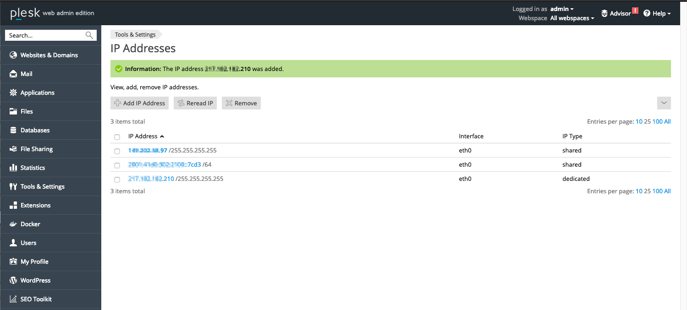

> [!primary]
> Questa traduzione è stata generata automaticamente dal nostro partner SYSTRAN. I contenuti potrebbero presentare imprecisioni, ad esempio la nomenclatura dei pulsanti o alcuni dettagli tecnici. In caso di dubbi consigliamo di fare riferimento alla versione inglese o francese della guida. Per aiutarci a migliorare questa traduzione, utilizza il pulsante "Modifica" di questa pagina.
>

**Ultimo aggiornamento: 10/11/2022**

> [!primary]
>
> Dal 6 ottobre 2022, la nostra soluzione "Failover IP" si chiama [Additional IP](https://www.ovhcloud.com/it/network/additional-ip/). Questo non ha alcun impatto sulla sua funzionalità.
>

## Obiettivo

L'alias IP (o IP aliasing) è un tipo di configurazione del tuo server dedicato che permette di associare più indirizzi IP a un'interfaccia di rete. 

**Questa guida ti mostra la procedura da seguire per effettuare l’operazione.**

## Prerequisiti

- Disporre di un server dedicato ([server dedicati](https://www.ovh.it/server_dedicati/){.external}, [VPS](https://www.ovh.it/vps/){.external} o [istanze Public Cloud]( https://www.ovh.it/public-cloud/istanze/){.external})
- Disporre di uno o più [Additional IP](https://www.ovhcloud.com/it/bare-metal/ip/){.external}
- Essere connesso al server in SSH (accesso root)

> [!warning]
> Questa funzionalità può non essere disponibile o limitata sui [server dedicati **Eco**](https://eco.ovhcloud.com/it/about/).
>
> Per maggiori informazioni, consulta la nostra [a confronto](https://eco.ovhcloud.com/it/compare/).

## Procedura

Di seguito le procedure di configurazione per le principali distribuzioni.

### Debian 10/11

#### Step 1: crea il file sorgente

Per prima cosa, ti consigliamo di effettuare una copia del file sorgente per poter ripristinare la versione precedente se necessario:

```sh
cp /etc/network/interfaces.d/50-cloud-init /etc/network/interfaces.d/50-cloud-init.bak
```

#### Step 2: modifica il file sorgente

Ora è possibile modificare il file sorgente:

```sh
editor /etc/network/interfaces.d/50-cloud-init
```

e aggiungere un’interfaccia secondaria:

```bash
auto eth0:0
iface eth0:0 inet static
address ADDITIONAL_IP
netmask 255.255.255.255
```

Per assicurarti che l’interfaccia secondaria venga attivata insieme all'interfaccia `eth0`, aggiungi questa riga alla configurazione di eth0:

```bash
post-up /sbin/ifconfig eth0:0 ADDITIONAL_IP netmask 255.255.255.255 broadcast ADDITIONAL_IP
pre-down /sbin/ifconfig eth0:0 down
```

Per configurare due Additional IP, il file /etc/network/interfaces.d/50-cloud-init deve essere di questo tipo:

```bash
auto eth0
iface eth0 inet dhcp

auto eth0:0
iface eth0:0 inet static
address ADDITIONAL_IP1
netmask 255.255.255.255

auto eth0:1
iface eth0:1 inet static
address ADDITIONAL_IP2
netmask 255.255.255.255
```
O così:

```bash
auto eth0
iface eth0 inet dhcp

# IP 1
post-up /sbin/ifconfig eth0:0 ADDITIONAL_IP1 netmask 255.255.255.255 broadcast ADDITIONAL_IP1
pre-down /sbin/ifconfig eth0:0 down

# IP 2
post-up /sbin/ifconfig eth0:1 ADDITIONAL_IP2 netmask 255.255.255.255 broadcast ADDITIONAL_IP2
pre-down /sbin/ifconfig eth0:1 down
```


#### Step 3: riavvia l’interfaccia

Per riavviare l’interfaccia esegui il comando:

```sh
/etc/init.d/networking restart
```

### Debian 6/7/8 e derivati

#### Step 1: crea il file sorgente

Per prima cosa, ti consigliamo di effettuare una copia del file sorgente per poter ripristinare la versione precedente se necessario:

```sh
cp /etc/network/interfaces /etc/network/interfaces.bak
```

#### Step 2: modifica il file sorgente

Ora è possibile modificare il file sorgente:

```sh
editor /etc/network/interfaces
```

e aggiungere un’interfaccia secondaria:

```bash
auto eth0:0
iface eth0:0 inet static
address ADDITIONAL_IP
netmask 255.255.255.255
```

Per assicurarti che l’interfaccia secondaria venga attivata insieme all'interfaccia `eth0`, aggiungi questa riga alla configurazione di eth0:

```bash
post-up /sbin/ifconfig eth0:0 ADDITIONAL_IP netmask 255.255.255.255 broadcast ADDITIONAL_IP
pre-down /sbin/ifconfig eth0:0 down
```

Per configurare due Additional IP, il file /etc/network/interfaces deve essere di questo tipo:

```bash
auto eth0
iface eth0 inet static
address SERVER_IP
netmask 255.255.255.0
broadcast xxx.xxx.xxx.255
gateway xxx.xxx.xxx.254

auto eth0:0
iface eth0:0 inet static
address ADDITIONAL_IP1
netmask 255.255.255.255

auto eth0:1
iface eth0:1 inet static
address ADDITIONAL_IP2
netmask 255.255.255.255

O così:

# IP 1
post-up /sbin/ifconfig eth0:0 ADDITIONAL_IP1 netmask 255.255.255.255 broadcast ADDITIONAL_IP1
pre-down /sbin/ifconfig eth0:0 down

# IP 2
post-up /sbin/ifconfig eth0:1 ADDITIONAL_IP2 netmask 255.255.255.255 broadcast ADDITIONAL_IP2
pre-down /sbin/ifconfig eth0:1 down
```


#### Step 3: riavvia l’interfaccia

Per riavviare l’interfaccia esegui il comando:

```sh
/etc/init.d/networking restart
```

### Debian 9+, Ubuntu 17+, Fedora 26+ e Arch Linux

Queste distribuzioni non utilizzano più la nomenclatura eth0, eth1... per le interfacce. Utilizzeremo quindi, in modo più generico, il servizio `systemd-network`.

#### Step 1: crea il file sorgente

Per prima cosa, ti consigliamo di effettuare una copia del file sorgente per poter ripristinare la versione precedente se necessario:

```sh
cp /etc/systemd/network/50-default.network /etc/systemd/network/50-default.network.bak
```

#### Step 2: modifica il file sorgente

Ora è possibile aggiungere il tuo Additional IP nel file sorgente, utilizzando il comando:

```sh
nano /etc/systemd/network/50-default.network
```

```sh
[Address]
Address=22.33.44.55/32
Label=failover1 # optional
```

Il label è opzionale e serve a distinguere i diversi Additional IP.

#### Step 3: riavvia l’interfaccia

Per riavviare l’interfaccia esegui il comando:

```sh
systemctl restart systemd-networkd
```


### CentOS e Fedora (25 e precedenti)

#### Step 1: crea il file sorgente

Per prima cosa, ti consigliamo di effettuare una copia del file sorgente per poterlo utilizzare come template:

```sh
cp /etc/sysconfig/network-scripts/ifcfg-eth0 /etc/sysconfig/network-scripts/ifcfg-eth0:0
```

#### Step 2: modifica il file sorgente

Ora è possibile modificare il file eth0:0 per sostituire l’IP:

```sh
editor /etc/sysconfig/network-scripts/ifcfg-eth0:0
```

Sostituisci prima il nome del `Device` e poi l'IP esistente con l'Additional IP assegnato:

```bash
DEVICE="eth0:0"
ONBOOT="yes"
BOOTPROTO="none" # For CentOS use "static"
IPADDR="ADDITIONAL_IP"
NETMASK="255.255.255.255"
BROADCAST="ADDITIONAL_IP"
```

#### Step 3: riavvia l’interfaccia

Per riavviare l’interfaccia esegui il comando:

```sh
ifup eth0:0
```


### Gentoo

#### Step 1: crea il file sorgente

Per prima cosa, ti consigliamo di effettuare una copia del file sorgente per poter ripristinare la versione precedente se necessario:

```sh
cp /etc/conf.d/net /etc/conf.d/net.bak
```

#### Step 2: modifica il file sorgente

Ora è possibile modificare il file per aggiungervi l’Additional IP. Su Gentoo, viene aggiunto direttamente un alias all’interfaccia eth0. Non sarà quindi necessario creare l’interfaccia eth0:0 come per Red Hat o CentOS.

> [!warning]
>
> Per assicurare il corretto funzionamento di alcune operazioni specifiche di OVH, l'IP di default del server e config\_eth0= devono essere sulla stessa riga. 
> 

È sufficiente inserire il tuo Additional IP nella linea successiva alla netmask **255.255.255.0** (sostituisci SERVER\_IP con l'IP principale del tuo server).

```sh
editor /etc/conf.d/net
```

Dovrai quindi aggiungere:

```bash
config_eth0=( "SERVER_IP netmask 255.255.255.0" "ADDITIONAL_IP netmask 255.255.255.255 brd ADDITIONAL_IP" )
```

Il file /etc/conf.d/net deve contenere:


```bash
#This blank configuration will automatically use DHCP for any net.
# scripts in /etc/init.d. To create a more complete configuration,
# please review /etc/conf.d/net.example and save your configuration
# in /etc/conf.d/net (this file :]!).
config_eth0=( "SERVER_IP netmask 255.255.255.0"
"ADDITIONAL_IP netmask 255.255.255.255 brd ADDITIONAL_IP" )
routes_eth0=( "default gw SERVER_IP.254" )
```

Per effettuare un ping sul tuo Additional IP, sarà sufficiente riavviare l’interfaccia di rete.


#### Step 3: riavvia l’interfaccia

Per riavviare l’interfaccia esegui il comando:

```sh
/etc/init.d/net.eth0 restart
```


### openSUSE

#### Step 1: crea il file sorgente

Per prima cosa, ti consigliamo di effettuare una copia del file sorgente per poter ripristinare la versione precedente se necessario:

```sh
cp /etc/sysconfig/network/ifcfg-ens32 /etc/sysconfig/network/ifcfg-ens32.bak
```

#### Step 2: modifica il file sorgente

Ora è possibile modificare il file /etc/sysconfig/network/ifcfg-ens32 in questo modo:

```bash
IPADDR_1=ADDITIONAL_IP
NETMASK_1=255.255.255.255
LABEL_1=ens32:0 
```


### cPanel

#### Step 1: crea il file sorgente

Per prima cosa, ti consigliamo di effettuare una copia del file sorgente per poter ripristinare la versione precedente se necessario:

```sh
cp /etc/ips /etc/ips.bak
```

#### Step 2: modifica il file sorgente

Ora è possibile modificare il file /etc/ips:

```sh
editor /etc/ips
```

aggiungere l’Additional IP al file:

```bash
ADDITIONAL_IP:255.255.255.255:ADDITIONAL_IP
```

e infine aggiungere l’IP in `/etc/ipaddrpool`:

```bash
ADDITIONAL_IP
```

#### Step 3: riavvia il servizio

Per riavviare l’interfaccia esegui il comando:

```sh
/etc/init.d/ipaliases restart
```

### Windows Server

I server Windows vengono forniti solitamente con una configurazione di rete con DHCP abilitato di default. Se hai già aggiunto un Additional IP o modificato la tua configurazione per utilizzare un IP statico, passa direttamente allo step successivo.

In caso contrario sarà necessario modificare la configurazione di rete per impostare IP statico al posto del DHCP.

Apri il prompt dei comandi `cmd`{.action} o `powershell`{.action} e digita il comando:

```sh
ipconfig /all
```

Il risultato restituito sarà, ad esempio:

{.thumbnail}

Recupera il tuo IPv4, la subnet mask, il gateway predefinito e il nome della scheda di rete.

Nel nostro esempio, l’IP del server è: **94.23.229.151**


Per continuare, è possibile effettuare le operazioni sia da riga di comando che tramite interfaccia grafica:

#### Da riga di comando (consigliato)

Nei comandi seguenti, è necessario sostituire:

|Comando|Valore|
|---|---|
|NETWORK_ADAPTER|Nome della scheda di rete (nel nostro esempio, Local Area Connection)|
|IP_ADDRESS|Indirizzo IP del server (nel nostro esempio, 94.23.229.151)|
|SUBNET_MASK| Maschera di sottorete (nel nostro esempio, 255.255.255.0)|
|GATEWAY| Gateway predefinito (nel nostro esempio, 94.23.229.254)|
|ADDITIONAL_IP|Indirizzo Additional IP da aggiungere|

> [!warning]
>
> Attenzione: se le informazioni inserite non sono corrette, il server non sarà più raggiungibile e sarà necessario effettuare le correzioni accedendo in modalità Winrescue o tramite KVM. 
> 

Nel prompt dei comandi:

* Passare a un IP statico

```sh
netsh interface ipv4 set address name="NETWORK_ADAPTER" static IP_ADDRESS SUBNET_MASK GATEWAY
```
 
* Definire il server DNS

```sh
netsh interface ipv4 set dns name="NETWORK_ADAPTER" static 213.186.33.99
``` 

* Aggiungere un Additional IP

```sh
netsh interface ipv4 add address "NETWORK_ADAPTER" ADDITIONAL_IP 255.255.255.255
```

Da questo momento, il tuo Additional IP è attivo.


#### Da interfaccia grafica

1. Accedi al menu `Start`{.action} > `Pannello di controllo`{.action} > `Rete e Internet`{.action} > `Centro connessioni di rete e condivisione`{.action} > `Modifica impostazioni scheda`{.action} (nel menu a sinistra)
2. Clicca con il tasto destro su `Connessione alla rete locale`{.action}
3. Clicca su `Proprietà`{.action}
4. Seleziona `Protocollo Internet Version 4 (TCP/IPv4)`{.action} e clicca su `Proprietà`{.action}
5. Clicca su `Utilizza il seguente indirizzo IP`{.action} e inserisci l'IP principale del tuo server, la subnet mask e il gateway predefinito ottenuto precedentemente con il comando `ipconfig`{.action} . In `Server DNS preferito`, inserisci 213.186.33.99.

{.thumbnail}


> [!warning]
>
> Attenzione: se le informazioni inserite non sono corrette, il server non sarà più raggiungibile e sarà necessario effettuare le correzioni accedendo in modalità Winrescue o tramite KVM. 
> 

In seguito, clicca su `Avanzate`{.action} (sempre nelle `Impostazioni TCP/IP`{.action}).

{.thumbnail}

Nella parte `indirizzo IP`{.action}, clicca su `Aggiungi...`{.action}:

{.thumbnail}

Inserisci il tuo Additional IP e la subnet mask **255.255.255.255**.

{.thumbnail}

Clicca su `Aggiungi`{.action}.

Da questo momento, il tuo Additional IP è attivo.

### Plesk

#### Step 1: accedere alla gestione IP di Plesk

Nel pannello di configurazione Plesk, seleziona `Tools & Settings`{.action} nella barra laterale sinistra.

{.thumbnail}

Clicca su `IP Indirizzi`{.action} con **Tools & Settings**.

#### Step 2: aggiungi le informazioni IP supplementari

In questa sezione, clicca sul pulsante `Add IP Address`{.action}.

{.thumbnail}

Inserisci il tuo indirizzo Additional IP nella forma `xxx.xxx.xxx.xxx/32` nel campo "IP address and subnet mask" e clicca su `OK`{.action}.

{.thumbnail}

#### Step 3: verifica la configurazione IP corrente

Per verificare che l'indirizzo Additional IP sia stato aggiunto correttamente, accedi alla sezione "Indirizzi IP".

{.thumbnail}

### FreeBSD

#### Step 1: identifica l'interfaccia

Recupera il nome della tua interfaccia di rete principale utilizzando il comando `ifconfig`{.action}:

```sh
ifconfig
```

Otterrai questo risultato:

```sh
ifconfig
>>> nfe0: flags=8843 metric 0 mtu 1500
>>> options=10b
>>> ether 00:24:8c:d7:ba:11
>>> inet 94.23.196.18 netmask 0xffffff00 broadcast 94.23.196.255
>>> inet 87.98.129.74 netmask 0xffffffff broadcast 87.98.129.74
>>> media: Ethernet autoselect (100baseTX )
>>> status: active
>>> lo0: flags=8049 metric 0 mtu 16384
>>> options=3
>>> inet6 fe80::1%lo0 prefixlen 64 scopeid 0x2
>>> inet6 ::1 prefixlen 128
>>> inet 127.0.0.1 netmask 0xff000000 v comsdvt#
```

Nel nostro esempio, il nome dell’interfaccia è **nfe0**.


#### Step 2: crea il file sorgente

Ti consigliamo di effettuare una copia del file sorgente per poter ripristinare la versione precedente se necessario:

```sh
cp /etc/rc.conf /etc/rc.conf.bak
```

#### Step 3: modifica il file sorgente

Ora è possibile modificare il file /etc/rc.conf:

```sh
editor /etc/rc.conf
```

Alla fine del file, aggiungi la riga `ifconfig_INTERFACE_alias0=”inet ADDITIONAL_IP netmask 255.255.255.255 broadcast ADDITIONAL_IP”`.

Sostituisci **INTERFACE** e **ADDITIONAL_IP** rispettivamente con il nome della tua interfaccia (identificata nel primo step) e con il tuo Additional IP. Per esempio:


```bash
ifconfig_nfe0_alias0="inet 87.98.129.74 netmask 255.255.255.255 broadcast 87.98.129.74"
```

#### Step 4: riavvia l’interfaccia

Per riavviare l’interfaccia esegui il comando:

```sh
/etc/rc.d/netif restart && /etc/rc.d/routing restart
```

### Solaris

#### Step 1: identifica l'interfaccia

Recupera il nome della tua interfaccia di rete principale utilizzando il comando `ifconfig`{.action}:

```sh
ifconfig -a
```

Otterrai questo risultato:

```sh
ifconfig -a
>>> lo0: flags=2001000849 mtu 8232 index 1 inet 127.0.0.1 netmask ff000000 e1000g0: flags=1000843 mtu 1500 index 2 inet 94.23.41.167 netmask ffffff00 broadcast 94.23.41.255 ether 0:1c:c0:f2:be:42
```

Nel nostro esempio, il nome dell’interfaccia è **e1000g0**.


#### Step 2: crea il file sorgente

Ti consigliamo di effettuare una copia del file sorgente per poter ripristinare la versione precedente se necessario:

```sh
editor /etc/hostname.e1000g0:1
```

#### Step 3: modifica il file sorgente

In questo file, inserisci: **ADDITIONAL_IP/32 up**, dove **ADDITIONAL_IP** corrisponde al tuo Additional IP. Per esempio:

```bash
188.165.171.40/32 up
```

#### Step 4: riavvia l’interfaccia

Per riavviare l’interfaccia esegui il comando:

```sh
svcadm restart svc:/network/physical:default
```


## Per saperne di più

Contatta la nostra Community di utenti all’indirizzo <https://community.ovh.com/en/>.


