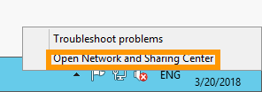
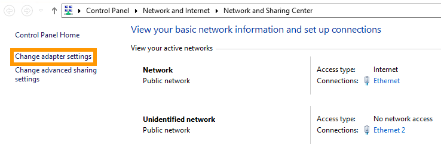

**Last updated 22nd February 2019**

## Objective

Internet Protocol version 6 (IPv6) is the latest version of the Internet Protocol (IP). It is designed to address the long-anticipated address exhaustion of its predecessor, IPv4, by using 128-bit addresses instead of 32-bit addresses. Every OVH Dedicated Server comes with a /64 IPv6 block. This represents over 18 quintillion IP addresses that you can use at your convenience.

**This guide explains how to configure IPv6 addresses on our infrastructure.**

## Requirements

- a [Dedicated Server](https://www.ovh.co.uk/dedicated_servers/){.external}
- [IP failover(s)](https://www.ovh.co.uk/dedicated_servers/ip_failover.xml){.external} with associated virtual MAC addresses
- all your IPv6 information (prefix, gateway etc.)
- a basic knowledge of [SSH](http://en.wikipedia.org/wiki/Secure_Shell) and networking

## Instructions

If you are using an OVH-provided Linux OS template to install your server, you will see that you already have the first (main) IPv6 configured right out of the box.

If you want to have more than one IPv6 configured on your server (or want to use it on a VM) you will need to have a failover IP configured with a vMAC. Otherwise, the IPv6 won’t be routed by our routers/switches.

> [!primary]
>
> The default gateway for your IPv6 block (IPv6_GATEWAY) is always xxxx.xxxx.xxxx.xxFF:FF:FF:FF:FF. 
>
> For example:
> 
> - The IPv6 address of the server is 2607:5300:60:62ac::/64. The IPv6_GATEWAY will therefore be 2607:5300:60:62FF:FF:FF:FF:FF.
> - The IPv6 address of the server is 2001:41D0:1:46e::/64. The IPv6_GATEWAY will therefore be 2001:41D0:1:4FF:FF:FF:FF:FF.
>

### Debian and Debian-based operating systems

> [!warning]
>
> Before following the steps below, we strongly suggest that you disable IPv6 autoconf and router advertising to prevent known issues. You can do so by adding the following lines to your `sysctl.conf` file, which is located in /etc/sysctl.conf:
> 
> `net.IPv6.conf.all.autoconf=0`
> 
> `net.IPv6.conf.all.accept_ra=0`
> 
> Once this has been done, you can apply those rules by executing the following command: `sh sysctl -p`.
> 

#### Step 1: Open an SSH connection to your server

You can open up a connection to your server using the command line terminal if you're using a Linux operating system. If you're using a Windows PC, you can install PuTTy, which is a terminal emulator for Windows. It will allow you to connect to your server and run commands.

You can connect to your server using its IP address and your root credentials.

#### Step 2: Open your server's network configuration file

Your server's network configuration file is located in `/etc/network/interfaces`. Use the command line to locate the file and open it for editing.

#### Step 3: Amend the network configuration file

Amend the file so that it looks like the example below. In this example, the network interface is called `eth0`. The interface on your server may differ.

```sh
iface eth0 inet6 static 
    address YOUR_IPv6 
    netmask 128

post-up /sbin/ip -f inet6 route add IPv6_GATEWAY dev eth0 
post-up /sbin/ip -f inet6 route add default via IPv6_GATEWAY 
pre-down /sbin/ip -f inet6 route del IPv6_GATEWAY dev eth0
pre-down /sbin/ip -f inet6 route del default via IPv6_GATEWAY
```

#### Step 4: Save the file and reboot the server

Save your changes to the file and then reboot your server to apply the changes.

#### Step 5: Test the IPv6 connectivity

You can test the IPv6 connectivity by running the commands shown below:

```sh
ping6 -c 4 2001:4860:4860::8888

>>> PING 2001:4860:4860::8888(2001:4860:4860::8888) 56 data bytes
>>> 64 bytes from 2001:4860:4860::8888: icmp_seq=1 ttl=55 time=23.6 ms
>>> 64 bytes from 2001:4860:4860::8888: icmp_seq=2 ttl=55 time=23.8 ms
>>> 64 bytes from 2001:4860:4860::8888: icmp_seq=3 ttl=55 time=23.9 ms
>>> 64 bytes from 2001:4860:4860::8888: icmp_seq=4 ttl=55 time=23.8 ms

>>> --- 2001:4860:4860::8888 ping statistics ---
>>> 1 packets transmitted, 1 received, 0% packet loss, time 0ms
>>> rtt min/avg/max/mdev = 23.670/23.670/23.670/0.000 ms
```


If you are not able to ping this IPv6 address, check your configuration and try again. If it still doesn't work, please test your configuration in [Rescue mode](https://docs.ovh.com/gb/en/dedicated/ovh-rescue/){.external}.

### Fedora 26 and above

> [!warning]
>
> This example has been made with CentOS 7.0. Results may vary when using other Redhat derivatives.
>

#### Step 1: Open an SSH connection to your server

You can open up a connection to your server using the command line terminal if you're using a Linux operating system. If you're using a Windows PC, you can install PuTTy, which is a terminal emulator for Windows. It will allow you to connect to your server and run commands.

You can connect to your server using its IP address and your root credentials.

#### Step 2: Open your server's network configuration file

Your server's network configuration file is located in /etc/sysconfig/network-scripts/ifcfg-eth0. Use the command line to locate this file and open it for editing.

#### Step 3: Amend the network configuration file

Amend the file so that it looks like the example below. In this example, the network interface is called eth0. The interface on your server may differ. Also, we have omitted the IPv4 Failover configuration to avoid confusion, but the IPv6 configuration is made in the same configuration file.

```sh
IPV6INIT=yes
IPV6_AUTOCONF=no
IPV6_DEFROUTE=yes
IPV6_FAILURE_FATAL=no
IPV6ADDR=YOUR_IPv6/IPv6_PREFIX ---> (basically your IPv6 in CIDR notation)
IPV6_DEFAULTGW=IPv6_GATEWAY
```

#### Step 4: Save the file and reboot the server

Save your changes to the file and then reboot your server to apply the changes.

#### Step 5: Test the IPv6 connectivity

You can test the IPv6 connectivity by running the commands shown below:

```sh
ping6 -c 4 2001:4860:4860::8888

>>> PING 2001:4860:4860::8888(2001:4860:4860::8888) 56 data bytes
>>> 64 bytes from 2001:4860:4860::8888: icmp_seq=1 ttl=55 time=23.6 ms
>>> 64 bytes from 2001:4860:4860::8888: icmp_seq=2 ttl=55 time=23.8 ms
>>> 64 bytes from 2001:4860:4860::8888: icmp_seq=3 ttl=55 time=23.9 ms
>>> 64 bytes from 2001:4860:4860::8888: icmp_seq=4 ttl=55 time=23.8 ms

>>> --- 2001:4860:4860::8888 ping statistics ---
>>> 1 packets transmitted, 1 received, 0% packet loss, time 0ms
>>> rtt min/avg/max/mdev = 23.670/23.670/23.670/0.000 ms
```

If you are not able to ping this IPv6 address, check your configuration and try again. If it still doesn't work, please test your configuration in [Rescue mode](https://docs.ovh.com/gb/en/dedicated/ovh-rescue/){.external}.

### FreeBSD

#### Step 1: Open an SSH connection to your server

You can open up a connection to your server using the command line terminal if you're using a Linux operating system. If you're using a Windows PC, you can install PuTTy, which is a terminal emulator for Windows. It will allow you to connect to your server and run commands.

You can connect to your server using its IP address and your root credentials.

#### Step 2: Open your server's network configuration file

Your server's network configuration file is located in `/etc/rc.conf`. Use the command line to locate this file and open it for editing.

#### Step 3: Amend the network configuration file

Amend the file so that it looks like the example below. In this example, the network interface is called eth0. The interface on your server may differ.

```sh
IPv6_activate_all_interfaces="YES" 
IPv6_defaultrouter="IPv6_GATEWAY" 
ifconfig_em0_IPv6="inet6 YOUR_IPv6 prefixlen 64"
```

#### Step 4: Save the file and reboot the server

Save your changes to the file and then reboot your server to apply the changes.

#### Step 5: Test the IPv6 connectivity

You can test the IPv6 connectivity by running the commands shown below:

```
ping6 -c 4 2001:4860:4860::8888

>>> PING 2001:4860:4860::8888(2001:4860:4860::8888) 56 data bytes
>>> 64 bytes from 2001:4860:4860::8888: icmp_seq=1 ttl=55 time=23.6 ms
>>> 64 bytes from 2001:4860:4860::8888: icmp_seq=2 ttl=55 time=23.8 ms
>>> 64 bytes from 2001:4860:4860::8888: icmp_seq=3 ttl=55 time=23.9 ms
>>> 64 bytes from 2001:4860:4860::8888: icmp_seq=4 ttl=55 time=23.8 ms

>>> --- 2001:4860:4860::8888 ping statistics ---
>>> 1 packets transmitted, 1 received, 0% packet loss, time 0ms
>>> rtt min/avg/max/mdev = 23.670/23.670/23.670/0.000 ms
```

If you are not able to ping this IPv6 address, check your configuration and try again. If it still doesn't work, please test your configuration in [Rescue mode](https://docs.ovh.com/gb/en/dedicated/ovh-rescue/){.external}.

### Ubuntu 18.04

#### Step 1: Open an SSH connection to your server

Using a command line utility, establish an SSH connection to your server.

#### Step 2: Open your server's network configuration file

Open the network configuration file located in /etc/systemd/network. For demonstration purposes, our file is called 50-default.network.

#### Step 3: Amend the network configuration file

Using a text editor, amend the file by adding the following lines to the relevant sections as shown in the example below:

```sh
[Network]
Destination=Gateway_Address

[Address]
Address=IPv6_Address/64

[Route]
Destination=Gateway_Address
Scope=link
```

#### Step 4: Save the file and reboot the server

Save your changes to the file and then reboot your server to apply the changes.

#### Step 5: Test the IPv6 connectivity

You can test the IPv6 connectivity by running the commands shown below:

```
ping6 -c 4 2001:4860:4860::8888

PING 2001:4860:4860::8888(2001:4860:4860::8888) 56 data bytes
64 bytes from 2001:4860:4860::8888: icmp_seq=1 ttl=57 time=4.07 ms
64 bytes from 2001:4860:4860::8888: icmp_seq=2 ttl=57 time=4.08 ms
64 bytes from 2001:4860:4860::8888: icmp_seq=3 ttl=57 time=4.08 ms
64 bytes from 2001:4860:4860::8888: icmp_seq=4 ttl=57 time=4.07 ms

--- 2001:4860:4860::8888 ping statistics ---
4 packets transmitted, 4 received, 0% packet loss, time 3003ms
rtt min/avg/max/mdev = 4.075/4.079/4.083/0.045 ms
```

### Windows Server 2012

To remotely connect to your Windows server, you'll need to establish a remote desktop connection to it. First, right-click on the network icon in the notification area to go to the `Network and Sharing Center`{.action}.

{.thumbnail}

Click `Change adapter settings`{.action}.

{.thumbnail}

Right-click your network adapter, then click `Properties`{.action}.

{.thumbnail}

Select `Internet Protocol Version 6`{.action}, then click `Properties`{.action}.

{.thumbnail}

Enter your IPv6 configuration (`IPv6 address` and `Default Gateway`) and click `OK`{.action}.

{.thumbnail}

## Go further

Join our community of users on <https://community.ovh.com/en/>.