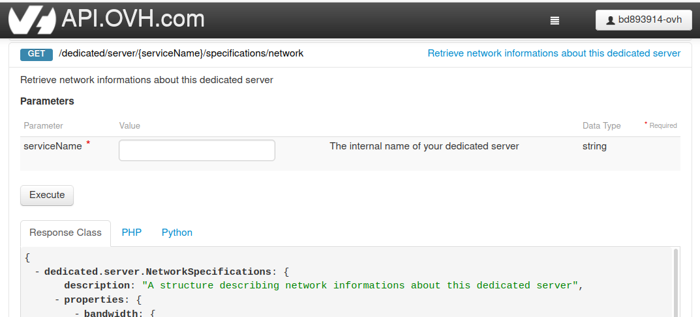
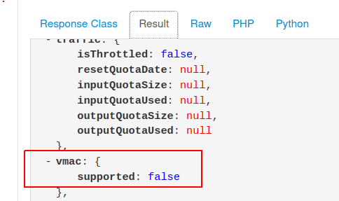

**Dernière mise à jour le 09/12/2021**

## Objectif

Savoir si la fonctionalité des MAC virtuelles est supporté sur un serveur.
Le support de cette fonctionalité est un pré-requis de toutes les actions concernant les MAC virtuelles.

**Ce guide vous explique comment savoir si la fonctionnalité des MAC virtuelles est supporté sur un serveur donné.**

## Prérequis

* Posséder [un serveur dédié](https://www.ovh.com/fr/serveurs_dedies/){.external}.
* Être connecté à l'[API OVH](https://api.ovh.com/console/){.external}.

## En pratique

### Obtenir l'information

Une fois connecté dansl'[API OVH](https://api.ovh.com/console/){.external} , aller sur la route API [/dedicated/server/{serviceName}/specifications/network] (https://api.ovh.com/console/#/dedicated/server/%7BserviceName%7D/specifications/network#GET){.external}

{.thumbnail}

Mettre le com de votre serveur dans le champ "serviceName", puis cliquez sur `Execute`{.action}.

{.thumbnail}

Vous avez en résultat, une liste avec une entrée "vmac / supported" qui sera à "true" ou "false" (valeur booléenne).

{.thumbnail}

> [!primary]
>
> **false** : vous ne pouvez pas utiliser les fonctionnalités liées aux MAC virtuelles sur ce serveur.
>
> **true** : vous pouvez utiliser les fonctionnalités liées aux MAC virtuelles sur ce serveur.
>

## Aller plus loin

Échangez avec notre communauté d'utilisateurs sur <https://community.ovh.com/>.