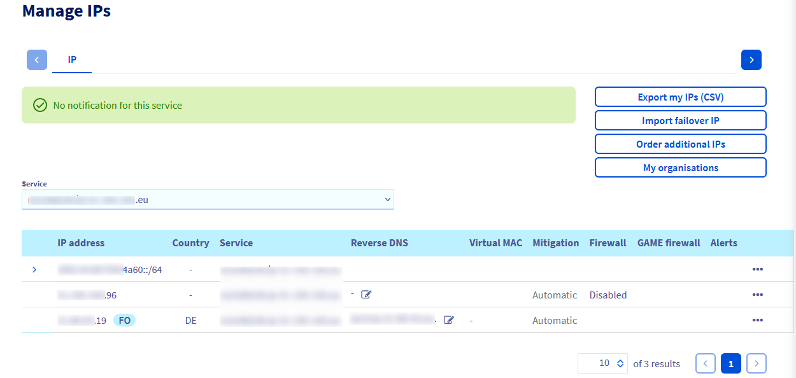
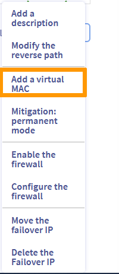

**Dernière mise à jour le 26/07/2022**

## Objectif

OVHcloud vous permet d’associer une adresse MAC virtuelle à une adresse IP, afin de pouvoir mettre en place des machines virtuelles avec une configuration bridge sur votre serveur.

**Ce guide vous explique comment créer une adresse MAC virtuelle et comment l’associer à une adresse IP fail-over.**

## Prérequis

- Posséder [un serveur dédié](https://www.ovh.com/fr/serveurs_dedies/){.external}.
- Disposer d'une [adresse IP fail-over](https://www.ovh.com/fr/serveurs_dedies/ip_failover.xml){.external} ou un bloc d’IP fail-over (RIPE).
- Être connecté à l'[espace client OVHcloud](https://www.ovh.com/auth/?action=gotomanager&from=https://www.ovh.com/fr/&ovhSubsidiary=fr){.external} ou à [l'API OVHcloud](https://api.ovh.com/console/).
- Votre serveur doit supporter les MAC virtuelles. Consultez [ce guide](https://docs.ovh.com/fr/dedicated/network-support-virtual-mac/) afin de le déterminer.

> [!warning]
> Cette fonctionnalité peut être indisponible ou limitée sur les [serveurs dédiés **Eco**](https://eco.ovhcloud.com/fr/about/).
>
> Consultez notre [comparatif](https://eco.ovhcloud.com/fr/compare/) pour plus d’informations.

> [!primary]
> Si vous n'êtes pas familier avec l'utilisation de l'API OVHcloud, consultez notre guide « [Premiers pas avec les API OVHcloud](https://docs.ovh.com/fr/api/first-steps-with-ovh-api/) ».

## En pratique

### Assigner une adresse MAC

> [!warning]
>
> Si un bloc IP a été déplacé dans le vRack, il n’est plus assigné à un serveur physique à ce titre, il n’est plus possible d’assigner une MAC virtuelle à une IP.
>

#### Via l'espace client OVHcloud

Une fois connecté dans l'[espace client OVHcloud](https://www.ovh.com/auth/?action=gotomanager&from=https://www.ovh.com/fr/&ovhSubsidiary=fr){.external}, cliquez sur le menu `Bare Metal Cloud`{.action}, puis ouvrez la section `IP`{.action}.

{.thumbnail}

Localisez ensuite votre adresse IP fail-over (ou votre bloc) dans la liste, puis cliquez sur le bouton `...`{.action} pour afficher la liste des options.

{.thumbnail}

Lorsque la boîte de dialogue « Ajouter une MAC virtuelle » apparaît, sélectionnez un type dans la liste déroulante, entrez un nom de machine virtuelle, puis cliquez sur `Confirmer`{.action}.

> [!primary]
>
> **Type** : il s'agit du type d’adresse MAC virtuelle (« VMware » sera une adresse MAC faite pour le système VMware ESXi tandis qu'« ovh » conviendra à tous les autres types de systèmes de virtualisation).
>
> **Nom de la machine virtuelle** : il s'agit du nom souhaité pour l’adresse MAC virtuelle, pour retrouver ensuite plus facilement ce couple IP/MAC.
>

{.thumbnail}

> [!primary]
>
> N’oubliez pas d’assigner l’adresse MAC virtuelle créée lors de la configuration de votre machine virtuelle.
> 

#### Via l'API OVHcloud

Utilisez l'appel API suivant :

> [!api]
>
> @api {POST} /dedicated/server/{serviceName}/virtualMac/{macAddress}/virtualAddress/{ipAddress}

### Supprimer une adresse MAC

> [!warning]
>
> La suppression d'une adresse MAC est définitive, aucune récupération ultérieure ne sera possible.
> 

#### Via l'espace client OVHcloud

Pour supprimer une adresse MAC virtuelle associée à une IP fail-over, connectez-vous dans un premier temps à votre [espace client](https://www.ovh.com/auth/?action=gotomanager&from=https://www.ovh.com/fr/&ovhSubsidiary=fr){.external}, cliquez sur le menu `Bare Metal Cloud`{.action}, puis ouvrez la section `IP`{.action}. Sélectionnez le serveur concerné afin que l’IP fail-over (ou le bloc d’IP) qui y sont attachées apparaissent.

Pour finir, cliquez sur le bouton `...`{.action} à droite puis cliquez sur `Supprimer la MAC virtuelle`{.action}.

#### Via l'API OVHcloud

Utilisez l'appel API suivant :

> [!api]
>
> @api {DELETE} /dedicated/server/{serviceName}/virtualMac/{macAddress}/virtualAddress/{ipAddress}
>

## Aller plus loin

Échangez avec notre communauté d'utilisateurs sur <https://community.ovh.com/>.
