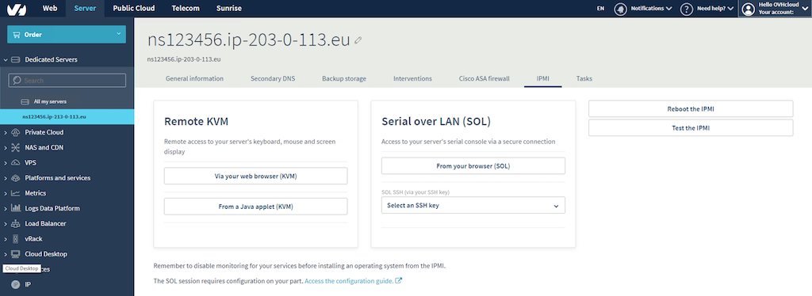

**Last updated October 24th, 2019**

## Objective

OVHcloud Link Aggregation (OLA) technology is designed by our teams to increase your server’s availability, and boost the efficiency of your network connections. In just a few clicks, you can aggregate your network cards and make your network links redundant. This means that if one link goes down, traffic is automatically redirected to another available link. In this article, we will discuss how to bond your NICs to use them for OLA in CentOS 7.

## Requirements

[How to Configure Your NIC for OVHcloud Link Aggregation in the OVH Manager](https://docs.ovh.com/gb/en/dedicated/ola-manager){.external}

## Instructions

Because we have a private-private configuration for our NICs in OLA, we will be unable to SSH into the server. Thus, we will need to leverage the IPMI tool to access the server. To do so, first log in to the [OVH Manager](https://www.ovh.com/manager/){.external}.  Then select the server you wish to configure on the left-hand sidebar and click the **IPMI** tab.

{.thumbnail}

Next, click the **From a Java applet (KVM)** button. A JNLP program will download. Open the program to enter the IPMI. Log in using valid credentials for the server.

By default, using an OVH template, the NICs will be named *eth0* and *eth1*. If you are not using an OVH template, you can find the names of your interfaces using the following command:

```bash
ip a
```

> [!primary]
>
> This command will yield numerous "interfaces." If you are having trouble determining which ones are your physical NICs, the first interface will still have the server's public IP address attached to it by default.
>

Once we have determined the names of our two NICs, we will configure NIC bonding in the OS. The first step is to create a bond interface. To do so, create the following configuration file in a text editor of your choice:

```bash
vi /etc/sysconfig/network-scripts/ifcfg-bond0
```

This will open an empty text file. To configure the bond interface, insert the following into the text file:

```bash
DEVICE=bond0
TYPE=Bond
NAME=bond0
BOOTPROTO=none
ONBOOT=yes
BONDING_MASTER=yes
IPADDR=10.0.0.1
NETMASK=255.255.255.0
BONDING_OPTS="mode=802.3ad miimon=100"
```

> [!primary]
>
> You can use any private IP address and subnet you wish you to use.
>

Save and exit the file once you have confirmed that the information is correct.  Next, we need to configure both physical interfaces. By default, on an OVH server, only *eth0* will have a configuration file. Open it using the following command:

```bash
vi /etc/sysconfig/network-scripts/ifcfg-eth0
```

By default, the file will appear as follows:

```bash
DEVICE=eth0
BOOTPROTO=static
IPADDR=203.0.113.1
NETMASK=255.255.255.0
ONBOOT=yes
GATEWAY=203.0.113.254
IPV6INIT=yes
IPV6_AUTOCONF=no
IPV6ADDR=2001:0db8:0000:0001::/64
```

> [!warning]
>
> The IP addresses will be different for each server.
>

We will change the file to appear as follows:

```bash
DEVICE=eth0
BOOTPROTO=static
#IPADDR=203.0.113.1
#NETMASK=255.255.255.0
ONBOOT=yes
#GATEWAY=203.0.113.254
#IPV6INIT=yes
#IPV6_AUTOCONF=no
#IPV6ADDR=2001:0db8:0000:0001::/64
TYPE=Ethernet
HWADDR=00:53:00:00:00:00
MASTER=bond0
SLAVE=yes
```

> [!primary]
>
> The hardware address (MAC address) of the NIC can be found using the *ip a* command that we used earlier.  It will be the number next to "link/ether" in the output.
>

The *#* in front of a line means that the server will ignore this line when reading the file. Thus, we will ignore these lines entirely when creating our interface file for *eth1*. We will create the *eth1* configuration file using the following command:

```bash
vi /etc/sysconfig/network-scripts/ifcfg-eth1
```

This time, the file will be blank so add the following content to the file:

```bash
DEVICE=eth1
BOOTPROTO=static
ONBOOT=yes
TYPE=Ethernet
HWADDR=00:53:00:00:00:01
MASTER=bond0
SLAVE=yes
```

Finally, we will restart the network daemon using the following command:

```bash
systemctl restart network
```

To test that our bond is working, ping another server on the same vRack. If it works, you are all set. If it does not, double-check your configurations or try rebooting the server.

## Conclusion

OVHcloud gives our customers the freedom and flexibility to leverage their hardware in the way that best fits their needs. Now that you have read this article, you should be able to configure OVHcloud Link Aggregation (OLA) in CentOS 7 in order to use both of your NICs as bonded private interfaces. 
