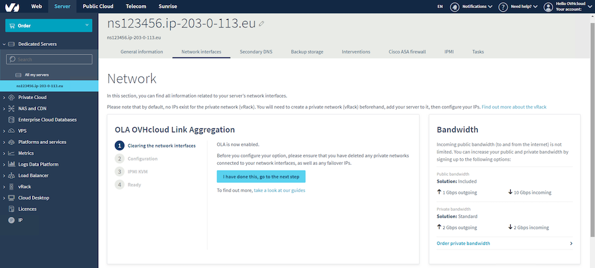

**Letzte Aktualisierung am 24\. Oktober 2019**

## Ziel

Die OVHcloud Link Aggregation (OLA)-Technologie wurde von unseren Teams entwickelt, um die Verfügbarkeit Ihres Servers zu erhöhen und die Effizienz Ihrer Netzwerkverbindungen zu steigern. Mit nur wenigen Klicks können Sie Ihre Netzwerkkarten aggregieren und Ihre Netzwerkverbindungen überflüssig machen. Wenn also eine Verbindung ausfällt, wird der Datenverkehr automatisch auf eine andere verfügbare Verbindung umgeleitet. In diesem Artikel wird erläutert, wie Sie OLA im OVH-Manager einrichten.

## Anforderungen

Stellen Sie sicher, dass Sie OLA über den OVHcloud Manager bestellt haben, bevor Sie die Schritte in diesem Handbuch ausführen.

> [!warning]
>
> Um Änderungen an OLA vorzunehmen, müssen Sie zunächst alle Server, an denen Sie arbeiten, von allen vRacks entfernen, an die sie derzeit angeschlossen sind. Anschließend müssen Sie alle angehängten Failover-IP-Adressen entfernen.
>

## Anleitung

Melden Sie sich beim [OVHcloud-Manager](https://www.ovh.com/manager/){.external} an, um mit der Konfiguration von OLA zu beginnen.  Klicken Sie oben auf dem Bildschirm auf die Schaltfläche **Server** und wählen Sie den betreffenden Server aus dem Dropdown-Menü auf der linken Seitenleiste aus. Klicken Sie anschließend auf die Registerkarte **Netzwerkschnittstellen**. Nachdem Sie bestätigt haben, dass der Server nicht an vRacks angeschlossen ist, klicken Sie auf die Schaltfläche **Ich habe den Vorgang ausgeführt. Weiter zum nächsten Schritt**. 

{.thumbnail}

Klicken Sie im Schritt „Konfiguration“ auf die Schaltfläche **Konfigurieren**.

{.thumbnail}

Wählen Sie nun die Option „Private Aggregation“ und geben Sie Ihrer Schnittstelle einen Namen. Klicken Sie auf die Schaltfläche **Weiter**, wenn Sie bestätigt haben, dass alles korrekt ist.

{.thumbnail}

Überprüfen Sie auf der folgenden Registerkarte alle Schnittstellen, die Sie in OLA zusammenfassen möchten, und klicken Sie dann auf **Weiter**.

{.thumbnail}

Überprüfen Sie nun den Schritt „Konfigurationsübersicht“. Wenn Sie bestätigt haben, dass alle Informationen korrekt sind, klicken Sie auf die Schaltfläche **Erstellen**.

{.thumbnail}

Es kann einige Minuten dauern, bis der Vorgang abgeschlossen ist. Sobald der Vorgang abgeschlossen ist, werden im nächsten Schritt die Schnittstellen in Ihrem Betriebssystem zu einer NIC-Anleihe oder einem NIC-Team konfiguriert. In den folgenden Artikeln finden Sie Informationen zu den beliebtesten Betriebssystemen:

[So konfigurieren Sie Ihre Netzwerkkarte für die OVHcloud Link Aggregation in Debian 9](https://docs.ovh.com/de/dedicated/ola-debian9/){.ref}

[So konfigurieren Sie Ihre Netzwerkkarte für die OVHcloud Link Aggregation in CentOS 7](https://docs.ovh.com/de/dedicated/ola-centos7/){.ref}

[So konfigurieren Sie Ihre Netzwerkkarte für die OVHcloud Link Aggregation in Windows Server 2019](https://docs.ovh.com/de/dedicated/ola-w2k19/){.ref}

## Fazit

Wir bei OVHcloud glauben an Innovation für Freiheit. OLA gibt unseren Kunden die Freiheit, ihre Netzwerkkarten nach ihren Wünschen zu verwenden. Nachdem Sie diesen Artikel gelesen haben, sollten Sie in der Lage sein, Ihren Server im OVH-Manager mit OLA zu konfigurieren. 