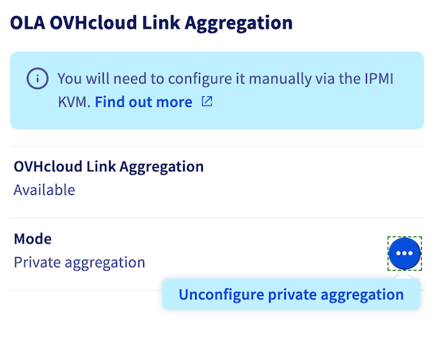

**Last updated 18th May 2022**

## Objective

OVHcloud Link Aggregation (OLA) technology is designed by our teams to increase your server’s availability, and boost the efficiency of your network connections. In just a few clicks, you can aggregate your network cards and make your network links redundant. This means that if one link goes down, traffic is automatically redirected to another available link. 
Aggregation is based on IEEE 802.3ad, Link Aggregation Control Protocol (LACP) technology.

**This guide explains how to configure OLA in the OVHcloud Control Panel.**

## Requirements

- A [dedicated server](https://www.ovhcloud.com/en-ie/bare-metal/) in your OVHcloud account
- Access to the [OVHcloud Control Panel](https://www.ovh.com/auth/?action=gotomanager&from=https://www.ovh.ie/&ovhSubsidiary=ie)
- An Operating System / Hypervisor that supports the 802.3ad aggregation protocol (LACP)

## Instructions

> [!warning]
>
> OLA is configured on all network interfaces. They will form a “private aggregation”.
>
> Following the implementation of OLA, the public IP will no longer be accessible.
>

### Configuring OLA in the OVHcloud Control Panel

To start configuring OLA, log in to the [OVHcloud Control Panel](https://www.ovh.com/auth/?action=gotomanager&from=https://www.ovh.ie/&ovhSubsidiary=ie){.external} and choose the `Bare Metal Cloud`{.action} section. Click on `Dedicated Servers`{.action} and select your server from the list.

{.thumbnail}

In the tab `Network interfaces`{.action} (1), click on the `...`{.action} button (2) to the right of "Mode" in the **OLA: OVHcloud Link Aggregation** box. Next, click `Configure private aggregation`{.action}  (2).

{.thumbnail}

Make sure that both your interfaces, or interface groups, are selected and give the OLA a name. Click `Confirm`{.action} when your checks are complete.

This may take a few minutes. Once it is complete, the next step is to configure the interfaces in your operating system via a NIC link or NIC team. For the method to use, refer to the following guides for the most popular operating systems:

- [How to Configure Your NIC for OVHcloud Link Aggregation in Debian 9](../ola-debian9/).
- [How to Configure Your NIC for OVHcloud Link Aggregation in CentOS 7](../ola-centos7/).
- [How to Configure Your NIC for OVHcloud Link Aggregation in Windows Server 2019](../ola-w2k19/).

### Restoring OLA to default values

To restore OLA to the default values, click on the `...`{.action} button to the right of "Mode" in the **OLA: OVHcloud Link Aggregation** box. Then click `Unconfigure private aggregation`{.action}. Click `Confirm`{.action} in the popup menu.

{.thumbnail}

This may take a few minutes.

## Go further

[How to Configure Your NIC for OVHcloud Link Aggregation in Debian 9](../ola-debian9/)

[How to Configure Your NIC for OVHcloud Link Aggregation in CentOS 7](../ola-centos7/)

[How to Configure Your NIC for OVHcloud Link Aggregation in Windows Server 2019](../ola-w2k19/)

Join our community of users on <https://community.ovh.com/en/>.
