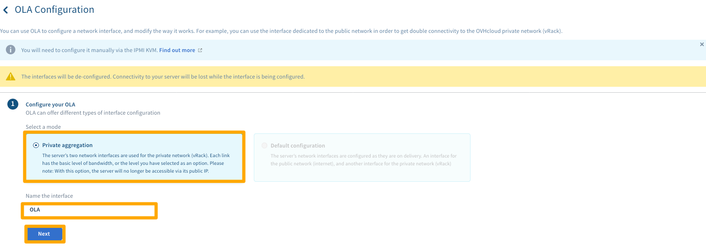
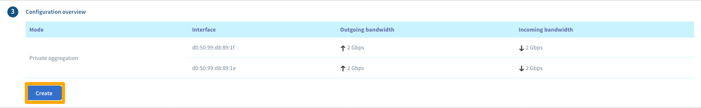

**Dernière mise à jour le 24/10/2019**

## Objectif

La technologie OVHcloud Link Aggregation (OLA) est conçue par nos équipes pour augmenter la disponibilité de votre serveur et améliorer l'efficacité de vos connexions réseau. En quelques clics, vous pouvez agréger vos cartes réseau et rendre vos liaisons réseau redondantes. Cela signifie que si une liaison tombe en panne, le trafic est automatiquement redirigé vers une autre liaison disponible. 

**Découvrez comment configurer OLA dans votre espace client**

## Prérequis

- Avoir commandé l'option OLA depuis votre espace client.

> [!warning]
>
> Avant d'apporter toute modification à OLA, assurez-vous d'avoir d'abord supprimé tout serveur sur lequel vous travaillez de tout vRack auquel il pourrait être rattaché. Vous devez également supprimer toute IP de failover rattachés à vos vRacks.
>

## En pratique

Pour commencer à configurer OLA, connectez-vous à [votre espace client OVHcloud](https://ca.ovh.com/manager/){.external}. Cliquez sur le bouton `Serveur`{.action} en haut de l'écran, puis sélectionnez le serveur en question dans le menu déroulant de la barre latérale gauche. Cliquez ensuite sur l'onglet `Interfaces réseau`{.action}. Une fois que vous avez confirmé que le serveur n'est connecté à aucun vRack, cliquez sur `J'ai effectué cette opération, puis passez à l'étape suivante`{.action}.

{.thumbnail}

A l'étape 2, cliquez sur le bouton `Configurer`{.action}.

{.thumbnail}

Sélectionnez à présent l'option `Agrégation privée`{.action}  et donnez un nom à votre interface. Validez les informations en cliquant sur `Suivant`{.action}.
{.thumbnail}

A l'étape suivante, cochez toutes les interfaces que vous souhaitez agréger via OLA et cliquez sur `Suivant`{.action}.

{.thumbnail}

Vérifiez, à l'étape suivante, que toutes les informations sont correctes puis cliquez sur  `Créer`{.action}.

{.thumbnail}

L'opération peut prendre quelques minutes. Une fois celle-ci terminée, l'étape suivante consiste à configurer les interfaces dans votre système d'exploitation via une liaison NIC ou une équipe NIC. Pour connaître la méthode à appliquer, consultez les guides suivants qui la détaillent pour les systèmes d'exploitation les plus populaires :

[Comment configurer votre NIC pour l'agrégation de liens OVHcloud sous Debian 9](../ola-debian9/){.ref}

[Comment configurer votre NIC pour l'agrégation de liens OVHcloud sous CentOS 7](../ola-centos7/){.ref}

[Comment configurer votre NIC pour l'agrégation de liens OVHcloud sous Windows Server 2019](../ola-w2k19/){.ref}

## Aller plus loin

Échangez avec notre communauté d'utilisateurs sur <https://community.ovh.com>
