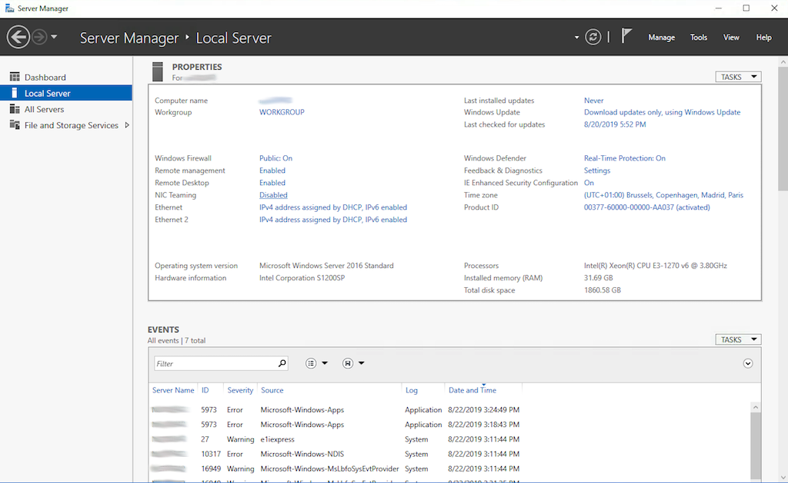
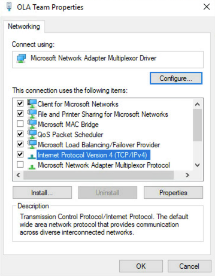

**Last updated October 24th, 2019**

## Objective

OVHcloud Link Aggregation (OLA) technology is designed by our teams to increase your server’s availability, and boost the efficiency of your network connections. In just a few clicks, you can aggregate your network cards and make your network links redundant. This means that if one link goes down, traffic is automatically redirected to another available link. In this article, we will discuss how to bond your NICs to use them for OLA in Windows Server 2019.

## Requirements

[How to Configure Your NIC for OVHcloud Link Aggregation in the OVH Manager](https://docs.ovh.com/gb/en/dedicated/ola-manager){.external}

## Instructions

Because we have a private-private configuration for our NICs in OLA, we will be unable to RDP into our server. Thus, we will need to leverage the IPMI tool to access it. To do so, first, log in to the [OVH Manager](https://www.ovh.com/manager/){.external}.  Then select the server you wish to configure on the left-hand sidebar and click the **IPMI** tab.

{.thumbnail}

Next, click the **From a Java applet (KVM)** button. A JNLP program will download. Open the program once it is finished to enter the IPMI.  Log in using valid credentials for the server.

Once you are in the server, open Server Manager. If it is not already open by default, you will see it pinned to the Start menu.

{.thumbnail}

Once you have opened Server Manager, click the **Local Server** tab on the left-hand sidebar. Next, click the **Disabled** button next to "NIC Teaming."

{.thumbnail}

In the NIC Teaming pop-up, click the **New Team **button from the **TASKS** dropdown menu under the "TEAMS" section.

{.thumbnail}

Give your team a name and check the NICs you wish to use with OLA. Click the dropdown arrow next to "Additional properties" and change the "Teaming mode" to LACP. Click **OK** once you have confirmed that the information is correct.

{.thumbnail}

It could take up to a couple of minutes for the NIC team to come online. Once it is finished, click the network connection icon in the bottom-right corner.  Next, click the **Network &amp; Internet settings** button.  Then click the **Ethernet **button on the left-hand sidebar of the ensuing popup.

{.thumbnail}

Click the **Change adapter options** button. 

{.thumbnail}

Next, right-click on your NIC team and select **Properties** from the drop-down menu.

{.thumbnail}

On the ensuing pop-up window, double-click the **Internet Protocol Version 4 (TCP/IPv4)** button.

{.thumbnail}

Click the button next to "Use the following IP address" and add your chosen private IP and subnet. Click the **OK** button once you have confirmed that your settings are correct. 

{.thumbnail}

To test that our NIC team is working, ping another server on the same vRack.  If it works, you are all set. If it does not, double-check your configurations or try rebooting the server.

## Conclusion

OVHcloud gives our customers the freedom and flexibility to leverage their hardware in the way that best fits their needs. Now that you have read this article, you should be able to configure OVHcloud Link Aggregation (OLA) in Windows Server 2019 in order to use both of your NICs as bonded private interfaces. 

