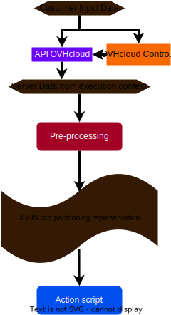

<!-- markdownlint-disable-next-line MD036 -->
**Last updated 25th November 2022**

## Objective

> [!warning]
>
> This article is intended for experimented users that have at least basic Linux knowledge, but more importantly deeper technical knowledge on storage and especially on RAID software as well as Logical volume management (LVM)
>

With [OVHcloud Dedicated Servers](https://www.ovhcloud.com/en-gb/bare-metal/), you can configure Partitions, [software RAID](https://docs.ovh.com/gb/en/dedicated/raid-soft/), LVM, ZFS, etc. during [OS installation](https://docs.ovh.com/gb/en/dedicated/getting-started-dedicated-server/) from the [OVHcloud API](https://api.ovh.com/) as well as the [OVHcloud Control Panel](https://www.ovh.com/manager/#/dedicated/configuration). In this article, we will focus on the [OVHcloud API](https://api.ovh.com/). This will give us more details about the engine that is running in the background in order to create the partitioning on the dedicated server from the input data passed on to the OVHcloud API.

Providing in-depth details about partitioning can help customers understand why:

- their custom partitioning could not be applied on their dedicated server.
- the actual partitioning on the dedicated server is slightly different from what the customer requested.

## Requirements

* A [dedicated server](https://www.ovhcloud.com/en-gb/bare-metal/) **ready to be installed/re-installed** in your OVHcloud account.
* Access to the [OVHcloud API](https://api.ovh.com/console/).

> [!warning]
>
> Reinstalling a dedicated server deletes all data currently stored on it.
>

## Instructions

During the default OS installation, the user is interactively prompted by the OS installer (provided by the software editor) to specify on which disks the Operating System will be installed, the partitioning layout, etc. Once the OS is installed, it is possible to change the partitioning layout but it can be very tricky and risky, especially for partitions that are currently used by the system. For that reason, server partitioning is a very important subject that needs to be considered **before** installing an Operating System.

Apart from the simplicity offered by an API, the main advantage is the possibility to fully customize the disks and partitions on which the OS will be installed.

### Partitioning Overview

When we talk about partitioning layout, we are talking about how your data will be organized on the disks, i.e everything that comes on top of your disk, up to the filesystem that is mounted and visible to the OS: from lowest to highest layers:

- disk (physical disk, PD),
- partition (physical partition, PP),
- ZFS: vdev (zgroup, ZG), zpool (ZP), ZFS dataset (ZD), ZFS volume (ZV),
- [software RAID](https://docs.ovh.com/gb/en/dedicated/raid-soft/) (SR),
- LVM: physical volume (PV), volume group (VG), logical volume (LV),
- filesystem with a mountpoint (FS)

The following table provides an overview of the different partitioning components and how these layers interact with each other:

{.thumbnail}

> [!primary]
>
> In the table above, `/dev/zd1` represents a ZFS volume (also known as `zvol`). This is a virtual disk on top of ZFS dataset (ZD) and a zpool (ZP), that is seen as a normal physical disk (PD) by the Operating System. This feature is not available on the OVHcloud API and we do not plan on implementing it.
>

### Partitioning using the API

#### Template Concepts

When triggering an OS installation, the customer can either choose between several OVHcloud templates or choose between one of their personal templates (based on an OVHcloud template).

> [!api]
>
> @api {POST} /dedicated/server/{serviceName}/install/start
>

**OVHcloud templates <a name="OVHcloudtemplates"></a>**

An OVHcloud template is an official template that is nearly identical to the official software editor/vendor cloud-ready image.

To list available templates (depending on your server's hardware), use the following API call:

> [!api]
>
> @api {GET} /dedicated/installationTemplate
>

You can get the details such as LVM compatibility, filesystem availability of a specific OVHcloud template with the following API call:

> [!api]
>
> @api {GET} /dedicated/installationTemplate/{templateName}
>

Example:

```json
{
    "templateName": "debian11_64",
    "filesystems": [
        "ext3",
        "ext4",
        "swap",
        "xfs"
    ],
    ...
    "lvmReady": true
}
```

The partitioning layout defined within an OVHcloud template cannot be changed: this is called the "default" partitioning scheme layout.

> [!api]
>
> @api {GET} /dedicated/installationTemplate/{templateName}/partitionScheme/{schemeName}/partition
> @api {GET} /dedicated/installationTemplate/{templateName}/partitionScheme/{schemeName}/partition/{mountpoint}
>

**Customer Templates <a name="customertemplates"></a>**

Users can create custom installation templates based on OVHcloud templates in order to be able to create custom partitioning layouts:

> [!api]
>
> @api {POST} /me/installationTemplate
>

Once created, the template inherits the default partitioning layout and partitions can be listed on the "default" scheme:

> [!api]
>
> @api {GET} /me/installationTemplate/{templateName}/partitionScheme/{schemeName}/partition
>

Of course a partition can be altered, deleted, added and then displayed:

> [!api]
>
> @api {PUT} /me/installationTemplate/{templateName}/partitionScheme/{schemeName}/partition/{mountpoint}
> @api {DELETE} /me/installationTemplate/{templateName}/partitionScheme/{schemeName}/partition/{mountpoint}
> @api {POST} /me/installationTemplate/{templateName}/partitionScheme/{schemeName}/partition
> @api {GET} /me/installationTemplate/{templateName}/partitionScheme/{schemeName}/partition/{mountpoint}
>

#### API Partition Layout

**Structure**

A partiton layout is a list of partitions. Here is an example of a partition structure:

```JSON
{
  "raid": "1",
  "filesystem": "ext4",
  "volumeName": "data",
  "size": 0,
  "order": 4,
  "type": "lv",
  "mountpoint": "/var/lib/vz",
}
```

> [!primary]
>
> order: is the partition order within the partition array
>

<!-- markdownlint-disable-next-line MD028 -->
> [!primary]
>
> type: is one of primary, logical, lv
>
> - lv: means that LVM layers will be added on top of the [software RAID](https://docs.ovh.com/gb/en/dedicated/raid-soft/) device (or the physical partition if RAID level is 0)
> - primary: only makes sense for MBR partition tables (a few old non-UEFI servers still don't support GPT)
> - logical: if you don't know what to choose
>

<!-- markdownlint-disable-next-line MD028 -->
> [!primary]
>
> volumeName: only useful if type lv is set
>

**Filesystems & LVM + RAID levels Comptibility Matrix**

The following table provides an overview of filesystem compatibility with RAID levels as well as LVM within the context of OVHcloud:

|Filesystem|LVM|RAID 0|RAID 1|RAID 5|RAID 6|RAID 7|RAID 10|
|---|---|---|---|---|---|---|---|
|Btrfs, ext4, XFS|✅|✅|✅|✅|✅|❌|✅|
|ZFS¹|❌|✅|✅|✅|✅|✅|❌|
|swap|❌|⚠️²|❌|❌|❌|❌|❌|
|NTFS|❌|❌|✅³|❌|❌|❌|❌|
|UFS, VMFS5, VMFS6, VMFS-L⁴|❌|❌|❌|❌|❌|❌|❌|

¹ See the [ZFS vdevs vs standard RAID](#raidz2RAID) table for more details.<br />
² The RAID level for swap can only be set to 1 within the [OVHcloud API](https://api.ovh.com/). In reality, the swap partitions will not use RAID. When a swap partition with size `s` is defined on a server with `n` disks, this will create `n` partitions of size `s` on every disk without any software RAID device underneath.<br />
³ Windows native RAID (the one configured by the OVHcloud installer) supports RAID 1 but only between two disks while other implementations allow for more than two.<br />
⁴ The ESXi installer does not support custom partitioning schemes. Partitioning is defined by the software publisher. Nevertheless, the [OVHcloud API](https://api.ovh.com/) can give you an idea of what the partitioning looks like: see [OVHcloud templates](#OVHcloudtemplates) for more details.<br />

> [!warning]
>
> This table is only provided for information purposes. Please note that LVM and especially filesystem compatibility also depend on the OS (OVHcloud template) being installed. See [OVHcloud templates](#OVHcloudtemplates) for more details.
>

#### ZFS vdevs vs standard RAID <a name="raidz2RAID"></a>

ZFS does not support standard RAID levels. It refers to virtual devices (vdevs) to describe fault tolerance within a group of devices. See the [official OpenZFS documentation](https://openzfs.github.io/openzfs-docs/man/7/zpoolconcepts.7.html) for more details about vdevs.

In order to make the OVHcloud API as simple as possible, customers must define a standard RAID within the API for ZFS filesystems. The standard RAID level will then be translated to an equivalent vdev definition. The following table illustrates the translation of the various RAID levels offered by the OVHcloud API as well as a reminder of their respective characteristics.

|Standard RAID|Equivalent vdev type|Minimal Number of data disks|Number of parity disks|Total minimum number of disks required|
|---|---|---|---|---|
|RAID 0|striped vdev|1|0|1|
|RAID 1|mirror|2|0|2|
|RAID 5|raidz1|2|1|3|
|RAID 6|raidz2|3|2|5|
|RAID 7|raidz3|4|3|7|
|RAID 10|❌|4|0|4|

> [!warning]
>
> RAID 7 (raidz3) can only be selected from the OVHcloud API, not from the OVHcloud Control Panel. We are currently working on adding this feature to the OVHcloud Control Panel.
>

### Partitioning Backend

#### Architecture

There is an abstraction layer between the partitioning description on the OVHcloud API (that is quite minimalist) and the real partitioning (that can be very complex).

The key feature of this partitioning is the separation between the **pre-processing** and the **action script**:

{.thumbnail}

- the **pre-processing** runs on the OVHcloud infrastructure. It just converts the data from the OVHcloud API to a richer JSON representation.

- the **action script** runs on the customer's server, takes the rich JSON representation of the partitioning and creates the partitions.

> [!primary]
>
> The JSON data generated by the **pre-processing** is also re-used at the end of the OS installation process to validate the partitioning. This script runs on the customer's server, it takes the rich JSON representation of the partitioning and compares it with the server's actual partitioning.
>

#### Error handling

Basic customer input data errors are directly handled by the OVHcloud API. This is the most common and easiest situation as customers can see the error synchronously and retry immediately.

Customer input data related to partitioning might be too specific to be checked by the OVHcloud API and therefore require **pre-processing**. The drawback is that customers are notified later during the OS installation process.

Within the [OVHcloud Control Panel](https://www.ovh.com/manager/#/dedicated/configuration), this is visible on the progress bar
From the [OVHcloud API](https://api.ovh.com/), this status can be obtained with the following API call:

> [!api]
>
> @api {GET} /dedicated/server/{serviceName}/install/status
>

There are 2 types of errors:

- **ovh errors**: the customer is not responsible for the error, the customer can re-install with another partitioning layout but OVHcloud will have to fix the bug.
- **customer errors**: the customer requested a partitioning layout that cannot be achieved or one that would prevent the server from booting properly.

> [!primary]
>
> Partitioning **action script** only returns errors of the type **ovh error**.
>

In the next section we will only focus on the **customer errors** types within the **partitioning pre-processing step**, because this is only helpful for the customer.

#### Common customer errors

The following table gives an overview of well known customer errors and how to fix them.

|Error message|Details|Solution(s)|
|---|---|---|
|Some Linux distributions such as RHEL family OSes don't support those mountpoints / mountpoint reserved/managed by OVHcloud (`list forbidden mountpoints`). Please remove those mountpoints and restart an installation|- You have chosen `/boot/efi` as mountpoint. OVHcloud will create this partition automatically for you if your server needs one<br />- You have chosen a mountpoint that is symlinked on some operating systems. See [Filesystem Hierarchy Standard](https://refspecs.linuxfoundation.org/fhs.shtml) for more details.|- Choose another mountpoint for the partition or remove this partition from your partitioning layout|
|Partition of type `t` with mountpoint `m` cannot fill the disk.|- You have chosen the `swap` partition to fill the disk, we disallow this to avoid creating unnecessarily large `swap` partitions|- Set a fixed size for the `swap` partition|
|Missing `/` partition. Please add a `/` partition in your partition scheme!|- Any Linux-based OS needs at least a `/` partition|- Add a `/` partition in your partitioning layout|
|`message`. Please adjust partitions so that the `p` partition fits on `n` disk(s)|- You have chosen a partition with a RAID that requires a number of disks that your server can provide, but some disks are already full because of other partitions and/or this current partition|- If it is not already set on another partition, set the partition size to fill the disk<br />- Reduce the size of this partition so that it fits the disks<br />- Reduce the size of other partitions partitions so that this partition fits the disks|
|Error with MBR partition table: Partition `p` is larger than 2TiB and this server does not support GPT|- You have defined a partition with a size that exceeds 2TiB and your are trying to apply such partitioning to a server that doesn't support GPT|- Reduce the partition to a size less than 2TiB<br />- Apply this partitioning to another similar server that supports GPT<br />- If you are using [customer templates](#customertemplates) to apply a partitioning with partitions larger than 2TiB to GPT-compatible and GPT-incompatible servers, you should create two separate [customer templates](#customertemplates). One template can have partitions that exceed 2TiB and should be used with GPT-compatible servers, the other template must have smaller partitions and should be used with servers that are not compatible with GPT|
|`/boot` (or `/` if no `/boot` defined) partition cannot be larger than 2097151 MiB on this hardware|- GRUB partition cannot be larger than 2 TiB with this hardware raid controller|- Create a separate `/boot` partition with a size less than 2TiB (1GiB should be enough)|
|`/boot` (or `/` if no `/boot` defined) partition type cannot be `XFS`|- GRUB partition doesn't support `XFS` filesystem type on this Operating System. This is the case for most of debian-like OSes (debian, proxmox, ubuntu)|- Create a separate `/boot` partition with filesystem other than `XFS`<br />- Don't create a separate `/boot` partition but choose a filesystem other than `XFS` for the `/` partition|

#### Input customer auto-fixing

In order to improve customer experience, reduce [OVHcloud support](https://help.ovhcloud.com/en-gb/) workload and to avoid introducing breaking changes for customer, some customer input is automatically fixed or changed by the backend. The following table gives an overview of what is currently auto-fixed/changed during the **pre-processing**:

|Subject|Description|
|---|---|
|ZP grouping|All ZFS partitions with the same RAID level will be grouped within the same zpool (ZP) (if possible depending on the size of the disks)|
|LV grouping|All partitions of type `lv` with the same RAID level will be grouped within the same VG (if possible depending on the size of the disks)|
|VG expanding|In case of LV partitions with a RAID level of 0, the VG will span multiple PPs (therefore PDs) and no SR device will be created|
|VG Disk fill|Remaining disk space will be filled by a VG (if any LV exists). The size of LVs attached to the VG is not affected.|
|RAID level reducing|In case the customer chooses a partition with a RAID level that requires more disks than the server has, the RAID level will be automatically reduced in the following order: 6, 10, 5, 1, 0 (or raidz3, raidz2, raidz, mirror, striped vdev for ZFS)|
|PP size reducing|In case the customer chose a PP that requires more space than the server has, the size of this PP will be reduced so that it fits the disk. Note that in case several PPs require more space than the system has, the script will only act on the first partition, raising an error later in the script for the second oversized partition. Also note that an error will be raised if the customer set another partition to fill the disk via the OVHcloud API|

## Go further <a name="gofurther"></a>

[Configuring Software RAID](https://docs.ovh.com/gb/en/dedicated/raid-soft/)

[Managing Hardware RAID](https://docs.ovh.com/gb/en/dedicated/raid-hard/)

Join our community of users on <https://community.ovh.com/en/>.
