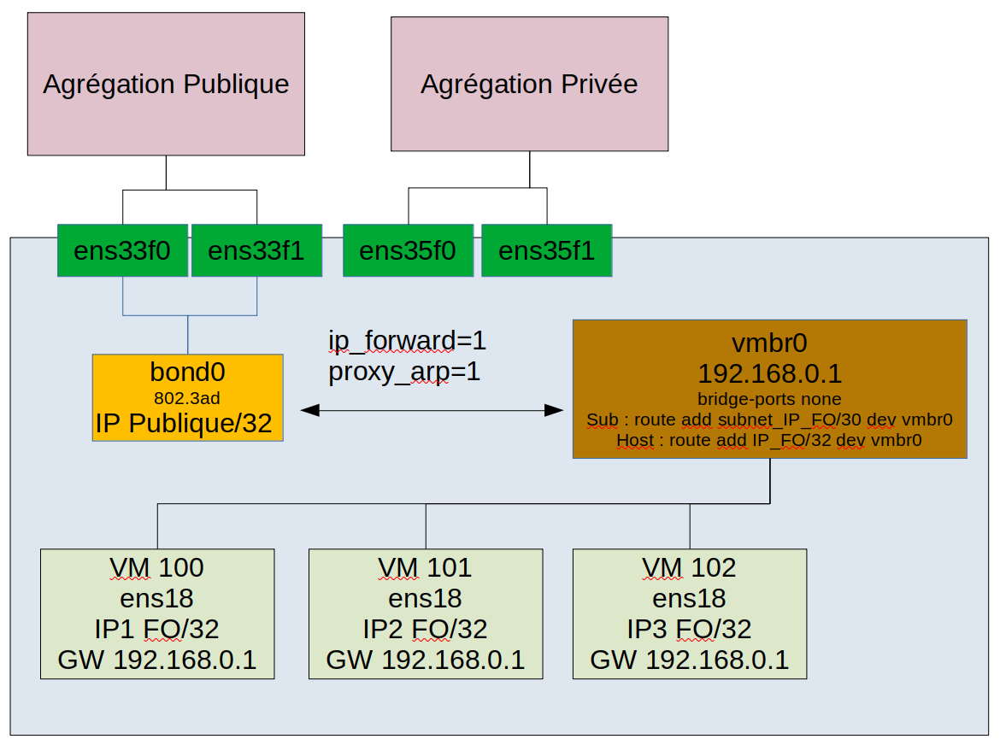
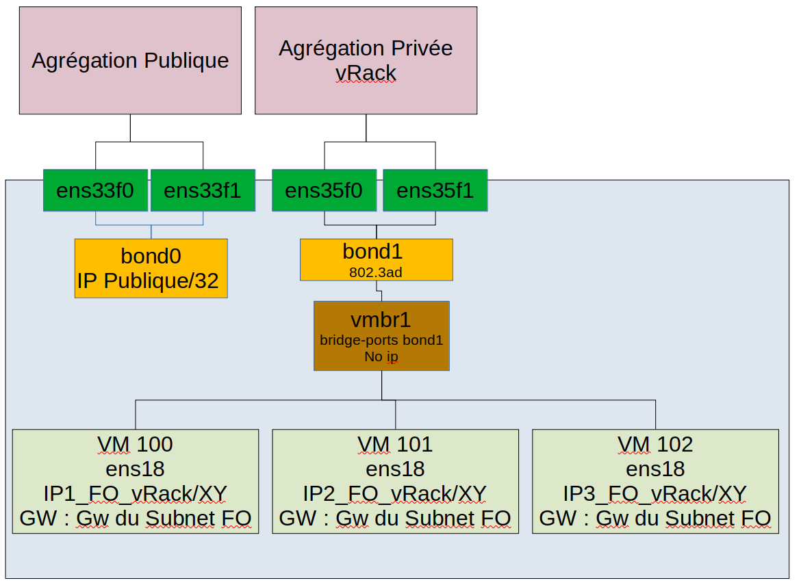

**Last updated 6th October 2022**

> [!primary]
>
> Since October 6th, 2022 our service "Failover IP" is named [Additional IP](https://www.ovhcloud.com/en/network/additional-ip/). This has no further impact on any of its features or the functioning of your services.
>

## Objective

On the High Grade & SCALE ranges, it is not possible to operate Additional IPs in *bridged* mode (via virtual MACs). It is therefore necessary to configure Additional IPs in routed mode or via the vRack.

**This guide explains how to configure the network in Proxmox VE.**

## Requirements

- An [OVHcloud dedicated server](https://www.ovhcloud.com/en/bare-metal/)
- Access to the [OVHcloud Control Panel](https://ca.ovh.com/auth/?action=gotomanager&from=https://www.ovh.com/world/&ovhSubsidiary=we)
- An [Additional IP](https://www.ovhcloud.com/en/bare-metal/ip/)

> [!warning]
>
> No virtual MACs should be applied to Additional IPs in the OVHcloud Control Panel.
>

## Instructions

> [!primary]
>
> On these server ranges, there are 4 network cards. The first two for the public, the last two for the private network. To get all the bandwidth, aggregates must be created.
>

### Additional IP in routed mode on public network interfaces

#### Target configuration schema

{.thumbnail}

#### Explanations

You need to:

- create an aggregate
- create a bridge
- allow forwarding and add routes.

#### Configure the hypervisor

The entire configuration is done in the `/etc/network/interfaces` file:

```bash
vi /etc/network/interfaces
```

```bash
auto lo
iface lo inet loopback

# public interface 1
auto ens33f0
iface ens33f0 inet manual

# public interface 2
auto ens33f1
iface ens33f1 inet manual

# private interface 1
auto ens35f0
iface ens35f0 inet manual

# private interface 2
auto ens35f1
iface ens35f1 inet manual

auto bond0
# LACP aggregate on public interfaces
# configured in DHCP mode on this example
# Has the server's public IP
iface bond0 inet dhcp
	bond-slaves ens33f0 ens33f1
        bond-miimon 100
	bond-mode 802.3ad
        post-up echo 1 > /proc/sys/net/ipv4/conf/bond0/proxy_arp
        post-up echo 1 > /proc/sys/net/ipv4/ip_forward

#Private

auto vmbr0
# Configure the bridge with a private address and add route(s) to send the Additional IPs to it
# A.B.C.D/X => Subnet of Additional IPs assigned to the server, this can be a host with /32
iface vmbr0 inet static
	address 192.168.0.1
        netmask 255.255.255.255
	bridge-ports none
	bridge-stp off
	bridge-fd 0
        post-up ip route add A.B.C.D/X dev vmbr0
```

At this point, restart the network services or restart the server.

#### Configuration example of a client VM on Debian

File contents `/etc/network/interfaces`:

```bash
auto lo ens18
iface lo inet loopback
iface ens18 inet static
    address IP_FO
    netmask 255.255.255.255
    gateway 192.168.0.1
```

### Additional IP via vRack

#### Requirements

- A public block of IP addresses in your account, with a minimum of four addresses. The block must be pointed to the vRack.
- Your chosen private IP address range
- A [vRack compatible server](https://www.ovhcloud.com/en/bare-metal/){.external}
- A [vRack](https://www.ovh.com/world/solutions/vrack/){.external} service activated in your account
- Access to the [OVHcloud Control Panel](https://ca.ovh.com/auth/?action=gotomanager&from=https://www.ovh.com/world/&ovhSubsidiary=we)


#### Target configuration schema

{.thumbnail}

#### Explanations

You need to:

- create an aggregate
- create a bridge connected to the aggregate

First, add your public block of IP addresses to the vRack. To do so, go to the `Bare Metal Cloud`{.action} section of your [OVHcloud Control Panel](https://ca.ovh.com/auth/?action=gotomanager&from=https://www.ovh.com/world/&ovhSubsidiary=we) and open the `vRack`{.action} menu.

Select your vRack from the list to display the list of eligible services. Click on the IP block you want to add to the vRack and then click the `Add`{.action} button.

#### Configure a usable IP address

For vRack, the first, penultimate, and last addresses in a given IP block are always reserved for the network address, network gateway, and network *broadcast* respectively. This means that the first usable address is the second address in the block, as shown below:

```sh
46.105.135.96 # Reserved: network address
46.105.135.97 # First usable IP
46.105.135.98
46.105.135.99
46.105.135.100
46.105.135.101
46.105.135.102
46.105.135.103
46.105.135.104
46.105.135.105
46.105.135.106
46.105.135.107
46.105.135.108
46.105.135.109 # Last usable IP
46.105.135.110 # Reserved: network gateway
46.105.135.111 # Reserved: network broadcast
```

To configure the first usable IP address, you must edit the network configuration file as shown below. In this example, we use a subnet mask of **255.255.255.240**.

> [!primary]
>
> The subnet mask used in this example is appropriate for our IP block. Your subnet mask may differ depending on the size of your block. When you purchase your IP block, you will receive an email notifying you of the subnet mask to use.
>

#### Configure the hypervisor

The entire configuration is done in the `/etc/network/interfaces` file:

```bash
vi /etc/network/interfaces
```

What matters here is the `bond1` and `vmbr1` configuration:

```bash
auto lo
iface lo inet loopback

# public interface 1
auto ens33f0
iface ens33f0 inet manual

# public interface 2
auto ens33f1
iface ens33f1 inet manual

# private interface 1
auto ens35f0
iface ens35f0 inet manual

# private interface 2
auto ens35f1
iface ens35f1 inet manual

auto bond0
iface bond0 inet dhcp
	bond-slaves ens33f0 ens33f1
        bond-miimon 100
	bond-mode 802.3ad
        post-up echo 1 > /proc/sys/net/ipv4/conf/bond0/proxy_arp
        post-up echo 1 > /proc/sys/net/ipv4/ip_forward

auto bond1
# LACP Aggregate on private interfaces
# No IPs on it
iface bond1 inet manual
	bond-slaves ens35f0 ens35f1
        bond-miimon 100
	bond-mode 802.3ad


#Private

auto vmbr1
# Bridge connected to bond1 aggregate
# No need for IP
iface vmbr1 inet manual
	bridge-ports bond1
	bridge-stp off
	bridge-fd 0

```

At this point, restart the network services or restart the server.

#### Configuration example of a client VM on Debian

Content of the file `/etc/network/interfaces`:

```bash
auto lo ens18
iface lo inet loopback
iface ens18 inet static
    address 46.105.135.97
    netmask 255.255.255.240
    gateway 46.105.135.110
```

## Go further

Join our community of users on <https://community.ovh.com/en/>.
