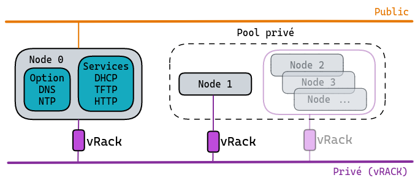

## Objectif

> [!warning]
> 
> Cet article est destiné aux utilisateurs expérimentés qui ont un minimum de connaissance concernant le monde open source, ainsi que des notions d'administration.
> 

Cette documentation à pour but de vous accompagner pour deployer tous les composants ou bien services nécessaires au bon redémarrage de vos solutions OVHcloud en environnement dédié et **entièrement privé**.<br>
Profiter d'une infrastructure "full private" sans avoir modifié la configuration par défaut de vos [serveurs dédiés](https://www.ovhcloud.com/fr/bare-metal/) OVhcloud.

> [!warning]
>
> Pour rappel, il est très fortement recommandé de ne pas modifier les configurations par défaut: configuration Bios, Boot Order, etc...
> Nous avons au préalable effectués tous nos tests, qualifications et validations de configurations, à partir de paramètres bien définis, pour vous proposez des environnements techniques les mieux adaptés à votre matériel.
>

Les [serveurs dédiés](https://www.ovhcloud.com/fr/bare-metal/) OVHcloud vous permettent de configurer/déclarer vos propres réseaux.<br>
Chaque serveur est muni de 2 interfaces réseaux (en réalité 4, fonctionnants en liens aggrégés (par paire) pour la redondance).<br>
Vous avez donc la possiblité d'utiliser/déclarer vos réseaux dit "public" aussi appelés "front-end" et ceux, au contraire dit "privés", appelés "back-end".

Nous allons présenter le cas de [serveur(s) dédié(s)](https://www.ovhcloud.com/fr/bare-metal/) configuré(s) en mode full-private, c'est-à-dire ne possédant **uniquement** que des réseaux privés.
Ce choix propose à votre infrastructure la meilleur isolation/protection possible pour votre service hébergé.

La seule différence majeure qui est à noter, est que les réseaux [privés](https://docs.ovh.com/fr/ovhcloud-connect/presentation-concepts/#prive) n'ont donc pas accès à tout ce qui n'appartient pas à votre infrastructure.<br>
Mais dans ce cas, le mecanisme de démarrage de la solution se retrouve inopérant, à savoir que lorsque les systèmes sont démarrés, via une méthode **netboot** (Network Boot), ces derniers doivent obligatoirement récupèrer leur configurations via des services réseaux mutualisés présent sur le réseaux OVHcloud.


### Présentation rapide d'un démarrage avec PXE
definition du Netboot avec la fonctionnabilité PXE:

* Mode de démarrage en PXE (solution de démarrage réseau bas niveau) via l'interface réseau d'une machine cliente active permettant de communiquer avec le serveur DHCP de ce même réseau.
* Le serveur DHCP peut donc lui adresser les informations nécessaire afin de lui indiquer, le fichier de configuration initiale, ainsi que l'endroit où le récupérer.
* le serveur client va chercher à acceder à ce fichier en protocol TFTP, pour ensuite le charger dans sa configuration.
* Le fichier contient les informations permettant la selection du type d'amorçage d'un systeme pour la machine cliente:<br>
  disque local, volume réseau, usb, etc...


### Comment fonctionne le Netboot chez OVHcloud
Nous avons pré-configurés la méthode de recherche d'amorçage des systèmes avec le Netboot (Network Boot) en priorité.

Cette méthode, décrite précedement, consiste donc à lancer une séquence via l'interface réseau qui permet d'utiliser les services **mutualisés** DHCP et TFTP (via le réseau interne OVHcloud), afin de récupérer le fichier de configuration adéquate qui sera utiliser par le système qui tente de démarrer.

Le processus complet de récupération aura comme instruction de par ses instructions:

* de vérifier l'origine et la bonne intégrité du fichier à récupéré (via chaine de certification interne)
* en fonction de type de serveur et du bios utilisé (legacy/UEFI), le script récupéré sera donc en fonction du mode détecté:<br>
  PXE (pour le legacy) ou iPXE (utilisé avec l'UEFI, qui représente une version plus évoluée de PXE).
* le mode étant détecté, le script correspondant sera donc éxecuté et permettra l'"amorçage" du systeme d'exploitation présent.


> [!primary]
>
> La description ici restera le plus générique possible pour rester claire, et ainsi ne pas ajouter des éléments ou contraintes techniques qui sortent du cadre de notre exemple, mais donnera une vision globale du principe de fonctionnement.
>

## Prérequis

* Être connecté à [l'espace client OVHcloud](https://www.ovh.com/manager/#/dedicated/configuration).
* Posséder au moins un [serveur dédié](https://www.ovhcloud.com/fr/bare-metal/) ayant un système d'exploitation **déjà installé**.
* Avoir toutes les interfaces réseaux de ce serveur en réseau dit **privé**, ce qui sous-entend que vous avez au préalable configuré le(s) service(s) [vrack](https://docs.ovh.com/fr/dedicated/configurer-plusieurs-serveurs-dedies-dans-le-vrack/).
* Un système dédié supplémentaire avec les interfaces réseaux configurées par défaut, à savoir, un accès au réseau public ainsi qu'à votre réseau privé. (qui hébergera les services DHCP et TFPT). Le système d'exploitation sera celui de votre choix.


## En pratique

### Deployer vos services DHCP, TFTP et PXE

* installation des packages pour les services DHCP/TFTP/PXE.
* configuration basique pour chaque service.
* mise en marche.


exemple d'infrastructure privée basique (schéma layer 2):



Exemple:

* services hébergés/mutualisés sur *Node 0*.
* une seule machine cliente *Node 1*.


le service DHCP

ci-dessous, un exemple de fichier de configuration pour votre service **DHCP** avec le netboot PXE.<br>
Selon votre distribution, l'arboresence peut être différente (dhcpd.conf):

à titre d'exemple:
```bash

allow booting;
allow bootp;

 # Minimum configuration directives...
 option domain-name "domain_name";
 option subnet-mask subnet_mask;
 option broadcast-address broadcast_address;
 option routers default_router;

 # Optional
 option domain-name-servers dns_servers;

 # Declare the TFTP server
 group {
  option root-path "/tftpboot/";
  next-server TFTP_server_address;
  filename "pxelinux.0";
 
  # Declare each host here
  host hostname {
   hardware ethernet ethernet_address;
   fixed-address ip_hostname;

 }
}

```

Détails:

* réseau privé (ex: 192.168.1.0/28).
* `subnet_mask` : 192.168.1.240
* `broadcast_address` : 192.168.1.15
* `dns_servers` : cf chapitre optionnel
* `default_router` : 192.168.1.1
* `TFTP_server_address` : 192.168.1.1
* `hostname` : nom machine cliente
* `ethernet_address` : adresse matérielle (MAC) machine cliente
* `ip_hostname` : ip machine cliente


le service **TFTP**

Selon votre distribution, il existe plusieurs paquets réalisant la fonction de serveur TFTP.<br>
Par exemple: *tftp-server*, *tftpd*, *tftpd-hpa* ou encore *atftpd*.

> [!info]
> L'arborescence d'installation peut être différente selon la version du package et de votre système d'exploitation utilisé.
> 


Ce qu'il faut savoir:
* Ce service utilise le port 69 (UDP), à déclarer dans le firewall, pour permettre/autoriser les futures connections.
* Il est obligatoire de déclarer un répertoire "cible", correspondant à une arboresence locale qui sera utilisée pour les réceptions et les téléchargments des fichiers.

exemple de configuration avec le logiciel 'tftpd-hpa':

```bash
# /etc/default/tftpd-hpa
TFTP_USERNAME="tftp"
TFTP_DIRECTORY="/var/lib/tftpboot"
TFTP_ADDRESS="TFTP_server_address:69"
TFTP_OPTIONS="--secure"

#Defaults for tftpd-hpa
RUN_DAEMON="yes"

```

Nous utiliserons le chemin par défaut de l'application (/var/lib/tftpboot/), et y déposerons le fichier `pxelinux.0` à utliser.
Le fichier doit simplement contenir la directive suivante:

```bash

# Boot from local hard disk
  sanboot --no-describe --drive 0x80

```

La syntaxe [sanboot](https://ipxe.org/cmd/sanboot) permet de forcer la détection des disques locaux, et la découverte de secteur d'amorçage lié à un éventuel système d'exploitation installé au préalable.
A partir du moment où cette étape a été réalisée, le système d'exploitation peut débuter son chargement.


Pour finaliser les déploiements des nouveaux services, ne pas oublier d'autoriser les futures connexions **entrantes** depuis les machines clientes.<br>
exemple de configuration de firewall local avec `iptables`, cela peut varier selon votre distribution:

```bash
# pour le service DHCP
iptables -I INPUT -i ethX -p udp --dport 67:68 --sport 67:68 -j ACCEPT

# pour le service TFTP
iptables -I INPUT -i eth1 -p udp --dport 69 -j ACCEPT
```

> [!warning]
>
> Penser à relancer le service de firewall local après chaque modification/déclaration de configuration, pour prise en compte.
>

## Optionnel


> [!warning]
> 
> Il est récommandé également de deployer les services DNS et NTP.
> Ceux-ci ne sont pas nécessaires pour les phases de démarrage des systèmes, donc pas imposés dans cette procédure.
> Mais ils font partie des services importants par la suite, pour la stabilité de votre infrastructure.
> 


**Suggestions**

service DNS:<br>
Pour pouvez utiliser la table locale de chaque *Node*, à savoir le fichier `/etc/hosts`,ou bien utiliser, par exemple, un service tel que [dnsmasq](https://en.wikipedia.org/wiki/Dnsmasq).


service NTP:

definition [ntp](https://fr.wikipedia.org/wiki/Network_Time_Protocol)


```bash
# pour le service NTP
iptables -I INPUT -i ethX -p udp --dport 123 -j ACCEPT

# pour le service DNS
iptables -I INPUT -i ethX -p udp --dport 53 -j ACCEPT
iptables -I INPUT -i ethX -p tcp --dport 53 -j ACCEPT
```


## Aller plus loin


Échangez avec notre communauté d'utilisateurs sur <https://community.ovh.com/>.
