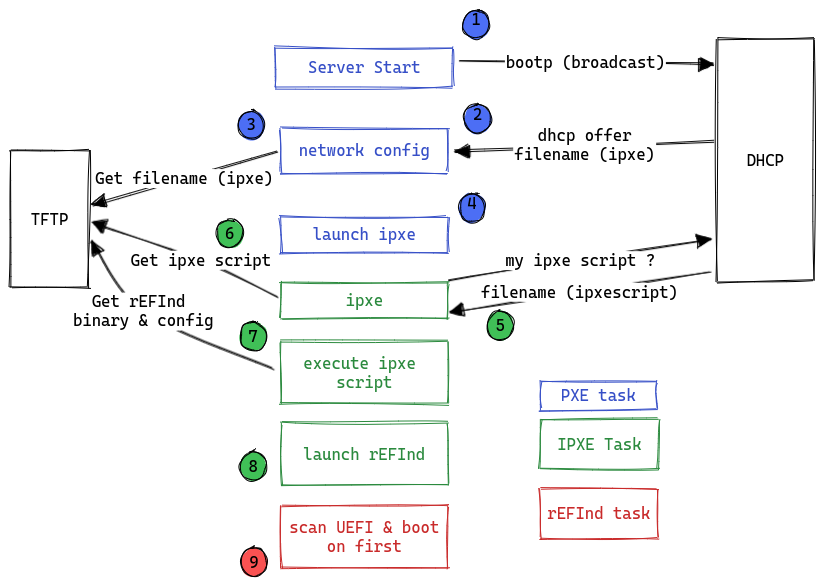
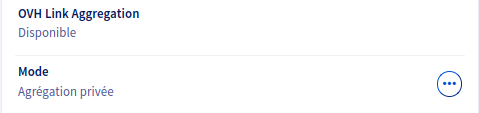
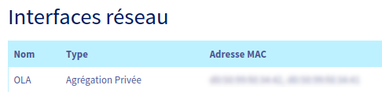
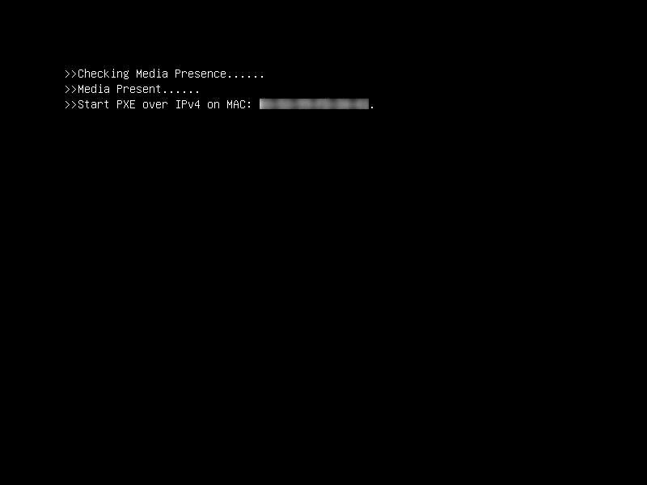

**Dernière mise à jour le 12/12/2022**

## Objectif

Ce guide a pour but de vous accompagner pour déployer tous les composants et services nécessaires au bon redémarrage de vos solutions OVHcloud en environnement **entièrement privé**.<br>
Profitez d'une infrastructure privée sans avoir modifié la configuration par défaut de vos [serveurs dédiés OVHcloud](https://www.ovhcloud.com/fr/bare-metal/).

> [!warning]
>
> Nous avons au préalable effectué tous nos tests, qualifications et validations de configurations, à partir de paramètres et critères de fonctionnement bien définis, afin de vous proposer des environnements techniques les mieux adaptés à votre matériel.
> 
> De par ses différentes séquences, le Netboot (Network Boot) consiste à utiliser votre interface réseau (en mode bas niveau) comme outil de sélection du boot de votre système d'exploitation.
>
> Sachez qu'il est possible de démarrer n'importe quel système à partir d'un volume réseau, par exemple SAN ou NFS. Cependant, le système démarre généralement à partir d'un volume local : disque local, CD/DVD ou USB.
>
> Pour rappel, il est fortement déconseillé de modifier les configurations par défaut : configuration BIOS, Boot Order, etc.
> 
> En effet, nous avons pré-configuré ce mécanisme de démarrage à nos solutions et y avons intégré tous nos outils : netboot, monitoring, recycling, etc.
> Si ces paramètres étaient amenés à être modifiés, nos équipes ne pourraient plus effectuer les tâches qui leur sont dédiées dans les conditions que nous avons choisies, et surtout vous risqueriez de rendre le démarrage inopérant.
>

Les [serveurs dédiés OVHcloud](https://www.ovhcloud.com/fr/bare-metal/) vous permettent de configurer/déclarer vos propres réseaux.<br>
Chaque serveur est muni au minimum de 2 interfaces réseaux, fonctionnant en réalité en liens aggrégés et assurant la redondance en cas de panne.<br>
Vous avez donc la possiblité d'utiliser/déclarer vos réseaux *publics* et *privés* en passant par notre solution [vRack](https://docs.ovh.com/fr/dedicated/configurer-plusieurs-serveurs-dedies-dans-le-vrack/).

Nous allons présenter le cas de [serveur(s) dédié(s)](https://www.ovhcloud.com/fr/bare-metal/) configuré(s) en mode **OLA**, c'est-à-dire possédant **uniquement** des réseaux privés.
Ce choix propose à votre infrastructure la meilleure isolation/protection possible pour votre service hébergé.<br>
La seule différence majeure notable est que les [réseaux privés](https://docs.ovh.com/fr/ovhcloud-connect/presentation-concepts/#prive) n'ont donc pas accès à tout ce qui n'appartient pas à votre infrastructure.<br>
Par conséquent, un serveur isolé de par son réseau privé empêche le mecanisme de démarrage. C'est à dire que lorsque les systèmes sont démarrés via le méthode **Netboot** (Network Boot), ces derniers s'appuient sur le réseau interne d'OVHcloud et ses services mutualisés.

### Présentation rapide d'un démarrage en Netboot

Un composant majeur existe en 2 versions :

- **PXE** : utilisant un environnement standardisé client/serveur, basé sur les protocoles BOOTP/DHCP/TFTP, afin de permettre un démarrage/déploiement via le réseau du système client.<br>
- **iPXE** : utilisant un environnement standardisé client/serveur plus évolué, basé sur les protocoles HTTP, iSCSI, AoE, FCoE, Wi-Fi afin de permettre un démarrage/déploiement via le réseau du système client.

### Présentation rapide d'un démarrage en Netboot chez OVHcloud 

Liste des composants intervenants lors du démarrage :

- Un serveur **DHCP** : attribue une configuration réseau  (bail avec adresse IP) pour une machine cliente qui tente de démarrer.
- Un service **TFTP** : ressources disponibles à travers le réseau et qui seront interrogées/requêtées par PXE et iXPE.
- La solution **rEFInd**, sous forme de **BootLoader**, a été retenue car parfaitement adaptée. Elle permettra la recherche de secteurs d'amorçage des machines clientes : disque local, USB, etc...

Voici un schéma (logique) de démarrage Netboot :



|Description / Détails|
|---|
|1. Envoi d'une requête discover vers le DHCP depuis la machine cliente (en broadcast)|
|2. Le DHCP affecte une adresse IP à la machine cliente (offer/request/ack). Requête de récupération du binaire iPXE|
|3. Récupération en TFTP du binaire iPXE|
|4. Chargement du binaire iPXE en tant que firmware|
|5. Requête de récupération de script iPXE par le firmware iPXE|
|6. Récupération du script iPXE associé en TFTP|
|7. Exécution du script iPXE. Récupération des ressources nécessaires à rEFInd : binaire et fichier de configuration requis|
|8. Exécution et chargement du binaire rEFInd|
|9. rEFInd lance sa tâche de scan afin de repérer les secteurs d'amorçage des disques locaux|

> [!primary]
>
> Cette description reste la plus générique possible afin de rester claire, et ainsi ne pas ajouter des éléments ou contraintes techniques qui sortent du cadre de notre exemple. L'objectif de ce shémar est de donner une vision globale du principe de fonctionnement.
>

## Prérequis

> [!warning]
> 
> Cet article est destiné aux utilisateurs expérimentés qui ont un minimum de connaissances concernant le monde open source, ainsi que des notions d'administration système et réseau.
> 

- Être connecté à votre [espace client OVHcloud](https://www.ovh.com/manager/#/dedicated/configuration).
- Posséder au moins un [serveur dédié](https://www.ovhcloud.com/fr/bare-metal/) ayant un système d'exploitation **déjà installé**.
- Un serveur dédié supplémentaire avec les interfaces réseau configurées par défaut, à savoir un accès au réseau public et privé. Ce serveur hébergera tous les services (**DHCP** et **TFTP**). Le système d'exploitation sera celui de votre choix.
- Avoir toutes les interfaces réseau de ce serveur en mode **privé**, ce qui sous-entend que vous avez préalablement configuré [notre fonctionnalité OLA](https://docs.ovh.com/fr/dedicated/ola-manager/).<br>

>
> Pour vérifier que votre machine est éligible à notre procédure, connectez-vous à votre [espace client OVHcloud](https://www.ovh.com/auth/?action=gotomanager&from=https://www.ovh.com/fr/&ovhSubsidiary=fr) et cliquez sur l'onglet `Bare Metal Cloud`{.action}.
>
> Sélectionnez votre serveur et vérifiez son éligibilité à `OLA: OVHcloud Link Aggregation` dans l'onglet `Interfaces réseau`{.action}.
>
> {.thumbnail}
>
> {.thumbnail}

## En pratique

### Déployer vos services DHCP et TFTP

1. Installez les packages pour les services DHCP/TFTP.
2. Effectuez la configuration basique pour chaque service.
3. Mettez en marche votre serveur.

Ci-dessous un exemple d'infrastructure privée basique (schéma layer 2) :


**Exemple :**

- Services hébergés/mutualisés sur **Node 0**.
- Une seule machine cliente **Node 1** avec OLA actif.


> [!primary]
>
> Après le démarrage des systèmes, et afin que les services DHCP et ceux optionels (DNS et NTP) soient pleinement fonctionnels, pensez à déclarer/ajouter les règles dans le firewall local, via l'interface réseau privée de la machine hébergeant les services.
>

#### Le service DHCP

Retrouvez ci-dessous un exemple de fichier de configuration pour votre service **DHCP**.<br>
Selon votre distribution, l'arborescence peut être différente (`dhcpd.conf`).

En règle générale, il suffit de :

- déclarer une interface réseau pour l'écoute (en attente de requêtes) ;
- préciser la version du protocol IP (v4 ou v6) ;
- renseigner un fichier de configuration principale (à titre d'exemple, cf fichier ci-dessous).

```bash
default-lease-time 7200;
max-lease-time 7200;

allow booting;
allow bootp;
allow unknown-clients;

###PXE###

option space PXE;
option PXE.mtftp-ip code 1 = ip-address;
option PXE.mtftp-cport code 2 = unsigned integer 16;
option PXE.mtftp-sport code 3 = unsigned integer 16;
option PXE.mtftp-tmout code 4 = unsigned integer 8;
option PXE.mtftp-delay code 5 = unsigned integer 8;
option arch code 93 = unsigned integer 16;

option space ipxe;
option ipxe-encap-opts code 175 = encapsulate ipxe;
option ipxe.priority code 1 = signed integer 8;
option ipxe.keep-san code 8 = unsigned integer 8;
option ipxe.skip-san-boot code 9 = unsigned integer 8;
option ipxe.syslogs code 85 = string;
option ipxe.cert code 91 = string;
option ipxe.privkey code 92 = string;
option ipxe.crosscert code 93 = string;
option ipxe.no-pxedhcp code 176 = unsigned integer 8;
option ipxe.bus-id code 177 = string;
option ipxe.san-filename code 188 = string;
option ipxe.bios-drive code 189 = unsigned integer 8;
option ipxe.username code 190 = string;
option ipxe.password code 191 = string;
option ipxe.reverse-username code 192 = string;
option ipxe.reverse-password code 193 = string;
option ipxe.version code 235 = string;
option iscsi-initiator-iqn code 203 = string;

# Feature indicators
option ipxe.pxeext code 16 = unsigned integer 8;
option ipxe.iscsi code 17 = unsigned integer 8;
option ipxe.aoe code 18 = unsigned integer 8;
option ipxe.http code 19 = unsigned integer 8;
option ipxe.https code 20 = unsigned integer 8;
option ipxe.tftp code 21 = unsigned integer 8;
option ipxe.ftp code 22 = unsigned integer 8;
option ipxe.dns code 23 = unsigned integer 8;
option ipxe.bzimage code 24 = unsigned integer 8;
option ipxe.multiboot code 25 = unsigned integer 8;
option ipxe.slam code 26 = unsigned integer 8;
option ipxe.srp code 27 = unsigned integer 8;
option ipxe.nbi code 32 = unsigned integer 8;
option ipxe.pxe code 33 = unsigned integer 8;
option ipxe.elf code 34 = unsigned integer 8;
option ipxe.comboot code 35 = unsigned integer 8;
option ipxe.efi code 36 = unsigned integer 8;
option ipxe.fcoe code 37 = unsigned integer 8;
option ipxe.vlan code 38 = unsigned integer 8;
option ipxe.menu code 39 = unsigned integer 8;
option ipxe.sdi code 40 = unsigned integer 8;
option ipxe.nfs code 41 = unsigned integer 8;

subnet 192.168.1.0 netmask 255.255.255.240 {

    range 192.168.1.2 192.168.1.5;
    option broadcast-address 192.168.1.15;
    option routers 192.168.1.1;
    ping-check = 1;
    next-server 192.168.1.1;                        # Détermine l'IP de votre serveur tftp

    if option arch = 00:07 {                        # Détermine le type d'architecture, ici 64bits
      if exists user-class and option user-class = "iPXE" {
          filename "refind.pxe";                    # Détermine le script appelé par le binaire
      } else {
            filename "ipxe.efi";                    # Détermine le binaire iPXE
      }

    } else if option arch = 00:06 {                 # Détermine le type d'architecture, ici 32bits
      if exists  user-class and option user-class = "iPXE" {
              filename "refind.pxe";                # Détermine le script appelé par le binaire
      } else {
              filename "ipxe32.efi";                # Détermine le binaire iPXE
      }
    }
}

# Declare each host here
host node_1 {
    hardware ethernet xx:xx:xx:xx:xx:xx;
    server-name "node_1";
}
```

**Détails :**

- réseau privé (ex: 192.168.1.0/28)
- `subnet_mask` : 255.255.255.240
- `broadcast_address` : 192.168.1.15
- `dns_servers` : cf chapitre optionnel
- `ntp_servers` : cf chapitre optionnel
- `default_router` : 192.168.1.1
- `next-server` : 192.168.1.1
- `host` : nom machine cliente
- `hardware ethernet` : adresse matérielle (MAC) machine cliente
- `server-name` : hostname machine cliente


#### Le service TFTP

Selon votre distribution, il existe plusieurs paquets réalisant la fonction de serveur TFTP.<br>
Par exemple : *tftp-server*, *tftpd*, *tftpd-hpa* ou encore *atftpd*.

> [!primary]
> 
> L'arborescence d'installation peut être différente selon la version du package et de votre système d'exploitation utilisé.
> 

Ce qu'il faut savoir :

- Ce service utilise le port 69 (UDP).
- Il est obligatoire de déclarer un répertoire « cible », correspondant à une arborescence locale qui sera utilisée pour la réception et le téléchargement des fichiers.

Exemple de configuration avec le logiciel `tftpd-hpa` :

```bash
# /etc/default/tftpd-hpa
TFTP_USERNAME="tftp"
TFTP_DIRECTORY="/srv/tftp"
TFTP_ADDRESS="TFTP_server_address:69"
TFTP_OPTIONS="--secure"
```

Nous utiliserons comme exemple le chemin `/srv/tftp`, et y déposerons les fichiers nécessaires :

```bash
root@node_0:/srv/tftp# tree
.
|-- ipxe.efi
|-- ipxe32.efi
|-- refind.conf
|-- refind.pxe
`-- refind_x64.efi
```

#### Le bootloader rEFInd

- Contenu du fichier `refind.pxe` :

```bash
#!ipxe 

echo Boot to local disk

iseq ${platform} efi && goto is_efi_x86_64 || goto end

:is_efi_x86_64
echo EFI boot mode

# Récuperer le fichier de configuration
imgfetch --name refind.conf tftp://${[next-server}/refind.conf

# Charger le binaire rEFIND
imgfetch --name refind tftp://${next-server}/refind_x64.efi
chain refind

:end
echo Chain on hard drive failed
sleep 10
exit 1
```


- Contenu du fichier `refind.conf` :

*Il s'agit d'intégrer les directives minimales pour une bonne intégration au SI d'OVHcloud.*

```bash

timeout 1
default_selection 1
hideui hwtest
hideui hints
banner_scale noscale
textonly
scanfor internal
uefi_deep_legacy_scan
scan_delay 0

```

### Mise en marche

Ci-dessous un aperçu de ce que l'on obtient à l'affichage lors d'un Netboot UEFI (par défaut) :<br>
*Correspond aux étapes 1 à 8.*<br>

{.thumbnail}

*Correspond au résultat des étapes 8 et 9.*<br>

{.thumbnail}<br>

Ci-dessus, nous avons le bootloader **rEFInd** chargé sur une machine avec un système *debian* installé.

Vous trouverez sur <a href="https://raw.githubusercontent.com/ovh/docs/develop/pages/cloud/dedicated/dedicated-pxe-private/files/src.zip" download>ce lien</a> les ressources qui ont servi à élaborer nos tests et exemples présents tout au long de cette présentation. Ils pourront servir de template selon vos besoins.

#### Optionnel

Il est également récommandé de déployer les services DNS et NTP.

Ceux-ci ne sont pas nécessaires pour les phases de démarrage des systèmes, donc pas imposés dans cette procédure. Ils font néanmoins partie des services importants par la suite, principalement pour la stabilité de votre infrastructure.

##### **Service DNS**

Vous pouvez utiliser la table locale de chaque *Node*, à savoir le fichier `/etc/hosts`, ou bien utiliser un service tel que [dnsmasq](https://en.wikipedia.org/wiki/Dnsmasq).

##### **Service NTP**

Il est fortement conseillé d'utiliser un service NTP, surtout si votre infrastructure comprend plusieurs machines.

- Liste des ports à autoriser dans votre firewall local (de la machine hébergeant les services) :
    - NTP port 123
    - DNS port 53

## Aller plus loin

[Comprendre et/ou personnaliser votre service DHCP](https://wiki.debian.org/fr/DHCP_Server).<br>
[Comprendre et/ou personnaliser votre service iPXE](https://ipxe.org/docs).<br>
[Comprendre et/ou personnaliser votre service rEFInd](https://fr.wikipedia.org/wiki/REFInd).<br>
[Comprendre ou découvrir NTP](https://fr.wikipedia.org/wiki/Network_Time_Protocol).<br>
[Comprendre ou découvrir Dnsmasq](https://wiki.debian.org/dnsmasq).<br>

Échangez avec notre communauté d'utilisateurs sur <https://community.ovh.com/>.
