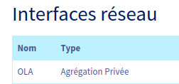

## Objectif

> [!warning]
> 
> Cet article est destiné aux utilisateurs expérimentés qui ont un minimum de connaissance concernant le monde open source, ainsi que des notions d'administration.
> 

Cette documentation à pour but de vous accompagner pour deployer tous les composants ou bien services nécessaires au bon redémarrage de vos solutions OVHcloud en environnement dédié et **entièrement privé**.<br>
Profiter d'une infrastructure privée sans avoir modifié la configuration par défaut de vos [serveurs dédiés](https://www.ovhcloud.com/fr/bare-metal/) OVhcloud.

> [!warning]
>
> Pour rappel, il est prohibé de modifier les configurations par défaut:<br>
> configuration Bios, Boot Order, etc...
> Nous avons au préalable effectués tous nos tests, qualifications et validations de configurations, à partir de paramètres de critères de fonctionnement bien définis, pour vous proposez des environnements techniques les mieux adaptés à votre matériel.
>

Les [serveurs dédiés](https://www.ovhcloud.com/fr/bare-metal/) OVHcloud vous permettent de configurer/déclarer vos propres réseaux.<br>
Chaque serveur est muni au minimum de 2 interfaces réseaux, fonctionnants en réalité en liens aggrégés et assurant la redondance en cas de panne. <br>
Vous avez donc la possiblité d'utiliser/déclarer vos réseaux dit "public" et ceux, au contraire dit "privés" en passant par notre solution [vrack](https://docs.ovh.com/fr/dedicated/configurer-plusieurs-serveurs-dedies-dans-le-vrack/).

Nous allons présenter le cas de [serveur(s) dédié(s)](https://www.ovhcloud.com/fr/bare-metal/) configuré(s) en mode *full-private*, c'est-à-dire ne possédant **uniquement** que des réseaux privés.
Ce choix propose à votre infrastructure la meilleur isolation/protection possible pour votre service hébergé.

La seule différence majeure qui est à noter, est que les réseaux [privés](https://docs.ovh.com/fr/ovhcloud-connect/presentation-concepts/#prive) n'ont donc pas accès à tout ce qui n'appartient pas à votre infrastructure.<br>
Mais dans ce cas, le mecanisme de démarrage de la solution se retrouve inopérant, à savoir que lorsque les systèmes sont démarrés, via une méthode **netboot** (Network Boot), ces derniers doivent obligatoirement récupèrer leur configurations via des services réseaux mutualisés présent sur le réseaux OVHcloud.


### Présentation rapide d'un démarrage en Netboot 

> [!primary]
>
> Ce qu'il faut savoir
> * il existe 2 "types" de boot:<br>
>  * Legacy (version ancienne): représente les anciens BIOS avec fonctionnabilités sommmaires, et limitations de prise en compte avec des matériels récents.
>  * [UEFI](https://fr.wikipedia.org/wiki/UEFI) (version récente) qui répresente une version améliorée du mode Legacy.
> 
> * il existe 2 "types" de PXE:<br>
>  * PXE: utilisant un environnement standardisé client/serveur, basé sur quelques protocoles (BOOTP/DHCP/TFTP), afin de permettre un démarrage/deploiement via le réseau du système client.
>  * iPXE: utilisant un environnement standardisé client/serveur plus évolué, basé sur plus grand nombre de protocoles (HTTP,iSCSI, AoE, FCoE, Wi-Fi...), afin de permettre un démarrage/deploiement via le réseau du système client.

definition du Netboot:

* Mode de démarrage en PXE (solution de démarrage réseau bas niveau) via l'interface réseau d'une machine cliente active permettant de communiquer avec le serveur DHCP de ce même réseau.Ce mode est défini au préalable dans le bios de votre serveur via le "boot order".
* Le serveur DHCP peut donc lui adresser les informations nécessaires, une adresse IP, un fichier PXE (sous forme de binaire executable), un script PXE. 
* le serveur client va chercher à récupérer ce binaire en protocol TFTP, pour ensuite le charger dans sa configuration.
* Le binaire récupéré et chargé en tant que firmware, peut donc désormais éxécuter le script associé qui contiendra les informations permettant la selection du type d'amorçage d'un systeme pour la machine cliente:<br>
  disque local, volume réseau, usb, etc...


### Comment fonctionne le Netboot chez OVHcloud
Nous avons pré-configurés la méthode de recherche d'amorçage des systèmes avec le Netboot (Network Boot) par défaut.

Cette méthode, décrite précedement, consiste donc à lancer une séquence via l'interface réseau qui permet d'utiliser les services **mutualisés** DHCP, TFTP  et HTTP (via le réseau interne OVHcloud), afin de récupérer les fichiers de configuration adéquates qui seront utilisé par le système qui tente de démarrer.

Le processus complet de démarrage aura comme instruction:

* de vérifier l'origine et la bonne intégrité des fichiers à récupéré (via chaine de certification interne)
* en fonction de type de serveur et du bios utilisé (legacy/UEFI), le script récupéré sera donc en fonction du mode détecté:<br>
  PXE (pour le legacy) ou iPXE (utilisé avec l'UEFI).
* le mode étant détecté, le script correspondant sera donc éxecuté et permettra l'amorçage du systeme d'exploitation installé au préalable.


processus complet de démarrage Netboot:
le cas avec l'**UEFI** est le cas par défaut et le plus courant, mais il existe des solutions plus ancienne en legacy.

| étape | mode LEGACY | mode UEFI |
|---|---|---|
|1|boot en PXE|Boot en PXE|
|2|requête vers DHCP|requête vers DHCP|
|3|réponse/attribution IP|réponse/attribution IP|
|4|requête pour récuperer le binaire iPXE|requête pour récuperer le binaire iPXE|
|5|récupération du binaire en TFTP|récupération du binaire en TFTP|
|6|chargement et initialisation|chargement et initialisation|
|7|requête DHCP pour récupérer le script associé au binaire|requête DHCP pour récupérer le script associé au binaire|
|8|récupération du script PXE|récupération du script iPXE|
|9|éxécution de commandes shell PXE|éxécution de commande shell iPXE|
|10|commande `boot` lancée|commandes shell pour récuperer en HTTP les sources (binaire + fichier de config) pour le bootloader rEFInd|
|11|fallback réalisé sur les disques locaux détectés|commande shell pour charger le binaire rEFInd|
|12|chargement du systeme d'exploitation installé|le binaire rEFInd scanne les disques locaux pour charger/détecter les systèmes d'amorçages |
|13|Système démarré |rEFInd utilise les secteurs d'amorçages présents|
|14||chargement du système d'exploitation associé|
|15||Système démarré|


> [!primary]
>
> La description ici restera le plus générique possible pour rester claire, et ainsi ne pas ajouter des éléments ou contraintes techniques qui sortent du cadre de notre exemple, mais donnera une vision globale du principe de fonctionnement.
>

## Prérequis

* Être connecté à [l'espace client OVHcloud](https://www.ovh.com/manager/#/dedicated/configuration).
* Posséder au moins un [serveur dédié](https://www.ovhcloud.com/fr/bare-metal/) ayant un système d'exploitation **déjà installé**.
* Avoir toutes les interfaces réseaux de ce serveur en réseau dit **privé**, ce qui sous-entend que vous avez au préalable configuré la fonction [OLA](https://docs.ovh.com/fr/dedicated/ola-manager/).
cf images extraites du manager, ci-dessous:<br>
onglet interfaces réseaux




* Un système dédié supplémentaire avec les interfaces réseaux configurées par défaut, à savoir, un accès au réseau public ainsi qu'à votre réseau privé. (qui hébergera les services DHCP et TFTP). Le système d'exploitation sera celui de votre choix.


## En pratique

### Deployer vos services DHCP, TFTP et HTTP

* installation des packages pour les services DHCP/TFTP/HTTP.
* configuration basique pour chaque service.
* mise en marche.


exemple d'infrastructure privée basique (schéma layer 2):


Exemple:

* services hébergés/mutualisés sur *Node 0*.
* une seule machine cliente *Node 1*.


#### le service **DHCP**

ci-dessous, un exemple de fichier de configuration pour votre service **DHCP**.<br>
Selon votre distribution, l'arboresence peut être différente (dhcpd.conf).

En régle générale, il suffit de:<br>

* déclarer une interface réseau pour l'écoute (en attente de requêtes).
* préciser la version du protocol IP (v4 ou v6).
* configurer/déclarer le subnet utilisé.

à titre d'exemple:
```bash
default-lease-time 7200;
max-lease-time 7200;

allow booting;
allow bootp;
allow unknown-clients;

###PXE###

option space PXE;
option PXE.mtftp-ip code 1 = ip-address;
option PXE.mtftp-cport code 2 = unsigned integer 16;
option PXE.mtftp-sport code 3 = unsigned integer 16;
option PXE.mtftp-tmout code 4 = unsigned integer 8;
option PXE.mtftp-delay code 5 = unsigned integer 8;
option arch code 93 = unsigned integer 16;

option space ipxe;
option ipxe-encap-opts code 175 = encapsulate ipxe;
option ipxe.priority code 1 = signed integer 8;
option ipxe.keep-san code 8 = unsigned integer 8;
option ipxe.skip-san-boot code 9 = unsigned integer 8;
option ipxe.syslogs code 85 = string;
option ipxe.cert code 91 = string;
option ipxe.privkey code 92 = string;
option ipxe.crosscert code 93 = string;
option ipxe.no-pxedhcp code 176 = unsigned integer 8;
option ipxe.bus-id code 177 = string;
option ipxe.san-filename code 188 = string;
option ipxe.bios-drive code 189 = unsigned integer 8;
option ipxe.username code 190 = string;
option ipxe.password code 191 = string;
option ipxe.reverse-username code 192 = string;
option ipxe.reverse-password code 193 = string;
option ipxe.version code 235 = string;
option iscsi-initiator-iqn code 203 = string;

# Feature indicators
option ipxe.pxeext code 16 = unsigned integer 8;
option ipxe.iscsi code 17 = unsigned integer 8;
option ipxe.aoe code 18 = unsigned integer 8;
option ipxe.http code 19 = unsigned integer 8;
option ipxe.https code 20 = unsigned integer 8;
option ipxe.tftp code 21 = unsigned integer 8;
option ipxe.ftp code 22 = unsigned integer 8;
option ipxe.dns code 23 = unsigned integer 8;
option ipxe.bzimage code 24 = unsigned integer 8;
option ipxe.multiboot code 25 = unsigned integer 8;
option ipxe.slam code 26 = unsigned integer 8;
option ipxe.srp code 27 = unsigned integer 8;
option ipxe.nbi code 32 = unsigned integer 8;
option ipxe.pxe code 33 = unsigned integer 8;
option ipxe.elf code 34 = unsigned integer 8;
option ipxe.comboot code 35 = unsigned integer 8;
option ipxe.efi code 36 = unsigned integer 8;
option ipxe.fcoe code 37 = unsigned integer 8;
option ipxe.vlan code 38 = unsigned integer 8;
option ipxe.menu code 39 = unsigned integer 8;
option ipxe.sdi code 40 = unsigned integer 8;
option ipxe.nfs code 41 = unsigned integer 8;

subnet 192.168.1.0 netmask 255.255.255.240 {

    range 192.168.1.2 192.168.1.5;
    option broadcast-address 192.168.1.15;
    option routers 192.168.1.1;
    ping-check = 1;
    next-server 192.168.1.1; # tftpd server's IP

    if option arch = 00:07 { 			# Détermine le type d'architecture, ici 64bits
      if exists user-class and option user-class = "iPXE" {
          filename "refind.pxe"; 		# Détermine le script iPXE correspondant
      } else {
            filename "ipxe.efi"; 		# Détermine le binaire iPXE
        }

      } else if option arch = 00:06 { 		# Détermine le type d'architecture, ici 32bits
          if exists  user-class and option user-class = "iPXE" {
              filename "ipxe32.efi"; 		# Détermine le script iPXE correspondant
          } else {
              filename "ipxe.efi";		# Détermine le biniare iPXE si arch différente
            }
        } else {
            if exists user-class and option user-class = "iPXE" {
                filename "refind.pxe";
            } else {
                  filename "undionly.kpxe";	# Détermine le binaire dans le cas de LEGACY
              }
          }
}

# Declare each host here
host node_1 {
    hardware ethernet xx:xx:xx:xx:xx:xx;
    server-name "node_1";
}
```

Détails:

* réseau privé (ex: 192.168.1.0/28).
* `subnet_mask` : 255.255.255.240
* `broadcast_address` : 192.168.1.15
* `dns_servers` : cf chapitre optionnel
* `ntp_servers` : cf chapitre optionnel
* `default_router` : 192.168.1.1
* `next-server` : 192.168.1.1
* `host` : nom machine cliente
* `hardware ethernet` : adresse matérielle (MAC) machine cliente
* `server-name` : ip machine cliente


#### le service **TFTP**

Selon votre distribution, il existe plusieurs paquets réalisant la fonction de serveur TFTP.<br>
Par exemple: *tftp-server*, *tftpd*, *tftpd-hpa* ou encore *atftpd*.

> [!primary]
> 
> L'arborescence d'installation peut être différente selon la version du package et de votre système d'exploitation utilisé.
> 


Ce qu'il faut savoir:
* Ce service utilise le port 69 (UDP)
* Il est obligatoire de déclarer un répertoire "cible", correspondant à une arboresence locale qui sera utilisée pour les réceptions et les téléchargments des fichiers.

exemple de configuration avec le logiciel `tftpd-hpa`:

```bash
# /etc/default/tftpd-hpa
TFTP_USERNAME="tftp"
TFTP_DIRECTORY="/srv/tftpboot"
TFTP_ADDRESS="TFTP_server_address:69"
TFTP_OPTIONS="--secure"
```

Nous utiliserons comme exemple le chemin `/srv/tftpboot`, et y déposerons les fichiers nécessaires:<br>

```bash
root@node_0:/srv/tftp# tree
.
|-- ipxe.efi
|-- ipxe32.efi
`-- undionly.kpxe
```

Contenu du fichier `refind.pxe`:
doit être déclaré/actif, le service http qui désservira les fichiers pour rEFInd:<br>
(le chemin choisi dans notre exemple sera  celui par défaut, à savoir `/var/www/` toujours sur le *Node_0*)


```bash
#!ipxe 
#
echo Boot to local disk

set ressources-url http://192.168.1.1

iseq ${platform} efi && goto is_efi_x86_64 || goto not_efi

:not_efi
echo Legacy boot mode
goto LEGACY_BOOT_default

:LEGACY_BOOT_boot
echo Executing exit 0
sleep 2
boot
goto end

#Boot the first local HDD
:LEGACY_BOOT_default
echo Executing sanboot
sleep 2
sanboot --no-describe --drive 0x80
goto end

:is_efi_x86_64
echo EFI boot mode
imgfetch --name refind.conf ${ressources-url}/refind.conf
chain ${ressources-url}/refind_x64.efi

:end
echo Chain on hard drive failed
sleep 10
exit 1

```

> [!primary]
>
> La syntaxe [sanboot](https://ipxe.org/cmd/sanboot) permet de forcer le fallback vers les disques durs locaux.<br>
> En effet, il est connu que cette méthode, prévu initialement pour chercher divers volumes sur le réseaux, sert à initier le boot en utiliser les disques locaux.<br>
> Plus d'informations si besoin à cette [adresse](https://ipxe.org/cmd/sanboot).
>

> [!warning]
>
> il s'avère que celle-ci ne fonctionne pas en mode UEFI dans le SI d'OVHcloud
>


A partir du moment où cette étape a été réalisée, le système d'exploitation peut débuter son chargement.


#### le service **HTTP**
Il est question de rendre disponible (en HTTP) les ressources permettant le lancement du menu rEFInd que le script iPXE doit récupérer, à savoir:<br>
* le binaire éxécutable `refind_x64.efi`
* le fichier de configuration `refind.conf`


doit être déclaré/actif, le service http qui désservira les fichiers pour rEFInd:<br>
(le chemin choisi dans notre exemple sera  celui par défaut, à savoir `/var/www/` toujours sur le *Node_0*)

```bash
root@node_0:/var/www# tree
|-- refind.conf
`-- refind_x64.efi
```

contenu du fichier `refind.conf`

Il s'agit d'intégrer les directives mimumun pour une bonne intégration au SI d'OVHcloud.
```bash

timeout 1
default_selection 1
hideui hwtest
hideui hints
banner_scale noscale
textonly
scanfor internal
uefi_deep_legacy_scan
scan_delay 0

```


#### Mise en marche

screen


#### Optionnel


> [!warning]
> 
> Il est récommandé également de deployer les services DNS et NTP.
> Ceux-ci ne sont pas nécessaires pour les phases de démarrage des systèmes, donc pas imposés dans cette procédure.
> Mais ils font partie des services importants par la suite, pour la stabilité de votre infrastructure.
> 


**Suggestions**

service DNS:<br>
Pour pouvez utiliser la table locale de chaque *Node*, à savoir le fichier `/etc/hosts`,ou bien utiliser, par exemple, un service tel que [dnsmasq](https://en.wikipedia.org/wiki/Dnsmasq).


service NTP:


```bash
# pour le service NTP
iptables -I INPUT -i ethX -p udp --dport 123 -j ACCEPT

# pour le service DNS
iptables -I INPUT -i ethX -p udp --dport 53 -j ACCEPT
iptables -I INPUT -i ethX -p tcp --dport 53 -j ACCEPT
```


## Aller plus loin

[dhcp](https://wiki.debian.org/fr/DHCP_Server)
[ntp](https://fr.wikipedia.org/wiki/Network_Time_Protocol)
[rEFInd](https://fr.wikipedia.org/wiki/REFInd)


Échangez avec notre communauté d'utilisateurs sur <https://community.ovh.com/>.
