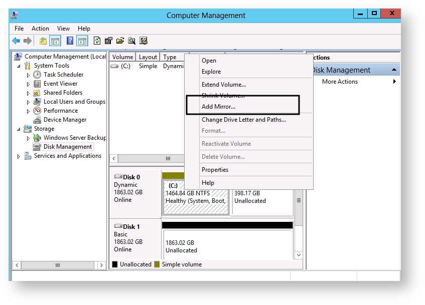
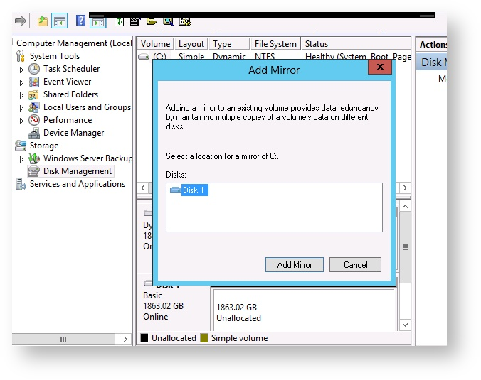
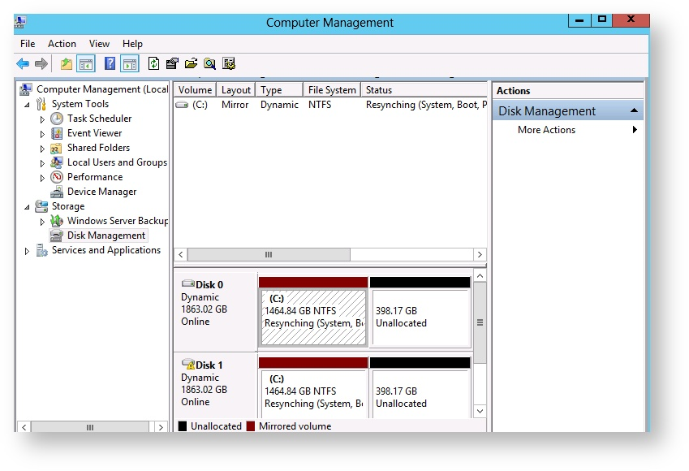

## Requirements
- Have a server in Raid Software.
- Have a server on a Linux or Windows system.


## State of a Raid - Linux

### Step 1 &#58; Checking

The checking of Raid is executed by the following command

```sh
cat /proc/mdstat
```

#### Case of a Synchronized Raid &#58;

```sh
cat /proc/mdstat
Personalities : [linear] [raid0] [raid1] [raid10] [raid6] [raid5] [raid4] [multipath] [faulty]
md1 : active raid1 sda1[0] 
sdb1[1] 51198912 blocks [2/2] [UU]
md2 : active raid1 sda2[0]
sdb2[1] 921462720 blocks [2/2] [UU]
```

#### Case of a desynchronized raid &#58 :

```sh
cat /proc/mdstat 
Personalities : [linear] [raid0] [raid1] [raid10] [raid6] [raid5] [raid4] [multipath] [faulty]
md2 : active raid1 sdc2[2] sdd2[3] sda2[0] sdb2[1] sde2[4] 20478912 blocks [7/5] [UUUUU__] 
md3 : inactive sda30 sdf35 sde34 sdd33 sdc32 sdb31 23316061824 blocks
```

If all units are not integrated into the Raid, check the discs.

If they are defective, you must :

- Backup your data.
- Contact the support to organize the disk replacement.

If they are healthy, a synchronization of the Raid is recommended.


### Step 2 &#58; For further

#### Examine partitions

To do this, you can use the command `mdadm --examine /dev/sdaX`:

```sh
mdadm --examine /dev/sda5 /dev/sda5:   
Magic : a92b4efc         Version : 0.90.00
UUID : 65889d2a:11172e42:a4d2adc2:26fd5302
Creation Time : Thu Jul 12 20:22:48 2012   
Raid Level : raid5
Used Dev Size : 1924838272 (1835.67 GiB 1971.03 GB)
Array Size : 5774514816 (5507.01 GiB 5913.10 GB)
Raid Devices : 4
Total Devices : 4
Preferred Minor : 5 

Update Time : Wed Feb 25 16:51:49 2015
State : active
Active Devices : 4
Working Devices : 4
Failed Devices : 0
Spare Devices : 0
Checksum : 36669dd - correct
Events : 2266211

Layout : left-symmetric
Chunk Size : 64K

 Number   Major   Minor   RaidDevice  State 
   0       8        5        0        active sync   /dev/sda5
   1       1        8        1        active sync   /dev/sdb5
   2       2        8        2        active sync   /dev/sdc5
   3       3        8        3        active sync   /dev/sdd2
```

#### Stop a partition

To do this, you can use the command `mdadm --stop /dev/mdX`:

```sh
mdadm --stop /dev/md126 mdadm: stopped /dev/md126 
```


#### Assemble the RAID in a different partition

Example: Put the content of sdb1 in md1 and md2

```sh
mdadm --assemble /dev/md1 /dev/sdb1 
mdadm: /dev/md1 has been started with 1 drive (out of 2).
```

```sh
cat /proc/mdstat 
Personalities : [linear] [raid0] [raid1] [raid10] [raid6] [raid5] [raid4] [multipath] [faulty]
md1 : active raid1 sdb1[1] 10485696 blocks [2/1] [_U] 
```

```sh
mdadm --assemble /dev/md2 /dev/sdb2 
mdadm: /dev/md2 has been started with 1 drive (out of 2).
```

```sh
cat /proc/mdstat
Personalities : [linear] [raid0] [raid1] [raid10] [raid6] [raid5] [raid4] [multipath] [faulty]
md2 : active raid1 sdb2[1] 1942498240 blocks [2/1] [_U]
md1 : active raid1 sdb1[1] 10485696 blocks [2/1] [_U]
```

## State of Raid - Windows

In Windows 2012, to check the status of a RAID, you must :

- Open an RDP connection.
- Go to the `Tools`{.action} section and select from the drop-down list the `Computer Management`{.action} tool.


{.thumbnail}

A new icon appears in the task bar, click on it.

{.thumbnail}

Select the `storage`{.action} part then `Disk management`{.action}.


{.thumbnail}

The two disks Disk 0 and Disk 1 are mirroring (Raid 1) in volume C.


## Rebuild a Raid - Linux

> [!warning]
>
> Before synchronizing a Raid, check the status of your drives.
> 


### Step 1&#58; Determine the new disc

You must list the partitions with the command `fdisk -l`{.action} in order to locate the blank disk.

The following message will be displayed for the new disc :

```sh
fdisk -l
The /dev/sdX disk does not contain a valid partition table 
```

Example :

```sh
fdisk -l
Disk /dev/sda: 1500.3 GB, 1500301910016 bytes 255 heads, 63 sectors/track, 182401 cylinders, total 2930277168 sectors Units = sectors of 1 * 512 = 512 bytes Sector size (logical/physical): 512 bytes / 512 bytes I/O size (minimum/optimal): 512 bytes / 512 bytes Disk identifier: 0x00067fad      
Device Boot      Start         End         Blocks          Id  System 
/dev/sda1 *      4096       40962048     20478976+    fd  Linux raid autodetect 
/dev/sda2      40962049     2929221632   1444129792   fd  Linux raid autodetect 
/dev/sda3      2929221633   2930268160    523264      82     Linux swap / Solaris   

Disk /dev/sdb: 2000.4 GB, 2000398934016 bytes 255 heads, 63 sectors/track, 243201 cylinders, total 3907029168 sectors Units = sectors of 1 * 512 = 512 bytes Sector size (logical/physical): 512 bytes / 512 bytes I/O size (minimum/optimal): 512 bytes / 512 bytes Disk identifier: 0x00000000   
Disk /dev/sdb doesnt contain a valid partition table

Disk /dev/md2: 1478.8 GB, 1478788841472 bytes 2 heads, 4 sectors/track, 361032432 cylinders, total 2888259456 sectors Units = sectors of 1 * 512 = 512 bytes Sector size (logical/physical): 512 bytes / 512 bytes I/O size (minimum/optimal): 512 bytes / 512 bytes Disk identifier: 0x00000000   
Disk /dev/md2 doesnt contain a valid partition table

Disk /dev/md1: 21.0 GB, 20970405888 bytes 2 heads, 4 sectors/track, 5119728 cylinders, total 40957824 sectors Units = sectors of 1 * 512 = 512 bytes Sector size (logical/physical): 512 bytes / 512 bytes I/O size (minimum/optimal): 512 bytes / 512 bytes Disk identifier: 0x00000000  
Disk /dev/md1 doesnt contain a valid partition table 
```

Here, the disk still blank is the disk sdb.


### Step 2&#58; Replicate Partitions

> [!warning]
>
> This step is irreversible. It is important to take extra care when running these commands, entering these commands incorrectly will risk erasing everything.
> 

The procedure differs depending on the type of partition tables :

- MBR (Master Boot Record), you will need to use `sfdisk`.
- GPT (GUID Partition Table), use `sgdisk`.


#### How to determine which type of partition table?

If during the `fdisk -l`{.action} command you encounter the message below, it means that the table is in GTP. Otherwise, it is in MBR.

```sh
WARNING: GPT (GUID Partition Table) detected on /dev/sda! The util fdisk doesnt support GPT. Use GNU Parted. Passez à étape *Disque en GPT* sinon passez à l étape *Disque en MBR*. 
```

#### For MBR &#58;

If you had SDA replaced :

```sh
sfdisk -d /dev/sdb | sfdisk /dev/sda 
```

If you had SDB replaced :

```sh
sfdisk -d /dev/sda | sfdisk /dev/sdb 
```

It may happen that replication must be forced: *sfdisk: ERROR: sector 0 does not have an msdos signature* In this case, you must add to the previous `--force` command:

If you had SDA replaced :

```sh
sfdisk -d /dev/sdb | sfdisk --force /dev/sda 
```

If you had SDB replaced :

```sh
sfdisk -d /dev/sda | sfdisk --force /dev/sdb 
```

#### For GPT &#58;

In the case of the change of the SDA :

```sh
sgdisk -R=/dev/sda /dev/sdb 
```

In the case of the change of the SDB :

```sh
sgdisk -R=/dev/sdb /dev/sda 
```

By following the example above, the partitions are in MBR, use `sfdisk`.

```sh
sfdisk -d /dev/sda | sfdisk /dev/sdb C
Checking that no-one is using this disk right now ... OK 
Disk /dev/sdb: 243201 cylinders, 255 heads, 63 sectors/track   sfdisk: ERROR: sector 0 does not have an msdos signature /dev/sdb: unrecognized partition table type Old situation: No partitions found New situation: Units = sectors of 512 bytes, counting from 0 Device Boot    Start       End   sectors  Id  
System/dev/sdb1     4096  40962048   40957953  fd  Linux raid autodetect 
/dev/sdb2      40962049 2929221632 2888259584  fd  Linux raid autodetect 
/dev/sdb3     2929221633 2930268160    1046528  82  Linux swap / Solaris 
/dev/sdb4            0         -          0   0  

Empty Warning: partition 1 does not end at a cylinder boundary 
Warning: partition 2 does not start at a cylinder boundary 
Warning: partition 2 does not end at a cylinder boundary 
Warning: partition 3 does not start at a cylinder boundary 
Warning: partition 3 does not end at a cylinder boundary 
Successfully wrote the new partition table   Re-reading the partition table ...  
If you created or changed a DOS partition, /dev/foo7, say, then use dd(1) to zero the first 512 bytes:  dd if=/dev/zero of=/dev/foo7 bs=512 count=1 (See fdisk(8).) 
```

The partition tables are then replicated.

To check :

```sh
fdisk -l
>>> Disk /dev/sda: 1500.3 GB, 1500301910016 bytes 255 heads, 63 sectors/track, 182401 cylinders, total 2930277168 sectors Units = sectors of 1 * 512 = 512 bytes Sector size (logical/physical): 512 bytes / 512 bytes I/O size (minimum/optimal): 512 bytes / 512 bytes Disk identifier: 0x00067fad      
Device Boot      Start        End        Blocks     Id  System 
/dev/sda1        4096      40962048    20478976+    fd  Linux raid autodetect 
/dev/sda2      40962049   2929221632   1444129792   fd  Linux raid autodetect 
/dev/sda3     2929221633  2930268160    523264   82  Linux swap / Solaris   

>>> Disk /dev/sdb:      2000.4 GB, 2000398934016 bytes 255 heads, 63 sectors/track, 243201 cylinders, total 3907029168 sectors Units = sectors of 1 * 512 = 512 bytes Sector size (logical/physical): 512 bytes / 512 bytes I/O size (minimum/optimal): 512 bytes / 512 bytes Disk identifier: 0x00000000   

Device Boot      Start         End      Blocks   Id  System 
/dev/sdb1   *        4096    40962048    20478976+  fd  Linux raid autodetect /dev/sdb2        40962049  2929221632  1444129792   fd  Linux raid autodetect /dev/sdb3      2929221633  2930268160      523264   82  Linux swap / Solaris   
Disk /dev/md2: 1478.8 GB, 1478788841472 bytes 2 heads, 4 sectors/track, 361032432 cylinders, total 2888259456 sectors Units = sectors of 1 * 512 = 512 bytes Sector size (logical/physical): 512 bytes / 512 bytes I/O size (minimum/optimal)512 bytes / 512 bytes Disk identifier: 0x00000000   
Disk /dev/md2 doesnt contain a valid partition table   
 
Disk /dev/md1: 21.0 GB, 20970405888 bytes 2 heads, 4 sectors/track, 5119728 cylinders, total 40957824 sectors Units = sectors of 1 * 512 = 512 bytes Sector size (logical/physical): 512 bytes / 512 bytes I/O size (minimum/optimal): 512 bytes / 512 bytes Disk identifier: 0x00000000   
Disk /dev/md1 doesnt contain a valid partition table
```


### Step 3&#58; Rebuilding


> [!primary]
>
> `Mdadm` must be installed.
> 

In the example below, it can be seen that the RAID is degraded.

```sh
cat /proc/mdstat 
Personalities : [linear] [raid0] [raid1] [raid10] [raid6] [raid5] [raid4] [multipath] [faulty]
md1 : active raid1 sda1[0] 20478912 blocks [2/1] [U_]
md2 : active raid1 sda2[0] 1444129728 blocks [2/1] [U_]
```

It lacks sdb1 in md1 and sdb2 in md2.

They should be added in md1 and md2 as follows:

```sh
mdadm /dev/md1 --manage --add /dev/sdb1
mdadm: added /dev/sdb1
mdadm /dev/md2 --manage --add /dev/sdb2
mdadm: added /dev/sdb2
```

Rebuilding is underway.

```sh
cat /proc/mdstat Personalities : [linear] [raid0] [raid1] [raid10] [raid6] [raid5] [raid4] [multipath] [faulty]
md1 : active raid1 sdb1[2] sda1[0] 20478912 blocks [2/1] [U_] [=>...................] recovery = 5.0% (1039872/20478912) finish=4.6min speed=69324K/sec   
md2 : active raid1 sdb2[2] sda2[0] 1444129728 blocks [2/1] [U_] resync=DELAYED 
```

On md2, the synchronization is DELAYED. This means that it is on hold.

The resynchronization of this partition will take place once md1 is reassembled.


### Step 4 &#58; The SWAP

Now you have to add the swap to the disk you just formatted and add it to the RAID.

```sh
mkswap /dev/sdb3 
```

If the synchronization has taken place on the disk, it will be necessary to activate the swap. In rescue, this is not necessary, it will be done automatically at startup.

```sh
swapon -a 
```

To verify that the entire swap area is activated, use the free command.


## Rebuild a Raid - Windows

> [!warning]
>
> Before synchronizing a Raid, check the status of your drives.
> 


### On disk in RDP

To synchronize the RAID, you must :

- Open a remote desktop connection.
- Access the Disk Management.


> [!primary]
>
> If a Raid disk is offline, right click on the disk, then click `Online`{.action} to restore it to the RAID.
> 

- Right click on the main disk, and select `Add mirror`{.action}.


{.thumbnail}

- Select the disk to be mirrored.

{.thumbnail}

- Confirm by clicking Add mirror.


> [!primary]
>
> If this is not already the case, the disk to be returned to the RAID will automatically be put into dynamic before rebuilding.
> 

Rebuilding is then in progress.


{.thumbnail}