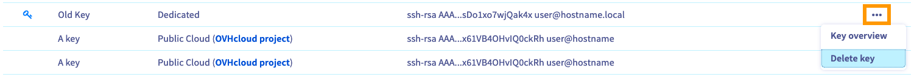

> [!primary]
> Questa traduzione è stata generata automaticamente dal nostro partner SYSTRAN. I contenuti potrebbero presentare imprecisioni, ad esempio la nomenclatura dei pulsanti o alcuni dettagli tecnici. In caso di dubbi consigliamo di fare riferimento alla versione inglese o francese della guida. Per aiutarci a migliorare questa traduzione, utilizza il pulsante "Contribuisci" di questa pagina.
>

**Ultimo aggiornamento: 06/02/2023**

## Obiettivo

Se [utilizzi chiavi SSH](/pages/cloud/dedicated/creating-ssh-keys-dedicated) per connetterti al tuo server dedicato, la perdita della tua chiave SSH privata potrebbe significare la perdita totale dell'accesso al tuo server.

Per accedere al tuo server in [modalità Rescue OVHcloud](/pages/cloud/dedicated/rescue_mode), utilizza una password provvisoria che ti permette di modificare i tuoi file.

**Questa guida ti mostra come sostituire le tue chiavi SSH in caso di perdita dell'accesso al tuo server.**

> [!warning]
>
> OVHcloud mette a tua disposizione servizi di cui tu sei responsabile per la configurazione e la gestione. Garantirne quotidianamente il corretto funzionamento è quindi responsabilità dell’utente.
>
> Questa guida ti aiuta a realizzare le operazioni più ricorrenti. Tuttavia, in caso di difficoltà o dubbi, ti consigliamo di rivolgerti a un [provider specializzato](https://partner.ovhcloud.com/it/directory/) o contattare l'amministratore del servizio. OVHcloud non potrà fornirti alcuna assistenza. Per maggiori informazioni consulta la sezione [Per saperne di più](#go-further) su questa guida.
>

## Prerequisiti

- Un [server dedicato](https://www.ovhcloud.com/it/bare-metal/) nel tuo account OVHcloud
- Avere accesso allo [Spazio Cliente OVHcloud](https://www.ovh.com/auth/?action=gotomanager&from=https://www.ovh.it/&ovhSubsidiary=it)

## Procedura

### Step 1 - Disattiva la chiave SSH corrente

Per accedere al tuo server in modalità Rescue, la chiave SSH attiva deve essere disattivata.

Accedi allo [Spazio Cliente OVHcloud](https://www.ovh.com/auth/?action=gotomanager&from=https://www.ovh.it/&ovhSubsidiary=it) e naviga fino alla sezione `Chiavi SSH`{.action}. Se necessario, consulta la guida ["Creare una chiave SSH"](/pages/cloud/dedicated/creating-ssh-keys-dedicated#cpsshkey).

La chiave pubblica salvata nello Spazio Cliente è inutile senza la chiave privata corrispondente, puoi quindi eliminarla. Clicca sul pulsante <i class="icons-ellipsis icons-border-rounded icons-masterbrand-blue"></i> a destra della chiave e seleziona `Elimina la chiave`{.action}.

{.thumbnail}

Nella nuova finestra, clicca su `Conferma`{.action}.

### Step 2 - Crea una nuova coppia di chiavi

Crea una nuova coppia di chiavi SSH sulla tua postazione di lavoro, come descritto nella prima sezione della guida ["Creare una chiave SSH"](/pages/cloud/dedicated/creating-ssh-keys-dedicated).

### Step 3 - Accedere al tuo server in modalità Rescue e sostituire la chiave

Segui gli step della guida sulla [modalità Rescue](/pages/cloud/dedicated/rescue_mode) per connetterti al tuo server e montare le tue partizioni.

Quando hai accesso ai tuoi file, apri il file "authorized_keys" in un editor di testo. Questo file salva le chiavi SSH e si trova nella cartella `home` dell'utente connesso al tuo server. (Sostituisci "USER_NAME" con il tuo nome utente)

```
rescue-customer:~# sudo nano /mnt/home/USER_NAME/.ssh/authorized_keys
```

Copia e incolla la tua nuova chiave pubblica (creata allo Step 2) nel file. Il contenuto del file dovrebbe essere simile a questo esempio:

```console
ssh-rsa 1111111111122222222222333333333333444444444555555555556666666666
777777777778888888888999999900000000000000000000000000== old@sshkey
ssh-rsa AAAAAAAAABBBBBBBBBBBCCCCCCCCCCCCCCCCDDDDDDDDDDDDDDDDDDDEEEEEEEEE
EEFFFFFFFFFFFFFGGGGGGGGGGGGGhhhhhhhhhhhhhhhhhhhhhhhhhh== new@sshkey
```

Puoi eliminare la catena di chiave "old" (ormai obsoleta) dal file. Salva e lascia l'editor.

Riavvia la modalità "normale" di avvio e riavvia il server dallo [Spazio Cliente OVHcloud](https://www.ovh.com/auth/?action=gotomanager&from=https://www.ovh.it/&ovhSubsidiary=it). Se necessario, consulta la guida ["Attivare e utilizzare il Rescue mode"](/pages/cloud/dedicated/rescue_mode).

A questo punto hai accesso al server con la tua nuova coppia di chiavi SSH.

## Per saperne di più <a name="go-further"></a>

[Modifica la password di root su un server dedicato](/pages/cloud/dedicated/changing_root_password_linux_ds)

Contatta la nostra Community di utenti all’indirizzo <https://community.ovh.com/en/>.