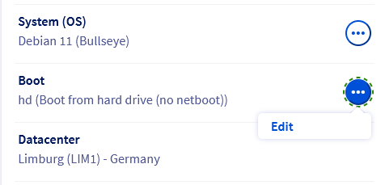
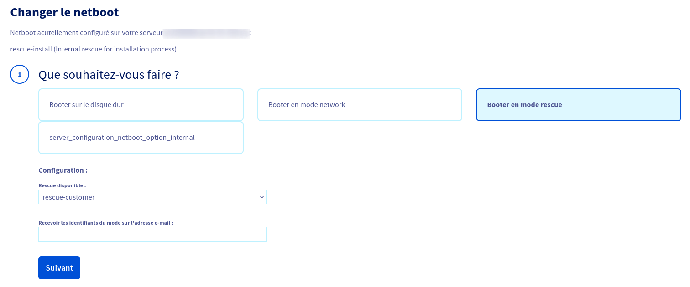

> [!primary]
> Diese Übersetzung wurde durch unseren Partner SYSTRAN automatisch erstellt. In manchen Fällen können ungenaue Formulierungen verwendet worden sein, z.B. bei der Beschriftung von Schaltflächen oder technischen Details. Bitte ziehen Sie beim geringsten Zweifel die englische oder französische Fassung der Anleitung zu Rate. Möchten Sie mithelfen, diese Übersetzung zu verbessern? Dann nutzen Sie dazu bitte den Button «Mitmachen» auf dieser Seite.
>

**Letzte Aktualisierung am 02.05.2022**

## Ziel

Der Rescue-Modus ist ein Tool Ihres dedizierten Servers, mit dem Sie diesen auf einem temporären Betriebssystem starten können, um Probleme zu diagnostizieren und zu beheben.

Der Rescue-Modus ist generell an folgende Aufgaben angepasst:

- Zurücksetzen des Root-Passworts
- Diagnose von Netzwerkproblemen
- Reparatur eines fehlerhaften Betriebssystems
- Korrektur einer fehlerhaften Konfiguration einer Software-Firewall
- Performance-Test der Festplatten
- Test des Prozessors und des RAM

Der erste Schritt, auch im Rescue-Modus, sollte immer darin bestehen, ein Backup Ihrer Daten, falls Sie nicht schon über aktuelle Backups verfügen.

**Diese Anleitung erklärt, wie Sie Ihren OVHcloud Dedicated Server im Rescue-Modus neu starten.**

## Voraussetzungen

- Sie haben einen [Dedicated Server](https://www.ovhcloud.com/de/bare-metal/) in Ihrem Kunden-Account.
- Sie haben Zugriff auf Ihr [OVHcloud Kundencenter](https://www.ovh.com/auth/?action=gotomanager&from=https://www.ovh.de/&ovhSubsidiary=de).

## In der praktischen Anwendung

> [!warning]
> Bitte beachten Sie, dass Sie beim Neustart eines Servers im Rescue-Modus kein Root-Passwort erhalten, wenn Sie in Ihrer Dienstverwaltung im Kundencenter einen SSH-Standard-Schlüssel festgelegt haben. In diesem Fall müssen Sie zuerst den SSH-Schlüssel deaktivieren, bevor Sie den Server im Rescue-Modus neu starten. Dazu lesen Sie bitte den [Abschnitt](../ssh-schluessel-erzeugen/#disablesshkey) der entsprechenden Anleitung.
>

Der Rescue-Modus kann nur über Ihr [OVHcloud Kundencenter](https://www.ovh.com/auth/?action=gotomanager&from=https://www.ovh.de/&ovhSubsidiary=de){.external} aktiviert werden. Wählen Sie Ihren Server aus, indem Sie in den Bereich `Bare Metal Cloud`{.action} wechseln und ihn dann unter `Dedicated Server`{.action} anklicken.

Suchen Sie "Boot" im Bereich **Allgemeine Informationen** und klicken Sie auf `...`{.action} und dann auf `Bearbeiten`{.action}.

{.thumbnail}

Auf der nächsten Seite, wählen Sie **Im Rescue-Modus booten**. Wenn Ihr Server über ein Linux-Betriebssystem verfügt, wählen Sie `rescue-customer`{.action} im Drop-down-Menü aus. Wenn Ihr Server auf Windows läuft, können Sie auch `WinRescue`{.action} wählen ([vgl. Abschnitt unten](#windowsrescue)). Geben Sie eine alternative E-Mail-Adresse an, wenn Sie *nicht* möchten, dass die Login-Daten an die Hauptadresse Ihres OVHcloud Kunden-Accounts gesendet werden.

> [!warning]
> OVHcloud Kunden-Accounts können zum Teil von einem Fehler bezüglich der Sprache der Rescue-E-Mails betroffen sein: französische Sprache statt deutsche Sprache. Obowhl die Fehlerursache seit dem 20. September 2022 korrigiert ist, muss die E-Mail-Adresse einmal aktualisiert werden, um das Problem endgültig zu beheben: Geben Sie dazu die E-Mail-Adresse Ihres Kunden-Accounts in diesem Schritt ein, bevor Sie den Rescue-Modus aktivieren.
>

Klicken Sie auf `Weiter`{.action} um mit dem nächsten Schritt fortzufahren, und dann auf `Bestätigen`{.action}.

{.thumbnail}

Wenn die Änderung abgeschlossen ist, klicken Sie auf `...`{.action}. rechts neben "Status" im Bereich **Dienstleistungsstatus**.
<br>Klicken Sie auf `Neu starten`{.action} und der Server wird im Rescue-Modus neu gestartet. Die Durchführung dieser Operation kann einige Minuten dauern.
<br>Sie können den Fortschritt im Tab `Tasks`{.action} überprüfen. Es wird automatisch eine E-Mail mit einigen zusätzlichen Informationen und den Zugangsdaten des Root-Benutzers für den Rescue-Modus verschickt.

{.thumbnail}

Wenn Sie Ihre Tasks im Rescue-Modus beendet haben, denken Sie daran, den Netboot-Modus wieder auf `Von Festplatte booten`{.action} umzustellen bevor Sie Ihren Server neu starten.

### Linux

#### Verwendung des Rescue-Modus (SSH)

> [!primary]
>
> Wenn Sie einen SSH-Schlüssel verwenden (der auch in Ihrem OVHcloud-Kundencenter aktiviert ist), wird Ihnen kein Passwort gesendet. Sobald der Server im Rescue-Modus ist, können Sie sich direkt über Ihren SSH-Schlüssel verbinden.
>

Nach dem Neustart Ihres Servers erhalten Sie eine E-Mail mit Ihren Login-Daten für den Rescue-Modus. Diese E-Mail ist auch in Ihrem [OVHcloud Kundencenter](https://www.ovh.com/auth/?action=gotomanager&from=https://www.ovh.de/&ovhSubsidiary=de) verfügbar. Klicken Sie in der oberen rechten Ecke Ihres Kundencenters auf den Namen Ihrer Kundenkennung und anschließend auf `E-Mails vom Support`{.action}.

Sie müssen dann über die Befehlszeile oder über ein SSH-Tool auf Ihren Server zugreifen, indem Sie das für den Rescue-Modus generierte Root-Passwort verwenden.

Beispiel:

```sh
ssh root@your_server_IP
root@your_server_password:
```

> [!warning]
>
> Ihr SSH-Client wird die Verbindung wahrscheinlich zuerst ablehnen, weil der ECDSA-Fingerabdruck nicht kompatibel ist. Dies ist normal, da der Rescue-Modus seinen eigenen temporären SSH-Server verwendet.
>
> Um dieses Problem zu umgehen, können Sie den regulären Fingerprint des Systems auskommentieren, indem Sie in der Datei *known_hosts* ein `#` in der entsprechenden Zeile hinzufügen. Achten Sie darauf, dieses Zeichen zu entfernen, bevor Sie den Server im normalen Modus neu starten.
>

#### Mounten Ihrer Partitionen

Für die meisten Änderungen Ihres Servers via SSH im Rescue-Modus muss eine Partition gemountet werden. Dieser Modus verfügt über ein eigenes temporäres Daateisystem. Folglich gehen alle im Rescue-Modus vorgenommenen Änderungen am Dateisystem beim Neustart des Servers im normalen Modus verloren.

Die Partitionen werden über SSH per `mount` Befehl gemountet. Zunächst müssen jedoch Ihre Partitionen aufgelistet werden, um den Namen derjenigen Partition zu ermitteln, die Sie mounten möchten. Im Folgenden finden Sie Codebeispiele, an denen Sie sich orientieren können.

```bash
rescue-customer:~# fdisk -l

Disk /dev/hda 40.0 GB, 40020664320 bytes
255 heads, 63 sectors/track, 4865 cylinders, total 41943040 sectors
Units = cylinders of 16065 * 512 = 8225280 bytes

Device Boot Start End Blocks Id System
/dev/hda1 * 1 1305 10482381 83 Linux
/dev/hda2 1306 4800 28073587+ 83 Linux
/dev/hda3 4801 4865 522112+ 82 Linux swap / Solaris

Disk /dev/sda 8254 MB, 8254390272 bytes
16 heads, 32 sectors/track, 31488 cylinders, total 41943040 sectors
Units = cylinders of 512 * 512 = 262144 bytes

Device Boot Start End Blocks Id System
/dev/sda1 1 31488 8060912 c W95 FAT32 (LBA)
```

Wenn Sie den Namen der gewünschten Partition ermittelt haben, verwenden Sie den folgenden Befehl:

```bash
rescue-customer:~# mount /dev/hda1 /mnt/
```

> [!primary]
>
> Ihre Partition wird nun gemountet. Sie können dann Operationen im Dateisystem durchführen.
>
> Wenn Ihr Server über eine Software-RAID-Konfiguration verfügt, muss Ihr RAID-Volume gemountet werden (im Allgemeinen `/dev/mdX`).
>

Um den Rescue-Modus zu verlassen, ändern Sie im [OVHcloud Kundencenter](https://www.ovh.com/auth/?action=gotomanager&from=https://www.ovh.de/&ovhSubsidiary=de) den Bootmodus wieder auf `Von Festplatte Booten`{.action} und starten Sie den Server über die Kommandozeile neu.

#### Mounten eines Datastores

Sie können einen VMware Datastore auf ähnliche Weise mounten wie im vorherigen Segment beschrieben. Installieren Sie zuerst das erforderliche Paket:

```bash
rescue-customer:~# apt-get update && apt-get install vmfs-tools
```

Listen Sie anschließend Ihre Partitionen auf, um den Namen der Partition des Datastores abzurufen:

```bash
rescue-customer:~# fdisk -l
```

Mounten Sie nun die Partition mit folgendem Befehl, und ersetzen Sie dabei `sdbX` mit dem im vorherigen Schritt identifizierten Wert:

```bash
rescue-customer:~# vmfs-fuse /dev/sdbX /mnt
```

Um den Rescue-Modus zu verlassen, ändern Sie im [OVHcloud Kundencenter](https://www.ovh.com/auth/?action=gotomanager&from=https://www.ovh.de/&ovhSubsidiary=de) den Bootmodus wieder auf `Von Festplatte Booten`{.action} und starten Sie den Server über die Kommandozeile neu.

### Windows <a name="windowsrescue"></a>

#### Verwendung der WinRescue-Tools

Nach dem Neustart Ihres Servers erhalten Sie eine E-Mail mit den Login-Daten des Rescue-Modus. Diese E-Mail ist auch in Ihrem [OVHcloud Kundencenter](https://www.ovh.com/auth/?action=gotomanager&from=https://www.ovh.de/&ovhSubsidiary=de) verfügbar. Klicken Sie in der oberen rechten Ecke Ihres Kundencenters auf den Namen Ihrer Kundenkennung und anschließend auf `E-Mails vom Support`{.action}.

Um die GUI für den Windows-Rescue-Modus zu verwenden, müssen Sie eine VNC-Konsole herunterladen und installieren oder das `IPMI`-Modul in Ihrem [OVHcloud-Kundencenter](https://www.ovh.com/auth/?action=gotomanager&from=https://www.ovh.de/&ovhSubsidiary=de){.external} verwenden.

{.thumbnail}

Folgende Anwendungen sind bereits in diesem Modus installiert:

|Tool|Beschreibung|
|---|---|
|Mozilla ULight|Ein Webbrowser.|
|Memory Diagnostics Tool|Ein Windows Tool zum Testen des RAM.|
|Explorer_Q-Dir|Ein Dateiexplorer.|
|GSmartControl|Ein Werkzeug zur Überprüfung von Festplatten/SSDs.|
|PhotoRec|Ein Tool zum Abruf potenziell verlorener Dateien auf einer Festplatte.|
|SilverSHielD|Ein SSH2 und SFTP Server.|
|System Recovery|Ein Windows Tool zur Systemwiederherstellung und Fehlerbehebung.|
|TestDisk|Eine leistungsstarke Anwendung zur Datenwiederherstellung. Mit diesem Tool können Sie beschädigte Partitionen wiederherstellen und bearbeiten, verlorene Partitionen wiederfinden, einen Bootsektor reparieren oder sogar einen fehlerhaften MBR rekonstruieren.|
|FileZilla|Ein Open-Source-FTP-Client. Er unterstützt SSH- und SSL-Protokolle und verfügt über ein intuitives Drag-and-Drop-Interface. Es kann verwendet werden, um Ihre Daten auf einen FTP-Server zu übertragen, zum Beispiel das FTP-Backup, das mit den meisten OVHcloud-Servermodellen bereitgestellt wird.|
|7-ZIP|Ein Datenkomprimierungs- und Datenarchivierungstool, das die folgenden Formate liest: ARJ, CAB, CHM, CPIO, CramFS, DEB, DMG, FAT, HFS, ISO, LZH, LZMA, MBR, MSI, NSIS, NTFS, RAR, RPM, SquashFS, UDF, VHD, WIM, XAR und Z. Außerdem können Sie mit diesem Tool Ihre eigenen Archive in den folgenden Formaten anlegen: BZIP2, GZIP, TAR, WIM, XZ, Z und ZIP.|

## Weiterführende Informationen

[Administratorpasswort auf einem Windows Dedicated Server ändern](../windows-admin-passwort-aendern/)

Für den Austausch mit unserer User Community gehen Sie auf <https://community.ovh.com/en/>.
