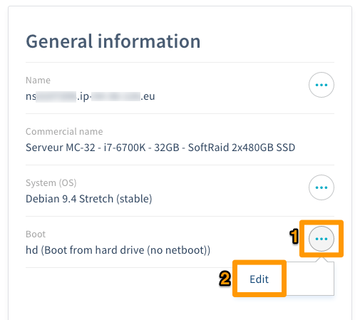
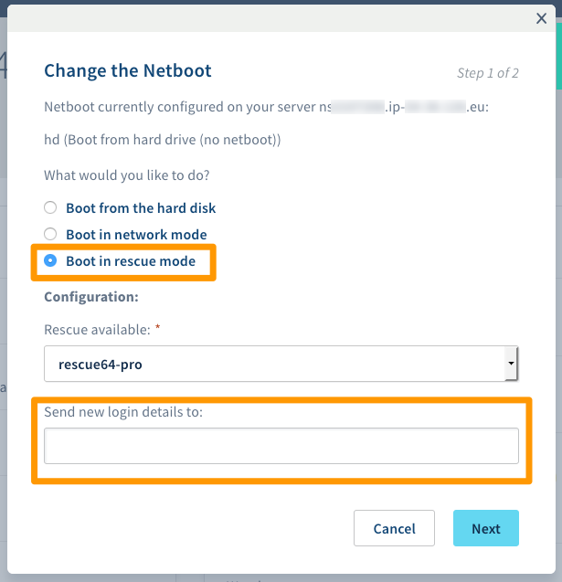
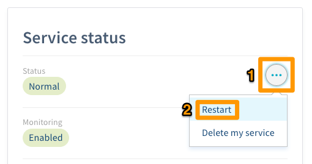
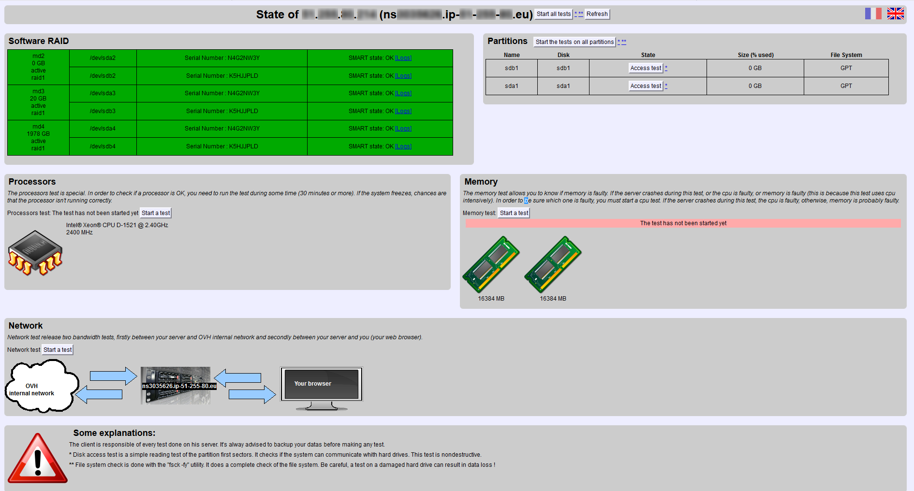
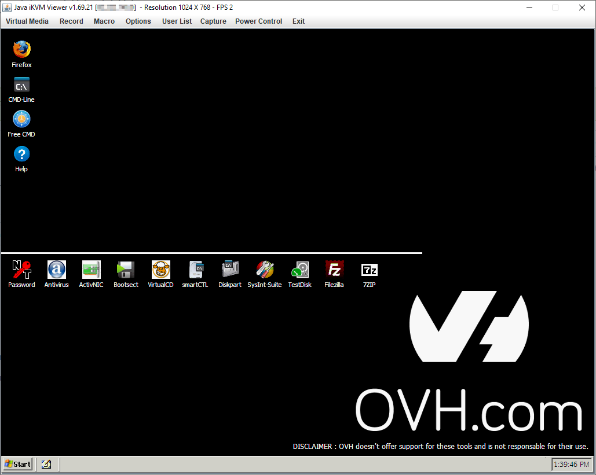

**Last updated 04 April 2019**

## Objective

Rescue mode is a tool on your Dedicated Server. You can use it to boot into a temporary operating system, in order to diagnose and resolve issues.

**This guide will show you how to activate and use your server's rescue mode.**

<iframe width="560" height="315" src="https://www.youtube.com/embed/UdMZSgXATFU" frameborder="0" allow="autoplay; encrypted-media" allowfullscreen></iframe>

## Requirements

- administrative (root) access to your [Dedicated Server](https://www.ovh.co.uk/dedicated_servers/){.external} via SSH


## Instructions

You can activate rescue mode by logging into the [OVH Control Panel](https://www.ovh.com/auth/?action=gotomanager/){.external}. Select your server by going to the `Dedicated`{.action} section, then `Dedicated Servers`{.action}. Then go to `Server status`{.action} > `General information`{.action} > `...`{.action} and click `Edit`{.action} to change the boot mode.

{.thumbnail}

On the next screen, select `Boot in rescue mode`{.action}. If your server has a Linux-based OS, select `rescue64-pro`{.action} from the dropdown list. If your server runs on Windows or FreeBSD, select `WinRescue`{.action} or `bsd-rescue-pro`{.action} respectively. Lastly, enter your email address in the text field, then click `Next`{.action}.

{.thumbnail}

Confirm your options on the next screen, then reboot your server to apply your changes. 

{.thumbnail}

Your server will now reboot in rescue mode, and you will receive the credentials for logging in via the email address you provided. To exit rescue mode, simply change the boot mode back to `Boot on the hard disk`{.action}, then reboot your server again.

### Linux

#### Use the web interface.

Once your server has rebooted, you will receive an email with your rescue mode access credentials. The email will also contain a link to the rescue mode web interface, which you can use to perform the following tests:

- <b>Hard disks.</b> Checks their integrity with SMART tests.
- <b>Processors.</b> Checks that they are functioning normally. (This test takes a while.)
- <b>Partitions (states).</b> Checks the states of readers.
- <b>Partitions (file systems).</b> Checks the server’s file system. 
- <b>Partitions (explore).</b> Launches a browser for exploring files. You cannot edit them with this tool, but you can back them up.
- <b>Memory.</b> Checks the RAM installed on the server. (This test takes a while.)
- <b>Network.</b> Checks the connection to an OVH-internal reference system as well as the connection to your browser.

{.thumbnail}

#### Use SSH (command line).


> [!primary]
> 
> If you are using an SSH key (also active in the OVH Control Panel), you will not be sent a password. Once the server is in rescue mode, you can connect directly via your SSH key.
>

Once your server has rebooted, you will receive an email with your rescue mode access credentials. You will then need to access your server via the usual command lines, using the root password for rescue mode rather than your own.

For example:

```sh
ssh root@your_server_IP
root@your_server_password:
```
> [!warning]
> 
> Your SSH-Client will likely block the connection due to a mismatch of the ECDSA fingerprint. This is normal because the rescue mode uses its own temporary ssh server.
>
> One way around this, is commenting the fingerprint of your regular system by adding a `#` in front of its line in the known_hosts file. And reverting that change when returning to normal boot.
>

For most changes you make to your server via SSH while in rescue mode, you will need to mount a partition. This mode has its own temporary file system, so any file system changes you make in rescue mode will be lost once you reboot the server back in normal mode.

You can mount partitions using the `mount` command in SSH. Firstly, you will need to list your partitions, so that you can retrieve the name of the partition you would like to mount. You can refer to the following code examples:

```sh
rescue:~# fdisk -l

Disk /dev/hda 40.0 GB, 40020664320 bytes
255 heads, 63 sectors/track, 4865 cylinders
Units = cylinders of 16065 * 512 = 8225280 bytes

Device Boot Start End Blocks Id System
/dev/hda1 * 1 1305 10482381 83 Linux
/dev/hda2 1306 4800 28073587+ 83 Linux
/dev/hda3 4801 4865 522112+ 82 Linux swap / Solaris

Disk /dev/sda 8254 MB, 8254390272 bytes
16 heads, 32 sectors/track, 31488 cylinders
Units = cylinders of 512 * 512 = 262144 bytes

Device Boot Start End Blocks Id System
/dev/sda1 1 31488 8060912 c W95 FAT32 (LBA)
```

Once you have found the name of the partition you want to mount, use the command below:

```sh
rescue:~# mount /dev/hda1 /mnt/
```

> [!primary]
>
> Your partition will now be mounted. You can then carry out operations on the file system.
> 
> If your server uses a softRAID configuration, you will need to mount your RAID volume (generally `/dev/mdX`).
>


### Windows

#### Access WinRescue.

Once your server has rebooted, you will receive an email with your rescue mode access credentials. To use them, you will need to download and install a VNC console, or use the `IPMI` module in the [OVH Control Panel](https://www.ovh.com/auth/?action=gotomanager/){.external}.

{.thumbnail}

#### WinRescue tool

|Tools|Description|
|---|---|
|Firefox|A web browser.|
|Freecommander|A file manager with all the standard features you would need.|
|NTPWEdit|An easy-to-use password manager. You can use it to reactivate or change the passwords of user accounts on your server. This tool is useful if you ever lose your credentials, or need to reactivate a security account.|
|Avast Virus Cleaner|An anti-virus application that scans and cleans files.|
|ActivNIC|A tool you can use to enable a disabled network interface card.|
|BootSect|A tool that allows to repair the bootsector.|
|Virtual Clone Drive|A tool you can use to mount BIN, CCD and ISO files in a virtual CD reader.|
|smartCTL|Self-Monitoring Analysis and Reporting Technology controll - A tool to to access self monitoring logs of the harddrives.|
|Diskpart|A tool to manipulate the partitions of the Server.|
|SysInternal|A software suite from Microsoft that includes several tools you can use to carry out network maintenance, and manage processes.|
|TestDisk|A powerful data recovery application. You can use it to recover and modify corrupted partitions, find lost partitions, repair a boot sector and even rebuild a defective MBR.|
|FileZilla|An open-source FTP client. It supports SSH and SSL protocols, and has a clear and intuitive drag-and-drop interface. You can use it to transfer your data to an FTP server, like the FTP backup service included with most OVH server models.|
|7-Zip|A utility for compressing and archiving files, which reads the following formats: ARJ, CAB, CHM, CPIO, CramFS, DEB, DMG, FAT, HFS, ISO, LZH, LZMA, MBR, MSI, NSIS, NTFS, RAR, RPM, SquashFS, UDF, VHD, WIM, XAR and Z. You can also use it to create your own archives in the following formats: BZIP2, GZIP, TAR, WIM, XZ, Z and ZIP.|
## Go further

Join our community of users on <https://community.ovh.com/en/>.
