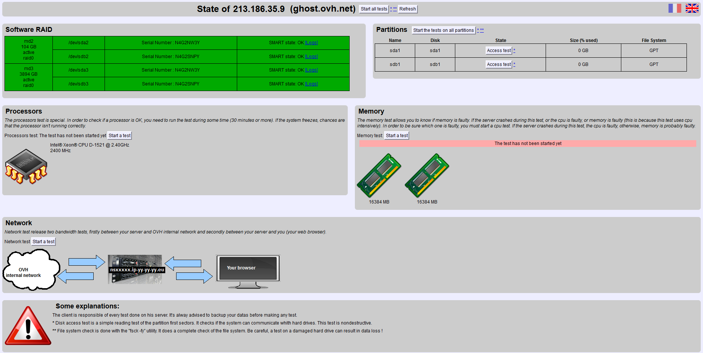

## Requirements
The advantage is that it is not necessary to contact support to schedule an intervention, because with rescue-mode you can run tests when it's best for you, and when it doesn't disturb the operations of your server.

Refers to the primary IP of your server.

### Software &amp; Administration
- launch a **fsck** / **e2fsck**
- consult and analyse **logs**
- **correct** problems on softs
- **rebuild** / **check** the RAID
- **backup** the data

### Hardware
- **memtest**: to check the memory ( RAM )
- **cpuburn**: to check your processor ( CPU )
- **fsck** to check the file system
- **state** to check the disk
- **explorer** for your files

If one of the tests fails or shows errors, just log into the Manager, go to the "Support" section and then submit an incident. Simply send the result of your test, for example: server crashed during the cpu test. We will immediately intervene to replace your hardware.

> [!warning]
>
> - You must not use the web interface and SSH at the same time.
> - You must not launch a disk check on the web interface and mount the partitions in ssh, this may cause the loss of your data!!
> 
> 

## Procedure

### Step 1 &#58; Activate Rescue Mode
[Log into your Manager](https://www.ovh.com/manager){.external}, **Cloud** section, then **Servers**, **Netboot** and select the **rescue-pro mode**.

If possible soft-reboot your machine (in SSH: sudo reboot -r now) and carry out a hard reboot only if you don't have any other choice.

You will then receive an email containing the link and the password that will enable you to access your server in "rescue" mode.

It may also occur that our technicians have already intervened on your server. If they do not diagnosis a hardware fault on the server, they will launch your server in "rescue" mode in order for you to proceed to the necessary verifications/corrections for its reinstallation.

### Step 2 &#58; Hardware Check
Once the server is in rescue mode you will receive an email containing a link and a password in order for you to connect and run hardware tests. Here is a overview of this interface:

{.thumbnail}

> [!primary]
>
> Check list
> - 
> Hard Drives: Enables you to see the disks installed
> - 
> Processors: Check the CPU. Here, it is possible that you won't get an error report, but that the server will reboot or freeze. It's a sign that there is a problem. You must contact us asap.
> - 
> Partitions State: Check the disk
> - 
> Partitions File System: Checks the file system. An inconsistency in the File System is often confused with a broken disk. Please note here, that usually you just need to reinstall the Operation system in order for everything to work again. Specially if the server detects files in the lost+found folder
> - 
> Partitions Explore: Enable you to explore the files. We can not edit via this tool, but we can save them for example. Very important: we can read logs of the machine without using ssh
> - 
> Memory: Check you RAM. Please note that a memtest takes a lot of CPU. If this test freeze or crash the machine, it's probably due to the fact that your CPU is broken or not well cooled. If the RAM is faulty you will get at the end of the test a report containing the errors
> 
> 

This interface cannot detect all problems.

For example irregular reboots etc. Do not hesitate to test it and to consult next the technical assistance that can help you to analyse the server.

> [!warning]
>
> You might get the following error at 64 % of the RAM test:
> your server hasn't reacted for a least 20 seconds
> You can click on ok, it is often due to the fact that the test, which execute around 64% is very long.
> It is most likely down, you can try to refresh the page.
> If the server crashed while doing a cpu test, it is possible that the cpu is faulty.
> 

## Rescue in SSH

### Step 1 &#58; Connecting
Connect to your machine using SSH as usual. The only thing that change is the password. You must use the temporary root pass that is sent to you by email after the rescue mode.

  <pre class="highlight command-prompt"> ssh root@SERVER_IP The authenticity of host 'SERVER_IP (SERVER_IP)' can't be established. RSA key fingerprint is 02:11:f2:db:ad:42:86:de:f3:10:9a:fa:41:2d:09:77. Are you sure you want to continue connecting (yes/no)? # <- yes Warning: Permanently added 'SERVER_IP' (RSA) to the list of known hosts. Password: rescue:~# </pre>

Now you are connected but your files are not accessible. You must "mount" the file system.

### Step 2 &#58; Mounting disk(s)
Usually, /dev/xda1 is your root partition (/) and /dev/xda2 corresponds to /home.

Devices are such as:

- /dev/sd for SCSI, SATA, Raid Hard
- /dev/hd for IDE disks
- /dev/md for RAID Soft
- /dev/rd/c0d0p for raid Mylex
- /dev/ad4s1 for Freebsd systems

You can also use devfs.

If you don't know which disk you have, or which is its partition table, use the commands: fdisk ou sfdisk. Here is an example with the commands and their output:

  <pre class="highlight command-prompt"> fdisk -l &nbsp; Disk /dev/hda 40.0 GB, 40020664320 bytes 255 heads, 63 sectors/track, 4865 cylinders Units = cylinders of 16065 * 512 = 8225280 bytes &nbsp; Device Boot Start End Blocks Id System /dev/hda1 * 1 1305 10482381 83 Linux /dev/hda2 1306 4800 28073587+ 83 Linux /dev/hda3 4801 4865 522112+ 82 Linux swap / Solaris &nbsp; Disk /dev/sda 8254 MB, 8254390272 bytes 16 heads, 32 sectors/track, 31488 cylinders Units = cylinders of 512 * 512 = 262144 bytes &nbsp; Device Boot Start End Blocks Id System /dev/sda1 1 31488 8060912 c W95 FAT32 (LBA) </pre>

Here the server is equipped with two devices.

The device /dev/hda is followed by a *. This means that it's the bootable disk. Next, we can see the usb key.

To mount / of the server, you just need to:

  <pre class="highlight command-prompt"> mount /dev/hda1 /mnt/ </pre>

The /home should be on /dev/hda2. We mount it after / with the command mount /dev/hda2 /mnt/home.

The /home is not necessarily on /dev/hda2 and it is possible that your data is in /var, with Plesk Panel for example. To be sure of the configuration you can mount / and next cat /mnt/etc/fstab.

This file contains the server partitions when it boots on its hard disk.

Here is an example:

  <pre class="highlight command-prompt"> cat /mnt/etc/fstab /dev/hda1 / ext3 errors=remount-ro 0 1 /dev/hda2 /var ext3 defaults,usrquota,grpquota 1 2 /dev/hda3 swap swap defaults 0 0 /dev/devpts /dev/pts devpts gid=5,mode=620 0 0 /dev/shm /dev/shm tmpfs defaults 0 0 /dev/proc /proc proc defaults 0 0 /dev/sys /sys sysfs defaults 0 0 </pre>

Therefor /dev/hda2 is /var and not /home.

You must then mount like so:

  <pre class="highlight command-prompt"> mount /dev/hda2 /mnt/var . </pre>

#### Mounting disk with an ESXi datastore
To mount an ESXi datastore, you have to use the vmfs-fuse tool.

  <pre class="highlight command-prompt"> vmfs-fuse /dev/sdX /mnt </pre>

### Step 3 &#58; Chroot
We can now edit files by using the path /mnt/var/.... for example or also /mnt/etc/lilo.conf, but to be able to do certain things you must be in root on the system that it is installed on the disk and that can not be done in the rescue-mode root.

For these operations you must use the command chroot:

  <pre class="highlight command-prompt"> chroot /mnt/ </pre>

We can see above that after chrooting the command response puts me in the / of the server. Now you can execute commands on your system.

### Step 4 &#58; Exiting Rescue Mode
After the modifications, we must go back to the manager in order to restore in Boot our usual Boot method.

[Log into your Manager](https://www.ovh.com/manager){.external}, **Cloud** section, then **Servers**, **Netboot** and select the **boot from disk**.

Once the right kernel is selected and validated, we carry out a soft reboot of the machine.

  <pre class="highlight command-prompt"> sudo reboot Broadcast message from root (pts/0) (Fri Jan 19 03:14:07 2038): The system is going down for reboot NOW! </pre>
