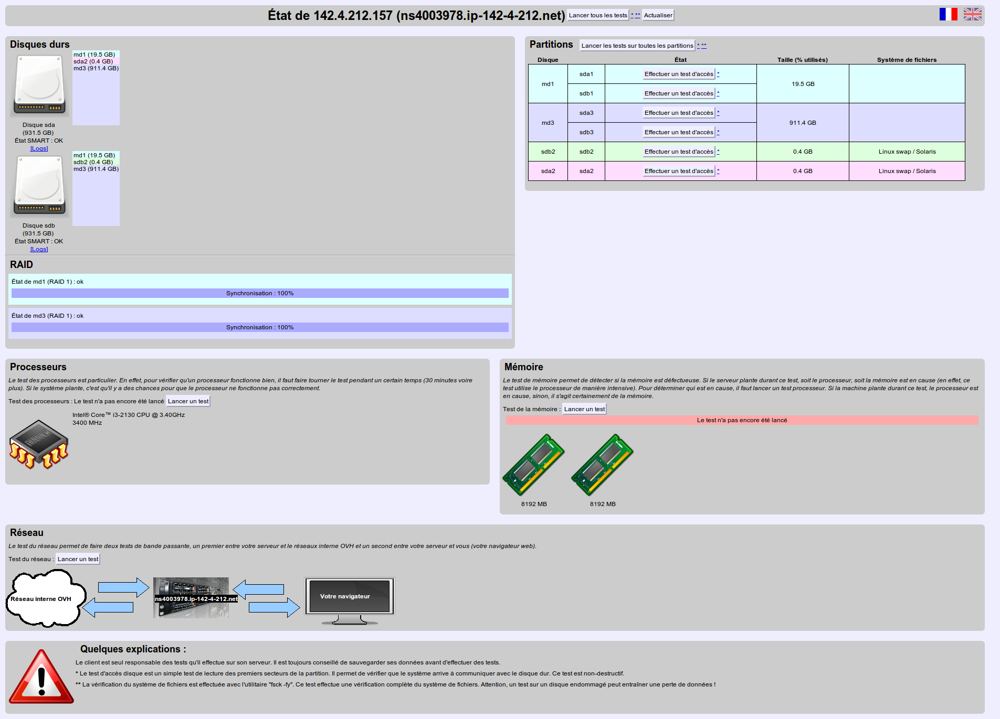
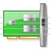
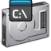

<iframe width="560" height="315" src="https://www.youtube.com/embed/UdMZSgXATFU?rel=0" frameborder="0" allow="autoplay; encrypted-media" allowfullscreen></iframe>

## 
Existem 2 modos de Rescue na OVH, o modo de Rescue Pro e o WinRescue (disponíveis no modo avançado no Manager na secção Netboot). O modo de Rescue Pro foi desenvolvido para os servidores Linux. Este modo permite ao administrador do servidor a manipulação do seu servidor via SSH, e permite igualmente que o administrador verifique o hardware do mesmo.

Deixamos alguns exemplos de operações que poderão ser realizadas através do modo de Rescue:

## Modo Rescue-pro Linux:

- Lançar um fsck / e2fsck
- Consultar e analisar logs
- Corrigir problemas com os softwares do servidor
- Reconstruir / verificar o RAID
- Efetuar um backup dos seus dados


## Interface check hardware:

- Memtest: para verificar a memória (RAM)
- Cpuburn: para verificar o seu processador (CPU)
- Fsck: para efetuar um 'check' ao sistema de ficheiros
- State: para verificar o disco
- Explorer: para navegar na sua árvore de ficheiros


## Modo Rescue WinPE:

- Gestão dos ficheiros: Explorador de ficheiros, Cliente FTP, Arquivos, etc
- Gestão das passwords: para alterar, remover passwords das contas dos utilizadores do Sistema Windows
- Ferramentas do servidor: Consola, Anti-vírus, Leitor virtual
- Browser Internet
- Gestão dos discos: Testdisk, Diskpart, Bootsect


Se um dos testes falhar ou demonstrar erros, é necessário aceder ao Espaço Cliente e efetuar a declaração de um Incidente. Deve, para tal, aceder ao Espaço Cliente -> Assistência -> Criar um pedido de assistência. Aquando da declaração de um pedido de assistência deve, na opção Escolha do Suporte, selecionar Declarar um Incidente.


## 1. Ativar o modo Rescue Pro
O modo Rescue-Pro é um Sistema operativo baseado em Linux (Debian) que é carregado no servidor a partir da rede. Este SO é totalmente independente do sistema instalado no servidor.

## Atenção:
Não deve utilizar a interface web e o acesso SSH ao mesmo tempo. Não deve lançar um "check" aos discos na interface web e montar as suas partições via SSH, essa ação poderá levar à total perda dos seus dados!!
Aceda ao Espaço Cliente e, depois de selecionar o seu servidor (secção Servidores Dedicados), deve aceder a Netboot e escolher a opção 'rescue-pro".

Note que alterar o Netboot para Rescue Pro não fará com que o servidor seja reiniciado automaticamente no sistema Rescue. É então necessário efetuar reiniciar o servidor, e poderá efetuá-lo de duas formas: via software ao estar ligado no seu servidor, ou via hardware, ao pedir o corte da alimentação elétrica do seu servidor a partir do Espaço Cliente.

Se for possível sugerimos que reinicie o servidor via software (via SSH: reboot). Caso não tenha outra opção (por não conseguir estabelecer o acesso via SSH ou por outro motivo), efetue um reboot hardware (Opção Reiniciar no seu Espaço Cliente).

## Atenção:
O Reboot Hardware apenas é recomendado se não tem efetivamente qualquer acesso ao servidor. O reboot hardware aporta riscos para os seus dados, ou seja, eles poderão ficar corrompidos. Lembramos que este reboot equivale a um reset elétrico.
Após efetuar um reboot, o administrador do servidor receberá por e-mail o link e a password que irá permitir o acesso ao seu servidor em modo de 'Rescue'.
Se recebeu um e-mail a indicar que o seu servidor está em modo de rescue e foi-lhe comunicada a password root temporária, significa que foi detetada uma falha no seu servidor e que o técnico do datacenter não teve outra escolha senão a de reiniciar o servidor em modo de rescue (problema de software, com o grup por exemplo).


## 2. Check Hardware
Pode consultar a interface que lhe será apresentada e que lhe dará acesso aos testes hardware do seu servidor:

{.thumbnail}
Esta interface gráfica fica disponível de imediato após o ter reiniciado o servidor no modo Rescue Pro e permite-lhe efetuar testes hardware do seu servidor. Será capaz de testar o CPU, a RAM, os discos e a rede.

A interface está disponível no seguinte link: http://ip.do.seu.servidor:81/ e os dados de acesso são os mesmos que recebe no e-mail.

## Lista das ferramentas de diagnóstico:

- Hard Drives: permite consultar os discos instalados no servidor e o seu estado de saúde (SMART)
- Processors: verifica o processador/sistema de arrefecimento. É possível que o relatório não seja apresentado e que o servidor reinicie ou bloqueie. Este reboot, ou bloqueio, significa que existe um problema com o processador, e se for esse o caso contacte de imediato o nosso serviço de incidentes (Declare um ticket no seu Espaço Cliente) para que seja marcada uma intervenção para se verificar o problema existente com o processador/sistema de arrefecimento.
- Partitions State: Efetua uma verificação dos discos
- Partitions File System: Efetua uma verificação do sistema de ficheiros. Inconsistências nos sistemas de ficheiros podem muitas vezes ser confundidas como um disco danificado. Neste caso basta reinstalar o SO para que tudo fique de novo em pleno funcionamento, particularmente quando os ficheiros estão localizados na pasta lost+found. Aviso: Efetue um backup dos seus dados antes de reinstalar o Sistema Operativo.
- Partitions Explore: Permite explorar os ficheiros. Não é possível editá-los através desta ferramenta mas poderá efetuar um backup dos mesmos, por exemplo. Importante: Poderá, com recurso a esta ferramenta, consultar os logs sem que tenha de estabelecer ligação via SSH. Lembramos apenas que alguns filesystems podem não ser compatíveis com esta ferramenta.
- Memory: verifica a RAM. Note que um memtest utiliza o CPU intensivamente. Se este teste levar a que o servidor bloqueie ou reinicie, é possível que o CPU esteja danificado ou existe um problema com o sistema de arrefecimento. Se a RAM estiver danificado os erros ser-lhe-ão apresentados no final do teste.


Esta interface pode não detetar todos os erros e falamos, por exemplo, de reboots intempestivos. Se os testes efetuados através desta interface não demonstram qualquer problema com o seu servidor mas pensa que um problema que está a ter está associado a uma falha no hardware do seu servidor, Declare um Incidente. A equipa de incidente poderá analisar a situação, e poderá até planear uma intervenção no datacenter para que um técnico analise o hardware do seu servidor.

## Atenção:
Podrá encontrar o seguinte erro aos 64% do teste à RAM:
"your server hasn't reacted for a least 20 seconds. it is probably down you can try to refresh the pageif the server crashed while doing a cpu test. it is possible that the cpu is faulty."
Pode clicar em "ok", este erro ocorre porque o teste executado aos 64% é muito longo.


## 3. Rescue via SSH

## a. Ligar-se
Deve ligar-se ao seu servidor via SSH como habitualmente.
A única coisa que muda aqui é a password. É necessário utilizar a password root temporária que é-lhe enviada quando coloca o servidor em modo de rescue e o reinicia.

```
angie@amazone:~$ ssh root@213.186.xx.yy
The authenticity of host '213.186.xx.yy (213.186.xx.yy)' can't be established.
RSA key fingerprint is 02:11:f2:db:ad:42:86:de:f3:10:9a:fa:41:2d:09:77.
Are you sure you want to continue connecting (yes/no)? yes
Warning: Permanently added '213.186.xx.yy' (RSA) to the list of known hosts.
Password:
rescue:~#
```


Está atualmente ligado ao servidor mas os seus ficheiros não estão disponíveis. É necessário 'montar' o sistema de ficheiros.

## b. Montagem dos discos
Habitualmente, /dev/xda1 é a sua partição raiz (/) e /dev/xda2 corresponde à sua /home.

## Os devices serão do tipo:

- /dev/sd para SCSI, SATA, Raid Hard
- /dev/hd para os discos IDE
- /dev/md para os RAID Soft
- /dev/rd/c0d0p para os raid Mylex
- /dev/ad4s1 para os sistemas Freebsd


Também pode utilizar as denominações devfs.
Se não sabe qual é o disco que tem, nem qual é a sua partição, os comandos fdisk ou parted. Deixamos um exemplo criado com o comando fdisk e o que o comando retorna:


```
rescue:~# fdisk -l

Disk /dev/hda 40.0 GB, 40020664320 bytes
255 heads, 63 sectors/track, 4865 cylinders
Units = cylinders of 16065 * 512 = 8225280 bytes

Device Boot Start End Blocks Id System
/dev/hda1 * 1 1305 10482381 83 Linux
/dev/hda2 1306 4800 28073587+ 83 Linux
/dev/hda3 4801 4865 522112+ 82 Linux swap / Solaris

Disk /dev/sda 8254 MB, 8254390272 bytes
16 heads, 32 sectors/track, 31488 cylinders
Units = cylinders of 512 * 512 = 262144 bytes

Device Boot Start End Blocks Id System
/dev/sda1 1 31488 8060912 c W95 FAT32 (LBA)
```


Este servidor está então equipado por dois 'devices': /dev/hda e /dev/sda. Existem 3 partições no hda: hda1, hda2, hda3, e 1 partição no sda: sda1.

Vemos então que o /dev/ha tem um asterisco (*), demonstrando que é o disco "bootable". Em segundo lugar vemos a Pen USB (/dev/sda).
Caso o disco rígido utilize uma tabela de partições do tipo GPT é necessário utilizar a ferramenta parted para poder ver as tabelas de particionamento dos discos.
Para montar a partição principal (/) do servidor basta efetuar o comando mount seguido da referência do disco (/dev/hda1) e da localização onde o sistema de ficheiros será montado (/mnt/):


```
rescue:~# mount /dev/hda1 /mnt/
```


Por norma a partição /home está no disco /dev/hda2. Vamos montá-la a seguir à / com o seguinte comando: "mount /dev/hda2 /mnt/home".

A /home não terá de estar forçosamente em /dev/hda2, poderá ter ainda dados em /var/ (para o Plesk por exemplo).
Para ter a certeza da configuração, poderá montar a partição / e efetuar de seguida o comando "cat /mnt/etc/fstab". Este ficheiro irá conter as partições do servidor quando ele faz o boot no seu disco rígido.

Vamos então passar a um exemplo:


```
rescue:# cat /mnt/etc/fstab
/dev/hda1 / ext3 errors=remount-ro 0 1
/dev/hda2 /var ext3 defaults,usrquota,grpquota 1 2
/dev/hda3 swap swap defaults 0 0
/dev/devpts /dev/pts devpts gid=5,mode=620 0 0
/dev/shm /dev/shm tmpfs defaults 0 0
/dev/proc /proc proc defaults 0 0
/dev/sys /sys sysfs defaults 0 0
```


Neste caso em concreto, a /dev/hda2 é a /var e não /home.
Devemos montá-la com: "mount /dev/hda2 /mnt/var".
Se o seu servidor está configurado com RAID Software, é necessário montar as partições /dev/md[x].

## c. Chroot
Podemos editar agora os ficheiros ao utilizar o caminho /mnt/var/[...], por exemplo, ou ainda /mnt/etc/lilo.conf. No entanto, para poderemos manipular o sistema, é necessário sermos root no sistema que se encontra instalado no disco e que não podem ser efetuadas com o root de rescue.
Para essas operações é necessário utilizar o seguinte comando chroot:


```
rescue:~# chroot /mnt/
rescue:/#
```


Vemos em cima que após efetuarmos o chroot, o comando posiciona-nos na / do servidor.
Podemos executar agora comandos no nosso sistema.


## 4. Sair do modo de Rescue
Para voltarmos a colocar o boot a partir dos discos rígidos do servidor, é necessário voltar ao Netboot no espaço Cliente e alterar para 'modo de disco rígido'. Após alterarmos o Netboot para "disco rígido" é agora necessário que reiniciemos o servidor. O reboot pode ser um reboot soft (comando a partir do servidor) ou reboot hardare (opção Reiniciar no Espaço Cliente).

Exemplo de um reboot soft:


```
rescue:~# reboot
Broadcast message from root (pts/0) (Tue Apr 12 15:56:17 2005):
The system is going down for reboot NOW!
```


## 1. Ativar o modo WinRescue
Aceda ao Espaço Cliente, e depois de selecionar no seu servidor (secção Servidores Dedicados), deve aceder a Netboot e escolher a opção "WinRescue" (Modo avançado).

Note que alterar o Netboot para WinRescue não fará com que o servidor seja reiniciado automaticamente no sistema Rescue. É então necessário efetuar reiniciar o servidor, e poderá efetuá-lo de duas formas, via software ao estar ligado no seu servidor, ou via hardware, ao pedir o corte da alimentação elétrica do seu servidor a partir do Espaço Cliente.

Se for possível sugerimos que reinicie o servidor via software (Modo Reboot + Reiniciar ou via SSH: "shutdown /r /t 0"). Caso não tenha outra opção (por não conseguir estabelecer o acesso via SSH ou por outro motivo), efetue um reboot hardware (Opção Reboot no seu Espaço Cliente).

## Atenção:
O Reboot Hardware apenas é recomendado se não tem efetivamente qualquer acesso ao servidor. O reboot hardware aporta riscos para os seus dados, ou seja, eles poderão ficar corrompidos. Lembramos que este reboot equivale a um reset elétrico.
Após efetuar um reboot, o administrador do servidor receberá por e-mail o link e a password que irá permitir o acesso ao seu servidor em modo de 'Rescue'.
Se recebeu um e-mail a indicar que o seu servidor está em modo de rescue e foi-lhe comunicada a password root temporária, significa que foi detetada uma falha no seu servidor e que o técnico do datacenter não teve outra escolha senão a de reiniciar o servidor em modo de rescue (problema de software, com o grup por exemplo).


## 2. As ferramentas
Descubra as principais ferramentas disponíveis em WinPe

a. Explorador de ficheiros

{.thumbnail}
Freecommander é um gestor de ficheiros com numerosas funcionalidades que permitem diversas ações nos seus dados.
Permite igualmente a exploração dos ficheiros presentes nos periféricos de armazenamento ligados no servidor.
Gestão dos dados: Copiar/Colar/cortar, Comprimir/Descomprimir, Renomear, Mover..etc

b. Gestor de password

{.thumbnail}
NTPWedit é um gestor de passwords fácil de utilizar.
Ele permite a reativação de uma conta e/ou de alterar a sua password.
Esta ferramenta é deveras útil caso perca os seus dados de acesso ou pretenda reativar uma conta de segurança.

c. Cliente FTP

{.thumbnail}
Filezilla client, é um cliente FTP livre e de simples utilização.
Ele suporta os protocolos SSH e SSL, copiar/arrastar e beneficia de uma interface clara e de simples utilização.
Ele permite a transferência dos seus dados para um servidor FTP, tal como o Espaço Backup Storage que está incluído na maioria dos modelos de servidores OVH.

d. Gestor de arquivos

{.thumbnail}
7-ZIP é uma ferramenta de arquivo gratuito potente e de simples utilização.
Ele permite consultar arquivos com os seguintes formatos: ARJ, CAB, CHM, CPIO, CramFS, DEB, DMG, FAT, HFS, ISO, LZH, LZMA, MBR, MSI, NSIS, NTFS, RAR, RPM, SquashFS, UDF, VHD, WIM, XAR e Z.
Poderá ainda, graças ao 7-sip, criar os seus próprios arquivos nos seguintes formatos: 7z, XZ, BZIP2, GZIP, TAR, ZIP et WIM.

e. Anti-vírus de segurança

{.thumbnail}
O Avast Virus Cleaner tool permite efetuar um scan rápido dos seus discos locais em caso de infeção.

f. Ferramentas de servidor

{.thumbnail}
O ActivNIC permite a reativação de uma placa de rede que poderá ter sido desativada no servidor.

{.thumbnail}
A SRVFirewall é um script que tenta Ativar ou Desativar a Firewall no seu servidor.

g. Ferramentas system microsoft

{.thumbnail}
SysInternals Tools é um software Microsoft composta por diversas ferramentas para a rede, gestão de processos e ainda outras funcionalidades.

{.thumbnail}
Interface que permite a execeção de comandos numa linha de comandos.

h. Leitor virtual

{.thumbnail}
O Virtual Clone Drive permite montar os seus ficheiros ISO, BIN, CCD num leitor virtual.

i. Browser internet

{.thumbnail}
Browser web (Firefox).

j. Utilitário de disco

{.thumbnail}
Testdisk é uma ferramenta de recuperação de dados desenvolvido por Christophe Grenier.
Ela permite recuperar ou modificar uma tabela de partições corrompidos, de encontrar uma partição que desapareceu, de reparar um setor de boot ou reconstruir um MBR defeituoso.

{.thumbnail}
Diskpart é uma ferramenta da Microsoft via linha de comandos que permite criar, modificar, gerir as partições de um ou vários discos.
Poderá ainda estender ou reduzir uma partição, montar a letra atribuída a umv olume, de limpar integralmente um disco ... etc.
Permite ainda a implementação ou a desativação de um Raid Software em vários discos.

{.thumbnail}
Bootsec é uma ferramenta extraída da consola de recuperação Windows.
Ela permite reparar um setor de boot defeituoso no seu sistema de partições.


## 
Vimos neste guia 2 formas de reiniciar o seu servidor em modo de Rescue.

