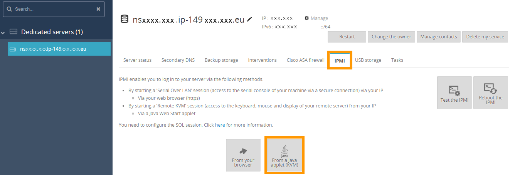
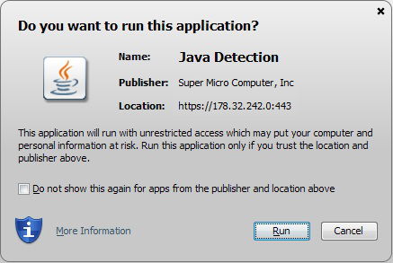
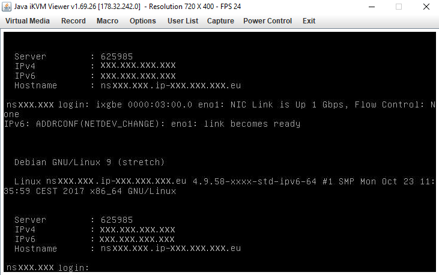
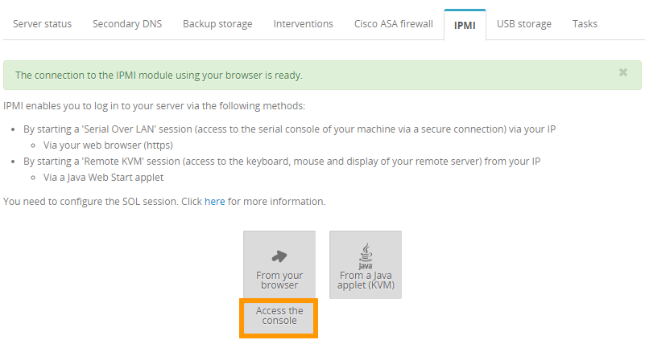
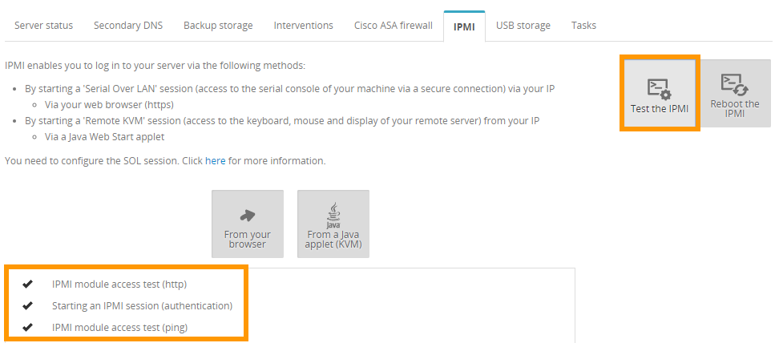
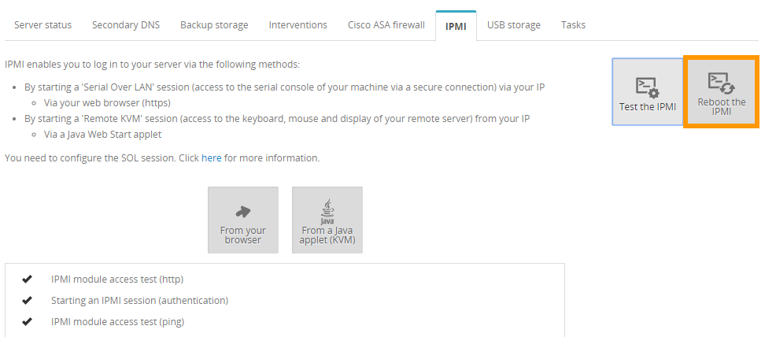

**Last updated 16th August 2018**

## Objective

With the IPMI (Intelligent Platform Management Interface) console, you can access your Dedicated Server directly, without needing to use any external software (e.g. a terminal or PuTTY). This guide will explain how to boot this console.

Please note that you may also see the term KVM (Keyboard Video and Mouse) used for this solution, particularly for VPS products.

## Requirements

- access to the [OVH Control Panel](https://www.ovh.com/auth/?action=gotomanager)

## Instructions

You can access the IPMI using two different methods: the Java applet (recommended) or the browser (Serial over LAN).

__Java applet__: Allows you to use a KVM (keyboard, video, mouse) tool through a Java console to perform the actions you want, with both options: keyboard and mouse.

__SoL (Serial over LAN)__: Allows you to have remote access to the sever console through a web browser.

### Access via the Java applet.

You will need to ensure that Java is installed on your desktop for the Java applet to work. If you do not have Java installed, go to the [official page](https://www.java.com/en/download/){.external} to do so.

In the `IPMI`{.action} section of the OVH Control Panel, click on `From a Java applet (KVM)`{.action}:

{.thumbnail}

Download the file `kvm.jnlp` when you are prompted to do so, and run it:

{.thumbnail}

You will then land on the login page, where you will be prompted to enter your `root` credentials, as you would need to when logging in via a terminal or external software application:

{.thumbnail}

You can now manage your server.

### Access via your browser, using Serial over LAN (SoL).

Although we would recommend that you log in via the Java applet, you can also access the IPMI using Serial over LAN. To do so, click on `From your browser`{.action} in the `IPMI`{.action} section of the OVH Control Panel:

{.thumbnail}

> [!warning]
>
> It may take several minutes to access the IPMI using SoL, which is why we would recommend using the applet instead.
>

### Test and reboot the IPMI.

Your IPMI may stop responding. If you cannot access it, you can test it first by clicking on `Test the IPMI`{.action}, and checking the result of the diagnostic:

{.thumbnail}

If everything appears to be normal, as per our example, you may be experiencing a local technical issue (internet connection, local desktop). If the IPMI encounters any issues, you can reboot it by clicking `Reboot the IPMI`{.action}.

{.thumbnail}

It will take several minutes for the IPMI to reboot.

> [!Primary]
>
> It will not impact to the server functioning.
>

## Go further

Join our community of users on <https://community.ovh.com/en/>.
