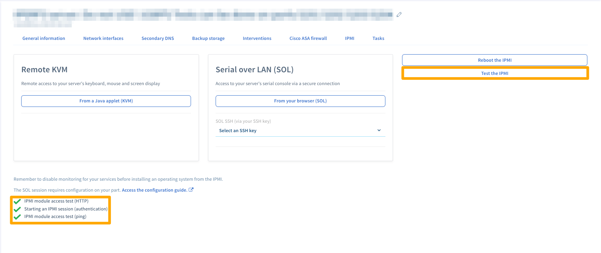
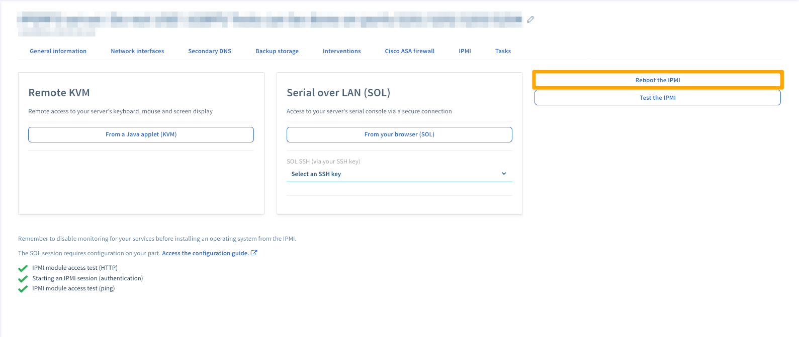

**Última actualización: 24/08/2018**

## Objetivo

La consola IPMI (Intelligent Platform Management Interface) permite establecer una conexión directa con un servidor dedicado sin necesidad de utilizar software externo (terminal o Putty, por ejemplo). Esta guía explica cómo iniciar dicha consola.

En otros documentos puede encontrar el término KVM, del inglés *keyboard, video and mouse* (teclado, vídeo y ratón), que se utiliza sobre todo en el caso de los VPS.

## Requisitos

- Estar conectado al [área de cliente de OVHcloud](https://ca.ovh.com/auth/?action=gotomanager), en la sección `Dedicado`{.action} > `Servidores dedicados`{.action}.

## Procedimiento

Es posible conectarse al IPMI de dos formas: con el applet Java (recomendado) o desde el navegador (Serial Over LAN).

### Conectarse con el applet Java

Para que el applet funcione, debe tener Java instalado en su ordenador. Si todavía no lo ha instalado, visite [la web oficial](https://www.java.com/es/download/){.external}.

Abra la pestaña `IPMI`{.action} del área de cliente y haga clic en el el botón `Desde un applet Java (KVM)`{.action}.

{.thumbnail}

Descargue el archivo **kvm.jnlp** y ejecútelo.

{.thumbnail}

A continuación, se abrirá la página de inicio de sesión, donde deberá introducir sus claves de acceso *root*, como cuando se conecta a un terminal o un programa externo.

{.thumbnail}

Ya puede administrar su servidor con normalidad.

### Conectarse desde el navegador con Serial Over LAN (SoL)

Aunque le recomendamos utilizar la conexión a través del applet Java, también es posible usar IPMI mediante Serial Over LAN. Para ello, abra la pestaña `IPMI`{.action} y haga clic en el botón `Desde el navegador (SoL)`{.action}.

{.thumbnail}

> [!warning]
>
> La conexión a través de SoL puede tardar varios minutos. Por eso es más recomendable utilizar el applet.
>

### Probar y reiniciar IPMI

Es posible que IPMI deje de responder. Si no puede acceder, realice una prueba haciendo clic en el botón `Probar IPMI`{.action} y consulte el resultado del diagnóstico.

{.thumbnail}

Si todo funciona correctamente, como en el ejemplo, es probable que se trate de un problema local (conexión a internet, equipo informático local...). Si, por el contrario, existe un problema relacionado con IPMI, puede reiniciarlo haciendo clic en `Reiniciar IPMI`{.action}.

{.thumbnail}

El reinicio puede tardar varios minutos.

## Más información

Interactúe con nuestra comunidad de usuarios en [https://community.ovh.com](https://community.ovh.com/){.external}.
