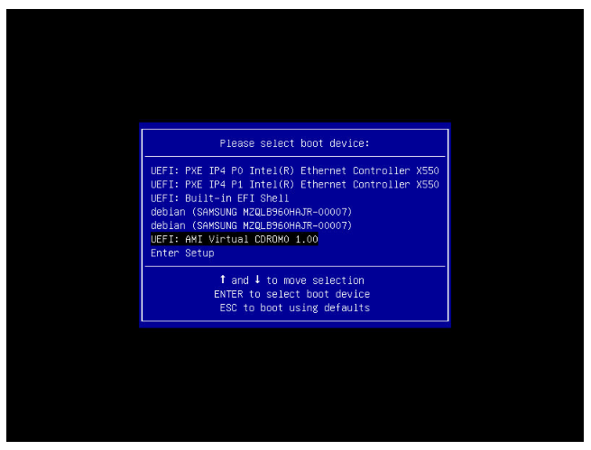

> [!primary]
> Tłumaczenie zostało wygenerowane automatycznie przez system naszego partnera SYSTRAN. W niektórych przypadkach mogą wystąpić nieprecyzyjne sformułowania, na przykład w tłumaczeniu nazw przycisków lub szczegółów technicznych. W przypadku jakichkolwiek wątpliwości zalecamy zapoznanie się z angielską/francuską wersją przewodnika. Jeśli chcesz przyczynić się do ulepszenia tłumaczenia, kliknij przycisk “Zaproponuj zmianę” na tej stronie.
> 

**Ostatnia aktualizacja z dnia 30-08-2022**

## Wprowadzenie

Konsola IPMI (Intelligent Platform Management Interface) pozwala na nawiązanie bezpośredniego połączenia z Twoim serwerem dedykowanym bez korzystania z zewnętrznego oprogramowania (na przykład z terminala lub PuTTY). Niniejszy przewodnik wyjaśnia, jak uruchomić tę konsolę.

Uwaga: napotkasz również termin KVM (Keyboard Video and Mouse), który jest używany przy serwerach VPS dla tego rozwiązania.

## Wymagania początkowe

- Dostęp do [Panelu klienta OVHcloud](https://www.ovh.com/auth/?action=gotomanager&from=https://www.ovh.pl/&ovhSubsidiary=pl).

> [!warning]
> Funkcja ta może być niedostępna lub ograniczona na [serwerach dedykowanych **Eco**](https://eco.ovhcloud.com/pl/about/).
>
> Aby uzyskać więcej informacji, zapoznaj się z naszym [porównaniem](https://eco.ovhcloud.com/pl/compare/).

## W praktyce

Połączenie z IPMI można wykonać głównie za pomocą kilku metod: apletu Java (zalecane) lub przeglądarki (Serial over LAN).

- **Applet Java** : pozwala na korzystanie z narzędzia KVM (klawiatura, wideo, mysz) przez konsolę Java do wykonywania żądanych operacji. Istnieją dwie opcje, mianowicie klawiatura i mysz.

- **Przeglądarka (Serial over LAN)** : pozwala na zdalny dostęp do konsoli serwera za pomocą przeglądarki internetowej.

- Trzecia metoda, dostępna tylko dla najnowszych serwerów, pozwala na korzystanie z narzędzia KVM przy użyciu przeglądarki internetowej.

Aby aktywować jedną z tych metod, zaloguj się do [Panelu klienta OVHcloud](https://www.ovh.com/auth/?action=gotomanager&from=https://www.ovh.pl/&ovhSubsidiary=pl). W części `Bare Metal Cloud`{.action} kliknij `Serwery dedykowane`{.action} i wybierz serwer, a następnie kliknij zakładkę `IPMI`{.action}.

### Logowanie za pomocą apletu Java 

Aby aplet Java działał, na komputerze musi być zainstalowana Java. Jeśli jeszcze tego nie zrobiłeś, przejdź do [oficjalnej strony](https://www.java.com/en/download/){.external}.

W części `IPMI`{.action} w Panelu klienta OVHcloud kliknij `Z poziomu apletu java (KVM)`{.action}:

{.thumbnail}

Pobierz plik `kvm.jnlp`, gdy zostaniesz zaproszony, a następnie uruchom go:

{.thumbnail}

Następnie przejdź do strony logowania. Wprowadź dane dostępowe `root`, tak jak przy logowaniu przy użyciu terminala lub programu zewnętrznego:

{.thumbnail}

Możesz teraz zarządzać serwerem.

### Korzystanie z KVM przez przeglądarkę internetową (tylko dla najnowszych serwerów) 

W części `IPMI`{.action} w Panelu klienta OVHcloud kliknij `Z poziomu przeglądarki (KVM)`{.action}:

{.thumbnail}

Aktywacja zajmie kilka sekund. Pojawi się komunikat o dostępności połączenia przez IPMI.

{.thumbnail}

Kliknij `Dostęp do konsoli (KVM)`{.action}, aby otworzyć konsolę w przeglądarce.

{.thumbnail}

### Logowanie za pomocą przeglądarki z funkcją Serial over LAN (SoL)

Nawet jeśli zalecamy zalogowanie się przez aplet Java, możesz również użyć IPMI w Serial over LAN (SoL). W tym celu kliknij `Z poziomu przeglądarki (SoL)`{.action} w części `IPMI`{.action} w Panelu klienta.

{.thumbnail}

> [!warning]
>
> Połączenie przez SoL może potrwać kilka minut. Dlatego zalecane jest użycie apletu Java.
>

### Testowanie i restartowanie IPMI

Możliwe, że IPMI nie odpowiada. Jeśli nie możesz uzyskać do niego dostępu, możesz najpierw wykonać test, klikając `Przetestuj IPMI`{.action} i wyświetlić wynik diagnostyki:

{.thumbnail}

Jeśli wszystko jest normalne, jak w naszym przykładzie, prawdopodobnie masz do czynienia z lokalnym problemem (połączenie z Internetem, poczta lokalna). Jeśli wystąpił problem z IPMI, możesz uruchomić go ponownie klikając `Zrestartuj IPMI`{.action}.

{.thumbnail}

Ponowne uruchomienie IPMI zajmuje kilka minut.

> [!primary]
> Operacja ta nie ma wpływu na działanie serwera.
>

### Instalacja systemu operacyjnego za pomocą IPMI v1

> [!warning]
> OVHcloud nie gwarantuje funkcjonalności systemów operacyjnych zainstalowanych za pomocą IPMI. Metoda ta powinna być rozważana tylko przez doświadczonego administratora serwerów.

Aby rozpocząć, otwórz [IPMI z poziomu apletu Java](./#applet-java) w [Panelu klienta OVHcloud](https://www.ovh.com/auth/?action=gotomanager&from=https://www.ovh.pl/&ovhSubsidiary=pl). Następnie kliknij `Device`{.action} na pasku menu i wybierz `Redirect ISO`{.action} z rozwijanego menu.

{.thumbnail}

Następnie wybierz ISO, której chcesz użyć w systemie plików Twojego lokalnego komputera. Po wybraniu ISO naciśnij przycisk `Ctrl Alt Del`{.action} w prawym górnym rogu ekranu, aby uruchomić serwer. Wciśnij przycisk `F`, aby uzyskać dostęp do opcji startowych.

> [!primary]
> Być może będziesz musiał użyć klawiatury oprogramowania do zapisywania wpisów w IPMI. Aby się zalogować, kliknij opcję `Keyboard`{.action} na pasku menu na górze okna. Następnie wybierz `Soft Keyboard` z rozwijanego menu i kliknij `Show`{.action}.
>

Wybierz opcję `UEFI Virtual CDROM 1.000` w menu startowym (Boot), aby uruchomić serwer z wcześniej podłączonego ISO.

{.thumbnail}

Postępuj zgodnie z instrukcjami potrzebnymi do zainstalowania systemu operacyjnego. Pamiętaj, aby usunąć ISO z opcji Redirect ISO.

### Instalacja systemu operacyjnego za pomocą IPMI v1

> [!warning]
> OVHcloud nie gwarantuje funkcjonalności systemów operacyjnych zainstalowanych za pomocą IPMI. Metoda ta powinna być rozważana tylko przez doświadczonego administratora serwerów.
>

Aby rozpocząć, otwórz [IPMI z poziomu apletu Java](./#applet-java) w [Panelu klienta OVHcloud](https://www.ovh.com/auth/?action=gotomanager&from=https://www.ovh.pl/&ovhSubsidiary=pl). Kliknij `Virtual Media`{.action}, a następnie `Virtual Storage`{.action}.

{.thumbnail}

W oknie, które się wyświetla wybierz `ISO File` z rozwijanej listy "Logical Drive Type". Następnie kliknij `Open Image`{.action} i przejdź do pliku ISO. Na koniec kliknij `Plug-in`{.action} i `OK`{.action}.

{.thumbnail}

Aby rozpocząć korzystanie z pliku ISO, należy uzyskać dostęp do BIOS i zmienić opcje uruchamiania. W tym celu kliknij `Power Control`{.action}, a następnie `Set Power Reset`{.action}.

{.thumbnail}

> [!primary]
> Być może będziesz musiał użyć klawiatury oprogramowania do zapisywania wpisów w IPMI. Aby się zalogować, kliknij opcję `Virtual Media`{.action} na pasku menu na górze okna. Wybierz następnie `Virtual Keyboard`{.action} z rozwijanego menu.
>

Podczas procesu uruchamiania, naciśnij przycisk `DEDIP`, gdy zostaniesz poproszony o dostęp do BIOSu. Możesz również nacisnąć przycisk `F1` i uzyskać dostęp do BIOS, wybierając opcję `Enter Setup`{.action}.

{.thumbnail}

W BIOS przejdź do karty `Boot`{.action} i zastąp `UEFI Boot Order #1` > `UEFI USB CD/DVD:UEFI: CDROM virtual ATEN YSOJ`.

{.thumbnail}

Na koniec, naciśnij klawisz `F4`, aby zapisać zmiany i zrestartować serwer.

### Zainstaluj system operacyjny korzystając z przeglądarki KVM (tylko dla najnowszych serwerów)

> [!warning]
> OVHcloud nie gwarantuje funkcjonalności systemów operacyjnych zainstalowanych za pomocą IPMI. Metoda ta powinna być rozważana tylko przez doświadczonego administratora serwerów.
>

W [Panelu client OVHcloud](https://www.ovh.com/auth/?action=gotomanager&from=https://www.ovh.pl/&ovhSubsidiary=pl) otwórz [konsolę KVM](#kvm-browser).

Tutaj masz dostęp do tych samych informacji i funkcji, co w modułach IPMI opartych na Java.

> [!primary]
>
> Upewnij się, że kolejne kroki są realizowane w dobrym tempie. Proces może zostać anulowany, jeśli między działaniami występują dłuższe przerwy.
>

Kliknij przycisk `Browse File`{.action} i wybierz Twój plik obrazu.

{.thumbnail}

Kliknij `Start Media`{.action}. Przygotuje to ISO dla procesu instalacji.

{.thumbnail}

Rozmiar wyświetlanego pliku nie jest rzeczywistym rozmiarem. To normalne, ponieważ plik nie jest do końca wysyłany na ten etap.

{.thumbnail}

Kliknij `Power`{.action} i wybierz `Reset Server`{.action} (zresetuj serwer) z rozwijanego menu.

{.thumbnail}

Poczekaj, aż pojawi się ekran wyboru boot i naciśnij odpowiedni przycisk, aby przejść do menu Boot (`F11` w tym przykładzie).

{.thumbnail}

W menu boot wybierz czytnik optyczny (`UEFI: AMI Virtual CDROM0` w tym przykładzie) i naciśnij `Enter`.

{.thumbnail}

Plik ISO zostanie teraz przesłany, a następnie serwer zostanie uruchomiony z pliku.

{.thumbnail}

## Sprawdź również

Dołącz do społeczności naszych użytkowników na stronie <https://community.ovh.com/en/>.
