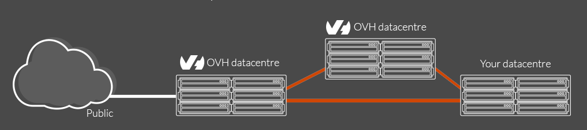

**Compatible :** INFRASTRUCTURE | STOCKAGE | SUR MESURE

{.thumbnail}

## Le vRack

Le vRack est une technologie qui permet de créer un réseau privé (vLAN) entre différents serveurs pour :

-   les connecter ;
-   les isoler ;
-   les répartir.

Il donne la possibilité de construire des réseaux inter-datacentres (Roubaix- Gravelines - Strasbourg - Beauharnois)

## Fonctionnement du vRack 

Le réseau privé utilise des IP non routables.

Il est recommandé d'utiliser les plages suivantes :

-   172.16.0.0/12 ;
-   192.168.0.0/16 ;
-   10.0.0.0/8.

Elles doivent être uniques dans le vlan et ne sont pas annoncées sur les routeurs, à l'inverse des IPs publiques qui sont uniques dans le monde.

Le vRAck 2.0 permet de construire une infrastructure avec 4000 vLANs