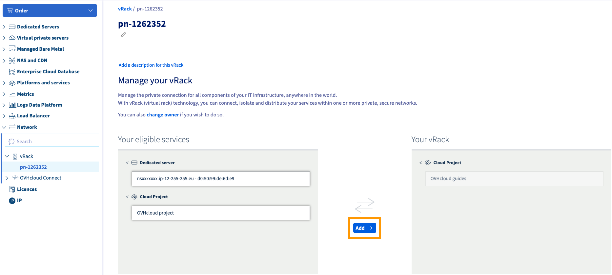

**Última actualización: 29/05/2018**

## Objetivo

La tecnología vRack (rack virtual) permite agrupar virtualmente varios servidores, independientemente de su número y su ubicación física en nuestros datacenters, y conectarlos a un switch virtual dentro de una misma red privada. De esa forma, los servidores pueden comunicarse entre sí de forma privada y segura a través de una VLAN dedicada.

**Esta guía explica cómo configurar varios servidores dedicados en el vRack.**

<iframe width="560" height="315" src="https://www.youtube.com/embed/ZA7IsbDdAmc?rel=0" frameborder="0" allow="autoplay; encrypted-media" allowfullscreen></iframe>

## Requisitos

- Tener un [vRack](https://www.ovh.es/soluciones/vrack/){.external}.
- Disponer de al menos dos [servidores compatibles con el vRack](https://www.ovh.es/servidores_dedicados/){.external}.
- Estar conectado por SSH (o a través de una interfaz gráfica) al servidor Linux (con acceso *root*).
- Tener acceso al [área de cliente](https://www.ovh.com/auth/?action=gotomanager){.external}.
- Tener un rango de direcciones IP privadas.


## Procedimiento

### Añadir los servidores al vRack

1. Una vez que haya añadido el vRack a su cuenta, acceda a la sección `Cloud`{.action} del [área de cliente de OVH](https://www.ovh.com/auth/?action=gotomanager){.external}.
2. En la columna izquierda, haga clic en `vRack`{.action} y seleccione el vRack.
4. En la lista de servicios compatibles, seleccione los servidores que quiera añadir al vRack y haga clic en el botón `Añadir`{.action}.

{.thumbnail}

### Configurar las interfaces de red

En este ejemplo, vamos a utilizar el rango de direcciones IP internas **192.168.0.0/16**.

También usaremos los nombres **eth1** y **eno4** para la interfaz de red secundaria. Sus servidores pueden utilizar una nomenclatura diferente. Puede comprobarlo utilizando los comandos que indicamos a continuación.

Para mostrar las interfaces de red, utilice el siguiente comando:

```
ifconfig -a | grep eth | awk '{print $ 1}'
```

La primera interfaz de la lista hace referencia a su conexión de red principal. Para comprobar que esté activa, utilice los siguientes comandos:

```
ifconfig eth1 up
```

```
ethtool eth1 | grep "Link detected"
```

Si este último comando le devuelve el mensaje **Link detected: no**, se trata de la interfaz de red que deberá utilizar para configurar el vRack. Ejecute entonces este comando:

```
ifconfig eth1 down
```

#### CentOS 6 y 7

Abra el archivo de configuración de la interfaz de red con el siguiente comando:

```
vi /etc/sysconfig/network-scripts/ifcfg-eth1
```

Pulse la tecla `I` del teclado para pasar al modo de inserción.

Configure la interfaz de red secundaria como se indica a continuación:

```
DEVICE=eth1
BOOTPROTO=static
IPADDR=192.168.0.1
NETMASK=255.255.0.0
ONBOOT=yes
TYPE=Ethernet
```

En el ejemplo anterior, puede utilizar cualquier rango de IP privadas y cualquier dirección IP incluida dentro de ese rango.

1. Pulse la tecla `Esc`.
2. Pulse las teclas `Shift + :` para abrir el editor.
3. Introduzca **wq**.
4. Pulse la tecla `Entrar`.
5. Reinicie el servidor.
6. Repita estos pasos en los demás servidores y asígneles una dirección IP única que pertenezca a su rango interno. 
 
Una vez realizadas estas acciones, los servidores podrán comunicarse entre sí en la red privada.


#### Debian 7 y 8

Abra el archivo de configuración de la interfaz de red con el siguiente comando:

```
nano /etc/network/interfaces
```

Configure la interfaz de red secundaria como se indica a continuación:

```
auto eth1
iface eth1 inet static
address 192.168.0.1
netmask 255.255.0.0
```

En el ejemplo anterior, puede utilizar cualquier rango de IP privadas y cualquier dirección IP incluida dentro de ese rango.


1. Pulse las teclas `CTRL + X` para salir del archivo de configuración de red.
2. Pulse la tecla `Y` para guardar los cambios y, a continuación, pulse `Entrar`.
3. Reinicie el servidor.
4. Repita estos pasos en los demás servidores y asígneles una dirección IP única que pertenezca a su rango interno. 

Una vez realizadas estas acciones, los servidores podrán comunicarse entre sí en la red privada.


#### Debian 9

Abra el archivo de configuración de la interfaz de red con el siguiente comando:

```
nano /etc/network/interfaces
```

Configure la interfaz de red secundaria como se indica a continuación:

```
auto eno4
iface eno4 inet static
address 192.168.0.1
netmask 255.255.0.0
```

En el ejemplo anterior, puede utilizar cualquier rango de IP privadas y cualquier dirección IP incluida dentro de ese rango.

1. Pulse las teclas `CTRL + X` para salir del archivo de configuración de red.
2. Pulse la tecla `Y` para guardar los cambios y, a continuación, pulse `Entrar`.
3. Reinicie el servidor.
4. Repita estos pasos en los demás servidores y asígneles una dirección IP única que pertenezca a su rango interno.

Una vez realizadas estas acciones, los servidores podrán comunicarse entre sí en la red privada.


#### Ubuntu Server 16

Abra el archivo de configuración de la interfaz de red con el siguiente comando:

```
vi /etc/network/interfaces
```

Pulse la tecla `I` del teclado para pasar al modo de inserción.

Configure la interfaz de red secundaria como se indica a continuación:

```
auto eth1
iface eth1 inet static
address 192.168.0.1
netmask 255.255.0.0
```

En el ejemplo anterior, puede utilizar cualquier rango de IP privadas y cualquier dirección IP incluida dentro de ese rango.

1. Pulse la tecla `Esc`.
2. Pulse las teclas `Shift + :` para abrir el editor.
3. Introduzca **wq**.
4. Pulse la tecla `Entrar`.
5. Reinicie el servidor.
6. Repita estos pasos en los demás servidores y asígneles una dirección IP única que pertenezca a su rango interno.

Una vez realizadas estas acciones, los servidores podrán comunicarse entre sí en la red privada.


#### Ubuntu Server 17

Abra el archivo de configuración de la interfaz de red con el siguiente comando:

```
nano /etc/network/interfaces
```

Configure la interfaz de red secundaria como se indica a continuación:

```
auto eno4
iface eno4 inet static
address 192.168.0.1
netmask 255.255.0.0
```

En el ejemplo anterior, puede utilizar cualquier rango de IP privadas y cualquier dirección IP incluida dentro de ese rango.

1. Pulse las teclas `CTRL + X` para salir del archivo de configuración de red.
2. Pulse la tecla `Y` para guardar los cambios y, a continuación, pulse `Entrar`.
3. Reinicie el servidor.
4. Repita estos pasos en los demás servidores y asígneles una dirección IP única que pertenezca a su rango interno.

Una vez realizadas estas acciones, los servidores podrán comunicarse entre sí en la red privada.


#### Windows

En este ejemplo, vamos a utilizar el rango de direcciones IP internas **192.168.0.0/16**.

Conéctese a su servidor Windows a través del escritorio remoto.

Haga clic en `Inicio`{.action}.

Haga clic en `Panel de control`{.action}.

{.thumbnail}

Haga clic en `Redes e Internet`{.action}.

{.thumbnail}

Haga clic en `Centro de redes y recursos compartidos`{.action}.

{.thumbnail}

Haga clic en `Cambiar configuración del adaptador`{.action}.

{.thumbnail}

Haga clic derecho en la interfaz de red secundaria y seleccione `Propiedades`{.action}.

{.thumbnail}

Haga doble clic en `Protocolo de Internet versión 4 (TCP/IPv4)`{.action}.

{.thumbnail}

Marque la opción `Usar la siguiente dirección IP`{.action}.

- En **Dirección IP** introduzca una dirección IP de su rango interno.
- En **Máscara de subred** introduzca **255.255.0.0**.

{.thumbnail}

Haga clic en `Aceptar`{.action} para guardar los cambios.

Reinicie el servidor.

Repita estos pasos en los demás servidores y asígneles una dirección IP única que pertenezca a su rango interno. 

Una vez realizadas estas acciones, los servidores podrán comunicarse entre sí en la red privada.

## Más información

Interactúe con nuestra comunidad de usuarios en [ovh.es/community](https://www.ovh.es/community/).