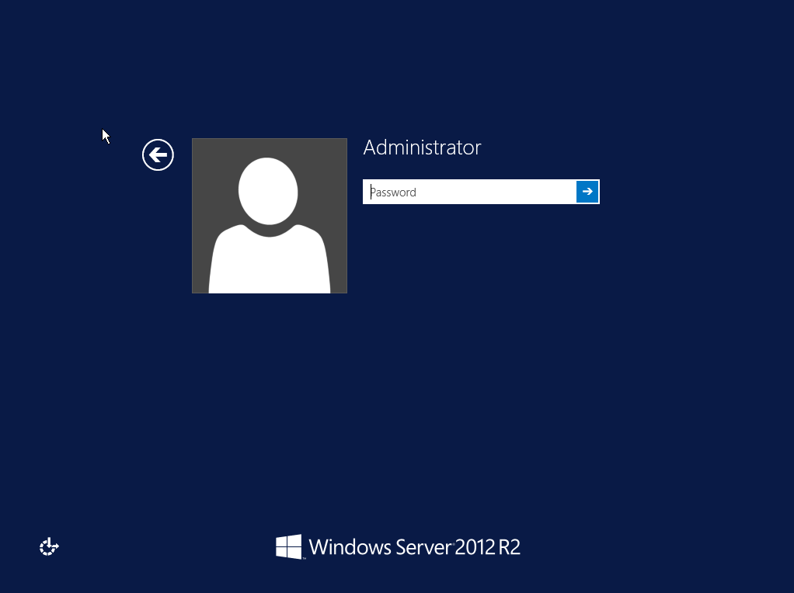

> [!primary]
> Tłumaczenie zostało wygenerowane automatycznie przez system naszego partnera SYSTRAN. W niektórych przypadkach mogą wystąpić nieprecyzyjne sformułowania, na przykład w tłumaczeniu nazw przycisków lub szczegółów technicznych. W przypadku jakichkolwiek wątpliwości zalecamy zapoznanie się z angielską/francuską wersją przewodnika. Jeśli chcesz przyczynić się do ulepszenia tłumaczenia, kliknij przycisk “Zaproponuj zmianę” na tej stronie.
> 

**Ostatnia aktualizacja z dnia 18-01-2022**

## Wprowadzenie

Po ponownym zainstalowaniu systemu operacyjnego Windows Server na serwerze zdalny dostęp i odpowiedź ICMP (Internet Control Message Protocol) mogą być czasami wyłączone.

**Niniejszy przewodnik wyjaśnia, jak skonfigurować Windows, aby ponownie włączyć ICMP i zezwolić na połączenia przez protokół Remote Desktop Protocol.**

## Wymagania początkowe

- Dystrybucja Windows zainstalowana na [serwera dedykowanego OVHcloud](https://www.ovhcloud.com/pl/bare-metal/).
- Dostęp do [Panelu client OVHcloud](https://www.ovh.com/auth/?action=gotomanager&from=https://www.ovh.pl/&ovhSubsidiary=pl).

## W praktyce

### Etap 1: dostęp do KVM

Aby uzyskać dostęp do konsoli KVM Twojego serwera, zapoznaj się z [przewodnikiem KVM](../uzywanie-ipmi-serwery-dedykowane/#korzystanie-z-kvm-przez-przegladarke-internetowa-tylko-dla-najnowszych-serwerow).

### Etap 2: zakończenie instalacji systemu Windows

Po zakończeniu sesji KVM wyświetlają się monitory konfiguracji początkowej. Tutaj skonfiguruj **kraj/region**, **język systemu Windows** oraz **układ klawiatury**. Po przeprowadzeniu tej operacji kliknij `Next`{.action}.

{.thumbnail}

W drugim oknie wpisz hasło do konta Administrator i je potwierdź, następnie kliknij `Finish`{.action}.

{.thumbnail}

System Windows zastosuje Twoje ustawienia, a następnie wyświetli ekran logowania. Kliknij przycisk `Send CtrlAltDel`{.action} w prawym górnym rogu, aby się zalogować.

{.thumbnail}

Wprowadź hasło, które utworzyłeś dla konta Administrator i kliknij strzałkę.

{.thumbnail}

Konfiguracja początkowa została zakończona. Po zalogowaniu należy zmodyfikować niezbędne ustawienia zapory Windows.

### Etap 3: zmiana firewalla Windows

Otwórz `Narzędzia administracyjne`{.action} panelu konfiguracyjnego `System and Bezpieczeństwo`{.action} i kliknij dwukrotnie `Firewall Windows z zaawansowanym`{.action} bezpieczeństwem.

{.thumbnail}

W tej sekcji możesz włączyć odpowiednie reguły "ICMP" i "Remote Desktop" (zdalny pulpit). Kliknij prawym przyciskiem myszy regułę i wybierz `Zezwalaj na regułę`{.action} w menu kontekstowym.

{.thumbnail}

Twój serwer powinien odpowiadać na zapytania wykorzystujące te protokoły.

## Sprawdź również

Przyłącz się do społeczności naszych użytkowników na stronie <https://community.ovh.com/en/>.
