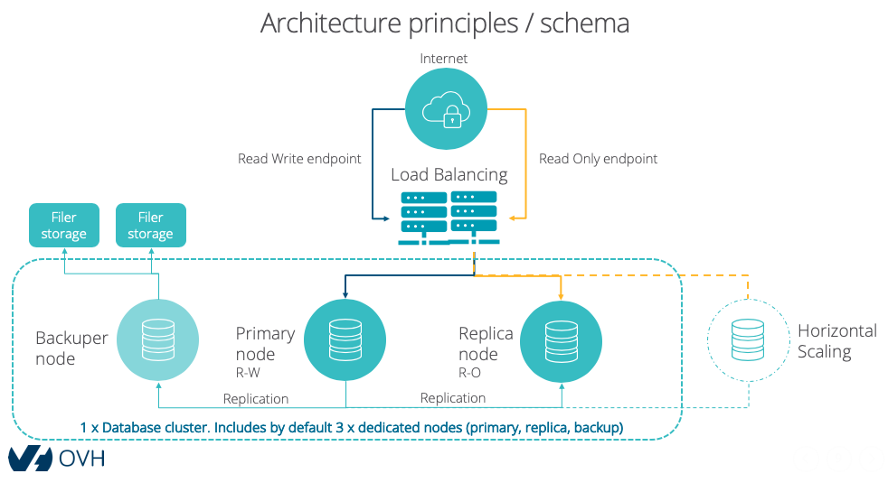

## Préambule

OVHcloud a utilisé son experience acquise avec la gestion de ses propres bases de données internes pour concevoir l'offre PostgreSQL managée.

La solution a été imaginée pour garantir un maximum de disponibilité et de résilience pour vos données.

## Schéma d'architecture
Pour rendre votre service de base de données hautement disponible et résilient à la défaillance d'un nœud, plusieurs briques sont mises en œuvre.

## Description d'un cluster

- **Chaîne de connexion**

Un nom de domaine pleinement qualifié (FQDN) et deux ports de connexions vous sont proposés (un pour les lectures/écritures, un pour les lectures).

- **Répartiteur de charge (load-balancing)**

Basé sur des appliances répliquées, les répartiteurs de charges répartissent le trafic sur les nœuds primaire et secondaires (réplicas).

- **Nœud primaire**

Basé sur un seul nœud dédié, il accepte les opérations de lectures/écritures. Ce nœud peut également supporter les opérations de lectures seules.

- **Nœud(s) secondaire(s)**

Basé sur n nœuds dédiés, les nœuds secondaires n'acceptent que les opérations de lectures. Il vous fournissent une croissance horizontale et une meilleure résilience. Par défaut, le cluster ne comporte qu'un seul nœud secondaire.

- **Nœud de sauvegarde**

Basé sur un nœud dédié, le nœud de sauvegarde n'accepte **aucune** connexion cliente. Ce nœud fait partie de la réplication afin de pouvoir réaliser des sauvegardes consistantes sans dégrader les performances globales du cluster. Les sauvegardes sont ainsi réalisées sur un nœud qui n'est pas en production.

- **Stockage des données**

Chaque nœud dispose de disques durs internes redondés (RAID 10) choisis pour leur performance. Ils assurent le stockage de vos données opérationnelles.

Vos données sont répliquées à travers tous les nœuds du cluster.

- **Stockage des sauvegardes**

Basés sur une infrastructure redondée de serveurs de stockage OVH, ils conservent les sauvegardes des nœuds de manière déportée.

- **Haute disponibilité de vos données**

OVHcloud utilise et contribue à [Patroni](https://github.com/zalando/patroni){.external}, un programme en Python utilisé pour gérer la configuration de PostgreSQL.
Cette couche logicielle prend en charge la réplication et la promotion des nœuds au sein du cluster.
Le quorum de haute disponibilité du cluster est assuré par une instance ZooKeeper installée sur chaque serveur.

> [!primary]
>
> Chaque nœud (sauf celui de sauvegarde) peut devenir primaire pendant la vie du cluster.
>
>
