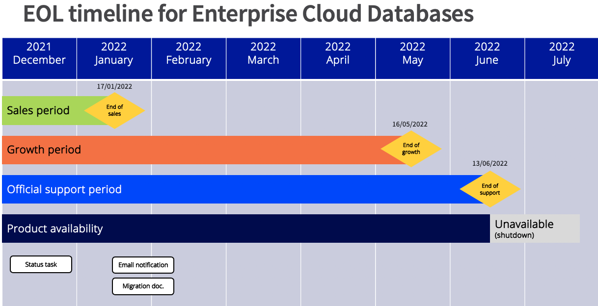

**Last updated 20th December 2021**

## Summary

OVHcloud has announced the end of its Enterprise Cloud Databases solution (managed PostgreSQL clusters, powered by baremetal servers).

Active services will be supported until June 13th 2022, when support ends.
All operations can be tracked via [the official status task](https://public-cloud.status-ovhcloud.com/incidents/961szlvn03b1).

New managed databases offers are available, see the [workaround](#workaround) section of this guide.

## End of Life Planning

In January 2022, customers with active services will receive an email notification on their NIC-admin.

### Schedule table 

| Milestone                | Definition                                                                                                          | Date                |
|--------------------------|---------------------------------------------------------------------------------------------------------------------|---------------------|
| End of Life announcement | The date of the service status task that announces end of sales and end of support.                                 | 20/12/2021 10h CEST |
| End of Sales             | Last day to purchase a new service on OVHcloud.                                                                     | 17/01/2022 10h CEST |
| End of Growth            | Last day to add replicas nodes to existing clusters.                                                                | 16/05/2022 10h CEST |
| Planned downtime         | Planned 2 hours punctual downtime, to warn impacted customers.                                                      | 10/06/2021 10h CEST |
| End of Support           | Last day to use services. After this date, all associated services and backups will be unavailable.                 | 13/06/2021 10h CEST |

All operations can be tracked via [the official status task](https://public-cloud.status-ovhcloud.com/incidents/961szlvn03b1).

### Visual timeline

{.thumbnail}

## End of life scope

This End of Life involves:

- All Enterprise Cloud databases services and solutions (free or paid) worldwide. 
- OVHcloud /cloudDB/enterprise/* API endpoints

This end of life **does not concern**:

- Web Hosting Databases;
- Public Cloud Databases.

## Workaround 

OVHcloud does have alternatives to migrate.
In our Public Cloud universe, we provide Managed PostgreSQL clusters compatible with your services.

Full documentation is available on <https://docs.ovh.com/gb/en/publiccloud/databases/>.

Here is a comparative matrix:

| Feature                                | Enterprise Cloud Databases (EOL) | Public Cloud Databases (new)  |
|----------------------------------------|----------------------------------|-------------------------------|
| Managed services                       | Yes                              | Yes                           |
| PostgreSQL available versions          | PostgreSQL 9.6, 10, 11           | PostgreSQL 10, 11, 12, 13, 14 |
| Infrastructure platform                | Baremetal servers                | Public Cloud virtual machines |
| Dedicated resources                    | Yes                              | Yes                           |
| High Availability (clustering)         | Yes. minimum 3 nodes             | Yes. minimum 3 nodes          |
| Automatic daily backups                | Yes                              | Yes                           |
| Observability tools (metrics and logs) | Partially                        | Yes                           |
| Public network                         | Yes                              | Yes                           |
| Private network                        | No                               | Yes                           |
| Last queries statistics                | No                               | Yes                           |
| Slow queries analyzer                  | No                               | Yes                           |
| Billing model                          | Monthly billing                  | Hourly billing                |

Discover the Public Cloud offers and prices:

- French (Euros): <https://www.ovhcloud.com/fr/public-cloud/databases/>.
- English (Euros): <https://www.ovhcloud.com/en-ie/public-cloud/databases/>.

## Migration options

There is no automatic migration option so far.

You can migrate to other PostgreSQL services with native PostgreSQL commands, such as **pg_dump** and **pg_restore**.

Specific guides are under redaction for a step by step process. We will link them here and on official Public Cloud Databases documentation.

If you need assistance, please contact our support directly. We provide a catalog of professional services.
