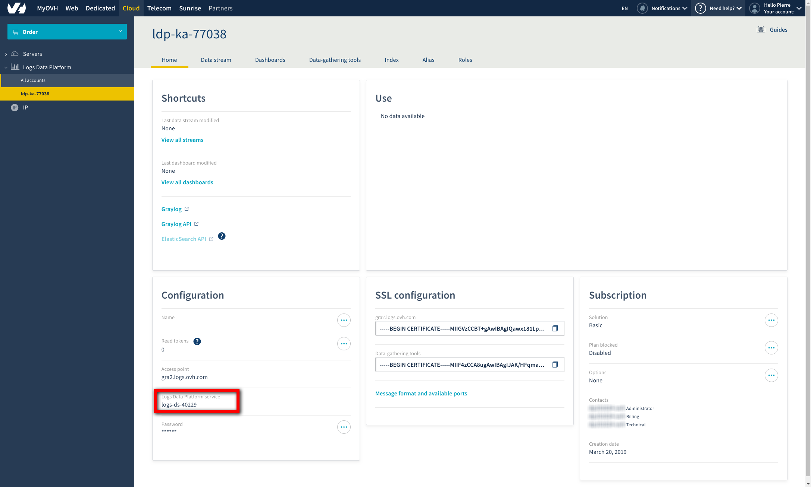

**Last updated 03rd January 2020**

## Objective

Each Enterprise Cloud Databases cluster gathers and stores an event log. It does so in a centralised and automated manner, for three-month rolling periods.
This guide will outline the steps you need to follow in order to access your logs.

## Requirements
- an Enterprise Cloud Databases cluster

## Instructions

### Step 1: Activate an OVHcloud Logs account.

The event logs are gathered and stored in a third-party product: the OVHcloud Logs Data Platform. Storage is included in our solution.
To access your logs, you will need to create a free OVHcloud Logs account. You can do this via the [official page](https://www.ovh.co.uk/data-platforms/logs/){.external}.

Once you have created an account, your OVHcloud Logs service will appear in the OVHcloud Control Panel. Retrieve your username in `Home > Configuration`{.action}:

{.thumbnail}

### Step 2: Grant access to OVHcloud Logs.

Once you have created your account, go to the Enterprise Cloud Databases Control Panel, click `Logs`{.action}, then `Grant access to OVHcloud Logs account`{.action}.
A window will appear, prompting you to enter your OVHcloud Logs username. Enter it, and accept.

### Step 3: Use Graylog.

We offer Graylog software for viewing logs in a simple, interactive interface. You can use Graylog to create a range of different dashboard types, and browse event logs.
[The official OVHcloud Logs documentation](../../platform/logs-data-platform/){.external} details all the configuration steps you need to follow in order to create the dashboards you need, and much more.

Dashboard example:

{.thumbnail}

## Go further

Learn how to manage your PostgreSQL cluster by reading [OVHcloud’s technical guides](../enterprise-cloud-databases/){.external} for further information on the technical aspects of how your managed solution works.
