**Last updated 16th February 2022**

## Objective

**This guide explains the first steps with an Hosted Private Cloud powered by Anthos infrastructure and how to configure the settings available in the OVHcloud Control Panel.**

## Requirements

- A [Hosted Private Cloud powered by Anthos service](https://www.ovhcloud.com/en-sg/hosted-private-cloud/anthos/)
- Access to the [OVHcloud Control Panel](https://ca.ovh.com/auth/?action=gotomanager&from=https://www.ovh.com/sg/&ovhSubsidiary=sg)

> [!primary]
> Be sure to consider the capabilities and known limitations of the service detailed on [this page](../technical-capabilities/).
>

## Instructions

Log in to your [OVHcloud Control Panel](https://ca.ovh.com/auth/?action=gotomanager&from=https://www.ovh.com/sg/&ovhSubsidiary=sg) and switch to `Hosted Private Cloud`{.action} in the top navigation bar.

Open `Anthos`{.action} in the left-hand sidebar and select your Hosted Private Cloud powered by Anthos deployment.

### Hosted Private Cloud powered by Anthos dashboard (General information) 

The `General information`{.action} tab displays technical details of the selected deployment as well as some subscription information.

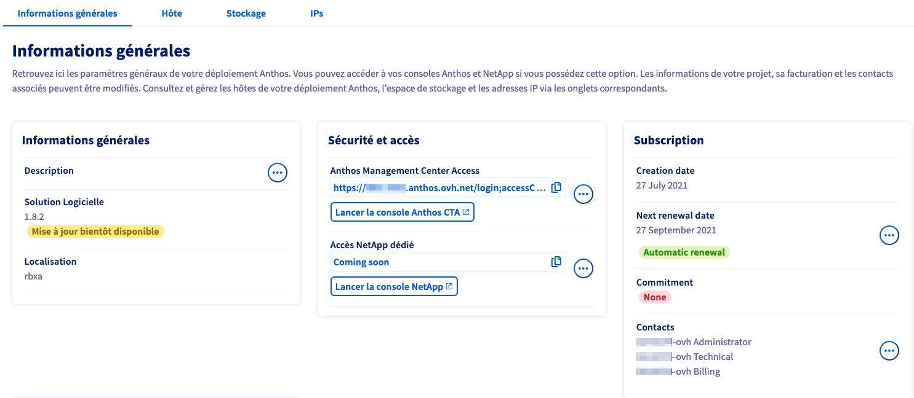{.thumbnail}

In the section `Security and access`{.action} of this tab you can find the URLs for your Anthos Management Center (Anthos console) and the [Dedicated NetApp console](#netapp) (only if NetApp is included in your subscription). Access these management tools directly via the respective button.
 In order to renew admin passwords, you can find the option `Reset access`{.action} for the consoles by clicking on the `...`{.action} buttons next to the URL fields.

The section `Resources`{.action} shows in brief the number of hosts, the Dedicated NetApp storage allocation and how many IP addresses are assigned to this deployment. With the respective `...`{.action} button you can [order more hosts](#hosts), [add SVMs](#netapp) and [assign public and private IP ranges](#iprange).

{.thumbnail}

#### Upgrading the subscription 

To upgrade your Hosted Private Cloud powered by Anthos pack, click on `...`{.action} next to **Pack** in the `Resources`{.action} section and select the pack to switch to. This will start the order process for your upgrade.

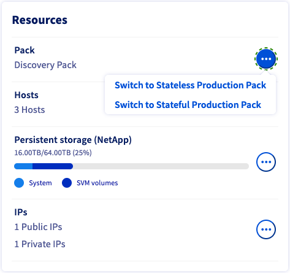{.thumbnail}

#### Software updates

In the `General information`{.action} section, a notification appears under **Software solution** when Anthos on Bare Metal in private mode updates are available. Click on `View available updates`{.action} to open the update page.

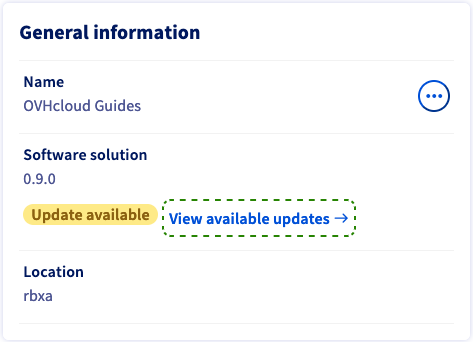{.thumbnail}

You can read the release notes for each Anthos software update if you click on the link `View the changelog`{.action}. Select the version to update your service to and confirm by clicking on `Updating`{.action}.

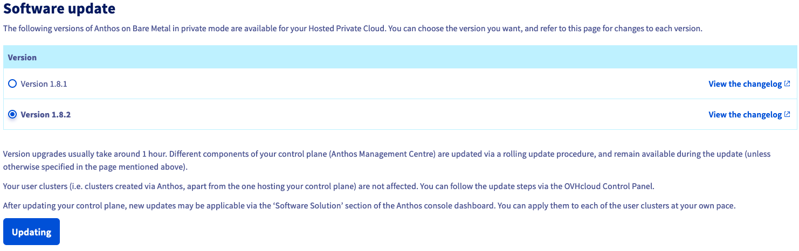{.thumbnail}

### Creating and managing bare metal nodes (Host) 

Expand the top table on this page to see the **included hosts** of the Hosted Private Cloud powered by Anthos pack. A second table will contain **additional hosts** that can be ordered separately.

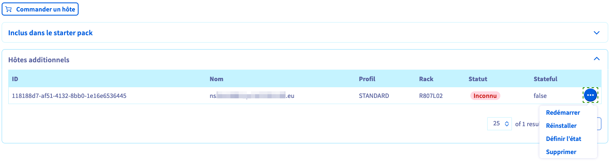{.thumbnail}

You can start the order process by clicking on the button `Order a host`{.action}. Additional hosts have a minimum renewal period of one month. A discount will be granted on orders with longer commitments.

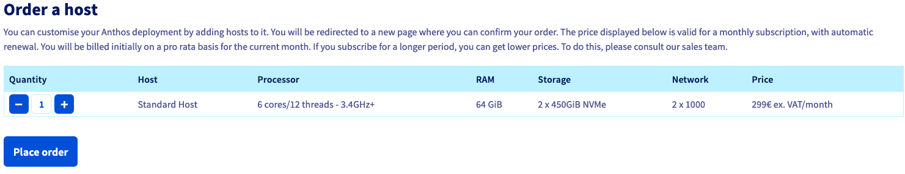{.thumbnail}

#### Rebooting a host

Click on the `...`{.action} button next to the host in the table and then select `Restart`{.action}.

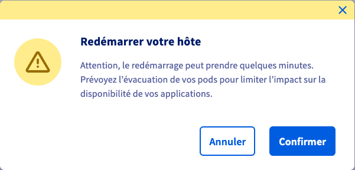{.thumbnail}

Take note of the warning message in the popup window and click on `Confirm`{.action} to reboot the selected host.

#### Reinstalling a host

> [!primary]
> A host can only be reinstalled if it is not currently part of a cluster. (Host status `Unassigned` in the Anthos console.)
>

Click on the `...`{.action} button next to the host in the table and then select `Reinstall`{.action}. A reinstallation will delete all data on the host.

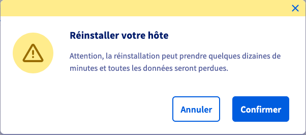{.thumbnail}

Take note of the warning message in the popup window and click on `Confirm`{.action} to reinstall the selected host.

#### Configuring the state of a host

Click on the `...`{.action} button next to the host in the table and then select `Set status`{.action}.

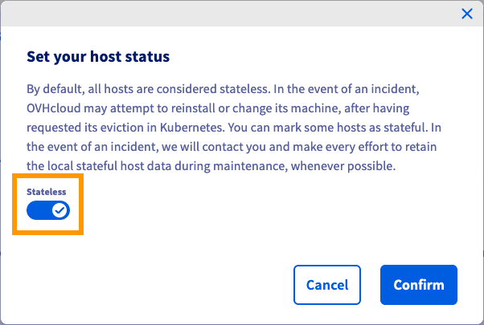{.thumbnail}

Take note of the information regarding host interventions and change the state with the `Stateless`{.action} slider button. Click on `Confirm`{.action} to change the state of the selected host.

#### Deleting a host (only for additional hosts)

Click on the `...`{.action} button next to the host in the table and then select `Delete`{.action}.

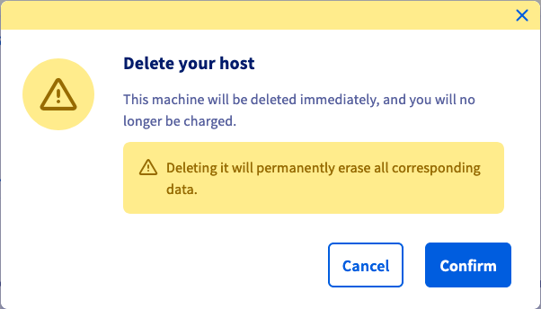{.thumbnail}

In the popup window, take note of the information about the cancellation process and click on `Confirm`{.action}. All data on the selected host will be permanently lost.

### Creating and managing NetApp SVMs (Storage) 

> [!primary]
> Dedicated NetApp storage is only available with the [Stateful Production Pack](https://www.ovhcloud.com/en-sg/hosted-private-cloud/anthos/). It is possible to upgrade a Hosted Private Cloud powered by Anthos deployment in the [General information tab](#upgrade).
>

The Dedicated NetApp storage is powered by NetApp ONTAP and features Trident, enabling your applications to efficiently make use of persistent storage via the Kubernetes Container Storage Interface (CSI) standard (creating and modifiying volumes, taking snapshots, etc.).

In the `Storage`{.action} tab you can divide the available storage space on your Dedicated NetApp cluster by creating Dedicated NetApp Storage Virtual Machines (SVM).

{.thumbnail}

Once created in the OVHcloud Control Panel, your SVMs will be available as **bootstrap services** in the [Anthos console](#firststeps). You can bind them to your clusters at creation or afterwards.

### Adding and managing IP ranges (IPs) 

On the `IPs`{.action} tab you can define local IPv4 ranges for your service and add public IP addresses.

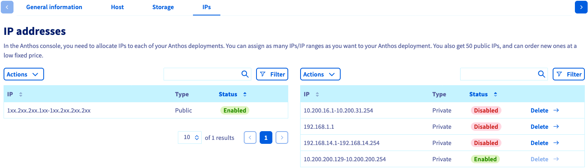{.thumbnail}

#### Public IP ranges

The included range of 50 **public IPv4 addresses** is displayed on the left-hand side. You can order more public IP addresses via the left-hand `Actions`{.action} button. Click on `Order public IPs`{.action} to start the order process.

Choose the number of IP blocks to order and click on `Confirm`{.action}.

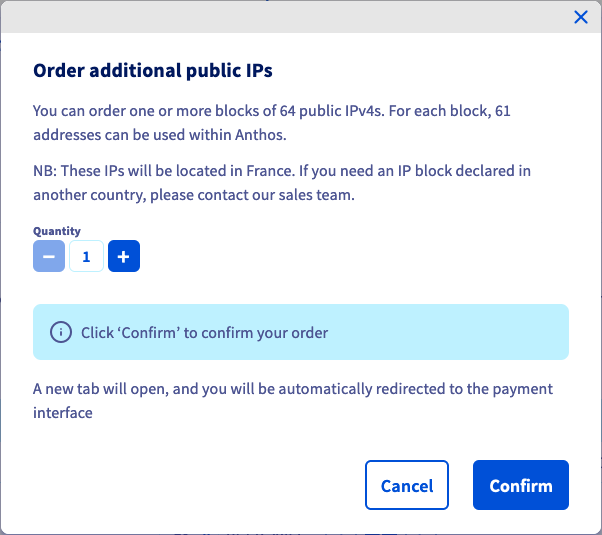{.thumbnail}

#### Local IP ranges

You can use **private IP addresses** freely but the ranges have to be declared in the OVHcloud Control Panel in order to be available for the service. The right-hand section will list your private IP addresses after adding them. To do this, click on the right-hand `Actions`{.action} button and then on `Assign private IPs`{.action}.

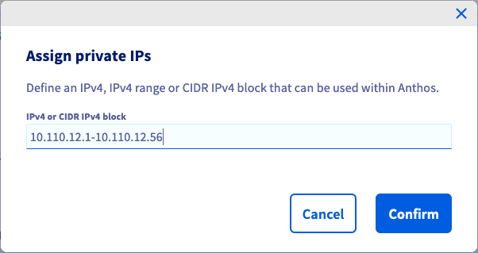{.thumbnail}

Afterwards you can assign the IP addresses in the [Anthos console](#firststeps).

To delete an entry, use the respective `Delete`{.action} button in the table. Only IP addresses that are not assigned in the Anthos console can be removed (status `Disabled` in the table).

#### Using the vRack with Hosted Private Cloud powered by Anthos and other OVHcloud services 

Each Hosted Private Cloud powered by Anthos is delivered with a [OVHcloud vRack](https://www.ovh.com/sg/solutions/vrack/). Please take note of the information disclosed in the installation email. Other compatible OVHcloud services can be attached to this vRack.

### First steps 

Once your Hosted Private Cloud powered by Anthos is delivered, the next steps depend on your use case and resource requirements:

- [Add more hosts (optional)](#hosts)
- [Assign IP address ranges](#iprange)
- [Create NetApp SVMs (optional)](#netapp)
- [Open the Anthos console and create your cluster(s)](#general)

Please continue with our [documentation on creating a cluster in the Anthos console](https://docs.anthos.ovh.net/docs/anthos/private-mode/docs/1.8/how-to/creating-user-clusters.html).

## Go further 

[Technical capabilities and limitations of Hosted Private Cloud powered by Anthos](../technical-capabilities/)

[Hosted Private Cloud powered by Anthos: Dedicated user documentation](https://docs.anthos.ovh.net/docs/anthos/private-mode/index.html)

Join our community of users on <https://community.ovh.com/en/>.
