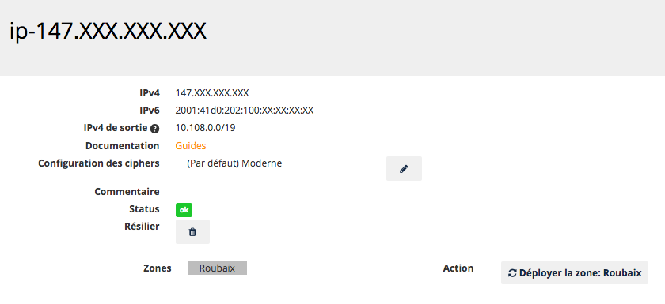
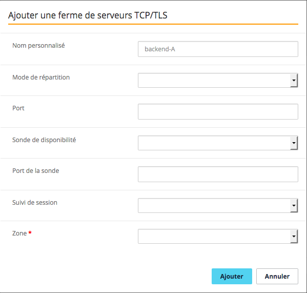
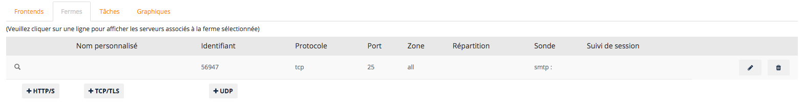
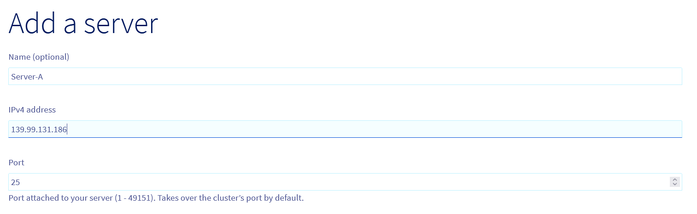
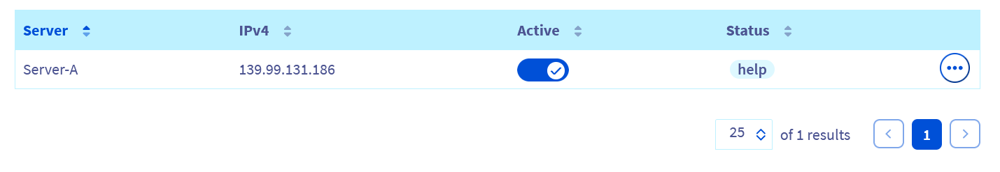
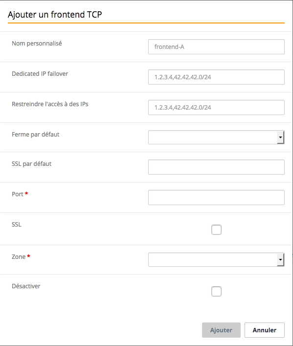
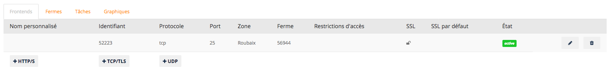

**Last updated 28th December 2018**

## Objective

In this guide, we will configure a basic TCP load balancing service, for one or more SMTP servers. A TCP front-end will listen to TCP traffic on port 25. It is configured to direct traffic to a TCP farm with one or more TCP servers, depending on how you choose to configure it.

**This guide is designed to help you configure an OVH Load Balancer service in order to balance load across several servers that respond in SMTP.**

> [!warning]
>
> Questions on what an SMTP service is and how it works will not be covered here. This guide is aimed at readers who have a general understanding of SMTP, or practical experience with it.
> 

> [!warning]
>
> We will assume that you already have a Postfix SMTP service set up and configured your servers.
> 

> [!warning]
>
> This guide will take you through the steps required. Depending on the way you have designed your architecture, some configurations may vary.
> 

As a reminder, each protocol (HTTP, TCP and UDP) in the OVH Load Balancer service has its own associated front-ends, farms and servers.

> [!warning]
>
> The order in which elements are created is important. In particular, the server farms must be configured before we can attach servers to them.
> 

In the Sunrise Control Panel, you will see the features detailed below:

{.thumbnail}

Via the OVH API, in the section:

> [!api]
>
> @api {GET} /ipLoadbalancing
> 

For more information on the API’s features, you can refer to the following guide: {.ref}

## Add a server farm.

We will add a farm of TCP servers to our service, which is the part that balances traffic on the servers.

### Via the Sunrise Control Panel.

In the `Farms`{.action} tab for servers, click on the `+TCP/TLS`{.action} button.

Fill in the fields. The mandatory fields for a basic configuration are *Port* and *Zone*. In our case, for SMTP, port 25 is used. If no ports are specified, your OVH Load Balancer will automatically use the same port as the corresponding front-end.

As an option, you can add an SMTP probe on your farm.

{.thumbnail}

Click `Add`{.action} once you have filled in the fields.

Your server farm should appear in the list, in the `Farms`{.action} tab.

{.thumbnail}

### Via the API

- List of TCP server farms:

> [!api]
>
> @api {GET} /ipLoadbalancing/{serviceName}/tcp/farm
> 

- Details of a specific TCP server:

> [!api]
>
> @api {GET} /ipLoadbalancing/{serviceName}/tcp/farm/{farmId}
> 

- Add a new TCP server farm:

> [!api]
>
> @api {POST} /ipLoadbalancing/{serviceName}/tcp/farm
> 

- Modify a specific server farm:

> [!api]
>
> @api {PUT} /ipLoadbalancing/{serviceName}/tcp/farm/{farmId}
> 

- Delete a specific server farm:

> [!api]
>
> @api {DELETE} /ipLoadbalancing/{serviceName}/tcp/farm/{farmId}
> 

## Add a server.

We will now add a server to our server farm.

### Via the Sunrise Control Panel.

In the `Farms`{.action} tab, select the farm you want to add a server to by clicking on the corresponding line. The list of servers already configured in the farm will appear beneath the list of farms, along with the `Add a server`{.action} button. Click on this button to add a new server.

Only the *IPv4 address*,  *Status* and *ProxyProtocol version* fields are mandatory. If a server does not use the same port as the one defined earlier in the farm, you may overload it by configuring a server. However, to keep the configuration as standard as possible and easy to maintain, we recommend only using this parameter in advanced cases.

> [!warning]
>
> It is important to configure ProxyProtocol in version v1, so that you can get the real source IP on your SMTP service. Postfix is compatible with this protocol.
> 

{.thumbnail}

Click `Add`{.action} once you have filled in the fields.

Your server should appear in the server list, in the `Farms`{.action} tab, just below the list of farms.

{.thumbnail}

### Via the API

- List of servers in the farm:

> [!api]
>
> @api {GET} /ipLoadbalancing/{serviceName}/tcp/farm/{farmId}/server
> 

- Details of a specific server:

> [!api]
>
> @api {GET} /ipLoadbalancing/{serviceName}/tcp/farm/{farmId}/server/{serverId}
> 

- Add a new server:

> [!api]
>
> @api {POST} /ipLoadbalancing/{serviceName}/tcp/farm/{farmId}/server
> 

- Modify a specific server:

> [!api]
>
> @api {PUT} /ipLoadbalancing/{serviceName}/tcp/farm/{farmId}/server
> 

- Delete a specific server:

> [!api]
>
> @api {DELETE} /ipLoadbalancing/{serviceName}/tcp/farm/{farmId}/server
> 

## Add a front-end

We will now add a `front-end`{.action} to our service, and connect it to our server farm. The front-end is the part of your OVH Load Balancer that exposes your service on the internet.

### Via the Sunrise Control Panel.

Go to the `+ Front-ends`{.action} tab, and click `+TCP/TLS`{.action}.

Fill in the fields. The only mandatory fields for a basic configuration are *Port* (25 for a standard SMTP service), *Zone* and *Probe*, if you configured a probe on your farm. If you want your service to be available across several ports at once, you can specify a list of ports, separated by commas, or a range of ports, in the format "start_port-end_port".

If you have routed failover IPs to your OVH Load Balancer service, you can also attach a front-end to one or more specific failover IPs.

Please remember to specify the farm you created earlier as a “default farm”.

{.thumbnail}

Click `Add`{.action} once you have filled in the fields.

Your front-end must appear in the list, in the `Front-ends`{.action} tab.

{.thumbnail}

### Via the API

- List of TCP front-ends:

> [!api]
>
> @api {GET} /ipLoadbalancing/{serviceName}/tcp/frontend
> 

- Details of a specific front-end:

> [!api]
>
> @api {GET} /ipLoadbalancing/{serviceName}/tcp/frontend/{frontendId}
> 

- Add a new front-end:

> [!api]
>
> @api {POST} /ipLoadbalancing/{serviceName}/tcp/frontend
> 

- Modify a specific front-end:

> [!api]
>
> @api {PUT} /ipLoadbalancing/{serviceName}/tcp/frontend/{frontendId}
> 

- Delete a specific front-end:

> [!api]
>
> @api {DELETE} /ipLoadbalancing/{serviceName}/tcp/frontend/{frontendId}
> 

## Apply the modifications

The modifications made to your OVH Load Balancer must be *explicitly applied* in each of the zones configured for your service. Only at this point will they be visible to your website visitors. This way, you can make complex configuration changes several times, and only apply them once the configuration is ready.

If you have several zones, you must apply the same configuration for each of them.

### Via the Sunrise Control Panel.

Go the homepage for the OVH Load Balancer, and click `Apply:Zone`{.action} for each of the zones concerned.

### Via the API.

- Refresh a zone:

> [!api]
>
> @api {POST} /ipLoadbalancing/{serviceName}/refresh
> 

## Postfix configuration.

To make Postfix compatible with HAProxy *ProxyProtocol*, an option is required in the postfix main.cf configuration file:

**smtp_upstream_proxy_protocol = haproxy**

You then need to restart your Postfix daemon.

## Confirmation.

After you have completed all of these steps, you should now have a functional Load Balancer service for your SMTP servers. You can now check the service status by requesting your IP Load Balancer as an SMTP server.

{.thumbnail}

## Go further

Join our community of users on <https://community.ovh.com/en/>.

