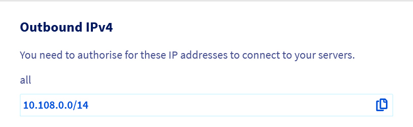
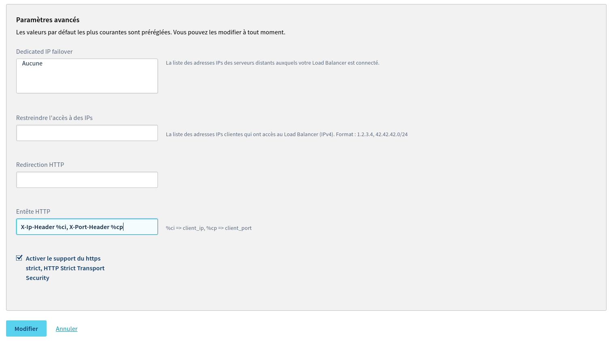

## Introduction
Le service OVH Load Balancer agit comme un mandataire ou "Proxy". Comme un mandataire humain, il agit comme un intermédiaire, de telle sorte que le client s'adresse au mandataire et le mandataire au fournisseur de service, au nom du client. Dans cette configuration, seul le mandataire connait à la fois le véritable client (le visiteur de votre service web) et le véritable fournisseur de service (l'un de vos serveurs).

Pour le visiteur, cela ne pose aucun soucis. Il n'a pas besoin de connaitre avec précision le serveur qui répond à sa requête. C'est un détail d'implémentation. En revanche, pour des raisons à la fois légal et de statistique, il est indispensable que le serveur final ait connaissance de la véritable adresse du client, or, par défaut, il ne voit que le mandataire (en l'occurence, votre service OVH Load Balancer).

Pour palier cela, votre service OVH Load Balancer ajoute par défaut les En-Têtes HTTP standards permettant de retrouver ces informations dans le cas d'une connexion HTTP. Dans le cas d'une connexion TCP, d'autres solutions existent telles que le ProxyProtocol, mais cela sort du cadre de ce guide.

Ce guide présente les En-Têtes par défaut, leur rôle, comment les exploiter depuis les serveurs les plus courants ainsi que comment les personnaliser en fonction des contraintes de votre infrastructure.

Si vous retrouvez dans vos acces_log uniquement des IP privées, ce guide est fait pour vous.


```bash
10.108.0.15 - - [22/Mar/2017:10:56:47 +0100] "GET / HTTP/1.1" 200 706 "-" "Mozilla/5.0 (Linux[...]"
10.108.0.24 - - [22/Mar/2017:10:56:47 +0100] "GET / HTTP/1.1" 200 706 "-" "Mozilla/5.0 (Linux[...]"
```

## Obligations légales
Vous pouvez être tenus de conserver des logs et certaines données relatives au trafic en vertu des lois et règlementations vous étant applicables. Il vous incombe de respecter ces obligations.

__A titre d’exemple :__

* [L’article L34-1 du Code des postes et des communications électroniques](https://www.legifrance.gouv.fr/affichCodeArticle.do?cidTexte=LEGITEXT000006070987&idArticle=LEGIARTI000006465770&dateTexte=&categorieLien=cid) ainsi que le [décret n°2006-358 du 24 mars 2006 relatif à la conservation des données des communications électroniques](https://www.legifrance.gouv.fr/affichTexte.do?cidTexte=JORFTEXT000000637071&dateTexte=20180110) imposent notamment à toute personne physique ou morale fournissant au public un service de communications électroniques de conserver des données d'identification des personnes utilisatrices des services fournis, etc. ;
* La [loi n° 2004-575 du 21 juin 2004 pour la confiance dans l'économie numérique](https://www.legifrance.gouv.fr/affichTexteArticle.do?idArticle=JORFARTI000002457442&cidTexte=JORFTEXT000000801164) et le [décret n° 2011-219 du 25 février 2011](https://www.legifrance.gouv.fr/affichTexte.do?cidTexte=JORFTEXT000023646013&categorieLien=id) imposent notamment aux personnes dont l’activité est d’offrir un accès à des services de communication au public en ligne de conserver pour chaque connexion les données relatives à l’identifiant de la connexion, les dates et heure de début et de fin de la connexion, etc.


## En-Tetes par defaut
Par défaut, votre service OVH Load Balancer ajoute à chaque requête HTTP 5 En-Têtes standard permettant de connaitre l'adresse et le port du visiteur de votre site ainsi que le protocole de connexion.

|En-Tête|Description|
|---|---|
|X-Forwarded-For et X-Remote-Ip|Adresse du client, tel que vu par votre OVH Load Balancer.|
|X-Forwarded-Port et X-Remote-Port|Port source du client, telle que vu par votre OVH Load Balancer.|
|X-Forwarded-Proto|Protocole du client (HTTP ou HTTPS), telle que vu par votre OVH Load Balancer.|


### Avertissement
Les champs X-Fowarded-* pouvant être forgés par un client malicieux, ils ne doivent être pris en compte que s’ils viennent d’une source de confiance.

Il est donc indispensable de limiter leurs utilisations à des IP de confiance, en l'occurence, les IPs de sortie de votre service OVH Load Balancer. Les principaux serveurs tels que Nginx et Apache disposent de modules capable de gérer cet aspect de sécurité et confiance.

Vous pouvez obtenir la liste de vos IPs de sortie via le Manager et via l'API.


#### Via le Manager
La liste des IPv4 de sortie potentiellement utilisées par votre service OVH Load Balancer se trouve sur la page d'accueil de votre service OVH Load Balancer dans le manager sous le nom "IPv4 de sortie".


{.thumbnail}


#### Via l'API
- Liste des IPs utilisées par votre service OVH Load Balancer


> [!api]
>
> @api {GET} /ipLoadbalancing/{serviceName}/natIp
> 

## Correction de lIP source dans les Logs
Par défaut, Apache, Nginx et les autres serveurs webs prennent en compte l'adresse IP source dans les logs. Quand vous utilisez un OVH Load Balancer en amont de votre site web, les logs ne contiennent alors plus que des adresses IPs qui ressemblent à "10.108.a.b". Ce sont les adresses IPs utilisées par l'OVH Load Balancer pour vous contacter.

Lorsque la requête passe par votre service OVH Load Balancer, celui-ci enregistre l'adresse IP de votre visiteur dans les En-Têtes X-Forwarded-For et X-Remote-Ip. Ils contiennent la même information. Seul le nom change pour des raisons de compatibilité avec la majorité des serveurs.

Pour corriger les IPs dans les logs, la solution évidente serait de modifier la directive de format de logs de votre serveur poyr utiliser l'un de ces En-Tête en lieu et place de l'IP du Load Balancer. Malheuresement, cela ne suffit pas car n'importe qui peut renseigner ces En-Tête, même s'il ne passe pas par votre OVH Load Balancer. Et cela lui permettrait de se faire passer pour quelqu'un d'autre. En dehors de l'aspect éthique de cette pratique, il y a égallement des implications légales, de sécurité et de statistiques pour lesquelles cela ne doit pas se produire.

Pour cette raisons, les principaux serveurs webs disposent de modules spécialisées permettant de controller exactement le niveau de confiance à accorder à ces En-Têtes en fonction de - L'adresse IP source (seulement celle de votre service OVH Load Balancer !) - Le niveau de profondeur de l'IP dans le champ. En effet, chaque mandataire (proxy, load balancer) ajoute l'IP de son client dans ce champ.

Ce guide vous propose quelques bonnes pratiques de configuration pour les principaux serveurs webs.


### Apache
- Créez le fichier /etc/apache2/conf-available/remoteip.conf
- Insérez la configuration suivante :

```apache
1. # Trust X-Forwarded-For headers from the OVH Load Balancer
2. # See https://www.ovh.com/manager/sunrise/iplb/index.html#/iplb for an up to date list
3. RemoteIPHeader X-Forwarded-For
4. RemoteIPInternalProxy 10.108.0.0/16
```

- Remplacez les variables %h par %a dans les directives LogFormat de la configuration Apache
- Enfin, activez la nouvelle configuration avec :

```bash
# Enable the 'remoteip' module and configuration
a2enmod remoteip
a2enconf remoteip

# Restart apache to load the new module ("reload" is enough if the module was already enabled)
service apache2 restart
```


### Nginx
Pour Nginx, c'est un peu plus simple, mais l'idée reste la même que pour Apache en ne prenant en compte le champs X-Forwarded-For que s'il vient de votre service OVH Load Balancer.

Cette configuration peut être effectuée soit - pour l'ensemble des sites en insérant la configuration dans la section http {} - pour un site en particulier en insérant la configuration dans la section server {} correspondante - pour une URL en particulier en insérant la configuration dans la section location {} correspondante

- Insérez la configuration dans la ou les sections voulue (http {} pour une configuration globale) :

```nginx
1. # Trust X-Forwarded-For headers from the OVH Load Balancer
2. # See https://www.ovh.com/manager/sunrise/iplb/index.html#/iplb for an up to date list
3. set_real_ip_from 10.108.0.0/16;
4. real_ip_header X-Forwarded-For;
```

- Puis activez la nouvelle configuration avec :

```bash
service nginx reload
```


## Redirection des visiteurs HTTP vers HTTPS
Pour plus de sécurité, certains contenus tels que les pages de connexion peuvent n'être disponible qu'en HTTPS. Certains site vont même plus loin en redirigeant systématiquement toutes les visites vers la version HTTPS du site. Par défaut, comme les 2 protocoles HTTP et HTTPS passent par des ports différents, respectivement le 80 et le 443, la solution consiste à mettre les règles de redirections directement dans le vhost correspondant au HTTP.

Lorsque la requête passe par un service comme le service OVH Load Balancer, celui-ci s'occupe de recevoir le trafic HTTP, déchiffrer le trafic HTTPS et les fait suivre tous les 2 vers vos serveurs. En fonction de la configuration de vos serveurs, l'ensemble du trafic sera propagé en HTTP ou en HTTPS, sans distinction de protocol d'entré sur le Load Balancer. Votre serveur ne peut plus faire la différence entre les 2, puisque les 2 arrivent au même endroit. On parle de "Terminaison SSL".

Pour cette raison, le service OVH Load Balancer ajoute automatiquement un En-Tête X-Forwarded-Proto qui contient le nom du protocol d'origine. En l'occurence "http" ou "https".

De même que X-Forwarded-For, cet En-Tête peut être forgé par un visiteur malicieux pour faire croire qu'une requête non sécurisée proviendrait de votre service OVH Load Balancer, en HTTPS. Il est essentiel de ne faire confiance à cette En-Tête que si elle vient bien de votre service service OVH Load Balancer.


### Apache
- Insérez la configuration suivante dans le fichier .hatccess de votre site :

```apache
1. RewriteEngine on
2. RewriteCond %{HTTP:X-Forwarded-Proto} !https
3. RewriteRule ^ https://%{HTTP_HOST}%{REQUEST_URI} [L,R=301]
```

- Puis activez la nouvelle configuration avec :

```bash
service apache2 reload
```


### Nginx
- Insérez la configuration suivante dans la section server {} de votre site :

```nginx
1. if ($http_x_forwarded_proto = "http") {
2.         return 301 https://$host/$request_uri;
3. }
```

- Puis activez la nouvelle configuration avec :

```bash
service nginx reload
```


## Transmissions des En-Tetes a PHP
PHP se base sur l'entête REMOTE_ADDR pour déterminer l'adresse des visiteurs. Cet En-Tête est configuré automatiquement lorsque la configuration de la section [Correction de l’IP source dans les Logs](#correction-de-lip-source-dans-les-logs){.internal} est appliquée.


## Ajouter des En-Tetes personnalises
Si votre application attend un format particulier d'En-Tête pour découvrir l'IP, le port ou le protocole du visiteur ou que vous souhaitez savoir par quel Frontend est arrivée une requête ou toute autre raison, vous pouvez ajouter des En-Têtes personnalisés sur votre Frontend HTTP.

Les En-Têtes personnalisés doivent être de la forme X-En-Tete Valeur de l'Entête. Le nom de l'En-Tête et sa valeur sont séparé par un espace. Il est possible de spécifier plusieurs En-Têtes sur un même Frontend.

Si un autre En-Tête existe dans la requête, il sera écrasé et remplacé par la nouvelle valeur de telle sorte qu'il devient impossible pour le visiteur passant par ce `Frontend`{.action} de le forger. Il n'est pas possible de re-définir un des En-Têtes réservés aux mandataires tels que ceux décrits dans ce document. Ceux ci sont gérés automatiquement par votre service OVH Load Balancer.

Lorsque vous spécifiez un nom d'En-Tête non standard, une bonne pratique est de le faire commencer par le préfixe "X-".

Il est possible d'utiliser des variables dans la valeur des En-Têtes: - %ci sera remplacé par l'adresse IP de votre visiteur - %cp sera remplacé par le port source de votre visiteur

Les En-Têtes personnalisés peuvent être spécifiés via le Manager et via l'API, à la fois sur un nouveau `Frontend`{.action} comme un Frontend existant.


### Via le Manager
Dans la section `Frontends`{.action} de votre Manager, choisissez le Frontend à éditer ou cliquez sur le bouton `Ajouter un frontend`{.action} pour en créer un nouveau. Une fenêtre d'édition apparait alors avec un champ `Entête HTTP`{.action} dans la partie `Paramètres avancés`{.action}.

Si vous souhaitez configurer plusieurs En-Têtes, ceux-ci doivent être séparés par des virgules *sans espaces*. Par exemple, vous pouvez créer les En-Têtes suivant: X-Ip-Header %ci,X-Port-Header %cp.


{.thumbnail}

Cliquez sur le bouton `Mettre à jour`{.action} une fois les En-Têtes configurés puis sur `Déployer la zone: VOTRE ZONE`{.action} pour appliquer vos changements dans la zone concernée.


### Via l'API
Dans l'API, les En-Têtes sont spécifiées dans une liste httpHeader. À la différence du Manager, chaque En-Tête doit être dans sa propre entrée de la liste. Dans la console de l'API OVH, un bouton `+`{.action} est disponible dès que vous commencez à spécifier une valeur afin d'ajouter un nouveau champ dans la liste. Si vous utilisez l'API dans votre code, cela correspond à une liste json telle que :


```json
1. {
2.         "httpHeader": [
3.                 "X-Ip-Header %ci",
4.                 "X-Port-Header %cp"
5.         ]
6. }
```

- Modifier un `Frontend`{.action} existant :


> [!api]
>
> @api {PUT} /ipLoadbalancing/{serviceName}/http/frontend/{frontendId}
> 

|Paramètre|Signification|
|---------|-------------|
|serviceName|Nom du service Load Balancer concerné|
|frontendId|Identifiant du Frontend où configurer les en-têtes HTTP|
|httpHeader|Liste d'en-têtes à configurer|

- Appliquer les modifications :


> [!api]
>
> @api {POST} /ipLoadbalancing/{serviceName}/refresh
> 

|Paramètre|Signification|
|---------|-------------|
|serviceName|Nom du service Load Balancer concerné|
|zone|Nom de la zone dans laquelle déployer la configuration|
