## Objective

The purpose of this guide is to help you create your first HTTP/HTTPS service with the new OVH Load Balancer solution. Here, we will set up a basic OVH Load Balancer service configuration to balance the HTTP load for a service like a website.

A front-end will be created to listen on port 80, while another listens on port 443 with an SSL/TLS certificate. These front-ends will be configured to direct their traffic to a common HTTP farm. This farm can have one or more servers, depending on the configuration you have chosen/adapted.

As a reminder, the OVH Load Balancer has four primary components:

- `front-ends`
- server `farms` and their `servers`
- the advanced `routes` between the front-ends and server farms (available soon, via the Sunrise Control Panel)
- `SSL/TLS` connections that can encrypt TCP and/or HTTP connections

**This guide will show you how to configure an OVH Load Balancer Service.**

## Requirements

- an OVH Load Balancer
- the ability to add and configure a farm, a server, a front-end and an SSL certificate

## Introduction

> [!warning]
>
> This guide will take you through the steps required. Depending on the way you have designed your architecture, some configurations may vary.
> 

If you have not done so already, we recommend reading a general introduction to the OVH Load Balancer service before you get started: {.ref}

> [!warning]
>
> The order in which elements are created is important. In particular, the server farms must be configured before we can attach an SSL/TLS certificate or servers to them. The front-ends must be configured after the server farms in order to configure the front-end’s default farm.
> 

In the Sunrise Control Panel, you will see the features detailed below:

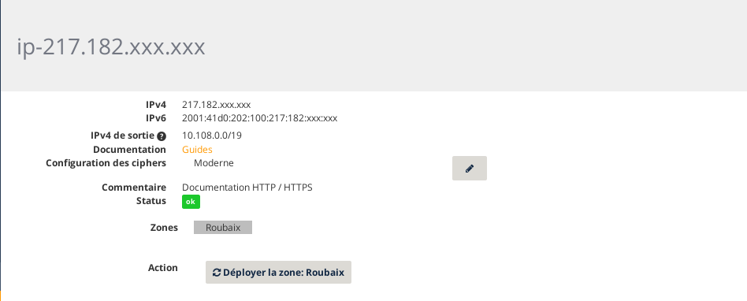{.thumbnail}

For more information on the Sunrise Control Panel’s features, you can consult the following guide: {.ref}

Similarly, this can be done via the OVH API, in the section:

> [!api]
>
> @api {GET} /ipLoadbalancing
> 

For more information on the API’s features, you can consult the following guide: {.ref}

## Add a server farm.

We will add a farm of HTTP servers to our service, which is the part that balances traffic on the servers.

### Via the Sunrise Control Panel.

In the `Server farms`{.action} tab, click on the `Add a server farm`{.action} button.

Fill in the fields. The only mandatory fields for a basic configuration are *Protocol* and *Datacentre*. We recommend explicitly defining a *Port* (generally port 80 for a web service). If no ports are specified, your OVH Load Balancer will automatically use the same port as the corresponding front-end, and the probes will not be able to work as intended.

If you add several servers to your farm, we advise configuring an HTTP `availability probe`. When a probe is configured, the OVH Load Balancer service can automatically disable a server that is down or under maintenance, so that your web users are not affected.

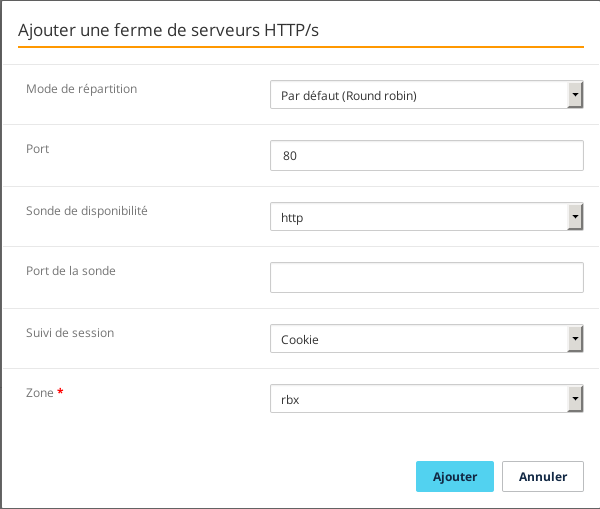{.thumbnail}

Click `Add`{.action} once you have filled in the fields.

Your server farm should appear in the list, in the `Server farms`{.action} tab.

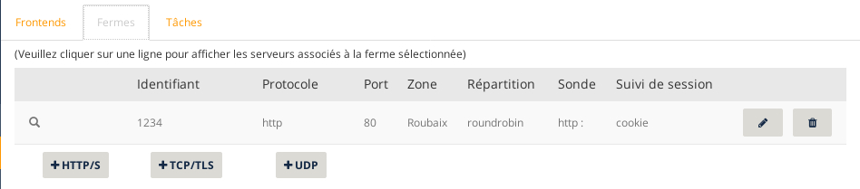{.thumbnail}

### Via the API

- List of HTTP server farms:

> [!api]
>
> @api {GET} /ipLoadbalancing/{serviceName}/http/farm
> 

- Details of a specific HTTP server:

> [!api]
>
> @api {GET} /ipLoadbalancing/{serviceName}/http/farm/{farmId}
> 

- Add a new HTTP server farm:

> [!api]
>
> @api {POST} /ipLoadbalancing/{serviceName}/http/farm
> 

- Modify a specific server farm:

> [!api]
>
> @api {PUT} /ipLoadbalancing/{serviceName}/http/farm/{farmId}
> 

- Delete a specific server farm:

> [!api]
>
> @api {DELETE} /ipLoadbalancing/{serviceName}/http/farm/{farmId}
> 

## Add a server.

We will now add a server to our server farm.

### Via the Sunrise Control Panel.

In the `Server farms`{.action} tab, select the farm you want to add a server to by clicking on the corresponding line. The list of servers already configured in the farm will appear beneath the list of farms, along with the `Add a server`{.action} button. Click on this button to add a new server.

Only the *IPv4 address* field is mandatory. If a server does not use the same port as the one defined earlier in the farm, you may overload it by configuring a server. However, to keep the configuration as standardised and easy to maintain as possible, we recommend only using this parameter in advanced cases.

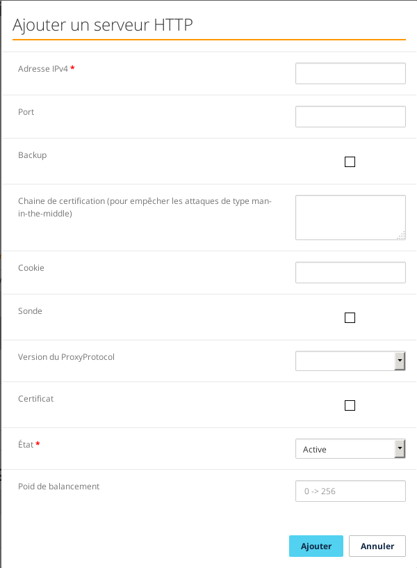{.thumbnail}

Click `Add`{.action} once you have filled in the fields.

Your server should appear in the server list, in the `Server farm`{.action} tab, just below the list of farms.

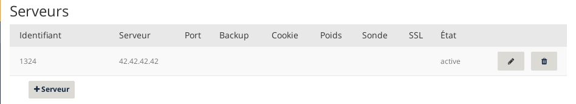{.thumbnail}

### Via the API

- List of servers in the farm:

> [!api]
>
> @api {GET} /ipLoadbalancing/{serviceName}/http/farm/{farmId}/server
> 

- Details of a specific server:

> [!api]
>
> @api {GET} /ipLoadbalancing/{serviceName}/http/farm/{farmId}/server/{serverId}
> 

- Add a new server:

> [!api]
>
> @api {POST} /ipLoadbalancing/{serviceName}/http/farm/{farmId}/server
> 

- Modify a specific server:

> [!api]
>
> @api {PUT} /ipLoadbalancing/{serviceName}/http/farm/{farmId}/server
> 

- Delete a specific server:

> [!api]
>
> @api {DELETE} /ipLoadbalancing/{serviceName}/http/farm/{farmId}/server
> 

## Add a front-end.

We will now add a `front-end` to our service, and connect it to our server farm. The front-end is the part of your OVH Load Balancer that exposes your service on the internet. First, we will only configure it in HTTP, without an SSL/TLS certificate.

### Via the Sunrise Control Panel.

Go to the `Front-ends`{.action} tab, and click `Add a front-end`{.action}.

Fill in the fields. The only mandatory fields for a basic configuration are *Protocol*, *Port* (80 for a standard HTTP web service) and *Datacentre*. If you want your service to be available across several ports at once, you can specify a list of ports, separated by commas, or a range of ports, in the format "START_PORT-END_PORT".

If you have routed failover IPs to your OVH Load Balancer service, you can also attach a front-end to one or more specific failover IPs.

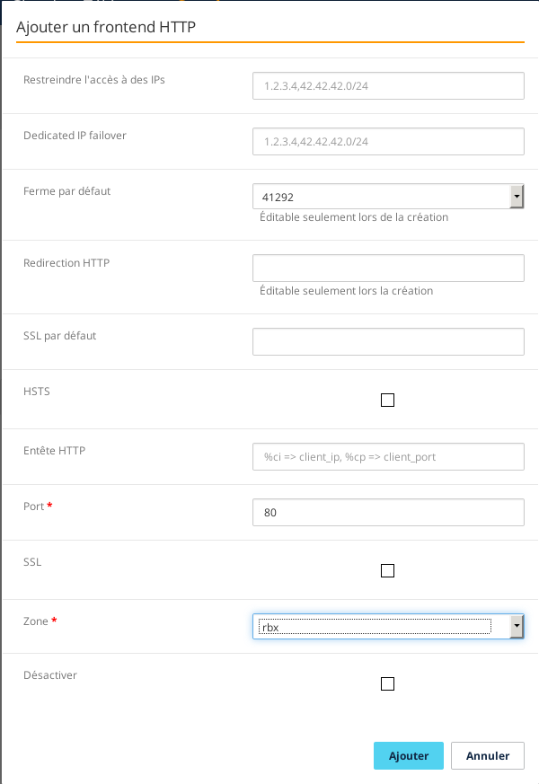{.thumbnail}

Click `Add`{.action} once you have filled in the fields.

Your front-end must appear in the list, in the `Front-ends`{.action} tab.

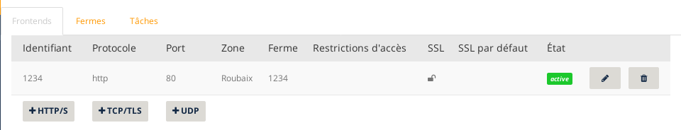{.thumbnail}

### Via the API

- List of HTTP front-ends:

> [!api]
>
> @api {GET} /ipLoadbalancing/{serviceName}/http/frontend
> 

- Details of a specific front-end:

> [!api]
>
> @api {GET} /ipLoadbalancing/{serviceName}/http/frontend/{frontendId}
> 

- Add a new front-end:

> [!api]
>
> @api {POST} /ipLoadbalancing/{serviceName}/http/frontend
> 

- Modify a specific front-end:

> [!api]
>
> @api {PUT} /ipLoadbalancing/{serviceName}/http/frontend/{frontendId}
> 

- Delete a specific front-end:

> [!api]
>
> @api {DELETE} /ipLoadbalancing/{serviceName}/http/frontend/{frontendId}
> 

## Add an SSL/TLS certificate.

The section above described the general configuration of a HTTP front-end. This next section describes the additional steps you need to take to activate support of HTTPS protocol on an HTTP front-end. In particular, you need to:

- switch over the front-end to port 443, which is standard for HTTPS protocol
- configure an SSL/TLS certificate to authenticate and encrypt connections

Whether you choose to configure your service via the API or the Sunrise Control Panel, you can choose from two methods for adding an SSL/TLS certificate. The choice of method will depend on your needs, as well as the solutions currently set up. You can either:

- Import an existing SSL/TLS certificate.
- Order an automatically managed SSL/TLS certificate. DV and EV certificates will be available to order soon.

If you choose to import an SSL/TLS certificate that you have already ordered and managed yourself, you will need to renew it periodically yourself, and update it in your OVH Load Balancer service. Most certificates are valid for one year. Some remain valid for longer periods of time. However, Let's Encrypt certificates need to be renewed every three months. We recommend using your OVH Load Balancer to automatically manage the service for Let’s Encrypt certificates, so that you do not miss the expiry dates.

If you opt for a certificate managed by the OVH Load Balancer service, it will be automatically ordered, validated, installed and renewed periodically by your OVH Load Balancer. For the validation and renewal operations to work, the domains you are ordering this certificate for need to be routed to your OVH Load Balancer service. This means that your domain’s *A* and *AAAA* DNS records must point to your OVH Load Balancer’s IPv4 and IPv6 fields respectively, or to one of its failover IPs. When you order, you will receive an email that will guide you through the validation steps.

>
> To ensure that your service remains accessible when you switch your domain to your OVH Load Balancer service’s IP address in order to validate your certificate, it is good practice to start by configuring and testing all of the HTTP configuration on port 80. This way, your website will remain accessible without any interruptions.
> If the website already has a HTTPS connection and you want to switch to certificates managed by your OVH Load Balancer service, you can import your existing certificates, configure and test your HTTPS front-end, and order a new certificate for the same domain.  It will be taken into account automatically when your old certificate expires.
> 

The certificates configured on your OVH Load Balancer service are automatically available for all of the front-ends on your service that have *SSL* options enabled.

### Via the Sunrise Control Panel.

The list of SSL/TLS certificates configured on the OVH Load Balancer can be found in the `SSL certificates`{.action} tab. In this interface, you can select one of the two options mentioned further up, i.e. importing an existing certificate certificate (`Add an SSL certificate`{.action}) and (`Order an SSL certificate`{.action}) managed automatically by your OVH Load Balancer.

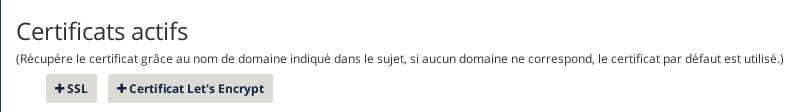{.thumbnail}

If you choose to import an existing SSL/TLS certificate, click `Add an SSL certificate`{.action}. The *Private key* and *Certificate* fields are obligatory.

Click `Add`{.action} once you have filled in the fields. Your certificate will appear in the certificate list.

{.thumbnail}

To add a Let's Encrypt certificate, click `Order an SSL certificate`{.action}, enter your domains, ensure that they point to your OVH Load Balancer, and follow the instructions set out in the guides you receive. You will then see it appear in the list of available certificates.

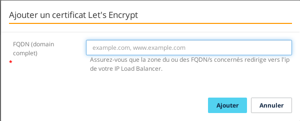{.thumbnail}

Once your certificates have been configured, you can create a HTTPS front-end, on the same model as the HTTP front-end created earlier on with port 443, and the *SSL* option enabled. You can also choose to enable the *HSTS* option. With this option enabled, web browsers will remember that this website should *no longer* be visited without HTTPS after the first time the web user visits in HTTPS. This way, you can improve your infrastructure’s overall security by protecting it against ‘man-in-the-middle’ attacks, where a malicious party can make it seem as though your website is not available in HTTPS, forcing your web users to switch to HTTP.

> [!warning]
>
> All though adding this additional level of security is important, we recommend waiting for a while before you enable this option, to ensure that there are no issues with your website forming HTTPS connections. Once HSTS has been enabled, you cannot undo the change.
> 

### Via the API

- To list the SSL/TLS certificates in place:

> [!api]
>
> @api {GET} /ipLoadbalancing/{serviceName}/ssl
> 

- To view details on an SSL/TLS certificate:

> [!api]
>
> @api {GET} /ipLoadbalancing/{serviceName}/ssl/{id}
> 

- To add a new, existing SSL/TLS certificate:

> [!api]
>
> @api {POST} /ipLoadbalancing/{serviceName}/ssl
> 

- To modify a specific SSL/TLS certificate (only the display name can be modified):

> [!api]
>
> @api {PUT} /ipLoadbalancing/{serviceName}/ssl/{id}
> 

- To delete a specific SSL/TLS certificate:

> [!api]
>
> @api {DELETE} /ipLoadbalancing/{serviceName}/ssl/{id}
> 

## Apply the modifications

The modifications made to your OVH Load Balancer must be *explicitly applied* in each of the zones configured for your OVH Load Balancer service. Only then will they be visible to your website visitors. This way, you can make complex configuration changes in one go.

If you have several zones, you must apply the same configuration for each of them.

### Via the Sunrise Control Panel.

Go to the page for your OVH Load Balancer, and click `Apply configuration`{.action}.

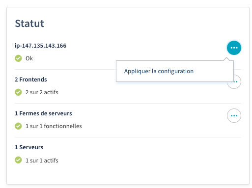{.thumbnail}

Next, select the zones you want to deploy, and click `Apply configuration`{.action}.

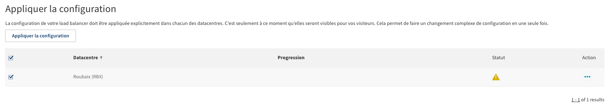{.thumbnail}

### Via the API

- Refresh a zone:

> [!api]
>
> @api {POST} /ipLoadbalancing/{serviceName}/refresh
> 

## Confirmation

Once you have completed all of these steps, you should have a functional load balancing service. You can check the service status by visiting your website.

## Go further

Join our community of users on <https://community.ovh.com/en/>.

