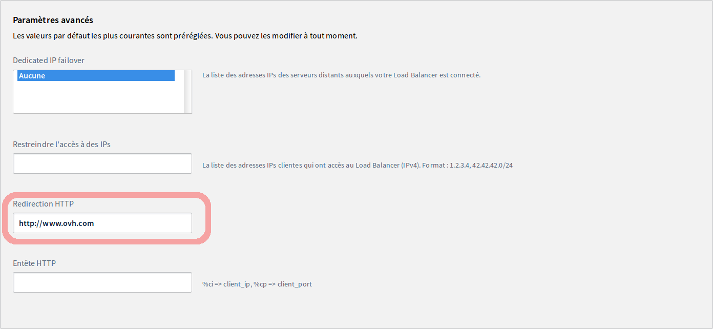

## Objective

The OVH Load Balancer acts by default as a proxy. It can also be configured to redirect your customers to a third-party website, which is useful if you are changing your domain name, or want to redirect your customers to your website’s HTTPS version, for example. This is known as HTTP redirection.

**This guide will show you how to to integrate your web services behind an OVH Load Balancer with redirections.**

## Requirements

- an [OVH Load Balancer](https://www.ovh.co.uk/solutions/load-balancer/){.external}
- access to the [OVH Control Panel](https://www.ovh.com/auth/?action=gotomanager){.external}, or the [OVH API](https://api.ovh.com/){.external}


## Instructions

### Presentation

A HTTP redirection is presented as follows:


```bash
HTTP/1.1 301 Moved Permanently
Location: http://www.example.org/
Content-Type: text/html
Content-Length: 174
```

Custom redirections should have the following form: `<scheme>://<net_loc>/<path>;<params>?<query>#<fragment>`. You can only specify one redirection per front-end.

Custom redirections can be specified via the OVH Control Panel and via the API, both on new and existing `front-ends`{.action}.

### Add a custom redirection via the OVH Control Panel.

You can define custom redirections from the [OVH Control Panel](https://www.ovh.com/auth/?action=gotomanager){.external} by going to the `Cloud`{.action} section, then `Load Balancer`{.action}.

You can either do this on a new front-end as you create it, or on an existing front-end.

* Add a new front-end.

In the `Front-ends`{.action} section of the OVH Control Panel, click on `Add a front-end`{.action} to create a new one.

In the editing page for a front-end, select `HTTP`{.action} or `HTTPS`{.action} protocol. Configure the information as requested. However, please note that there is no need to set a `Default farm`{.action}, as it will not be used.

In the advanced settings, enter the `HTTP redirection`{.action}.

* Edit an existing front-end.

In the `Front-ends`{.action} section of the OVH Control Panel, select the front-end you would like to edit. To do this, click the `...`{.action} button, then select `Edit`{.action} in the menu that appears. Please ensure that the front-end you have chosen uses either `HTTP` or `HTTPS` protocol.

In the editing page for the front-end, complete the configuration if needed. However, please note that there is no need to set a `Default farm`{.action}, as it will not be used.

In the advanced settings, enter the `HTTP redirection`{.action}.


{.thumbnail}

Once the front-end has been configured, click `Add`{.action} or `Edit`{.action}, depending on whether you are configuring a new or existing front-end. Please remember to deploy the configuration. There are two ways of doing this:

- via the `Status`{.action} section of the OVH Control Panel, by clicking on your Load Balancer’s `...`{.action} button, then selecting `Apply configuration`{.action}

- via the reminder box in the OVH Control Panel, notifying you that the configuration has not been applied, by clicking `Apply configuration`{.action}

{.thumbnail}


### Add a custom redirection via the API.

In the [OVH API](https://api.ovh.com/){.external}, redirections are specified in the redirectLocation character chain.

* If you are creating a new front-end:

> [!api]
>
> @api {POST} /ipLoadbalancing/{serviceName}/http/frontend
> 

|Setting|Meaning|
|---|---|
|serviceName|Your Load Balancer service ID|
|port|Front-end listening ports|
|zone|Front-end deployment zones|
|redirectLocation|HTTP redirection URL|

* If you are updating an existing front-end:

> [!api]
>
> @api {PUT} /ipLoadbalancing/{serviceName}/http/frontend/{frontendId}
> 

|Setting|Meaning|
|---|---|
|serviceName|Your Load Balancer service ID|
|frontendId|ID of the front-end to be updated|
|redirectLocation|HTTP redirection URL|

Then apply the modifications:


> [!api]
>
> @api {POST} /ipLoadbalancing/{serviceName}/refresh
>

|Setting|Meaning|
|---|---|
|serviceName|Your Load Balancer service ID|
|zone|Front-end deployment zones|


## Go further

Join our community of users on <https://community.ovh.com/en/>.
