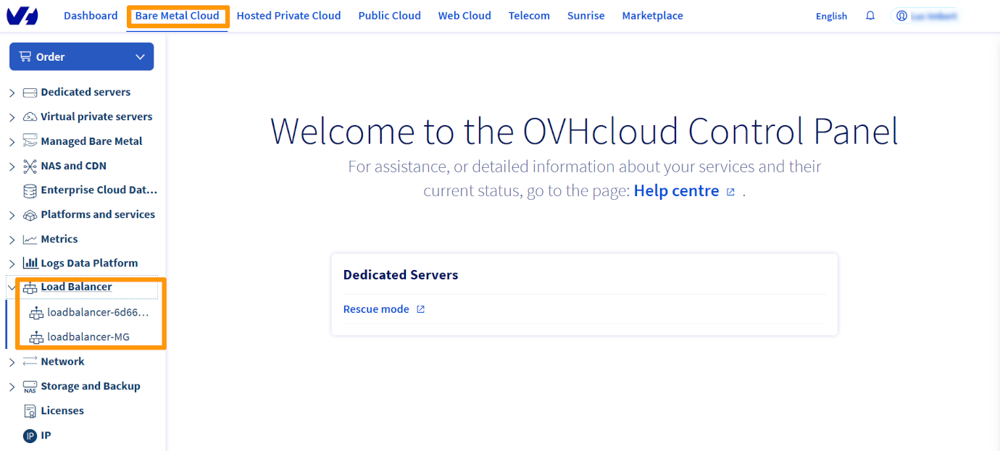
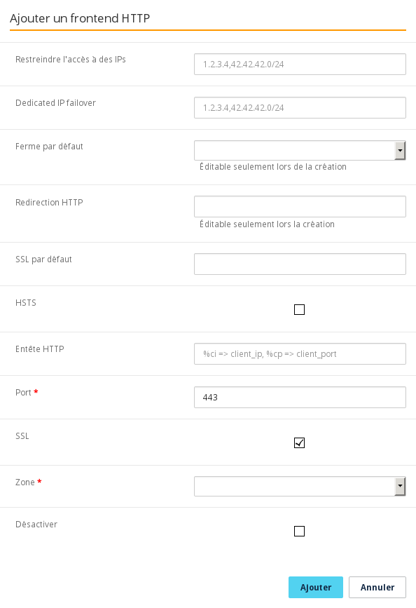
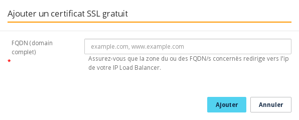

**Dernière mise à jour le 20/01/2021**

## Objectif

Le service OVHCloud Load Balancer peut être configuré pour prendre en charge la terminaison SSL.

La terminaison SSL a pour but de déchiffrer le flux chiffré entrant avant de le faire suivre vers le service approprié (Serveur web par exemple).

La terminaison SSL a un coût pour le service qui le gère. Plutôt que de laisser vos serveurs la faire, il est possible de configurer votre service OVHCloud Load Balancer pour la faire.

De plus, tous vos certificats sont ainsi centralisés au même endroit et leur maintenance s'en trouve facilitée.

## Prérequis

- Posséder une offre [OVHcloud Load balancer](https://www.ovh.com/fr/solutions/load-balancer/) dans votre compte OVHcloud.
- Être connecté à votre [espace client OVHcloud](https://www.ovh.com/auth/?action=gotomanager&from=https://www.ovh.com/fr/&ovhSubsidiary=fr)

## En pratique

Dans la suite de ce document, nous allons voir 2 cas d’usages distincts pour commander un certificat SSL gratuit

### Depuis le Manager

La première chose à faire est de configurer votre frontend pour gérer la terminaison SSL.

Il est possible de configurer votre terminaison SSL depuis l'[espace client](https://www.ovh.com/auth/?action=gotomanager&from=https://www.ovh.com/fr/&ovhSubsidiary=fr){.external} dans la partie `Bare Metal Cloud`{.action}, section `Load Balancer`{.action}.

{.thumbnail}

Après avoir sélectionné le Load Balancer que vous souhaitez modifier,créez un nouveau Frontend, ou éditez en un existants.

Dans la section `Frontends` de votre Manager, cliquez sur le bouton `Ajouter un frontend`{.action} pour en créer un nouveau. Une fenêtre d'édition apparait alors, selectionnez le protocole `HTTPS`. Il faudra aussi renseigner le champ `Ferme par défaut` ou `Redirection HTTP` dans les paramètres avancés.

{.thumbnail}

Une fois le frontend créé, il vous sera proposé d'`Appliquer la configuration`{.action} pour appliquer vos changements dans la zone concernée.

#### Commander le certificate SSL gratuit

Dans la section `Certificats SSL` de votre Manager, cliquez sur le bouton `Commander un certificat SSL`{.action} pour en créer un nouveau. Une fenêtre d'édition apparait alors avec un champ `FQDN` à renseigner.

{.thumbnail}

#### Suivi de la commande

Dans la section `Tâches`{.action} de votre Manager, les tâches relatives à la commandes d'un certificat SSL gratuit correspondent au type `orderFreeCertificate`.

### Depuis l'API

#### Commander le certificate SSL gratuit

Dans l'API, la terminaison SSL est spécifiée par le booléen ssl : (N'oubliez pas de renseigner defaultFarmId ou redirectLocation)

> [!api]
>
> @api {POST} /ipLoadbalancing/{serviceName}/http/frontend
>

Puis appliquer les modifications :

> [!api]
>
> @api {POST} /ipLoadbalancing/{serviceName}/refresh
>

Dans l'API, la commande se fait comme suit. Pour que la commande se finalise, il faut obligatoirement que le nom de domaine choisi pointe vers votre service OVHCloud Load Balancer.

> [!api]
>
> @api {POST} /ipLoadbalancing/{serviceName}/freeCertificate
>

#### Suivi de la commande

- Retourner la liste des taches
Vous pouvez spécifier le type d'action orderFreeCertificate pour affiner la recherche.

> [!api]
>
> @api {GET} /ipLoadbalancing/{serviceName}/task
>

- Retourner le statut d'une tache en particulier

> [!api]
>
> @api {GET} /ipLoadbalancing/{serviceName}/task/{id}
>

Une fois la commande finie, le certificat SSL est automatiquement installé sur votre service OVHCloud Load Balancer.

## Aller plus loin

Échangez avec notre communauté d'utilisateurs sur <https://community.ovh.com>.

