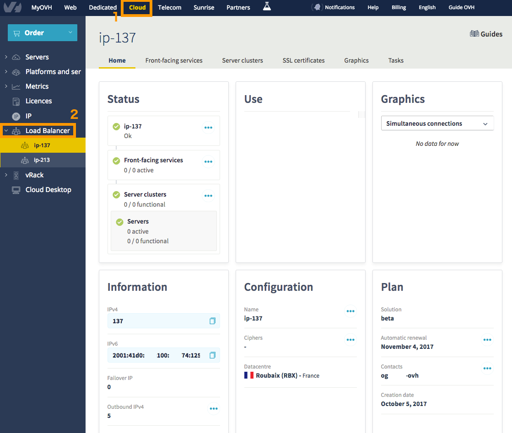
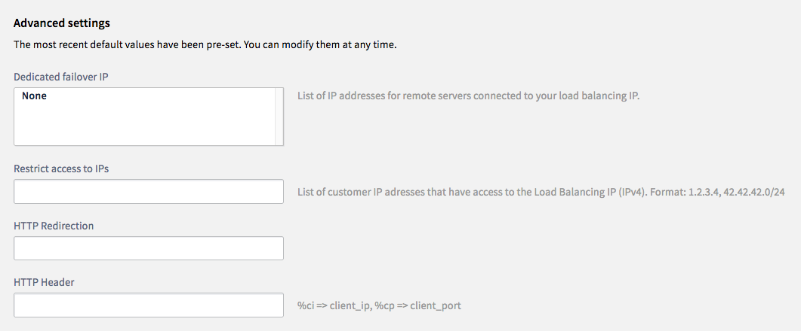
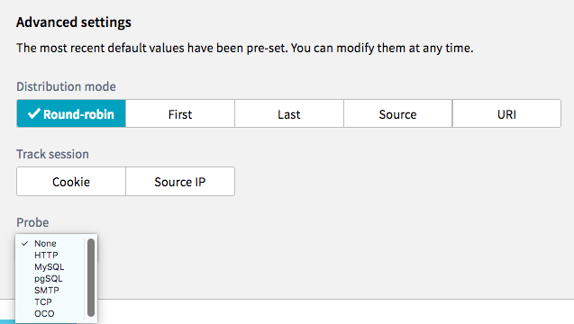
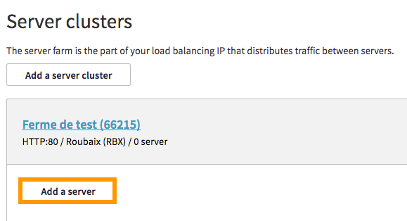
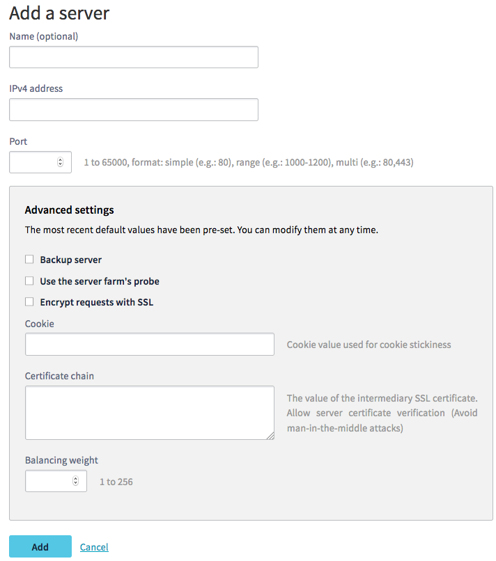
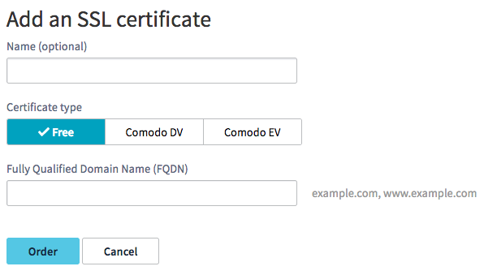
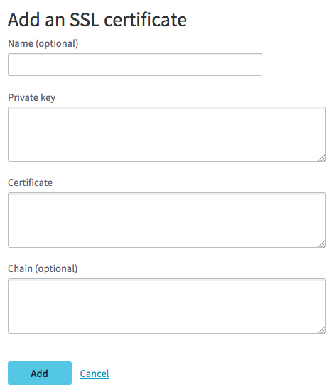

## Objective

This guide is designed to help you get started using the Load Balancer, by introducing the main features of the solution.

## Requirements

- You must have access to your OVH Control Panel.
- You must have ordered a [Load Balancer.](https://www.ovh.com/fr/solutions/load-balancer)

## Instructions

### Managing your Load Balancer via the Control Panel

To manage your Load Balancer via the Control Panel, go to the `Cloud`{.action} section (1), then the `Load Balancer`{.action} (2) section on the left-hand menu. The main page for the service will then appear:

{.thumbnail}

On this page, you will see the following information:

|Element|Purpose|
|---|---|
|Status|An overview of your Load Balancer with the IP, front-ends, functional farms and servers added|
|Use|A summary of how to use your Load Balancer|
|Graphs|In this section, you will see the graphs linked to service, by concurrent connections or requests per minute|
|Information|Your IPv4 address, IPv6 address and the failover IPs linked to them, as well as the number of outgoing IPv4s (see more details by clicking on the ellipses)|
|Configuration|Here, you can customise the name of your solution (which will appear at the top of the left-hand column) The cipher(s) are customisable, as well as the datacentre where your Load Balancer is based|
|Subscription|Here, you will see the admin details for your solution|

To add `Frontends`{.action} or `Server farms`{.action}, simply click on their respective buttons. A form will then help you configure each part of your solution.

### Managing frontends

To add front-ends, simply go to the `Frontends`{.action} section, and click `Add a frontend`{.action}. The following menu will then appear:

{.thumbnail}

Details of front-end parts:

|Element|Purpose|
|---|---|
|Name|If you want, you can choose a name for your front-end. This is very useful when you have several front-ends, so you can tell them apart quickly|
|Protocol|You can choose between HTTP, HTTPS, TCP, SSL TCP (or TLS) and UDP|
|Port|Choose the listening port you wish to use|
|Datacentre|Choose between your datacentre or all datacentres to create your front-end|
|Default farm|If you have several farms configured, you can choose one of them as a default for each front-end|

You can also access advanced settings:

{.thumbnail}

|Element|Purpose|
|---|---|
|Dedicated failover IP|List of failover IPs for remote servers|
|Restrict access to IPs|List for restricting remote access to the Load Balancer, for IPv4 only|
|HTTP redirection|Add a HTTP redirection URL|
|HTTP header|Add a HTTP header here|

### Managing your farms

To add a server farm, simply go to the `Server farms`{.action} section, and click `Add a server farm`{.action}. You will get the same main options as for the front-end. However, the advanced options are different:

{.thumbnail}

|Element|Purpose|
|---|---|
|Distribution method|Choosing between Round-robin, First, Last, Source or URI for your IP load balancing|
|Session tracking|You can track sessions via Cookie or source IP, this can be defined here|
|Probe|Choosing and activating a probe|

### Managing your servers

Once you have created your server farm, you just need to add servers to it. Details on these options are below, as well as advanced options:

{.thumbnail}
{.thumbnail}

|Element|Purpose|
|---|---|
|Name|If you want, you can choose a name for your server. This is very useful when you have several servers, so you can tell them apart quickly|
|IPv4 address|Adding the IP address of the service that will act as a server|
|Port|Server port|
|Backup server|Selecting which server is a backup server|
|Use the server farm’s probe|Choosing the probe that was validated when you created the farm|
|Encrypt requests with SSL|Encrypting requests with an SSL certificate|
|Cookie|Add a customised session cookie|
|Certificate chain|Add a certificate chain|
|Balancing load|Choose the balancing load for the load balancer|

### Managing SSL certificates
You can add an SSL certificate to the Load Balancer in the `SSL Certificate`{.action} section. You have two options: you can order an SSL certificate from OVH, or add an external certificate.

#### OVH SSL certificate
To order an SSL certificate, simply go to the `SSL Certificate`{.action} section, then click `Order an SSL certificate`{.action} and browse the options available:

{.thumbnail}

|Element|Purpose|
|---|---|
|Name|If you want, you can choose a name for your certificate. This is very useful when you have several certificates, so you can tell them apart quickly|
|Certificate type|Free (Let's Encrypt), Comodo DV or Comodo EV (details available here: https://www.ovh.co.uk/ssl/)|
|Fully Qualified Domain Name (FQDN)|Domain(s) concerned|

#### Adding an external SSL certificate
If you already have your own SSL certificate, you can add it directly:

{.thumbnail}

|Element|Purpose|
|---|---|
|Name|If you want, you can choose a name for your certificate. This is very useful when you have several certificates, so you can tell them apart quickly|
|Private key|Field for entering the private key to add to the service|
|Certificate|Field for adding the certificate|
|Chain|Field for adding the root certificate, if required|

## Going further

Join our community of users on <https://community.ovh.com/en/>.