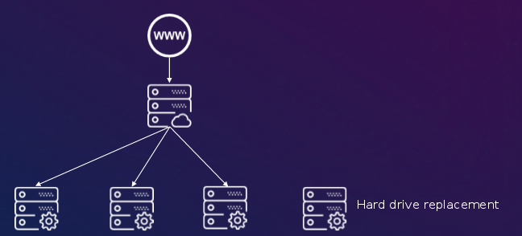
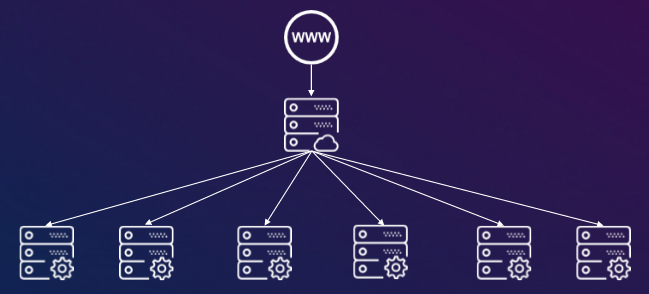

**Last updated 17th January 2018**

## Objective

The new **OVH Load Balancer** is a reliable service, with versatile configurations. You just need to configure your products with the OVH Load Balancer, and we’ll take care of the rest.

**Find out more about the brand-new OVH Load Balancer solution.**

## Requirements

- No specific requirements.

## Instructions

This new solution is based on robust open-source solutions: HAProxy for TCP traffic, and Nginx for UDP traffic.

There are no limits to what you can do! The new OVH Load Balancer solution can be used to work with a variety of protocols:

|Type|Description|Advantages|Technology|
|---|---|---|---|
|HTTP|All HTTP/HTTPS web services|Optimised for L7 (application layer) processing|HAProxy|
|TCP|For any network services that aren’t HTTP|Supports all TCP applications|HAProxy|
|UDP|For all UDP traffic types|Supports all UDP applications|Nginx|

With this new solution, you will get:

- OVH anti-DDoS protection
- your services replicated worldwide (Anycast)
- advanced HTTP/HTTPS support (redirections, headers, ACL, etc.)
- a service compatible with a failover IP
- vRack supported
- redundancy - your Load Balancer functions on separate instances, working individually on isolated, redundant hardware

### Basic parts

- The new OVH Load Balancer solution is made up of three basic parts:

{.thumbnail}

|Basic parts|Function|
|---|---|
|Front-end|The front-end defines the protocol type (HTTP/TCP/UDP) of the OVH Load Balancer service. This part also has the service’s listening port|
|Farm|The farm receives the incoming traffic from the front-end. This part takes care of the load balancing|
|Server|These are the servers that receive the final traffic, and respond via the application|

With these three basic parts that make up the Load Balancer, you can configure it to use nearly all possible load balancing methods.

### Why use the OVH Load Balancer?

#### Balance the load

This is the basic function of a load balancer, but the OVH Load Balancer offers much more.

{.thumbnail}

#### Eliminate downtime

The OVH Load Balancer service can automatically detect when a server is not responding. When this happens, it redirects incoming traffic to another server, if possible. This resolves the problem without affecting your website.

{.thumbnail}

#### Scale your infrastructure easily

You can add or remove farms, front-ends or servers from the OVH Load Balancer solution without interrupting your service.

{.thumbnail}

#### Make maintenance easier

If there is any maintenance scheduled for your solution, you can now easily place a farm in downtime mode to prevent it from receiving traffic. If you need to do this, it’s easy to add your server again once the maintenance has finished.

{.thumbnail}

#### Combine your services

You can now combine various OVH services in the Load Balancer, for example:

- Public Cloud instances with failover IPs
- VPS with failover IPs
- Dedicated servers with failover IPs
- vRacks

{.thumbnail}

#### Anycast

You can balance your load across a variety of geographical zones.

{.thumbnail}

#### Distribute any kind of traffic

The OVH Load Balancer doesn’t just work with HTTP traffic any more! You can now use it with all TCP and UDP traffic types.

#### Email server

Balance the load between your email servers.

{.thumbnail}

#### Databases

Balance your databases, and make them redundant.

{.thumbnail}

## Go further

[Find out more about load balancing](https://en.wikipedia.org/wiki/Load_balancing){.external}.

[Find out more about HAProxy](http://www.haproxy.org/#desc){.external}.

[Find out more about Nginx](https://en.wikipedia.org/wiki/Nginx){.external}.

Join our community of users on <https://community.ovh.com/en/>.