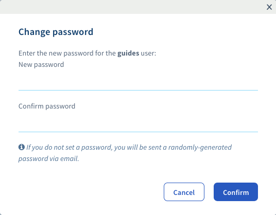

**Letztes Update: 18.11.2020**
 
## Einleitung

Die Berechtigungen und Passwörter von Nutzern des vSphere Clients werden im OVHcloud Kundencenter verwaltet.

**Sehen Sie hier, wie Sie Ihr Nutzerpasswort ändern können**

## Voraussetzungen

- Sie sind in Ihrem [OVHcloud Kundencenter](https://www.ovh.com/auth/?action=gotomanager&from=https://www.ovh.de/&ovhSubsidiary=de){.external} angemeldet.
- Im OVHcloud Kundencenter wurde ein Nutzeraccount für Sie angelegt. Bitte entnehmen Sie [dieser Anleitung](../manager-ovhcloud/#benutzer) weitere Informationen.

## Praktische Anwendung

### Passwort ändern

Melden Sie sich in Ihrem [OVHcloud Kundencenter](https://www.ovh.com/auth/?action=gotomanager&from=https://www.ovh.de/&ovhSubsidiary=de){.external} an, gehen Sie in den Bereich `Bare Metal Cloud`{.action} (1), klicken Sie auf `Managed Bare Metal`{.action} (2) und wählen Sie Ihren Server aus der Liste aus (3). Klicken Sie dann auf den Reiter `Nutzer`{.action} (4).

{.thumbnail}

Klicken Sie auf die Schaltfläche `(...)`{.action} rechts neben dem jeweiligen Nutzer, dann auf `Passwort ändern`{.action}.

{.thumbnail}

Geben Sie nun ein neues Passwort ein und bestätigen Sie es.

{.thumbnail}

> [!primary]
> Wenn Sie kein neues Passwort eingeben, wird ein nach dem Zufallsprinzip erstelltes Passwort per E-Mail an die Adresse gesandt, die mit dem Nutzer verbunden ist.
> 

> [!warning]
>
>Um die Sicherheit Ihrer Infrastruktur nicht zu gefährden empfehlen wir Ihnen, diese bewährte Verfahren zu befolgen. Ihr Passwort muss:
>
> - Aus mindestens 8 Zeichen bestehen.
> - Mindestens 3 verschiedene Zeichentypen enthalten.
> - Es darf kein Wort aus dem Wörterbuch sein.
> - Es darf keine privaten Informationen enthalten.
> - Es darf nicht für mehrere Zugänge verwendet werden.
> - In einem Passwort-Manager gespeichert sein.
> - Alle drei Monate geändert werden.
> - Sich von den vorherigen Passwörtern unterscheiden.
>

## Weiterführende Informationen

[Das Passwort Ihres OVHcloud Accounts anlegen und verwalten](https://docs.ovh.com/de/customer/Passwort-verwalten/)

Für den Austausch mit unserer User Community gehen Sie auf <https://community.ovh.com/en/>.
