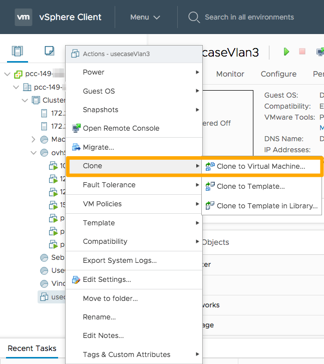
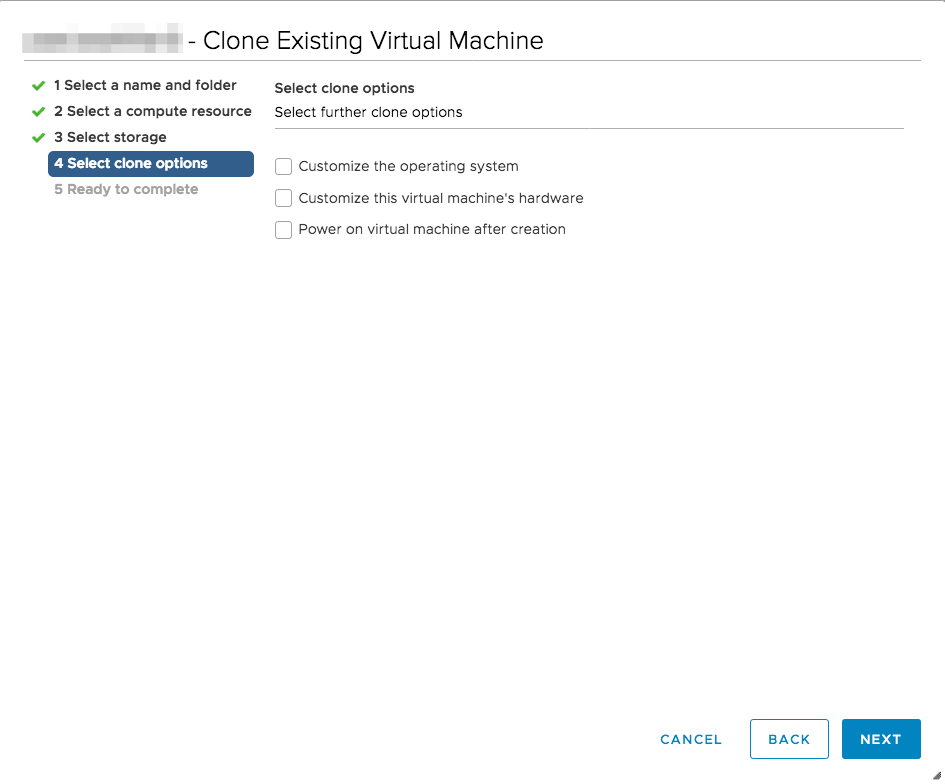

**Stand 18.11.2020**

## Einleitung

Mit dem Klonen einer VM können Sie eine Kopie der ursprünglichen VM herstellen.

**In dieser Anleitung erklären wir Ihnen, wie Sie diese Aktion durchführen.**

## Voraussetzungen

- Sie verfügen über ein [Managed Bare Metal](https://www.ovhcloud.com/de/managed-bare-metal/){.external} Produkt.
- Sie haben mindestens eine VM in Ihrem Cluster.
- Sie sind auf Ihrem [vSphere Interface](../den_vsphere_client_installieren/) angemeldet.

## Praktische Anwendung

### Die VM klonen

Gehen Sie in Ihrem [vSphere Interface ](../den_vsphere_client_installieren/) zu `Hosts and Clusters`.

Klicken Sie mit der rechten Maustaste auf die VM, die Sie klonen möchten. Klicken Sie danach auf `Clone`{.action} und daraufhin auf `Clone to virtual machine...`{.action}. 

{.thumbnail}

Geben Sie dieser neuen VM einen Namen und legen Sie ihren Platz in der Struktur fest. 

{.thumbnail}

### Ressource auswählen

Geben Sie Cluster, Host, vApp oder Ressourcen-Pool dieser VM an.

{.thumbnail}

### Wahl des Speichers

Legen Sie den Speicherort (Festplattenspeicherplatz) dieser VM fest. 

Das Format der virtuellen Festplatte ist “Thin Provision”. Das bedeutet, dass eine virtuelle Festplatte erstellt wird, diese aber den wirklich verwendeten Speicherplatz einnimmt, ungeachtet des Speicherplatzes, den vorher die ursprüngliche VM eingenommen hat. 

Weitere Erklärungen zu Festplattenformaten finden Sie in [dieser Anleitung](../die-wahl-des-festplattenformats/).

In der Reihe `VM Storage Policy` können Sie die Standardeinstellung für das Speichern wählen, wenn Sie Datastores haben. Wenn Sie die Option [VM encryption](../vm-encrypt/) verwenden, können Sie eine nutzerdefinierte Speicherweise wählen.

{.thumbnail}

### Systemkonfiguration

In diesem Schritt können Sie die Netzwerkkonfiguration festlegen, die für diese VM gelten soll. Sie haben zwei Optionen zur Wahl:

- Wenn Sie keinen Haken setzen, wird die Netzwerkkonfiguration der neuen VM so sein, wie bei der ursprünglichen VM.

- `Die Hardware dieser virtuellen Maschine einrichten (experimentell)`{.action} : Mit dieser Option können Sie die neuen Konfigurationen angeben, die Sie auf dieser neuen VM vornehmen möchten.

{.thumbnail}

> [!warning]
>
> Wenn Sie keine individuelle Einrichtung der virtuellen Maschine vorgenommen haben, müssen Sie die Konfiguration des Klons vor dem Start ändern. Andernfalls kann es zu Konflikten von IP / MAC kommen. 
>
>In diesem Fall müssen Sie nur die Wahl der Netzwerkkarte in den Einstellungen der virtuellen Maschine aufheben. Dies tun Sie wenn sie geklont ist und bevor Sie sie starten.
>
>{.thumbnail}
>

## Weiterführende Informationen

Für den Austausch mit unserer User Community gehen Sie auf <https://community.ovh.com/en/>.
