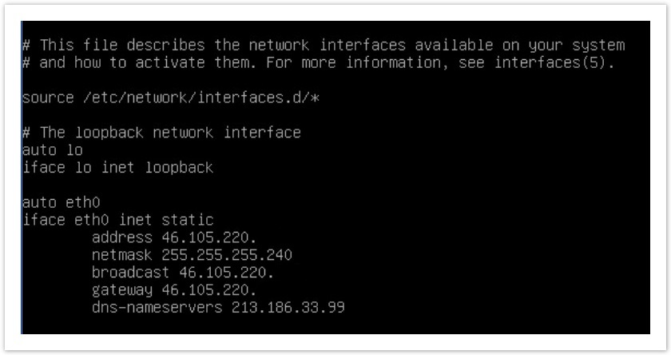
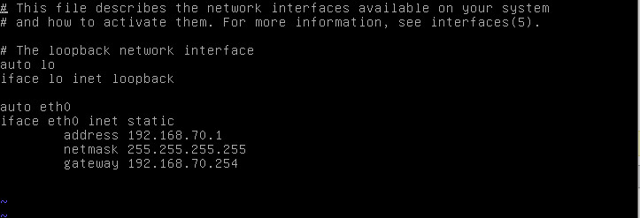
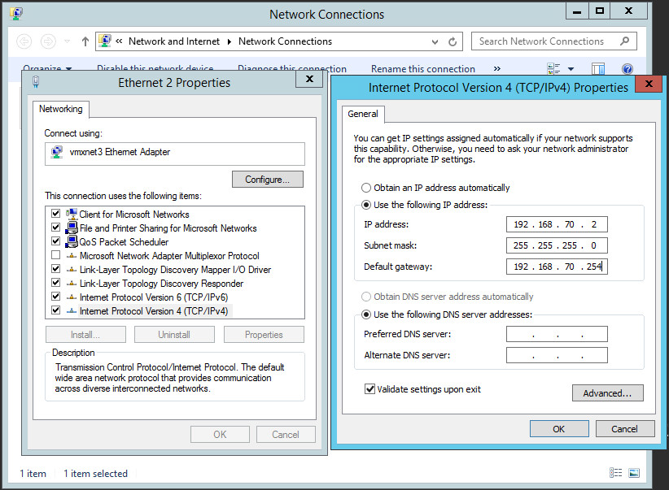

**Last updated 18th November 2020**

## Objective

After you have created a virtual machine (VM), you can assign to it a public or private IP address so that the VM has internet and/or private network connectivity.

**This guide will show you how to assign a public or private IP address to a virtual machine.**

## Requirements

- You must have already created a virtual machine.
- You will need an IP block.

## Instructions

### Retrieve your information

You can retrieve the information of your public IP address block directly from the vSphere client, by going to the `Hosts and Clusters`{.action} section. Click on your datacenter and click on the `Configure`{.action} tab. Then click `Network`{.action} under `OVHcloud`.

{.thumbnail}

On each block delivered by OVHcloud, five IP addresses are reserved for configuring the network and must never be used for your virtual machines. The first and the last four IP addresses in the block are reserved for this purpose.

This is how a Managed Bare Metal IP block is organised:

- The first IP address that is marked as (`Reserved`) corresponds to the network address
- The IP addresses that follow it can be used for your virtual machines. The are marked as (`Available`) if no VM is using them, or as (`Used`) if they are being used
- The last four IP addresses in the block are reserved: two are dedicated to OVHcloud routers for operating the block, and the other two are used for the gateway and broadcast

{.thumbnail}

### Configure a public IP address

To configure a public IP address on your virtual machine, you must first choose the `VMNetwork`{.action} interface in your VM network adapter settings:

{.thumbnail}

#### Linux

Here is a configuration example on a Debian operating system:

{.thumbnail}

```sh
auto eth0
iface eth0 inet static
address 46.105.220.xxx
netmask 255.255.255.240
broadcast 46.105.220.xxx
gateway 46.105.220.xxx
dns-nameservers 213.186.33.99
```

Mount the adapter using an `ifup` in your interface.

You can also check the configuration with an `ifconfig`.

If your virtual machine cannot find the network, try checking that the network adapter is configured on *VMNetwork* and not on *LocalPortGroup* or a VLAN. Check also that the adapter’s connection box is ticked.

#### Windows

Here is a configuration example for Windows:

In the `configuration panel`{.action}, go to `Network and Internet`{.action}, then `Network and Sharing Centre`{.action}, and then `Change Network Adapter`{.action}.

To speed up the process, you can click on the Windows search field and write `Run` (or press the *Windows* and *R* keys at the same time). The Windows command console will open, and you can enter this command:

```shell
ncpa.cpl
```

Right-click on the corresponding VMNetwork adapter and click `Properties`{.action}. Then select `TCP/IPv4 protocol`{.action} and click again on Properties, then enter your IP information as follows:

{.thumbnail}

```sh
IP address: 46.105.220.xxx
Subnet mask: 255.255.255.240
Default gateway: 46.105.220.yyy
DNS server: 213.186.33.99
```

### Configure a private IP address

The process for configuring a private IP address is similar to that of a public IP address. However, you must use the network adapter configured for your VLAN.

In your interface options, you can edit the following settings:

- A VLAN interface (10 to 20 by default and linked to the vRack, you can create more by consulting [this guide](/pages/cloud/managed-bare-metal/vlan-creation)).

In your virtual machine settings, you can use a VLAN :

{.thumbnail}

{.thumbnail}

#### Linux

Here is a configuration example on a Debian operating system:

{.thumbnail}

By editing the interfaces file, you can assign a private IP address on your chosen IP range:

```sh
auto eth0
iface eth0 inet static
address 192.168.70.1
netmask 255.255.255.0
gateway 192.168.70.254
```

Mount the adapter using an `ifup` in your interface.

You can also check the configuration with an `ifconfig`.

#### Windows

Here is a configuration example for Windows:

In the `configuration panel`{.action}, go to `Network and Internet`{.action}, then `Network and Sharing Centre`{.action}, and then to `Change Network Adapter`{.action}.

To speed up the process, you can click on the Windows search field and write `Run` (or press the *Windows* and *R* keys at the same time). The Windows command console will open, and you can enter this command:

```shell
ncpa.cpl
```

Right-click on the corresponding VMNetwork adapter and click `Properties`{.action}. Then select `TCP/IPv4 protocol`{.action} and click again on `Properties`{.action}, then enter your IP information as follows:

{.thumbnail}

By modifying this interface, you can assign a private IP address on your chosen IP range:

```sh
IP address: 192.168.70.2
Subnet mask: 255.255.255.0
Default gateway: 192.168.70.254
```

## Go further

Join our community of users on <https://community.ovh.com/en/>.