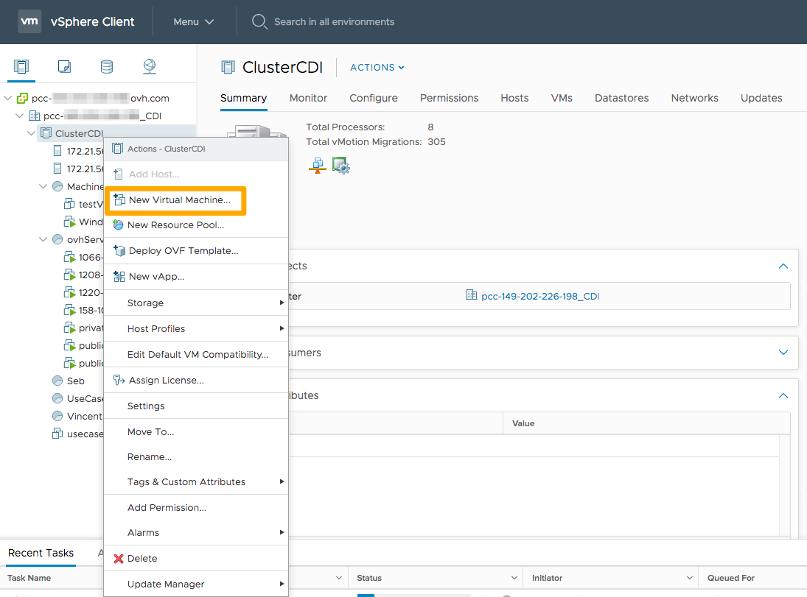
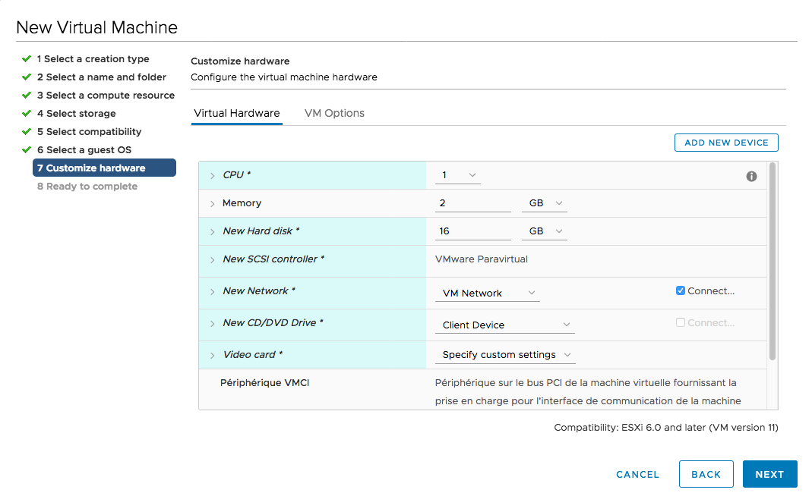

**Última actualización: 18/11/2020**

## Objetivo

La interfaz vSphere permite instrumentar máquinas virtuales de varios modos. 

**En esta guía, se explica cómo instrumentar una máquina virtual a partir de un archivo ISO.**

## Requisitos

- Haber contratado una solución [Managed Bare Metal de OVHcloud](https://www.ovhcloud.com/es/managed-bare-metal/){.external}.
- Estar conectado a la [interfaz vSphere](../instalar_el_vsphere_client/).

## Procedimiento

### Instrumentar la máquina virtual

La instrumentación de la nueva máquina virtual se realiza en el cliente vSphere, en la vista `«Servidores y clústeres»`.

Haga clic con el botón derecho en el clúster de su elección y, seguidamente, en `«Nueva máquina virtual»`{.action}.

{.thumbnail}

Para crear una máquina virtual, es posible elegir entre varias opciones:

- A partir de un archivo ISO, disponible en su datastore y que para importarlo debe seguir las instrucciones en la [guía de conexión en SFTP](../conexion_en_sftp/).
- También puede instrumentar una máquina virtual a partir de una plantilla existente o una [plantilla de OVHcloud](../desplegar-plantilla-ovf/).
- Puede clonar una máquina virtual ya existente (hay que tener cuidado con los posibles conflictos de direcciones IP).
- Puede clonar una máquina virtual en una plantilla para instrumentar más rápidamente sus próximas máquinas virtuales.
- Puede clonar una plantilla en otra plantilla para, por ejemplo, tenerla en varios datastores y evitar así problemas de rendimiento durante una instrumentación masiva.
- Puede convertir una plantilla en máquina virtual, lo que, a pesar de comportar la pérdida de la plantilla, puede ser útil si desea modificarla.

{.thumbnail}

En esta guía, se explica cómo instrumentar una máquina virtual a partir de un archivo ISO.

El siguiente paso le permite definir el nombre de su máquina y elegir su localización. Si no selecciona una carpeta, esta se creará en la raíz del datacenter.

{.thumbnail}

Luego, podrá elegir el clúster, el servidor, [el grupo de recursos](https://docs.vmware.com/fr/VMware-vSphere/6.7/com.vmware.vsphere.resmgmt.doc/GUID-60077B40-66FF-4625-934A-641703ED7601.html){.external-link} o [la vApp](https://docs.vmware.com/fr/VMware-vSphere/6.7/com.vmware.vsphere.vm_admin.doc/GUID-E6E9D2A9-D358-4996-9BC7-F8D9D9645290.html){.external-link} donde desee colocarla.

En este caso, la máquina virtual se instrumentará según las reglas DRS configuradas y se colocará en la raíz del clúster.

{.thumbnail}

A continuación, deberá seleccionar el almacén de datos donde se guardarán los archivos de configuración y de disco.

Desaconsejamos colocar la máquina virtual en un «storageLocal», que corresponda al almacenamiento local de su servidor. En caso de que falle su servidor, la máquina virtual no se podrá reiniciar y dejará de estar accesible.

{.thumbnail}

A continuación, elija la compatibilidad entre su máquina virtual y el servidor. Salvo en algunos casos concretos, recomendamos elegir el más reciente.

{.thumbnail}

Seleccione un sistema operativo invitado. El «Guest OS» no instala el sistema operativo; sin embargo, vSphere configura la máquina virtual de manera automática (número de CPU/RAM, tipo de tarjeta de red, compatibilidad de las herramientas de VMware).

{.thumbnail}

### Configurar la máquina virtual

Los siguientes pasos le permiten configurar los recursos de su máquina virtual.

La línea `«Nueva red»` permite añadir una tarjeta de red:

- La «VM Network» (red de máquina virtual) se utilizará para la red pública y el acceso directo a Internet.
- Las redes de área local virtual (VLAN) permitirán utilizar la red privada entre sus máquinas virtuales (y con otros servicios de OVHcloud a través del vRack).

{.thumbnail}

En la línea `«Nuevo lector de CD/DVD»`, podrá elegir «Almacén de datos de archivos ISO».

Se abrirá una ventana donde podrá seleccionar el archivo ISO. También se puede añadir una vez creada la máquina virtual.

{.thumbnail}

Una vez seleccionado el archivo, se visualizará como se muestra a continuación. No olvide marcar la casilla `«Conectar al encender»`{.action} para conectarlo.

{.thumbnail}

Entonces se mostrará un resumen de la creación de su máquina virtual. Si desea modificar su configuración, haga clic en uno de los pasos en la columna de la izquierda.

Haga clic en `«FINISH» (finalizar)`{.action} para completar su instrumentación.

{.thumbnail}

Una vez que la máquina se encuentre en su inventario, podrá iniciarla haciendo clic con el botón derecho en ella y, luego, en `«Alimentación»`{.action} > `«Encender»`{.action}. 

Por último, haga clic en `«Abrir consola remota»`{.action} para acceder a la «pantalla» de la máquina virtual e iniciar la instalación del sistema operativo.

{.thumbnail}

La consola se abrirá en una nueva pestaña y, tras completarse la instalación, podrá utilizar su máquina virtual.

{.thumbnail}

> [!primary]
> Una vez instalada la máquina virtual, recomendamos desconectar el archivo ISO en la configuración. De lo contrario, no podrá desplazar la máquina virtual.
>

## Más información

Interactúe con nuestra comunidad de usuarios en <https://community.ovh.com/en/>.
